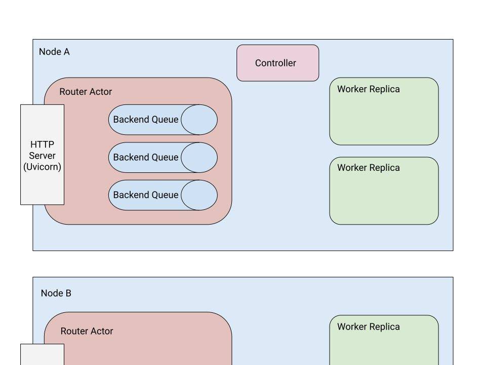

.. _serve-architecture:

Serve Architecture
==================
This section should help you:

- understand an overview of how each component in Serve works
- understand the different types of actors that make up a Serve instance

.. Figure source: https://docs.google.com/drawings/d/1jSuBN5dkSj2s9-0eGzlU_ldsRa3TsswQUZM-cMQ29a0/edit?usp=sharing

High Level View
---------------

Serve runs on Ray and utilizes :ref:`Ray actors<actor-guide>`.

There are three kinds of actors that are created to make up a Serve instance:

- Controller: A global actor unique to each Serve instance that manages
  the control plane. The Controller is responsible for creating, updating, and
  destroying other actors. Serve API calls like creating or getting a deployment
  make remote calls to the Controller.
- Router: There is one router per node. Each router is a `Uvicorn <https://www.uvicorn.org/>`_ HTTP
  server that accepts incoming requests, forwards them to replicas, and
  responds once they are completed.
- Worker Replica: Worker replicas actually execute the code in response to a
  request. For example, they may contain an instantiation of an ML model. Each
  replica processes individual requests from the routers (they may be batched
  by the replica using ``@serve.batch``, see the :ref:`batching<serve-batching>` docs).

Lifetime of a Request
---------------------
When an HTTP request is sent to the router, the follow things happen:

- The HTTP request is received and parsed.
- The correct deployment associated with the HTTP url path is looked up. The
  request is placed on a queue.
- For each request in a deployment queue, an available replica is looked up
  and the request is sent to it. If there are no available replicas (there
  are more than ``max_concurrent_queries`` requests outstanding), the request
  is left in the queue until an outstanding request is finished.

Each replica maintains a queue of requests and executes one at a time, possibly
using asyncio to process them concurrently. If the handler (the function for the
deployment or ``__call__``) is ``async``, the replica will not wait for the
handler to run; otherwise, the replica will block until the handler returns.

FAQ
---

.. _serve-ft-detail:

How does Serve handle fault tolerance?
^^^^^^^^^^^^^^^^^^^^^^^^^^^^^^^^^^^^^^

Application errors like exceptions in your model evaluation code are caught and
wrapped. A 500 status code will be returned with the traceback information. The
replica will be able to continue to handle requests.

Machine errors and faults will be handled by Ray. Serve utilizes the :ref:`actor
reconstruction <actor-fault-tolerance>` capability. For example, when a machine hosting any of the
actors crashes, those actors will be automatically restarted on another
available machine. All data in the Controller (routing policies, deployment
configurations, etc) is checkpointed to the Ray. Transient data in the
router and the replica (like network connections and internal request
queues) will be lost upon failure.

How does Serve ensure horizontal scalability and availability?
^^^^^^^^^^^^^^^^^^^^^^^^^^^^^^^^^^^^^^^^^^^^^^^^^^^^^^^^^^^^^^

Serve starts one router per node. Each router will bind the same port. You
should be able to reach Serve and send requests to any models via any of the
servers.

This architecture ensures horizontal scalability for Serve. You can scale the
router by adding more nodes and scale the model by increasing the number
of replicas.

How do ServeHandles work?
^^^^^^^^^^^^^^^^^^^^^^^^^

:mod:`ServeHandles <ray.serve.handle.RayServeHandle>` wrap a handle to the router actor on the same node. When a
request is sent from one replica to another via the handle, the
requests go through the same data path as incoming HTTP requests. This enables
the same deployment selection and batching procedures to happen. ServeHandles are
often used to implement :ref:`model composition <serve-model-composition>`.

What happens to large requests?
^^^^^^^^^^^^^^^^^^^^^^^^^^^^^^^

Serve utilizes Ray’s :ref:`shared memory object store <plasma-store>` and in process memory
store. Small request objects are directly sent between actors via network
call. Larger request objects (100KiB+) are written to a distributed shared
memory store and the replica can read them via zero-copy read.
