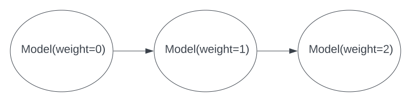

# Pattern: Chain nodes with same class and different args

The example shows how to chain nodes using the same class and having different args passed in



## Code

+++

```python
import ray
from ray import serve
from ray.experimental.dag.input_node import InputNode
from ray.serve.drivers import DAGDriver


#Adjust the num_cpus based on your device 
ray.init(num_cpus=4)
serve.start()

@serve.deployment
class Model:
   def __init__(self, weight):
      self.weight = weight
   def forward(self, input):
      return input +  self.weight


# 3 nodes chain in a line
num_nodes = 3
nodes = [Model.bind(w) for w in range(num_nodes)]
outputs = [None] * num_nodes
with InputNode() as dag_input:
   for i in range(num_nodes):
      if i == 0:
         # first node
         outputs[i] = nodes[i].forward.bind(dag_input)
      else:
         outputs[i] = nodes[i].forward.bind(outputs[i - 1])

print(ray.get(outputs[-1].execute(0)))
```

## Outputs

The graph will add all nodes weights plus the input (which is 0 in this case).
0(input) + 0(weight) + 1(weight) + 2(weight) = 3

```
3
```

+++