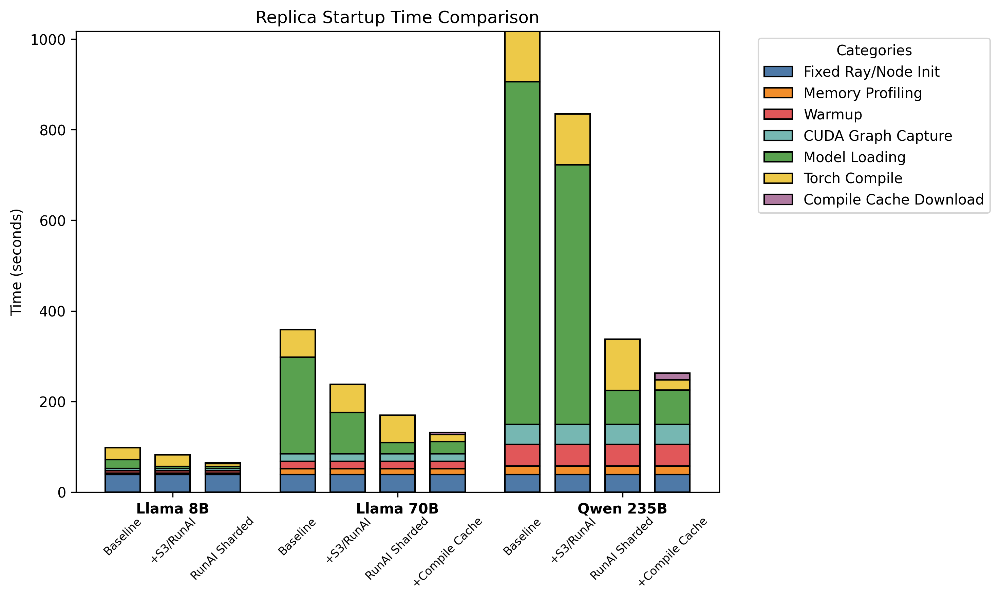

# Benchmarks

Performance in LLM serving depends heavily on your specific workload characteristics and hardware stack. From a Ray Serve perspective, the focus is on orchestration overhead and the effectiveness of serving pattern implementations. The Ray team maintains the [ray-serve-llm-perf-examples](https://github.com/anyscale/ray-serve-llm-perf-examples) repository with benchmarking snapshots, tooling, and lessons learned. These benchmarks validate the correctness and effectiveness of different serving patterns. You can use these benchmarks to validate your production stack more systematically. 

## Replica Startup Latency

Replica startup times involving large models can be slow, leading to slow autoscaling and poor response to changing workloads. This section illustrates the effects of the various techniques mentioned in [this guide](./user-guides/deployment-initialization.md) on startup latency. All examples are run on EC2 with 8xH100.

### Baseline Setup

We evaluate on `meta-llama/Meta-Llama-3-8B`, `meta-llama/Meta-Llama-3-70B`, and `Qwen/Qwen3-235B-A22B`. Our baseline setup involves spawning a Ray Serve LLM service with 0 initial replicas to measure replica autoscaling time. More details on benchmarking code can be found [here](https://github.com/anyscale/ray-serve-llm-perf-examples).

```python
import os
from ray import serve
from ray.serve.llm import LLMConfig, build_openai_app

llm_config = LLMConfig(
    model_loading_config={
        "model_id": "llama",
        "model_source": "unsloth/llama-3-8b-Instruct",
    },
    deployment_config={
        "autoscaling_config": {
            #start deployment with no replicas so we can trigger autoscaling when sending a request
            "min_replicas": 0,
            "initial_replicas": 0,
            "max_replicas": 1,
        }
    },
    accelerator_type="H100",
    engine_kwargs={
        "tensor_parallel_size": 1,
    },
)

app = build_openai_app({"llm_configs": [llm_config]})
serve.run(app, blocking=True)
```

### Benchmarked Results

Our improvements primarily address model loading and Torch Compile, and each subsequent optimization reduces the overall startup latency. As models grow larger, the effects of these optimizations become increasingly pronounced. As illustrated, we get nearly 3.88x reduction in latency on `Qwen/Qwen3-235B-A22B`. Of the remaining contributors to startup latency, CUDA graph capture and fixed initialization time are signficant areas for future optimization. vLLM startup latency is an ongoing [issue](https://github.com/vllm-project/vllm/issues/19824) that is being worked on by the community.


