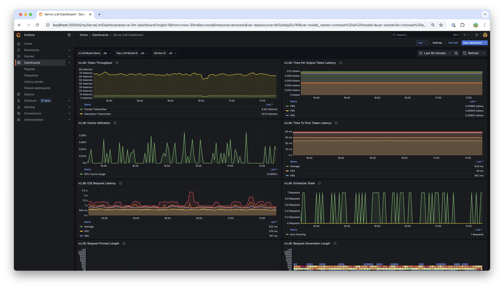

(quick-start)=
# Quickstart examples

## Deployment through OpenAiIngress

You can deploy LLM models using either the builder pattern or bind pattern.

::::{tab-set}

:::{tab-item} Builder Pattern
:sync: builder

```{literalinclude} ../../llm/doc_code/serve/qwen/qwen_example.py
:language: python
:start-after: __qwen_example_start__
:end-before: __qwen_example_end__
```
:::

:::{tab-item} Bind Pattern
:sync: bind

```python
from ray import serve
from ray.serve.llm import LLMConfig
from ray.serve.llm.deployment import LLMServer
from ray.serve.llm.ingress import OpenAiIngress, make_fastapi_ingress

llm_config = LLMConfig(
    model_loading_config=dict(
        model_id="qwen-0.5b",
        model_source="Qwen/Qwen2.5-0.5B-Instruct",
    ),
    deployment_config=dict(
        autoscaling_config=dict(
            min_replicas=1, max_replicas=2,
        )
    ),
    # Pass the desired accelerator type (e.g. A10G, L4, etc.)
    accelerator_type="A10G",
    # You can customize the engine arguments (e.g. vLLM engine kwargs)
    engine_kwargs=dict(
        tensor_parallel_size=2,
    ),
)

# Deploy the application
server_options = LLMServer.get_deployment_options(llm_config)
server_deployment = serve.deployment(LLMServer).options(
    **server_options).bind(llm_config)

ingress_options = OpenAiIngress.get_deployment_options(
    llm_configs=[llm_config])
ingress_cls = make_fastapi_ingress(OpenAiIngress)
ingress_deployment = serve.deployment(ingress_cls).options(
    **ingress_options).bind([server_deployment])

serve.run(ingress_deployment, blocking=True)
```
:::

::::

You can query the deployed models with either cURL or the OpenAI Python client:

::::{tab-set}

:::{tab-item} cURL
:sync: curl

```bash
curl -X POST http://localhost:8000/v1/chat/completions \
     -H "Content-Type: application/json" \
     -H "Authorization: Bearer fake-key" \
     -d '{
           "model": "qwen-0.5b",
           "messages": [{"role": "user", "content": "Hello!"}]
         }'
```
:::

:::{tab-item} Python
:sync: python

```python
from openai import OpenAI

# Initialize client
client = OpenAI(base_url="http://localhost:8000/v1", api_key="fake-key")

# Basic chat completion with streaming
response = client.chat.completions.create(
    model="qwen-0.5b",
    messages=[{"role": "user", "content": "Hello!"}],
    stream=True
)

for chunk in response:
    if chunk.choices[0].delta.content is not None:
        print(chunk.choices[0].delta.content, end="", flush=True)
```
:::

::::


For deploying multiple models, you can pass a list of {class}`LLMConfig <ray.serve.llm.LLMConfig>` objects to the {class}`OpenAiIngress <ray.serve.llm.ingress.OpenAiIngress>` deployment:

::::{tab-set}

:::{tab-item} Builder Pattern
:sync: builder

```python
from ray import serve
from ray.serve.llm import LLMConfig, build_openai_app


llm_config1 = LLMConfig(
    model_loading_config=dict(
        model_id="qwen-0.5b",
        model_source="Qwen/Qwen2.5-0.5B-Instruct",
    ),
    deployment_config=dict(
        autoscaling_config=dict(
            min_replicas=1, max_replicas=2,
        )
    ),
    accelerator_type="A10G",
)

llm_config2 = LLMConfig(
    model_loading_config=dict(
        model_id="qwen-1.5b",
        model_source="Qwen/Qwen2.5-1.5B-Instruct",
    ),
    deployment_config=dict(
        autoscaling_config=dict(
            min_replicas=1, max_replicas=2,
        )
    ),
    accelerator_type="A10G",
)

app = build_openai_app({"llm_configs": [llm_config1, llm_config2]})
serve.run(app, blocking=True)
```
:::

:::{tab-item} Bind Pattern
:sync: bind

```python
from ray import serve
from ray.serve.llm import LLMConfig
from ray.serve.llm.deployment import LLMServer
from ray.serve.llm.ingress import OpenAiIngress, make_fastapi_ingress

llm_config1 = LLMConfig(
    model_loading_config=dict(
        model_id="qwen-0.5b",
        model_source="Qwen/Qwen2.5-0.5B-Instruct",
    ),
    deployment_config=dict(
        autoscaling_config=dict(
            min_replicas=1, max_replicas=2,
        )
    ),
    accelerator_type="A10G",
)

llm_config2 = LLMConfig(
    model_loading_config=dict(
        model_id="qwen-1.5b",
        model_source="Qwen/Qwen2.5-1.5B-Instruct",
    ),
    deployment_config=dict(
        autoscaling_config=dict(
            min_replicas=1, max_replicas=2,
        )
    ),
    accelerator_type="A10G",
)

# deployment #1
server_options1 = LLMServer.get_deployment_options(llm_config1)
server_deployment1 = serve.deployment(LLMServer).options(
    **server_options1).bind(llm_config1)

# deployment #2
server_options2 = LLMServer.get_deployment_options(llm_config2)
server_deployment2 = serve.deployment(LLMServer).options(
    **server_options2).bind(llm_config2)

# ingress
ingress_options = OpenAiIngress.get_deployment_options(
    llm_configs=[llm_config1, llm_config2])
ingress_cls = make_fastapi_ingress(OpenAiIngress)
ingress_deployment = serve.deployment(ingress_cls).options(
    **ingress_options).bind([server_deployment1, server_deployment2])

# run
serve.run(ingress_deployment, blocking=True)
```
:::

::::

See also {ref}`serve-deepseek-tutorial` for an example of deploying DeepSeek models.

## Production deployment

For production deployments, Ray Serve LLM provides utilities for config-driven deployments. You can specify your deployment configuration with YAML files:

::::{tab-set}

:::{tab-item} Inline Config
:sync: inline

```{literalinclude} ../../llm/doc_code/serve/qwen/llm_config_example.yaml
:language: yaml
```
:::

:::{tab-item} Standalone Config
:sync: standalone

```yaml
# config.yaml
applications:
- args:
    llm_configs:
        - models/qwen-0.5b.yaml
        - models/qwen-1.5b.yaml
  import_path: ray.serve.llm:build_openai_app
  name: llm_app
  route_prefix: "/"
```

```yaml
# models/qwen-0.5b.yaml
model_loading_config:
  model_id: qwen-0.5b
  model_source: Qwen/Qwen2.5-0.5B-Instruct
accelerator_type: A10G
deployment_config:
  autoscaling_config:
    min_replicas: 1
    max_replicas: 2
```

```yaml
# models/qwen-1.5b.yaml
model_loading_config:
  model_id: qwen-1.5b
  model_source: Qwen/Qwen2.5-1.5B-Instruct
accelerator_type: A10G
deployment_config:
  autoscaling_config:
    min_replicas: 1
    max_replicas: 2
```
:::

::::

To deploy with either configuration file:

```bash
serve run config.yaml
```

## Generate config files

Ray Serve LLM provides a CLI to generate config files for your deployment:

```bash
python -m ray.serve.llm.gen_config
```

*Note*: This command requires interactive inputs. You should execute it directly in the terminal.

This command lets you pick from a common set of OSS LLMs and helps you configure them. You can tune settings such as GPU type, tensor parallelism, and autoscaling parameters.

Note that if you're configuring a model whose architecture is different from the provided list of models, you should closely review the generated model config file to provide the correct values.

This command generates two files: an LLM config file, saved in `model_config/`, and a Ray Serve config file, `serve_TIMESTAMP.yaml`, that you can reference and re-run in the future.

After reading and reviewing the generated model config, see the [vLLM engine configuration docs](https://docs.vllm.ai/en/latest/serving/engine_args.html) for further customization.

## Observability

Ray enables LLM service-level logging by default, and makes these statistics available through Grafana and Prometheus. For more details on configuring Grafana and Prometheus, see {ref}`collect-metrics`.

These higher-level metrics track request and token behavior across deployed models. For example: average total tokens per request, ratio of input tokens to generated tokens, and peak tokens per second.

For visualization, Ray ships with a Serve LLM-specific dashboard, which is automatically available in Grafana. Example below:



## Engine metrics

All engine metrics, including vLLM, are available through the Ray metrics export endpoint and are queryable with Prometheus. See [vLLM metrics](https://docs.vllm.ai/en/stable/usage/metrics.html) for a complete list. These are also visualized by the Serve LLM Grafana dashboard. Dashboard panels include: time per output token (TPOT), time to first token (TTFT), and GPU cache utilization.

Engine metric logging is on by default as of Ray 2.51. To disable engine-level metric logging, set `log_engine_metrics: False` when configuring the LLM deployment. For example:

::::{tab-set}

:::{tab-item} Python
:sync: builder

```python
from ray import serve
from ray.serve.llm import LLMConfig, build_openai_app

llm_config = LLMConfig(
    model_loading_config=dict(
        model_id="qwen-0.5b",
        model_source="Qwen/Qwen2.5-0.5B-Instruct",
    ),
    deployment_config=dict(
        autoscaling_config=dict(
            min_replicas=1, max_replicas=2,
        )
    ),
    log_engine_metrics=False
)

app = build_openai_app({"llm_configs": [llm_config]})
serve.run(app, blocking=True)
```
:::

:::{tab-item} YAML
:sync: bind

```yaml
# config.yaml
applications:
- args:
    llm_configs:
        - model_loading_config:
            model_id: qwen-0.5b
            model_source: Qwen/Qwen2.5-0.5B-Instruct
        accelerator_type: A10G
        deployment_config:
            autoscaling_config:
                min_replicas: 1
                max_replicas: 2
        log_engine_metrics: false
  import_path: ray.serve.llm:build_openai_app
  name: llm_app
  route_prefix: "/"
```
:::

::::


## Frequently asked questions

### How to configure tokenizer pool size so it doesn't hang?

When using `tokenizer_pool_size` in vLLM's `engine_kwargs`, `tokenizer_pool_size` is also required to configure together in order to have the tokenizer group scheduled correctly.

The following example shows a config:

```yaml
# config.yaml
applications:
- args:
    llm_configs:
        - engine_kwargs:
            max_model_len: 1000
            tokenizer_pool_size: 2
            tokenizer_pool_extra_config: "{\"runtime_env\": {}}"
          model_loading_config:
            model_id: Qwen/Qwen2.5-7B-Instruct
  import_path: ray.serve.llm:build_openai_app
  name: llm_app
  route_prefix: "/"
```


## Usage data collection

We collect usage data to improve Ray Serve LLM. We collect data about the following features and attributes:

- Model architecture used for serving.
- Whether JSON mode is used.
- Whether LoRA is used and how many LoRA weights are loaded initially at deployment time.
- Whether autoscaling is used and the min and max replicas setup.
- Tensor parallel size used.
- Initial replicas count.
- GPU type used and number of GPUs used.

If you'd like to opt-out from usage data collection, you can follow {ref}`Ray usage stats <ref-usage-stats>` to disable it.

