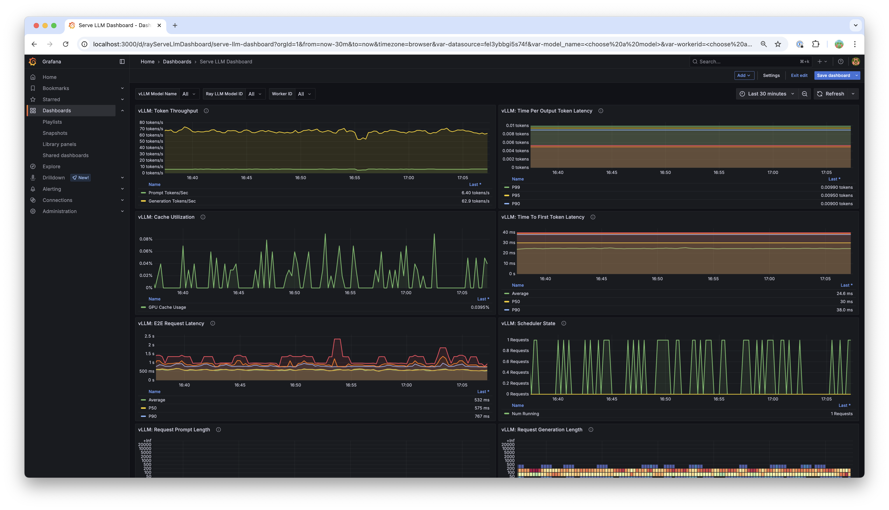

.. _serving_llms:

Serving LLMs
============

Ray Serve LLM APIs allow users to deploy multiple LLM models together with a familiar Ray Serve API, while providing compatibility with the OpenAI API.

Features
--------
- ⚡️ Automatic scaling and load balancing
- 🌐 Unified multi-node multi-model deployment
- 🔌 OpenAI compatible
- 🔄 Multi-LoRA support with shared base models
- 🚀 Engine agnostic architecture (i.e. vLLM, SGLang, etc)

Requirements
--------------

.. code-block:: bash

    pip install ray[serve,llm]>=2.43.0 vllm>=0.7.2

    # Suggested dependencies when using vllm 0.7.2:
    pip install xgrammar==0.1.11 pynvml==12.0.0

Key Components
--------------

The :ref:`ray.serve.llm <serve-llm-api>` module provides two key deployment types for serving LLMs:

LLMServer
~~~~~~~~~~~~~~~~~~

The LLMServer sets up and manages the vLLM engine for model serving. It can be used standalone or combined with your own custom Ray Serve deployments.

OpenAiIngress
~~~~~~~~~~~~~~~~~~~~~~~~~~~~
This deployment provides an OpenAI-compatible FastAPI ingress and routes traffic to the appropriate model for multi-model services. The following endpoints are supported:

- ``/v1/chat/completions``: Chat interface (ChatGPT-style)
- ``/v1/completions``: Text completion
- ``/v1/embeddings``: Text embeddings
- ``/v1/models``: List available models
- ``/v1/models/{model}``: Model information

Configuration
-------------

LLMConfig
~~~~~~~~~
The :class:`LLMConfig <ray.serve.llm.LLMConfig>` class specifies model details such as:

- Model loading sources (HuggingFace or cloud storage)
- Hardware requirements (accelerator type)
- Engine arguments (e.g. vLLM engine kwargs)
- LoRA multiplexing configuration
- Serve auto-scaling parameters

Quickstart Examples
-------------------

Deployment through :class:`OpenAiIngress <ray.serve.llm.ingress.OpenAiIngress>`
~~~~~~~~~~~~~~~~~~~~~~~~~~~~~~~~~~~~~~~~~~~~~~~~~~~~~~~~~~~~~~~~~~~~~~~~~~~~~~~

.. tab-set::

    .. tab-item:: Builder Pattern
        :sync: builder

        .. code-block:: python

            from ray import serve
            from ray.serve.llm import LLMConfig, build_openai_app

            llm_config = LLMConfig(
                model_loading_config=dict(
                    model_id="qwen-0.5b",
                    model_source="Qwen/Qwen2.5-0.5B-Instruct",
                ),
                deployment_config=dict(
                    autoscaling_config=dict(
                        min_replicas=1, max_replicas=2,
                    )
                ),
                # Pass the desired accelerator type (e.g. A10G, L4, etc.)
                accelerator_type="A10G",
                # You can customize the engine arguments (e.g. vLLM engine kwargs)
                engine_kwargs=dict(
                    tensor_parallel_size=2,
                ),
            )

            app = build_openai_app({"llm_configs": [llm_config]})
            serve.run(app, blocking=True)

    .. tab-item:: Bind Pattern
        :sync: bind

        .. code-block:: python

            from ray import serve
            from ray.serve.llm import LLMConfig
            from ray.serve.llm.deployment import LLMServer
            from ray.serve.llm.ingress import OpenAiIngress

            llm_config = LLMConfig(
                model_loading_config=dict(
                    model_id="qwen-0.5b",
                    model_source="Qwen/Qwen2.5-0.5B-Instruct",
                ),
                deployment_config=dict(
                    autoscaling_config=dict(
                        min_replicas=1, max_replicas=2,
                    )
                ),
                # Pass the desired accelerator type (e.g. A10G, L4, etc.)
                accelerator_type="A10G",
                # You can customize the engine arguments (e.g. vLLM engine kwargs)
                engine_kwargs=dict(
                    tensor_parallel_size=2,
                ),
            )

            # Deploy the application
            deployment = LLMServer.as_deployment(llm_config.get_serve_options(name_prefix="vLLM:")).bind(llm_config)
            llm_app = OpenAiIngress.as_deployment().bind([deployment])
            serve.run(llm_app, blocking=True)

You can query the deployed models using either cURL or the OpenAI Python client:

.. tab-set::

    .. tab-item:: cURL
        :sync: curl

        .. code-block:: bash

            curl -X POST http://localhost:8000/v1/chat/completions \
                 -H "Content-Type: application/json" \
                 -H "Authorization: Bearer fake-key" \
                 -d '{
                       "model": "qwen-0.5b",
                       "messages": [{"role": "user", "content": "Hello!"}]
                     }'

    .. tab-item:: Python
        :sync: python

        .. code-block:: python

            from openai import OpenAI

            # Initialize client
            client = OpenAI(base_url="http://localhost:8000/v1", api_key="fake-key")

            # Basic chat completion with streaming
            response = client.chat.completions.create(
                model="qwen-0.5b",
                messages=[{"role": "user", "content": "Hello!"}],
                stream=True
            )

            for chunk in response:
                if chunk.choices[0].delta.content is not None:
                    print(chunk.choices[0].delta.content, end="", flush=True)

For deploying multiple models, you can pass a list of :class:`LLMConfig <ray.serve.llm.LLMConfig>` objects to the :class:`OpenAiIngress <ray.serve.llm.ingress.OpenAiIngress>` deployment:

.. tab-set::

    .. tab-item:: Builder Pattern
        :sync: builder

        .. code-block:: python

            from ray import serve
            from ray.serve.llm import LLMConfig, build_openai_app

            llm_config1 = LLMConfig(
                model_loading_config=dict(
                    model_id="qwen-0.5b",
                    model_source="Qwen/Qwen2.5-0.5B-Instruct",
                ),
                deployment_config=dict(
                    autoscaling_config=dict(
                        min_replicas=1, max_replicas=2,
                    )
                ),
                accelerator_type="A10G",
            )

            llm_config2 = LLMConfig(
                model_loading_config=dict(
                    model_id="qwen-1.5b",
                    model_source="Qwen/Qwen2.5-1.5B-Instruct",
                ),
                deployment_config=dict(
                    autoscaling_config=dict(
                        min_replicas=1, max_replicas=2,
                    )
                ),
                accelerator_type="A10G",
            )

            app = build_openai_app({"llm_configs": [llm_config1, llm_config2]})
            serve.run(app, blocking=True)

    .. tab-item:: Bind Pattern
        :sync: bind

        .. code-block:: python

            from ray import serve
            from ray.serve.llm import LLMConfig
            from ray.serve.llm.deployment import LLMServer
            from ray.serve.llm.ingress import OpenAiIngress

            llm_config1 = LLMConfig(
                model_loading_config=dict(
                    model_id="qwen-0.5b",
                    model_source="Qwen/Qwen2.5-0.5B-Instruct",
                ),
                deployment_config=dict(
                    autoscaling_config=dict(
                        min_replicas=1, max_replicas=2,
                    )
                ),
                accelerator_type="A10G",
            )

            llm_config2 = LLMConfig(
                model_loading_config=dict(
                    model_id="qwen-1.5b",
                    model_source="Qwen/Qwen2.5-1.5B-Instruct",
                ),
                deployment_config=dict(
                    autoscaling_config=dict(
                        min_replicas=1, max_replicas=2,
                    )
                ),
                accelerator_type="A10G",
            )

            # Deploy the application
            deployment1 = LLMServer.as_deployment(llm_config1.get_serve_options(name_prefix="vLLM:")).bind(llm_config1)
            deployment2 = LLMServer.as_deployment(llm_config2.get_serve_options(name_prefix="vLLM:")).bind(llm_config2)
            llm_app = OpenAiIngress.as_deployment().bind([deployment1, deployment2])
            serve.run(llm_app, blocking=True)

See also :ref:`serve-deepseek-tutorial` for an example of deploying DeepSeek models.

Production Deployment
---------------------

For production deployments, Ray Serve LLM provides utilities for config-driven deployments. You can specify your deployment configuration using YAML files:

.. tab-set::

    .. tab-item:: Inline Config
        :sync: inline

        .. code-block:: yaml

            # config.yaml
            applications:
            - args:
                llm_configs:
                    - model_loading_config:
                        model_id: qwen-0.5b
                        model_source: Qwen/Qwen2.5-0.5B-Instruct
                      accelerator_type: A10G
                      deployment_config:
                        autoscaling_config:
                            min_replicas: 1
                            max_replicas: 2
                    - model_loading_config:
                        model_id: qwen-1.5b
                        model_source: Qwen/Qwen2.5-1.5B-Instruct
                      accelerator_type: A10G
                      deployment_config:
                        autoscaling_config:
                            min_replicas: 1
                            max_replicas: 2
              import_path: ray.serve.llm:build_openai_app
              name: llm_app
              route_prefix: "/"

    .. tab-item:: Standalone Config
        :sync: standalone

        .. code-block:: yaml

            # config.yaml
            applications:
            - args:
                llm_configs:
                    - models/qwen-0.5b.yaml
                    - models/qwen-1.5b.yaml
              import_path: ray.serve.llm:build_openai_app
              name: llm_app
              route_prefix: "/"

        .. code-block:: yaml

            # models/qwen-0.5b.yaml
            model_loading_config:
              model_id: qwen-0.5b
              model_source: Qwen/Qwen2.5-0.5B-Instruct
            accelerator_type: A10G
            deployment_config:
              autoscaling_config:
                min_replicas: 1
                max_replicas: 2

        .. code-block:: yaml

            # models/qwen-1.5b.yaml
            model_loading_config:
              model_id: qwen-1.5b
              model_source: Qwen/Qwen2.5-1.5B-Instruct
            accelerator_type: A10G
            deployment_config:
              autoscaling_config:
                min_replicas: 1
                max_replicas: 2

To deploy using either configuration file:

.. code-block:: bash

    serve run config.yaml

Generate config files
---------------------

Ray Serve LLM provides a CLI to generate config files for your deployment:

.. code-block:: bash

    python -m ray.serve.llm.gen_config

*Note*: This command requires interactive inputs. You should execute it directly in the
terminal.

This command lets you pick from a common set of OSS LLMs and helps you configure them.
You can tune settings like GPU type, tensor parallelism, and autoscaling parameters.

Note that if you're configuring a model whose architecture is different from the
provided list of models, you should closely review the generated model config file to
provide the correct values.

This command generates two files: an LLM config file, saved in `model_config/`, and a
Ray Serve config file, `serve_TIMESTAMP.yaml`, that you can reference and re-run in the
future.

After reading and reviewing the generated model config, see
the `vLLM engine configuration docs <https://docs.vllm.ai/en/latest/serving/engine_args.html>`_
for further customization.

Observability
---------------------
Ray enables LLM service-level logging by default, and makes these statistics available using Grafana and Prometheus. For more details on configuring Grafana and Prometheus, see :ref:`collect-metrics`.

These higher-level metrics track request and token behavior across deployed models. For example: average total tokens per request, ratio of input tokens to generated tokens, and peak tokens per second.

For visualization, Ray ships with a Serve LLM-specific dashboard, which is automatically available in Grafana. Example below:

Engine Metrics
---------------------
All engine metrics, including vLLM, are available through the Ray metrics export endpoint and are queryable using Prometheus. See `vLLM metrics <https://docs.vllm.ai/en/stable/usage/metrics.html>`_ for a complete list. These are also visualized by the Serve LLM Grafana dashboard. Dashboard panels include: time per output token (TPOT), time to first token (TTFT), and GPU cache utilization.

Engine metric logging is off by default, and must be manually enabled. In addition, you must enable the vLLM V1 engine to use engine metrics. To enable engine-level metric logging, set `log_engine_metrics: True` when configuring the LLM deployment. For example:

.. tab-set::

    .. tab-item:: Python
        :sync: builder

        .. code-block:: python

            from ray import serve
            from ray.serve.llm import LLMConfig, build_openai_app

            llm_config = LLMConfig(
                model_loading_config=dict(
                    model_id="qwen-0.5b",
                    model_source="Qwen/Qwen2.5-0.5B-Instruct",
                ),
                deployment_config=dict(
                    autoscaling_config=dict(
                        min_replicas=1, max_replicas=2,
                    )
                ),
                log_engine_metrics=True
            )

            app = build_openai_app({"llm_configs": [llm_config]})
            serve.run(app, blocking=True)

    .. tab-item:: YAML
        :sync: bind

        .. code-block:: yaml

            # config.yaml
            applications:
            - args:
                llm_configs:
                    - model_loading_config:
                        model_id: qwen-0.5b
                        model_source: Qwen/Qwen2.5-0.5B-Instruct
                    accelerator_type: A10G
                    deployment_config:
                        autoscaling_config:
                            min_replicas: 1
                            max_replicas: 2
                    log_engine_metrics: true
            import_path: ray.serve.llm:build_openai_app
            name: llm_app
            route_prefix: "/"

Advanced Usage Patterns
-----------------------

For each usage pattern, we provide a server and client code snippet.

Multi-LoRA Deployment
~~~~~~~~~~~~~~~~~~~~~

You can use our multi-LoRA (Low-Rank Adaptation) feature to efficiently serve multiple fine-tuned models by configuring the :class:`LoraConfig <ray.serve.llm.LoraConfig>`.
We use Ray Serve's multiplexing feature to serve multiple LoRA checkpoints from the same model.
When a request for a given LoRA adapter arrives, Ray Serve first checks if any replica has already loaded that adapter. If a replica with the adapter is found and is not overloaded, the request is routed to it. If all replicas with the adapter are overloaded, the request is routed to a less busy replica, which will then load the adapter on the new replica. If no replica has the adapter loaded, the request is routed to a replica according to the default request router logic (for example Power of 2) and loaded there so that the next time it will be cached. This ensures the adapter is cached for subsequent requests. The cache of LoRA adapters on each replica is controlled via a Least Recently Used (LRU) mechanism with a max size controlled by the ``max_num_adapters_per_replica`` variable.

.. tab-set::

    .. tab-item:: Server
        :sync: server

        .. code-block:: python

            from ray import serve
            from ray.serve.llm import LLMConfig, build_openai_app

            # Configure the model with LoRA
            llm_config = LLMConfig(
                model_loading_config=dict(
                    model_id="qwen-0.5b",
                    model_source="Qwen/Qwen2.5-0.5B-Instruct",
                ),
                lora_config=dict(
                    # Let's pretend this is where LoRA weights are stored on S3.
                    # For example
                    # s3://my_dynamic_lora_path/lora_model_1_ckpt
                    # s3://my_dynamic_lora_path/lora_model_2_ckpt
                    # are two of the LoRA checkpoints
                    dynamic_lora_loading_path="s3://my_dynamic_lora_path",
                    max_num_adapters_per_replica=16,
                ),
                engine_kwargs=dict(
                    enable_lora=True,
                    max_loras=16, # Need to set this to the same value as `max_num_adapters_per_replica`.
                ),
                deployment_config=dict(
                    autoscaling_config=dict(
                        min_replicas=1,
                        max_replicas=2,
                    )
                ),
                accelerator_type="A10G",
            )

            # Build and deploy the model
            app = build_openai_app({"llm_configs": [llm_config]})
            serve.run(app, blocking=True)

    .. tab-item:: Client
        :sync: client

        .. code-block:: python

            from openai import OpenAI

            # Initialize client
            client = OpenAI(base_url="http://localhost:8000/v1", api_key="fake-key")

            # Make a request to the desired lora checkpoint
            response = client.chat.completions.create(
                model="qwen-0.5b:lora_model_1_ckpt",
                messages=[{"role": "user", "content": "Hello!"}],
                stream=True,
            )

            for chunk in response:
                if chunk.choices[0].delta.content is not None:
                    print(chunk.choices[0].delta.content, end="", flush=True)

Embeddings
~~~~~~~~~~~~~~~~~~~~~

You can generate embeddings by selecting the embed task in the engine arguments.
Models supporting this use case are listed at
`vLLM text embedding models <https://docs.vllm.ai/en/stable/models/supported_models.html#text-embedding-task-embed>`_.

Note: You need to set the `VLLM_USE_V1` environment variable to `0`, since the VLLM V1 still does not fully support the embedding endpoints.

.. tab-set::

    .. tab-item:: Server
        :sync: server

        .. code-block:: python

            from ray import serve
            from ray.serve.llm import LLMConfig, build_openai_app

            llm_config = LLMConfig(
                model_loading_config=dict(
                    model_id="qwen-0.5b",
                    model_source="Qwen/Qwen2.5-0.5B-Instruct",
                ),
                engine_kwargs=dict(
                    task="embed",
                ),
                runtime_env=dict(
                    env_vars={
                        "VLLM_USE_V1": "0",
                    }
                ),
            )

            app = build_openai_app({"llm_configs": [llm_config]})
            serve.run(app, blocking=True)

    .. tab-item:: Python Client
        :sync: client

        .. code-block:: python

            from openai import OpenAI

            # Initialize client
            client = OpenAI(base_url="http://localhost:8000/v1", api_key="fake-key")

            # Make a request to the desired lora checkpoint
            response = client.embeddings.create(
                model="qwen-0.5b",
                input=["A text to embed", "Another text to embed"],
            )

            for data in responses.data:
                print(data.embedding)  # List of float of len 4096

    .. tab-item:: cURL
        :sync: curl

        .. code-block:: bash

            curl -X POST http://localhost:8000/v1/embeddings \
                 -H "Content-Type: application/json" \
                 -H "Authorization: Bearer fake-key" \
                 -d '{
                       "model": "qwen-0.5b",
                       "input": ["A text to embed", "Another text to embed"],
                       "encoding_format": "float"
                     }'

Structured Output
~~~~~~~~~~~~~~~~~

For structured output, you can use JSON mode similar to OpenAI's API:

.. tab-set::

    .. tab-item:: Server
        :sync: server

        .. code-block:: python

            from ray import serve
            from ray.serve.llm import LLMConfig, build_openai_app

            llm_config = LLMConfig(
                model_loading_config=dict(
                    model_id="qwen-0.5b",
                    model_source="Qwen/Qwen2.5-0.5B-Instruct",
                ),
                deployment_config=dict(
                    autoscaling_config=dict(
                        min_replicas=1,
                        max_replicas=2,
                    )
                ),
                accelerator_type="A10G",
            )

            # Build and deploy the model
            app = build_openai_app({"llm_configs": [llm_config]})
            serve.run(app, blocking=True)

    .. tab-item:: Client (JSON Object)
        :sync: client

        .. code-block:: python

            from openai import OpenAI

            # Initialize client
            client = OpenAI(base_url="http://localhost:8000/v1", api_key="fake-key")

            # Request structured JSON output
            response = client.chat.completions.create(
                model="qwen-0.5b",
                response_format={"type": "json_object"},
                messages=[
                    {
                        "role": "system",
                        "content": "You are a helpful assistant that outputs JSON."
                    },
                    {
                        "role": "user",
                        "content": "List three colors in JSON format"
                    }
                ],
                stream=True,
            )

            for chunk in response:
                if chunk.choices[0].delta.content is not None:
                    print(chunk.choices[0].delta.content, end="", flush=True)
            # Example response:
            # {
            #   "colors": [
            #     "red",
            #     "blue",
            #     "green"
            #   ]
            # }
    .. tab-item:: Client (JSON Schema)

        If you want, you can also specify the schema you want for the response, using pydantic models:

        .. code-block:: python

            from openai import OpenAI
            from typing import List, Literal
            from pydantic import BaseModel

            # Initialize client
            client = OpenAI(base_url="http://localhost:8000/v1", api_key="fake-key")

            # Define a pydantic model of a preset of allowed colors
            class Color(BaseModel):
                colors: List[Literal["cyan", "magenta", "yellow"]]

            # Request structured JSON output
            response = client.chat.completions.create(
                model="qwen-0.5b",
                response_format={
                    "type": "json_schema",
                    "json_schema": Color.model_json_schema()

                },
                messages=[
                    {
                        "role": "system",
                        "content": "You are a helpful assistant that outputs JSON."
                    },
                    {
                        "role": "user",
                        "content": "List three colors in JSON format"
                    }
                ],
                stream=True,
            )

            for chunk in response:
                if chunk.choices[0].delta.content is not None:
                    print(chunk.choices[0].delta.content, end="", flush=True)
            # Example response:
            # {
            #   "colors": [
            #     "cyan",
            #     "magenta",
            #     "yellow"
            #   ]
            # }

Vision Language Models
~~~~~~~~~~~~~~~~~~~~~~

For multimodal models that can process both text and images:

.. tab-set::

    .. tab-item:: Server
        :sync: server

        .. code-block:: python

            from ray import serve
            from ray.serve.llm import LLMConfig, build_openai_app

            # Configure a vision model
            llm_config = LLMConfig(
                model_loading_config=dict(
                    model_id="pixtral-12b",
                    model_source="mistral-community/pixtral-12b",
                ),
                deployment_config=dict(
                    autoscaling_config=dict(
                        min_replicas=1,
                        max_replicas=2,
                    )
                ),
                accelerator_type="L40S",
                engine_kwargs=dict(
                    tensor_parallel_size=1,
                    max_model_len=8192,
                ),
            )

            # Build and deploy the model
            app = build_openai_app({"llm_configs": [llm_config]})
            serve.run(app, blocking=True)

    .. tab-item:: Client
        :sync: client

        .. code-block:: python

            from openai import OpenAI

            # Initialize client
            client = OpenAI(base_url="http://localhost:8000/v1", api_key="fake-key")

            # Create and send a request with an image
            response = client.chat.completions.create(
                model="pixtral-12b",
                messages=[
                    {
                        "role": "user",
                        "content": [
                            {
                                "type": "text",
                                "text": "What's in this image?"
                            },
                            {
                                "type": "image_url",
                                "image_url": {
                                    "url": "https://example.com/image.jpg"
                                }
                            }
                        ]
                    }
                ],
                stream=True,
            )

            for chunk in response:
                if chunk.choices[0].delta.content is not None:
                    print(chunk.choices[0].delta.content, end="", flush=True)

Using remote storage for model weights
~~~~~~~~~~~~~~~~~~~~~~~~~~~~~~~~~~~~~~

You can use remote storage (S3 and GCS) to store your model weights instead of
downloading them from Hugging Face.

For example, if you have a model stored in S3 that looks like the below structure:

.. code-block:: bash

    $ aws s3 ls air-example-data/rayllm-ossci/meta-Llama-3.2-1B-Instruct/
    2025-03-25 11:37:48       1519 .gitattributes
    2025-03-25 11:37:48       7712 LICENSE.txt
    2025-03-25 11:37:48      41742 README.md
    2025-03-25 11:37:48       6021 USE_POLICY.md
    2025-03-25 11:37:48        877 config.json
    2025-03-25 11:37:48        189 generation_config.json
    2025-03-25 11:37:48 2471645608 model.safetensors
    2025-03-25 11:37:53        296 special_tokens_map.json
    2025-03-25 11:37:53    9085657 tokenizer.json
    2025-03-25 11:37:53      54528 tokenizer_config.json

You can then specify the `bucket_uri` in the `model_loading_config` to point to your S3 bucket.

.. code-block:: yaml

    # config.yaml
    applications:
    - args:
        llm_configs:
            - accelerator_type: A10G
              engine_kwargs:
                max_model_len: 8192
              model_loading_config:
                model_id: my_llama
                model_source:
                  bucket_uri: s3://anonymous@air-example-data/rayllm-ossci/meta-Llama-3.2-1B-Instruct
      import_path: ray.serve.llm:build_openai_app
      name: llm_app
      route_prefix: "/"

Frequently Asked Questions
--------------------------

How do I use gated Huggingface models?
~~~~~~~~~~~~~~~~~~~~~~~~~~~~~~~~~~~~~~~~~

You can use `runtime_env` to specify the env variables that are required to access the model.
To set the deployment options, you can use the :meth:`get_serve_options <ray.serve.llm.LLMConfig.get_serve_options>` method on the :class:`LLMConfig <ray.serve.llm.LLMConfig>` object.

.. code-block:: python

    from ray import serve
    from ray.serve.llm import LLMConfig
    from ray.serve.llm.deployment import LLMServer
    from ray.serve.llm.ingress import OpenAiIngress
    import os

    llm_config = LLMConfig(
        model_loading_config=dict(
            model_id="llama-3-8b-instruct",
            model_source="meta-llama/Meta-Llama-3-8B-Instruct",
        ),
        deployment_config=dict(
            autoscaling_config=dict(
                min_replicas=1, max_replicas=2,
            )
        ),
        # Pass the desired accelerator type (e.g. A10G, L4, etc.)
        accelerator_type="A10G",
        runtime_env=dict(
            env_vars=dict(
                HF_TOKEN=os.environ["HF_TOKEN"]
            )
        ),
    )

    # Deploy the application
    deployment = LLMServer.as_deployment(llm_config.get_serve_options(name_prefix="vLLM:")).bind(llm_config)
    llm_app = OpenAiIngress.as_deployment().bind([deployment])
    serve.run(llm_app, blocking=True)

Why is downloading the model so slow?
~~~~~~~~~~~~~~~~~~~~~~~~~~~~~~~~~~~~~

If you are using huggingface models, you can enable fast download by setting `HF_HUB_ENABLE_HF_TRANSFER` and installing `pip install hf_transfer`.

.. code-block:: python

    from ray import serve
    from ray.serve.llm import LLMConfig
    from ray.serve.llm.deployment import LLMServer
    from ray.serve.llm.ingress import OpenAiIngress
    import os

    llm_config = LLMConfig(
        model_loading_config=dict(
            model_id="llama-3-8b-instruct",
            model_source="meta-llama/Meta-Llama-3-8B-Instruct",
        ),
        deployment_config=dict(
            autoscaling_config=dict(
                min_replicas=1, max_replicas=2,
            )
        ),
        # Pass the desired accelerator type (e.g. A10G, L4, etc.)
        accelerator_type="A10G",
        runtime_env=dict(
            env_vars=dict(
                HF_TOKEN=os.environ["HF_TOKEN"],
                HF_HUB_ENABLE_HF_TRANSFER="1"
            )
        ),
    )

    # Deploy the application
    deployment = LLMServer.as_deployment(llm_config.get_serve_options(name_prefix="vLLM:")).bind(llm_config)
    llm_app = OpenAiIngress.as_deployment().bind([deployment])
    serve.run(llm_app, blocking=True)

How to configure tokenizer pool size so it doesn't hang?
~~~~~~~~~~~~~~~~~~~~~~~~~~~~~~~~~~~~~~~~~~~~~~~~~~~~~~~~

When using `tokenizer_pool_size` in vLLM's `engine_kwargs`,
`tokenizer_pool_size` is also required to configure together in order to have
the tokenizer group scheduled correctly.

An example config is shown below:

.. code-block:: yaml

    # config.yaml
    applications:
    - args:
        llm_configs:
            - engine_kwargs:
                max_model_len: 1000
                tokenizer_pool_size: 2
                tokenizer_pool_extra_config: "{\"runtime_env\": {}}"
              model_loading_config:
                model_id: Qwen/Qwen2.5-7B-Instruct
      import_path: ray.serve.llm:build_openai_app
      name: llm_app
      route_prefix: "/"

Usage Data Collection
--------------------------
We collect usage data to improve Ray Serve LLM.
We collect data about the following features and attributes:

- model architecture used for serving
- whether JSON mode is used
- whether LoRA is used and how many LoRA weights are loaded initially at deployment time
- whether autoscaling is used and the min and max replicas setup
- tensor parallel size used
- initial replicas count
- GPU type used and number of GPUs used

If you would like to opt-out from usage data collection, you can follow :ref:`Ray usage stats <ref-usage-stats>`
to disable it.
