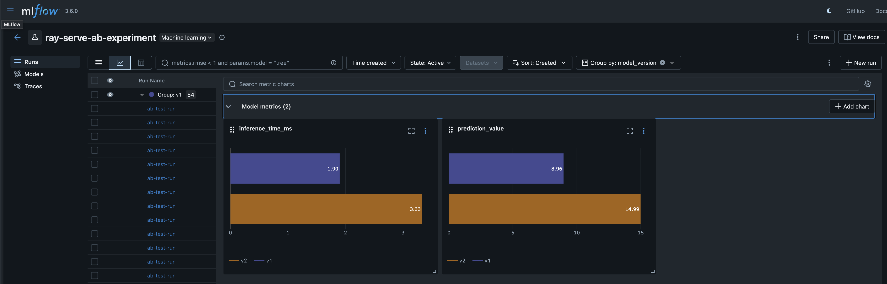

# Model Registry

Ray Serve is Python-native, which means it integrates seamlessly with the broader MLOps ecosystem. You can easily connect Ray Serve deployments to Model Registry, enabling production-ready ML workflows without complex configuration or glue code.

This guide shows you how to integrate Ray Serve with Model Registry to build end-to-end ML serving pipelines, including production considerations such as model versioning, performance optimization, and infrastructure setup.

## Why Python-native integration matters

Unlike framework-specific serving solutions that require custom adapters or complex configuration, Ray Serve runs arbitrary Python code. This means you can:

- Load models directly from any model registry using standard Python clients
- Combine model loading and inference in a single deployment
- Iterate quickly without wrestling with YAML configurations or custom serialization formats

(mlflow-serving-intig)=
## Integrate with MLflow

[MLflow](https://mlflow.org/) is a popular open-source platform for managing the ML lifecycle. Ray Serve makes it easy to load models from MLflow Model Registry and serve them in production.

### Train and register a model

The following example shows how to train a scikit-learn model and register it with MLflow:

```{literalinclude} doc_code/mlflow_model_registry_integration.py
:language: python
:start-after: __train_model_start__
:end-before: __train_model_end__
```

This function trains a RandomForestRegressor, logs the model parameters and metrics, and registers the model in MLflow Model Registry with the name `sk-learn-random-forest-reg-model`.

### Load and serve the model

Once you've registered a model in MLflow, you can load and serve it with Ray Serve. The following example shows how to create a deployment that loads a model from MLflow Model Registry:

```{literalinclude} doc_code/mlflow_model_registry_integration.py
:language: python
:start-after: __deployment_start__
:end-before: __deployment_end__
```

The `MLflowModelDeployment` class loads the model in its `__init__` method using the MLflow model URI. The `model_uri` parameter can reference models in several ways:

- `models:/ModelName/latest` - Load the latest version of a model
- `models:/ModelName/Production` - Load the production version of a model
- `models:/ModelName/1` - Load a specific version number
- `runs:/<run_id>/model` - Load a model from a specific MLflow run

## Production Tips for Using Model Registry with Ray Serve

This section distills **practical, Ray Serve–specific guidance** for using Model Registry in production—covering model loading, infrastructure, updates, and multi-model patterns. The goal is to help you run models on Ray Serve with **high reliability and zero-downtime updates**.

### Keep the registry close to your Ray cluster

Because Serve replicas download artifacts at startup, network hops matter:

* Run the registry in the **same region/VPC** as your Ray cluster
* Minimize cross-region egress
* If self-hosting MLflow on Kubernetes, co-locate with Ray nodes when possible

### Memory & Resource Planning for Ray Serve Replicas

Ray Serve hosts models inside long-running Python actors, so memory planning is crucial.

1. Give each replica extra memory headroom. Python deserialization, framework runtimes, tokenizers, and temporary tensors all add overhead. **Rule of thumb:** 
**Reserve at least 1.5–2× your serialized model size per replica.** For example, a 4GB model typically requires 6–8GB of available memory.
2. Use Ray’s actor-level memory limits

```python
@serve.deployment(ray_actor_options={"memory": <bytes>})
```

Prevents a single model replica from OOM-killing the entire node.

3. Plan for multi-replica costs. Ray Serve does **not** share model memory between replicas. 10 replicas of a 4GB model = ~60–70GB of required memory.

4. For very large models (10–20GB+)
    * quantization or pruning before registering
    * storing pre-converted formats (ONNX, TorchScript)
    * preloading onto node-local NVMe to avoid repeated downloads

### Zero-Downtime Model Updates in Ray Serve

Ray Serve has multiple ways to update models safely. Choose the simplest one that fits your workflow.

1. **Rolling updates via updated model URI (recommended)**: Update the model URI in your deployment definition and run `serve deploy`. Ray Serve: starts new replicas, waits for them to become healthy and gracefully stops old replicas

2. **Hot-swap using `user_config` + `reconfigure()`:** Great for frequent model updates, No deployment code change and Faster reloads. If you keep your model URI in `user_config`:

```python
@serve.deployment
class Model:
    def reconfigure(self, config):
        self.model = mlflow.pyfunc.load_model(config["model_uri"])
```

Then update with:

```bash
serve deploy --config user_config.yaml
```

### A/B testing with model registry and experiment tracking

A/B testing allows you to compare multiple model versions in production by routing live traffic to different models and tracking their performance. This pattern is essential for validating model improvements, detecting regressions, and making data-driven decisions about model deployments.

Ray Serve makes A/B testing straightforward with its composable deployment architecture. You can deploy multiple model versions simultaneously and use a router deployment to split traffic between them. Combined with MLflow's experiment tracking, you can monitor and compare model performance in real-time.

:::{note}
This example uses MLflow for experiment tracking, but the A/B testing pattern works with other frameworks such as Weights & Biases, Neptune, or custom tracking solutions. Some of these frameworks also provide flexibility to create experiments and set traffic weights directly from their UI or CLI tools.
:::

#### How it works

The A/B testing pattern consists of three components:

1. **Multiple model deployments**: Each deployment loads a different model version from the registry
2. **Router deployment**: Routes incoming requests to different model versions based on your routing logic (random, weighted, or custom)
3. **Experiment tracking**: Logs inference metrics to MLflow for performance comparison

The following example demonstrates A/B testing with two RandomForest models that have different hyperparameters:

**Train and register two models:**

```{literalinclude} doc_code/mlflow_model_registry_integration.py
:language: python
:start-after: __ab_testing_train_models_start__
:end-before: __ab_testing_train_models_end__
```

This code trains two models with different configurations (v1 with 50 estimators, v2 with 100 estimators) and tags them with version identifiers in MLflow Model Registry.

**Create router and model deployments:**

```{literalinclude} doc_code/mlflow_model_registry_integration.py
:language: python
:start-after: __ab_testing_router_start__
:end-before: __ab_testing_router_end__
```

The `ModelVersionDeployment` class loads a model from MLflow and measures inference time. The `ABTestRouter` randomly routes requests to either model version and logs comprehensive metrics to MLflow, including:

- Which model version handled each request
- Inference latency per request
- Prediction values

**Run the example:**

To see the A/B test in action, run the complete example:

```{literalinclude} doc_code/mlflow_model_registry_integration.py
:language: python
:start-after: __ab_testing_run_start__
:end-before: __ab_testing_run_end__
```

#### View results in MLflow UI

Launch the MLflow UI to view and compare your A/B test results:

```bash
mlflow ui
```

Then open `http://localhost:5000` in your browser. You'll see the `ray-serve-ab-experiment` experiment with all inference runs.


