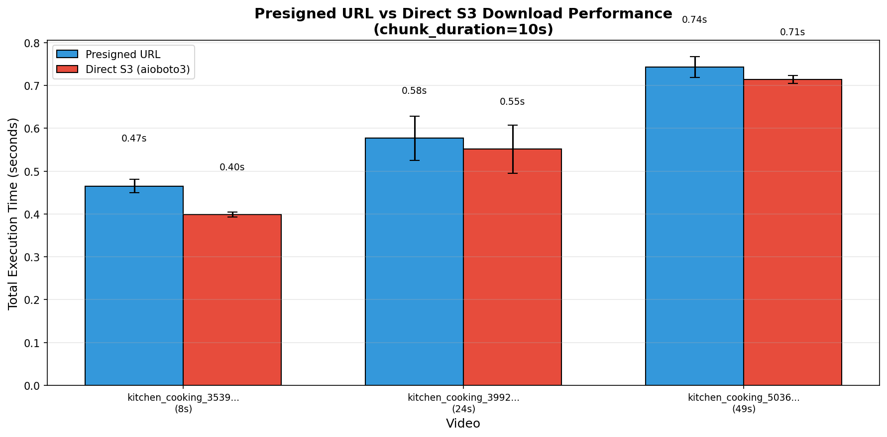
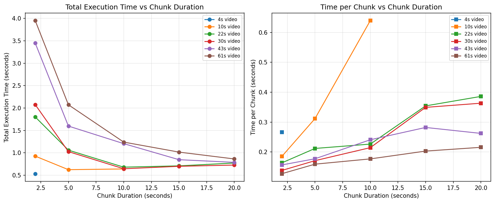
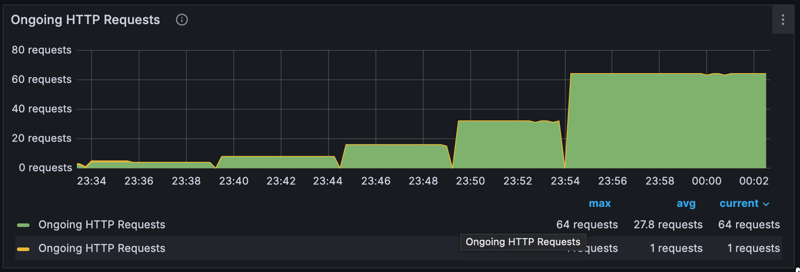
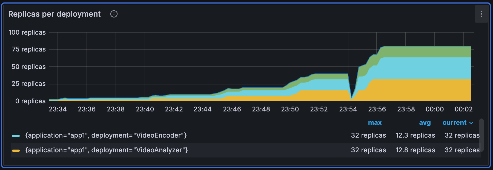
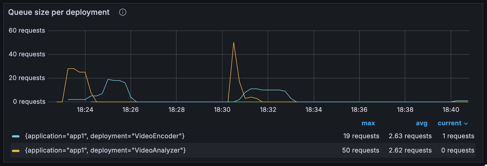
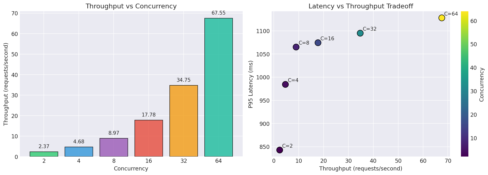

# Video analysis inference pipeline with Ray Serve

This notebook demonstrates how to build a production-grade video analysis pipeline with [Ray Serve](https://docs.ray.io/en/latest/serve/). The pipeline processes videos from S3 and extracts:

- **Tags**: [Zero-shot classification](https://huggingface.co/tasks/zero-shot-image-classification) labels (such as "kitchen", "office", "park")
- **Captions**: Retrieval-based descriptions matching the video content
- **Scene changes**: Detected transitions using [exponential moving average (EMA)](https://en.wikipedia.org/wiki/Exponential_smoothing) analysis

The system uses [**SigLIP**](https://huggingface.co/google/siglip-so400m-patch14-384) (`google/siglip-so400m-patch14-384`) as the vision-language backbone. SigLIP provides a unified embedding space for both images and text, enabling zero-shot classification and retrieval without task-specific fine-tuning.

## Architecture

The pipeline splits work across three [Ray Serve deployments](https://docs.ray.io/en/latest/serve/key-concepts.html#deployment), each optimized for its workload:

```
                              ┌─────────────────────┐
                         ┌───▶│  VideoEncoder       │
                         │    │      (GPU)          │
                         │    ├─────────────────────┤
┌─────────────────────┐  │    │ • SigLIP embedding  │
│  VideoAnalyzer      │──┤    │ • 16 frames/chunk   │
│     (Ingress)       │  │    │ • L2 normalization  │
├─────────────────────┤  │    └─────────────────────┘
│ • S3 download       │  │          num_gpus=1
│ • FFmpeg chunking   │  │
│ • Request routing   │  │    ┌─────────────────────┐
└─────────────────────┘  └───▶│  MultiDecoder       │
      num_cpus=6              │      (CPU)          │
                              ├─────────────────────┤
                              │ • Tag classification│
                              │ • Caption retrieval │
                              │ • Scene detection   │
                              └─────────────────────┘
                                    num_cpus=1
```

**Request lifecycle:**
1. `VideoAnalyzer` receives HTTP request with S3 video URI
2. Downloads video from S3, splits into fixed-duration chunks using FFmpeg
3. Sends all chunks to `VideoEncoder` concurrently
4. Encoder returns embedding references (stored in Ray object store)
5. `VideoAnalyzer` sends embeddings to `MultiDecoder` serially (for EMA state continuity)
6. Aggregates results and returns tags, captions, and scene changes


## Why Ray Serve?

This pipeline has three distinct workloads: a GPU-bound encoder running SigLIP, a CPU-bound decoder doing cosine similarity, and a CPU-heavy ingress running FFmpeg. Traditional serving frameworks force you to bundle these into a single container with fixed resources, wasting GPU when the decoder runs or starving FFmpeg when the encoder dominates.

Ray Serve solves this with **heterogeneous [resource allocation](https://docs.ray.io/en/latest/serve/configure-serve-deployment.html#configure-ray-serve-deployments) per deployment**. The encoder requests 1 GPU, the decoder requests 1 CPU, and the ingress requests 6 CPUs for parallel FFmpeg. Each deployment [scales independently](https://docs.ray.io/en/latest/serve/autoscaling-guide.html) based on its own queue depth—GPU replicas scale with encoding demand while CPU replicas scale separately with decoding demand. The load test demonstrates this: throughput scales near-linearly from 2.4 to 67.5 requests/second as the system provisions replicas to match load.

The pipeline also benefits from **zero-copy data transfer**. The ingress passes encoder results directly to the decoder as unawaited [DeploymentResponse](https://docs.ray.io/en/latest/serve/api/doc/ray.serve.handle.DeploymentResponse.html) references rather than serialized data. Ray stores the embeddings in its [object store](https://docs.ray.io/en/latest/ray-core/objects.html), and the decoder retrieves them directly without routing through the ingress. When encoder and decoder land on the same node, this transfer is zero-copy.

**Request pipelining** keeps the GPU saturated. By allowing two concurrent requests per encoder replica via `max_ongoing_requests`, one request prepares data on CPU while another computes on GPU. This achieves 100% GPU utilization without batching, which would add latency from waiting for requests to accumulate.

Finally, **[deployment composition](https://docs.ray.io/en/latest/serve/model_composition.html)** lets you define the encoder, decoder, and ingress as separate classes, then wire them together with `.bind()`. Ray Serve handles deployment ordering, health checks, and request routing. The ingress maintains explicit state (EMA for scene detection) across chunks, which works correctly even when autoscaling routes requests to different decoder replicas—no sticky sessions required.

---

## Setup

### Prerequisites

Before running this notebook, ensure you have:

| Requirement | Purpose |
|-------------|---------|
| **Pexels API key** | Download sample video (free at https://www.pexels.com/api/) |
| **S3 bucket** | Store videos and text embeddings |
| **AWS credentials** | Read/write access to your S3 bucket |
| **ffmpeg** | Video processing and frame extraction |
| **GPU** | Run SigLIP model for encoding (1 GPU minimum) |

Set these environment variables before running:

```bash
export PEXELS_API_KEY="your-pexels-api-key"
export S3_BUCKET="your-bucket-name"
export AWS_ACCESS_KEY_ID="..."
export AWS_SECRET_ACCESS_KEY="..."
```

> **Note on GPU type**: The benchmarks, design choices, and hyperparameters in this notebook were tuned for **NVIDIA L4 GPUs**. Different GPU types (A10G, T4, A100, etc.) have different memory bandwidth, compute throughput, and batch characteristics. You may need to adjust `max_ongoing_requests`, chunk sizes, and concurrency limits for optimal performance on other hardware.


```python
import os

PEXELS_API_KEY = os.environ.get("PEXELS_API_KEY")  # Or set directly: "your-api-key"
S3_BUCKET = os.environ.get("S3_BUCKET")  # Or set directly: "your-bucket"
```

### Download sample video

Before running the pipeline, we need a sample video in S3. This section downloads a video from Pexels, normalizes it, and uploads to S3.

**Why normalize videos?** We re-encode all videos to a consistent format:
- **384×384 resolution**: Matches SigLIP's input size exactly, eliminating resize during inference
- **30 fps**: Standardizes frame timing for consistent chunk boundaries
- **[H.264](https://en.wikipedia.org/wiki/Advanced_Video_Coding) codec (libx264)**: Fast seeking—FFmpeg can jump directly to any timestamp without decoding preceding frames. Some source codecs (VP9, HEVC) require sequential decoding, adding latency for chunk extraction


```python
import asyncio

try:
    asyncio.get_running_loop()
except RuntimeError:
    loop = asyncio.new_event_loop()
    asyncio.set_event_loop(loop)
```


```python
from scripts.download_stock_videos import download_sample_videos

# Download sample videos (checks for existing manifest first, skips Pexels API if found)
S3_PREFIX = "anyscale-example/stock-videos/"
video_paths = asyncio.get_event_loop().run_until_complete(download_sample_videos(
    api_key=PEXELS_API_KEY,
    bucket=S3_BUCKET,
    total=1,  # Just need one sample video
    s3_prefix=S3_PREFIX,
    overwrite=False
))

if not video_paths:
    raise RuntimeError("No videos downloaded")

SAMPLE_VIDEO_URI = video_paths[0]
print(f"\nSample video ready: {SAMPLE_VIDEO_URI}")

```

    ✅ S3 bucket 'anyscale-example-video-analysis-test-bucket' accessible
    ✅ Found existing manifest with 1 videos in S3
       Skipping Pexels API download
    
    Sample video ready: s3://anyscale-example-video-analysis-test-bucket/anyscale-example/stock-videos/kitchen_cooking_35395675_00.mp4


### Generate embeddings for text bank

The decoder matches video embeddings against precomputed **text embeddings** for tags and descriptions. We define the text banks here and use a [Ray task](https://docs.ray.io/en/latest/ray-core/tasks.html) to compute embeddings on GPU and upload to S3.


```python
from textbanks import TAGS, DESCRIPTIONS

print(f"Tags: {TAGS}")
print(f"Descriptions: {DESCRIPTIONS}")
```

    Tags: ['kitchen', 'living room', 'office', 'meeting room', 'classroom', 'restaurant', 'cafe', 'grocery store', 'gym', 'warehouse', 'parking lot', 'city street', 'park', 'shopping mall', 'beach', 'sports field', 'hallway', 'lobby', 'bathroom', 'bedroom']
    Descriptions: ['A person cooking in a kitchen', 'Someone preparing food on a counter', 'A chef working in a professional kitchen', 'People eating at a dining table', 'A group having a meal together', 'A person working at a desk', 'Someone typing on a laptop', 'A business meeting in progress', 'A presentation being given', 'People collaborating in an office', 'A teacher lecturing in a classroom', 'Students sitting at desks', 'A person giving a speech', 'Someone writing on a whiteboard', 'A customer shopping in a store', 'People browsing products on shelves', 'A cashier at a checkout counter', 'A person exercising at a gym', 'Someone lifting weights', 'A person running on a treadmill', 'People walking on a city sidewalk', 'Pedestrians crossing a street', 'Traffic moving through an intersection', 'Cars driving on a road', 'A vehicle parked in a lot', 'People walking through a park', 'Someone jogging outdoors', 'A group having a conversation', 'Two people talking face to face', 'A person on a phone call', 'Someone reading a book', 'A person watching television', 'People waiting in line', 'A crowded public space', 'An empty hallway or corridor', 'A person entering a building', 'Someone opening a door', 'A delivery being made', 'A person carrying boxes', 'Workers in a warehouse']


```python
import ray

from jobs.generate_text_embeddings import generate_embeddings_task

S3_EMBEDDINGS_PREFIX = "anyscale-example/embeddings/"

# Run the Ray task (uses TAGS and DESCRIPTIONS from textbanks module)
# Note: runtime_env ships local modules to worker nodes (job working_dir only applies to driver)
ray.init(runtime_env={"working_dir": "."}, ignore_reinit_error=True)
result = ray.get(generate_embeddings_task.remote(S3_BUCKET, S3_EMBEDDINGS_PREFIX))

print(f"\nText embeddings ready:")
print(f"  Tags: {result['tag_embeddings']['s3_uri']}")
print(f"  Descriptions: {result['description_embeddings']['s3_uri']}")
```

    2026-01-06 08:27:08,101	INFO worker.py:1821 -- Connecting to existing Ray cluster at address: 10.0.45.10:6379...
    2026-01-06 08:27:08,114	INFO worker.py:1998 -- Connected to Ray cluster. View the dashboard at https://session-lqu9h8iu3cpgv59j74p498djis.i.anyscaleuserdata-staging.com 
    2026-01-06 08:27:08,160	INFO packaging.py:463 -- Pushing file package 'gcs://_ray_pkg_56a868c6743600cdc03ad7fedef93ccaf9011e05.zip' (10.59MiB) to Ray cluster...
    2026-01-06 08:27:08,200	INFO packaging.py:476 -- Successfully pushed file package 'gcs://_ray_pkg_56a868c6743600cdc03ad7fedef93ccaf9011e05.zip'.
    /home/ray/anaconda3/lib/python3.12/site-packages/ray/_private/worker.py:2046: FutureWarning: Tip: In future versions of Ray, Ray will no longer override accelerator visible devices env var if num_gpus=0 or num_gpus=None (default). To enable this behavior and turn off this error message, set RAY_ACCEL_ENV_VAR_OVERRIDE_ON_ZERO=0
      warnings.warn(


    (generate_embeddings_task pid=6626, ip=10.0.222.50) ============================================================
    (generate_embeddings_task pid=6626, ip=10.0.222.50) Starting text embedding generation
    (generate_embeddings_task pid=6626, ip=10.0.222.50) ============================================================
    (generate_embeddings_task pid=6626, ip=10.0.222.50) 
    (generate_embeddings_task pid=6626, ip=10.0.222.50) 📚 Loading text banks...
    (generate_embeddings_task pid=6626, ip=10.0.222.50)    Tags: 20
    (generate_embeddings_task pid=6626, ip=10.0.222.50)    Descriptions: 40
    (generate_embeddings_task pid=6626, ip=10.0.222.50) 
    (generate_embeddings_task pid=6626, ip=10.0.222.50) 🤖 Loading SigLIP model: google/siglip-so400m-patch14-384
    (generate_embeddings_task pid=6626, ip=10.0.222.50)    Device: cuda


    (generate_embeddings_task pid=6626, ip=10.0.222.50) Using a slow image processor as `use_fast` is unset and a slow processor was saved with this model. `use_fast=True` will be the default behavior in v4.52, even if the model was saved with a slow processor. This will result in minor differences in outputs. You'll still be able to use a slow processor with `use_fast=False`.


    (generate_embeddings_task pid=6626, ip=10.0.222.50)    Model loaded in 2.6s
    (generate_embeddings_task pid=6626, ip=10.0.222.50) 
    (generate_embeddings_task pid=6626, ip=10.0.222.50) 🏷️  Generating tag embeddings...
    (generate_embeddings_task pid=6626, ip=10.0.222.50)    Shape: (20, 1152)
    (generate_embeddings_task pid=6626, ip=10.0.222.50)    Time: 0.21s
    (generate_embeddings_task pid=6626, ip=10.0.222.50) 
    (generate_embeddings_task pid=6626, ip=10.0.222.50) 📝 Generating description embeddings...
    (generate_embeddings_task pid=6626, ip=10.0.222.50)    Shape: (40, 1152)
    (generate_embeddings_task pid=6626, ip=10.0.222.50)    Time: 0.25s
    (generate_embeddings_task pid=6626, ip=10.0.222.50) 
    (generate_embeddings_task pid=6626, ip=10.0.222.50) ☁️  Uploading to S3 bucket: anyscale-example-video-analysis-test-bucket
    
    Text embeddings ready:
      Tags: s3://anyscale-example-video-analysis-test-bucket/anyscale-example/embeddings/tag_embeddings.npz
      Descriptions: s3://anyscale-example-video-analysis-test-bucket/anyscale-example/embeddings/description_embeddings.npz


---

## Build the Ray Serve application

This section walks through building the video analysis pipeline step by step, introducing Ray Serve concepts as we go.


### GPU encoder

The `VideoEncoder` deployment runs on GPU and converts video frames to embeddings using SigLIP. Key configuration:

- `num_gpus=1`: Each replica requires a dedicated GPU
- `max_ongoing_requests=2`: Allows pipelining—while one request computes on GPU, another prepares data on CPU

**Why no request batching?** A single chunk (16 frames @ 384×384) already saturates GPU compute. Batching multiple requests would require holding them until a batch forms, adding latency without throughput gain. Instead, we use `max_ongoing_requests=2` to pipeline preparation and computation.


**Why [`asyncio.to_thread`](https://docs.python.org/3/library/asyncio-task.html#asyncio.to_thread)?** Ray Serve deployments run in an async event loop. The `encode_frames` method is CPU/GPU-bound (PyTorch inference), which would block the event loop and prevent concurrent request handling. Wrapping it in `asyncio.to_thread` offloads the blocking work to a thread pool, keeping the event loop free to accept new requests.

**Why pass [`DeploymentResponse`](https://docs.ray.io/en/latest/serve/api/doc/ray.serve.handle.DeploymentResponse.html) to decoder?** Instead of awaiting the encoder result in `VideoAnalyzer` and passing raw data to the decoder, we pass the unawaited `DeploymentResponse` directly. Ray Serve automatically resolves this reference when the decoder needs it, storing the embeddings in the [object store](https://docs.ray.io/en/latest/ray-core/objects.html#objects-in-ray). This avoids an unnecessary serialize/deserialize round-trip through `VideoAnalyzer`—the decoder retrieves data directly from the object store, enabling zero-copy transfer if encoder and decoder are on the same node.


```python
from constants import MODEL_NAME

print(f"MODEL_NAME: {MODEL_NAME}")
```

    (generate_embeddings_task pid=6626, ip=10.0.222.50)    Tags: s3://anyscale-example-video-analysis-test-bucket/anyscale-example/embeddings/tag_embeddings.npz
    (generate_embeddings_task pid=6626, ip=10.0.222.50)    Descriptions: s3://anyscale-example-video-analysis-test-bucket/anyscale-example/embeddings/description_embeddings.npz
    (generate_embeddings_task pid=6626, ip=10.0.222.50) 
    (generate_embeddings_task pid=6626, ip=10.0.222.50) ✅ Done!


    MODEL_NAME: google/siglip-so400m-patch14-384


```python
from deployments.encoder import VideoEncoder
import inspect

print(inspect.getsource(VideoEncoder.func_or_class))
```

    @serve.deployment(
        num_replicas="auto",
        ray_actor_options={"num_gpus": 1, "num_cpus": 2},
        # GPU utilization is at 100% when this is set to 2. with L4
        # aka number on ongoing chunks that can be processed at once.
        max_ongoing_requests=2,
        autoscaling_config={
            "min_replicas": 1,
            "max_replicas": 10,
            "target_num_ongoing_requests": 2,
        },
    )
    class VideoEncoder:
        """
        Encodes video frames into embeddings using SigLIP.
        
        Returns both per-frame embeddings and pooled embedding.
        """
        
        def __init__(self):
            self.device = "cuda" if torch.cuda.is_available() else "cpu"
            print(f"VideoEncoder initializing on {self.device}")
            
            # Load SigLIP model and processor
            self.processor = AutoProcessor.from_pretrained(MODEL_NAME)
            self.model = AutoModel.from_pretrained(MODEL_NAME).to(self.device)
            self.model.eval()
            
            # Get embedding dimension
            self.embedding_dim = self.model.config.vision_config.hidden_size
            
            print(f"VideoEncoder ready (embedding_dim={self.embedding_dim})")
        
        def encode_frames(self, frames: np.ndarray) -> np.ndarray:
            """
            Encode frames and return per-frame embeddings.
            
            Args:
                frames: np.ndarray of shape (T, H, W, 3) uint8 RGB
            
            Returns:
                np.ndarray of shape (T, D) float32, L2-normalized per-frame embeddings
            """
            
            # Convert to PIL images
            pil_images = frames_to_pil_list(frames)
            
            # Process images
            inputs = self.processor(images=pil_images, return_tensors="pt").to(self.device)
            # inputs = {k: v.to(self.device) for k, v in inputs.items()}
    
            start = torch.cuda.Event(enable_timing=True)
            end = torch.cuda.Event(enable_timing=True)
    
            # Get embeddings
            with torch.no_grad():
                with torch.amp.autocast(device_type=self.device, enabled=self.device == "cuda"):
                    outputs = self.model.get_image_features(**inputs)
    
                    # L2 normalize on GPU (faster than CPU numpy)
                    frame_embeddings = torch.nn.functional.normalize(outputs, p=2, dim=1)
            
            # Move to CPU and convert to numpy
            result = frame_embeddings.cpu().numpy().astype(np.float32)
            return result
        
        async def encode_unbatched(self, frames: np.ndarray) -> dict:
            """
            Unbatched entry point - processes single request directly.
            
            Args:
                frames: np.ndarray of shape (T, H, W, 3)
            
            Returns:
                dict with 'frame_embeddings' and 'embedding_dim'
            """
            print(f"Unbatched: {frames.shape[0]} frames")
            
            frame_embeddings = await asyncio.to_thread(self.encode_frames, frames)
            
            return {
                "frame_embeddings": frame_embeddings,
                "embedding_dim": self.embedding_dim,
            }
        
        @serve.batch(max_batch_size=2, batch_wait_timeout_s=0.1)
        async def encode_batched(self, frames_batch: List[np.ndarray]) -> List[dict]:
            """
            Batched entry point - collects multiple requests into single GPU call.
            
            Args:
                frames_batch: List of frame arrays, each of shape (T, H, W, 3)
            
            Returns:
                List of dicts, each with 'frame_embeddings' and 'embedding_dim'
            """
            frame_counts = [f.shape[0] for f in frames_batch]
            total_frames = sum(frame_counts)
            
            print(f"Batched: {len(frames_batch)} requests ({total_frames} total frames)")
            
            # Concatenate all frames into single batch
            all_frames = np.concatenate(frames_batch, axis=0)
            
            # Single forward pass for all frames
            all_embeddings = await asyncio.to_thread(self.encode_frames, all_frames)
            
            # Split results back per request
            results = []
            offset = 0
            for n_frames in frame_counts:
                chunk_embeddings = all_embeddings[offset:offset + n_frames]
                results.append({
                    "frame_embeddings": chunk_embeddings,
                    "embedding_dim": self.embedding_dim,
                })
                offset += n_frames
            
            return results
        
        async def __call__(self, frames: np.ndarray, use_batching: bool = False) -> dict:
            """
            Main entry point. Set use_batching=False for direct comparison.
            """
            if use_batching:
                return await self.encode_batched(frames)
            else:
                return await self.encode_unbatched(frames)
    


### CPU decoder

The `MultiDecoder` deployment runs on CPU and performs three tasks:

1. **Tag classification**: [Cosine similarity](https://en.wikipedia.org/wiki/Cosine_similarity) between video embedding and precomputed tag embeddings
2. **Caption retrieval**: Find the best-matching description from a text bank
3. **Scene detection**: EMA-based anomaly detection comparing each frame to recent history

The decoder loads precomputed text embeddings from S3 at startup.

**Why separate GPU/CPU deployments?** The encoder needs GPU for neural network inference; the decoder only does numpy dot products. Separating them allows independent scaling—encoders are limited by GPU count, decoders scale cheaply with CPU cores. This avoids tying expensive GPU resources to lightweight CPU work.

**Why EMA for scene detection?** Exponential Moving Average reuses existing SigLIP embeddings without an extra model. The algorithm computes `score = 1 - cosine(frame, EMA)` where EMA updates as `ema = 0.9*ema + 0.1*frame`. A simple threshold (`score > 0.15`) detects abrupt scene changes while smoothing noise.


```python
from deployments.decoder import MultiDecoder

print(inspect.getsource(MultiDecoder.func_or_class))
```

    @serve.deployment(
        num_replicas="auto",
        ray_actor_options={"num_cpus": 1},
        max_ongoing_requests=4, # can be set higher than 4, but since the encoder is limited to 4, we need to keep it at 4.
        autoscaling_config={
            "min_replicas": 1,
            "max_replicas": 10,
            "target_num_ongoing_requests": 2,
        },
    )
    class MultiDecoder:
        """
        Decodes video embeddings into tags, captions, and scene changes.
        
        Uses precomputed text embeddings loaded from S3.
        This deployment is stateless - EMA state for scene detection is passed
        in and returned with each call, allowing the caller to maintain state
        continuity across multiple replicas.
        """
        
        async def __init__(self, bucket: str, s3_prefix: str = S3_EMBEDDINGS_PREFIX):
            """Initialize decoder with text embeddings from S3."""
            self.bucket = bucket
            self.ema_alpha = EMA_ALPHA
            self.scene_threshold = SCENE_CHANGE_THRESHOLD
            self.s3_prefix = s3_prefix
            logger.info(f"MultiDecoder initializing (bucket={self.bucket}, ema_alpha={self.ema_alpha}, threshold={self.scene_threshold})")
            
            await self._load_embeddings()
            
            logger.info(f"MultiDecoder ready (tags={len(self.tag_texts)}, descriptions={len(self.desc_texts)})")
        
        async def _load_embeddings(self):
            """Load precomputed text embeddings from S3."""
            session = aioboto3.Session(region_name=get_s3_region(self.bucket))
            
            async with session.client("s3") as s3:
                # Load tag embeddings
                tag_key = f"{self.s3_prefix}tag_embeddings.npz"
                response = await s3.get_object(Bucket=self.bucket, Key=tag_key)
                tag_data = await response["Body"].read()
                tag_npz = np.load(io.BytesIO(tag_data), allow_pickle=True)
                self.tag_embeddings = tag_npz["embeddings"]
                self.tag_texts = tag_npz["texts"].tolist()
                
                # Load description embeddings
                desc_key = f"{self.s3_prefix}description_embeddings.npz"
                response = await s3.get_object(Bucket=self.bucket, Key=desc_key)
                desc_data = await response["Body"].read()
                desc_npz = np.load(io.BytesIO(desc_data), allow_pickle=True)
                self.desc_embeddings = desc_npz["embeddings"]
                self.desc_texts = desc_npz["texts"].tolist()
        
        def _cosine_similarity(self, embedding: np.ndarray, bank: np.ndarray) -> np.ndarray:
            """Compute cosine similarity between embedding and all vectors in bank."""
            return bank @ embedding
        
        def _get_top_tags(self, embedding: np.ndarray, top_k: int = 5) -> list[dict]:
            """Get top-k matching tags with scores."""
            scores = self._cosine_similarity(embedding, self.tag_embeddings)
            top_indices = np.argsort(scores)[::-1][:top_k]
            return [
                {"text": self.tag_texts[i], "score": float(scores[i])}
                for i in top_indices
            ]
        
        def _get_retrieval_caption(self, embedding: np.ndarray) -> dict:
            """Get best matching description."""
            scores = self._cosine_similarity(embedding, self.desc_embeddings)
            best_idx = np.argmax(scores)
            return {
                "text": self.desc_texts[best_idx],
                "score": float(scores[best_idx]),
            }
        
        def _detect_scene_changes(
            self,
            frame_embeddings: np.ndarray,
            chunk_index: int,
            chunk_start_time: float,
            chunk_duration: float,
            ema_state: np.ndarray | None = None,
        ) -> tuple[list[dict], np.ndarray]:
            """
            Detect scene changes using EMA-based scoring.
            
            score_t = 1 - cosine(E_t, ema_t)
            ema_t = α * ema_{t-1} + (1-α) * E_t
            
            Args:
                frame_embeddings: (T, D) normalized embeddings
                chunk_index: Index of this chunk in the video
                chunk_start_time: Start time of chunk in video (seconds)
                chunk_duration: Duration of chunk (seconds)
                ema_state: EMA state from previous chunk, or None for first chunk
            
            Returns:
                Tuple of (scene_changes list, updated ema_state)
            """
            num_frames = len(frame_embeddings)
            if num_frames == 0:
                # Return empty changes and unchanged state (or zeros if no state)
                return [], ema_state if ema_state is not None else np.zeros(0)
            
            # Initialize EMA from first frame if no prior state
            ema = ema_state.copy() if ema_state is not None else frame_embeddings[0].copy()
            scene_changes = []
            
            for frame_idx, embedding in enumerate(frame_embeddings):
                # Compute score: how different is current frame from recent history
                similarity = float(np.dot(embedding, ema))
                score = max(0.0, 1.0 - similarity)
                
                # Detect scene change if score exceeds threshold
                if score >= self.scene_threshold:
                    # Calculate timestamp within video
                    frame_offset = (frame_idx / max(1, num_frames - 1)) * chunk_duration
                    timestamp = chunk_start_time + frame_offset
                    
                    scene_changes.append({
                        "timestamp": round(timestamp, 3),
                        "score": round(score, 4),
                        "chunk_index": chunk_index,
                        "frame_index": frame_idx,
                    })
                
                # Update EMA
                ema = self.ema_alpha * ema + (1 - self.ema_alpha) * embedding
                # Re-normalize
                ema = ema / np.linalg.norm(ema)
            
            return scene_changes, ema
        
        def __call__(
            self,
            encoder_output: dict,
            chunk_index: int,
            chunk_start_time: float,
            chunk_duration: float,
            top_k_tags: int = 5,
            ema_state: np.ndarray | None = None,
        ) -> dict:
            """
            Decode embeddings into tags, caption, and scene changes.
            
            Args:
                encoder_output: Dict with 'frame_embeddings' and 'embedding_dim'
                chunk_index: Index of this chunk in the video
                chunk_start_time: Start time of chunk (seconds)
                chunk_duration: Duration of chunk (seconds)
                top_k_tags: Number of top tags to return
                ema_state: EMA state from previous chunk for scene detection continuity.
                    Pass None for the first chunk of a stream.
            
            Returns:
                Dict containing tags, retrieval_caption, scene_changes, and updated ema_state.
                The caller should pass the returned ema_state to the next chunk's call.
            """
            # Get frame embeddings from encoder output
            frame_embeddings = encoder_output["frame_embeddings"]
            
            # Calculate pooled embedding (mean across frames, normalized)
            pooled_embedding = frame_embeddings.mean(axis=0)
            pooled_embedding = pooled_embedding / np.linalg.norm(pooled_embedding)
    
            # Classification and retrieval on pooled embedding
            tags = self._get_top_tags(pooled_embedding, top_k=top_k_tags)
            caption = self._get_retrieval_caption(pooled_embedding)
            
            # Scene change detection on frame embeddings
            scene_changes, new_ema_state = self._detect_scene_changes(
                frame_embeddings=frame_embeddings,
                chunk_index=chunk_index,
                chunk_start_time=chunk_start_time,
                chunk_duration=chunk_duration,
                ema_state=ema_state,
            )
            
            return {
                "tags": tags,
                "retrieval_caption": caption,
                "scene_changes": scene_changes,
                "ema_state": new_ema_state,
            }
    


### Video chunking

Before we can process a video, we need to split it into fixed-duration chunks and extract frames. The chunking process:

1. **Get video duration** using [`ffprobe`](https://ffmpeg.org/ffprobe.html)
2. **Define chunk boundaries** (e.g., 0-10s, 10-20s, 20-30s for a 30s video)
3. **Extract frames in parallel** using multiple concurrent [`ffmpeg`](https://ffmpeg.org/) processes
4. **Limit concurrency** with [`asyncio.Semaphore`](https://docs.python.org/3/library/asyncio-sync.html#asyncio.Semaphore) to avoid CPU oversubscription

Each chunk extracts 16 frames uniformly sampled across its duration, resized to 384×384 (matching SigLIP's input size).

#### Design choices

**Direct S3 download vs presigned URLs**: We download the video to local disk before processing. An alternative is generating a presigned S3 URL and passing it directly to FFmpeg. Benchmarks show direct download is faster—FFmpeg's HTTP client doesn't handle S3's chunked responses as efficiently as `aioboto3`, and network latency compounds across multiple seeks.



**Single FFmpeg vs parallel FFmpeg**: Two approaches for extracting frames from multiple chunks:
- **Single FFmpeg**: One process reads the entire video, using `select` filter to pick frames at specific timestamps
- **Parallel FFmpeg**: Multiple concurrent processes, each extracting one chunk

Chose the Single FFmpeg approach since it outperforms parallel FFmpeg on longer videos and yields similar performance for typical 10s chunks. This method is both efficient and scalable as chunk counts grow.


**Chunk duration**: We use 10-second chunks. Shorter chunks increase overhead (more FFmpeg calls, more encoder/decoder round-trips). Longer chunks increases processing efficiency but **degrade inference quality**—SigLIP processes exactly 16 frames per chunk, so a 60-second chunk samples one frame every 3.75 seconds, missing fast scene changes. The 10-second sweet spot balances throughput with temporal resolution (~1.6 fps sampling).




### Deployment composition

The `VideoAnalyzer` ingress deployment orchestrates the encoder and decoder. It uses [FastAPI](https://fastapi.tiangolo.com/) integration with [`@serve.ingress`](https://docs.ray.io/en/latest/serve/http-guide.html#fastapi-http-deployments) for HTTP endpoints.

#### Design choices

**Why `num_cpus=6`?** The analyzer runs FFmpeg for frame extraction. Each FFmpeg process uses `FFMPEG_THREADS=2`, and we run up to `NUM_WORKERS=3` concurrent processes. So `2 × 3 = 6` CPUs ensures FFmpeg doesn't contend for CPU during parallel chunk extraction.

**Why `max_ongoing_requests=4`?** The encoder has `max_ongoing_requests=2`. We want the analyzer to stay ahead: while 2 videos are encoding, we download and chunk 2 more videos so they're ready when encoder slots free up. This keeps the GPU pipeline saturated without excessive memory from queued requests.

**Why cache the S3 client?** Creating a new `aioboto3` client per request adds overhead (connection setup, credential resolution). Caching the client in `__init__` and reusing it across requests amortizes this cost. The client is thread-safe and handles connection pooling internally.

**Why encode in parallel but decode serially?** Encoding is stateless—each chunk's frames go through SigLIP independently, so we fire all chunks concurrently with [`asyncio.gather`](https://docs.python.org/3/library/asyncio-task.html#asyncio.gather). Decoding requires temporal ordering—the EMA for scene detection must process chunks in order (chunk 0's EMA state feeds into chunk 1). The `VideoAnalyzer` calls the decoder serially, passing EMA state from each response to the next request. This explicit state passing ensures correct scene detection even when multiple decoder replicas exist under autoscaling.


```python
from app import VideoAnalyzer

print(inspect.getsource(VideoAnalyzer.func_or_class))
```

    @serve.deployment(
        # setting this to twice that of the encoder. So that requests can complete the
        # upfront CPU work and be queued for GPU processing.
        num_replicas="auto",
        ray_actor_options={"num_cpus": FFMPEG_THREADS},
        max_ongoing_requests=4,
        autoscaling_config={
            "min_replicas": 2,
            "max_replicas": 20,
            "target_num_ongoing_requests": 2,
        },
    )
    @serve.ingress(fastapi_app)
    class VideoAnalyzer:
        """
        Main ingress deployment that orchestrates VideoEncoder and MultiDecoder.
        
        Encoder refs are passed directly to decoder; Ray Serve resolves dependencies.
        Downloads video from S3 to temp file for fast local processing.
        """
        
        def __init__(self, encoder: VideoEncoder, decoder: MultiDecoder):
            self.encoder = encoder
            self.decoder = decoder
            self._s3_session = aioboto3.Session()
            self._s3_client = None  # Cached client for reuse across requests
            logger.info("VideoAnalyzer ready")
        
        async def _get_s3_client(self):
            """Get or create a reusable S3 client."""
            if self._s3_client is None:
                self._s3_client = await self._s3_session.client("s3").__aenter__()
            return self._s3_client
        
        async def _download_video(self, s3_uri: str) -> Path:
            """Download video from S3 to temp file. Returns local path."""
            bucket, key = parse_s3_uri(s3_uri)
            
            # Create temp file with video extension
            suffix = Path(key).suffix or ".mp4"
            temp_file = tempfile.NamedTemporaryFile(suffix=suffix, delete=False)
            temp_path = Path(temp_file.name)
            temp_file.close()
            
            s3 = await self._get_s3_client()
            await s3.download_file(bucket, key, str(temp_path))
            
            return temp_path
    
        def _aggregate_results(
            self,
            chunk_results: list[dict],
            top_k_tags: int = 5,
        ) -> dict:
            """
            Aggregate results from multiple chunks.
            
            Strategy:
            - Tags: Average scores across chunks, return top-k
            - Caption: Return the one with highest score across all chunks
            """
            # Aggregate tag scores
            tag_scores = defaultdict(list)
            for result in chunk_results:
                for tag in result["tags"]:
                    tag_scores[tag["text"]].append(tag["score"])
            
            # Average tag scores and sort
            aggregated_tags = [
                {"text": text, "score": np.mean(scores)}
                for text, scores in tag_scores.items()
            ]
            aggregated_tags.sort(key=lambda x: x["score"], reverse=True)
            top_tags = aggregated_tags[:top_k_tags]
            
            # Best caption across all chunks
            best_caption = max(
                (r["retrieval_caption"] for r in chunk_results),
                key=lambda x: x["score"],
            )
            
            return {
                "tags": top_tags,
                "retrieval_caption": best_caption,
            }
        
        def _encode_chunk(self, frames: np.ndarray, use_batching: bool = False) -> DeploymentResponse:
            """Encode a single chunk's frames to embeddings. Returns DeploymentResponse ref."""
            return self.encoder.remote(frames, use_batching=use_batching)
    
        async def _decode_chunk(
            self,
            encoder_output: dict,
            chunk_index: int,
            chunk_start_time: float,
            chunk_duration: float,
            ema_state=None,
        ) -> dict:
            """Decode embeddings to tags, caption, scene changes."""
            return await self.decoder.remote(
                encoder_output=encoder_output,
                chunk_index=chunk_index,
                chunk_start_time=chunk_start_time,
                chunk_duration=chunk_duration,
                ema_state=ema_state,
            )
        
        @fastapi_app.post("/analyze", response_model=AnalyzeResponse)
        async def analyze(self, request: AnalyzeRequest) -> AnalyzeResponse:
            """
            Analyze a video from S3 and return tags, caption, and scene changes.
            
            Downloads video to temp file for fast local processing.
            Chunks the entire video and aggregates results.
            Encoder refs are passed directly to decoder for dependency resolution.
            """
            total_start = time.perf_counter()
            temp_path = None
    
            try:
                # Download video from S3 to temp file
                download_start = time.perf_counter()
                try:
                    temp_path = await self._download_video(request.video_path)
                except Exception as e:
                    raise HTTPException(status_code=400, detail=f"Cannot download S3 video: {e}")
                s3_download_ms = (time.perf_counter() - download_start) * 1000
    
                # Chunk video with PARALLEL frame extraction from local file
                decode_start = time.perf_counter()
                try:
                    chunks = await chunk_video_async(
                        str(temp_path),
                        chunk_duration=request.chunk_duration,
                        num_frames_per_chunk=request.num_frames,
                        ffmpeg_threads=FFMPEG_THREADS,
                        use_single_ffmpeg=True,
                    )
                except Exception as e:
                    raise HTTPException(status_code=400, detail=f"Cannot process video: {e}")
    
                decode_video_ms = (time.perf_counter() - decode_start) * 1000
                
                if not chunks:
                    raise HTTPException(status_code=400, detail="No chunks extracted from video")
                
                # Calculate video duration from chunks
                video_duration = chunks[-1].start_time + chunks[-1].duration
                
                # Fire off all encoder calls (returns refs, not awaited)
                encode_start = time.perf_counter()
                encode_refs = [
                    self._encode_chunk(chunk.frames, use_batching=request.use_batching) 
                    for chunk in chunks
                ]
                encode_ms = (time.perf_counter() - encode_start) * 1000
                
                # Decode chunks SERIALLY, passing encoder refs directly.
                # Ray Serve resolves the encoder result when decoder needs it.
                # EMA state is tracked here (not in decoder) to ensure continuity
                # even when autoscaling routes requests to different replicas.
                decode_start = time.perf_counter()
                decode_results = []
                ema_state = None  # Will be initialized from first chunk's first frame
                for chunk, enc_ref in zip(chunks, encode_refs):
                    dec_result = await self._decode_chunk(
                        encoder_output=enc_ref,
                        chunk_index=chunk.index,
                        chunk_start_time=chunk.start_time,
                        chunk_duration=chunk.duration,
                        ema_state=ema_state,
                    )
                    decode_results.append(dec_result)
                    ema_state = dec_result["ema_state"]  # Carry forward for next chunk
                decode_ms = (time.perf_counter() - decode_start) * 1000
                
                # Collect results
                chunk_results = []
                per_chunk_results = []
                all_scene_changes = []
                
                for chunk, decoder_result in zip(chunks, decode_results):
                    chunk_results.append(decoder_result)
                    
                    # Scene changes come directly from decoder
                    chunk_scene_changes = [
                        SceneChange(**sc) for sc in decoder_result["scene_changes"]
                    ]
                    all_scene_changes.extend(chunk_scene_changes)
                    
                    per_chunk_results.append(ChunkResult(
                        chunk_index=chunk.index,
                        start_time=chunk.start_time,
                        duration=chunk.duration,
                        tags=[TagResult(**t) for t in decoder_result["tags"]],
                        retrieval_caption=CaptionResult(**decoder_result["retrieval_caption"]),
                        scene_changes=chunk_scene_changes,
                    ))
                
                # Aggregate results
                aggregated = self._aggregate_results(chunk_results)
                
                total_ms = (time.perf_counter() - total_start) * 1000
                
                return AnalyzeResponse(
                    stream_id=request.stream_id,
                    tags=[TagResult(**t) for t in aggregated["tags"]],
                    retrieval_caption=CaptionResult(**aggregated["retrieval_caption"]),
                    scene_changes=all_scene_changes,
                    num_scene_changes=len(all_scene_changes),
                    chunks=per_chunk_results,
                    num_chunks=len(chunks),
                    video_duration=video_duration,
                    timing_ms=TimingResult(
                        s3_download_ms=round(s3_download_ms, 2),
                        decode_video_ms=round(decode_video_ms, 2),
                        encode_ms=round(encode_ms, 2),
                        decode_ms=round(decode_ms, 2),
                        total_ms=round(total_ms, 2),
                    ),
                )
            finally:
                # Clean up temp file
                if temp_path and temp_path.exists():
                    temp_path.unlink(missing_ok=True)
        
        @fastapi_app.get("/health")
        async def health(self):
            """Health check endpoint."""
            return {"status": "healthy"}
    


```python
encoder = VideoEncoder.bind()
decoder = MultiDecoder.bind(bucket=S3_BUCKET, s3_prefix=S3_EMBEDDINGS_PREFIX)
app = VideoAnalyzer.bind(encoder=encoder, decoder=decoder)
```


```python
from ray import serve

serve.run(app, name="video-analyzer", route_prefix="/", blocking=False)
```

    (ProxyActor pid=251250) INFO 2026-01-06 08:27:23,294 proxy 10.0.45.10 -- Proxy starting on node 7beb9ebc3808dac027f36a0400592d7a27cc9e90f0aab0a2578c328b (HTTP port: 8000).
    INFO 2026-01-06 08:27:23,369 serve 250708 -- Started Serve in namespace "serve".
    (ServeController pid=251181) INFO 2026-01-06 08:27:23,394 controller 251181 -- Registering autoscaling state for deployment Deployment(name='VideoEncoder', app='video-analyzer')
    (ServeController pid=251181) INFO 2026-01-06 08:27:23,395 controller 251181 -- Deploying new version of Deployment(name='VideoEncoder', app='video-analyzer') (initial target replicas: 1).
    (ServeController pid=251181) INFO 2026-01-06 08:27:23,397 controller 251181 -- Registering autoscaling state for deployment Deployment(name='MultiDecoder', app='video-analyzer')
    (ServeController pid=251181) INFO 2026-01-06 08:27:23,397 controller 251181 -- Deploying new version of Deployment(name='MultiDecoder', app='video-analyzer') (initial target replicas: 1).
    (ServeController pid=251181) INFO 2026-01-06 08:27:23,398 controller 251181 -- Registering autoscaling state for deployment Deployment(name='VideoAnalyzer', app='video-analyzer')
    (ServeController pid=251181) INFO 2026-01-06 08:27:23,398 controller 251181 -- Deploying new version of Deployment(name='VideoAnalyzer', app='video-analyzer') (initial target replicas: 2).
    (ProxyActor pid=251250) INFO 2026-01-06 08:27:23,365 proxy 10.0.45.10 -- Got updated endpoints: {}.
    (ProxyActor pid=251250) INFO 2026-01-06 08:27:23,403 proxy 10.0.45.10 -- Got updated endpoints: {Deployment(name='VideoAnalyzer', app='video-analyzer'): EndpointInfo(route='/', app_is_cross_language=False, route_patterns=None)}.
    (ServeController pid=251181) INFO 2026-01-06 08:27:23,508 controller 251181 -- Adding 1 replica to Deployment(name='VideoEncoder', app='video-analyzer').
    (ServeController pid=251181) INFO 2026-01-06 08:27:23,510 controller 251181 -- Adding 1 replica to Deployment(name='MultiDecoder', app='video-analyzer').
    (ServeController pid=251181) INFO 2026-01-06 08:27:23,512 controller 251181 -- Adding 2 replicas to Deployment(name='VideoAnalyzer', app='video-analyzer').
    (ProxyActor pid=251250) INFO 2026-01-06 08:27:23,416 proxy 10.0.45.10 -- Started <ray.serve._private.router.SharedRouterLongPollClient object at 0x72d0e5f4f710>.
    (ProxyActor pid=251250) INFO 2026-01-06 08:27:27,576 proxy 10.0.45.10 -- Got updated endpoints: {Deployment(name='VideoAnalyzer', app='video-analyzer'): EndpointInfo(route='/', app_is_cross_language=False, route_patterns=[RoutePattern(methods=['POST'], path='/analyze'), RoutePattern(methods=['GET', 'HEAD'], path='/docs'), RoutePattern(methods=['GET', 'HEAD'], path='/docs/oauth2-redirect'), RoutePattern(methods=['GET'], path='/health'), RoutePattern(methods=['GET', 'HEAD'], path='/openapi.json'), RoutePattern(methods=['GET', 'HEAD'], path='/redoc')])}.
    (ProxyActor pid=67913, ip=10.0.239.104) INFO 2026-01-06 08:27:28,373 proxy 10.0.239.104 -- Proxy starting on node 6954457300d89edbf779f01ef0bfcfc5d109d927fca0e3b4f80974ba (HTTP port: 8000). [repeated 2x across cluster] (Ray deduplicates logs by default. Set RAY_DEDUP_LOGS=0 to disable log deduplication, or see https://docs.ray.io/en/master/ray-observability/user-guides/configure-logging.html#log-deduplication for more options.)
    (ProxyActor pid=6627, ip=10.0.222.50) INFO 2026-01-06 08:27:26,287 proxy 10.0.222.50 -- Got updated endpoints: {Deployment(name='VideoAnalyzer', app='video-analyzer'): EndpointInfo(route='/', app_is_cross_language=False, route_patterns=None)}.


    (ServeReplica:video-analyzer:VideoEncoder pid=6736, ip=10.0.222.50) VideoEncoder initializing on cuda


    (ServeReplica:video-analyzer:VideoEncoder pid=6736, ip=10.0.222.50) Using a slow image processor as `use_fast` is unset and a slow processor was saved with this model. `use_fast=True` will be the default behavior in v4.52, even if the model was saved with a slow processor. This will result in minor differences in outputs. You'll still be able to use a slow processor with `use_fast=False`.
    (ProxyActor pid=67913, ip=10.0.239.104) INFO 2026-01-06 08:27:28,444 proxy 10.0.239.104 -- Started <ray.serve._private.router.SharedRouterLongPollClient object at 0x7dd178a4d190>. [repeated 2x across cluster]


    (ServeReplica:video-analyzer:VideoEncoder pid=6736, ip=10.0.222.50) VideoEncoder ready (embedding_dim=1152)


    INFO 2026-01-06 08:27:31,518 serve 250708 -- Application 'video-analyzer' is ready at http://0.0.0.0:8000/.
    INFO 2026-01-06 08:27:31,534 serve 250708 -- Started <ray.serve._private.router.SharedRouterLongPollClient object at 0x78edac0dbef0>.


    DeploymentHandle(deployment='VideoAnalyzer')


```python
import httpx
import time

# Wait for deployment to be ready
print("Waiting for deployment to be healthy...")
start = time.time()
while True:
    try:
        with httpx.Client(timeout=5.0) as client:
            response = client.get("http://localhost:8000/health")
            if response.status_code == 200:
                print(f"Deployment ready in {time.time() - start:.1f}s")
                break
    except httpx.RequestError:
        pass
    time.sleep(1.0)
    if time.time() - start > 120:
        raise TimeoutError("Deployment did not become healthy within 120s")

```

    Waiting for deployment to be healthy...
    Deployment ready in 0.0s


```python
import httpx
import time
import uuid

# Send a sample request to the deployed service
payload = {
    "stream_id": uuid.uuid4().hex[:8],
    "video_path": SAMPLE_VIDEO_URI,
    "num_frames": 16,
    "chunk_duration": 10.0,
}

print(f"Analyzing video: {SAMPLE_VIDEO_URI}")
print(f"Stream ID: {payload['stream_id']}\n")

start = time.perf_counter()
with httpx.Client(timeout=300.0) as client:
    response = client.post("http://localhost:8000/analyze", json=payload)
latency_ms = (time.perf_counter() - start) * 1000

result = response.json()

# Print results
print("=" * 60)
print(f"Video duration: {result['video_duration']:.1f}s")
print(f"Chunks processed: {result['num_chunks']}")
print()

print("Top Tags:")
for tag in result["tags"]:
    print(f"  {tag['score']:.3f}  {tag['text']}")
print()

print("Best Caption:")
print(f"  {result['retrieval_caption']['score']:.3f}  {result['retrieval_caption']['text']}")
print()

print(f"Scene Changes: {result['num_scene_changes']}")
for sc in result["scene_changes"][:5]:  # Show first 5
    print(f"  {sc['timestamp']:6.2f}s  score={sc['score']:.3f}")
print()

print("Timing:")
timing = result["timing_ms"]
print(f"  S3 download:  {timing['s3_download_ms']:7.1f} ms")
print(f"  Video decode: {timing['decode_video_ms']:7.1f} ms")
print(f"  Encode (GPU): {timing['encode_ms']:7.1f} ms")
print(f"  Decode (CPU): {timing['decode_ms']:7.1f} ms")
print(f"  Total server: {timing['total_ms']:7.1f} ms")
print(f"  Round-trip:   {latency_ms:7.1f} ms")
print("=" * 60)

```

    (ServeReplica:video-analyzer:VideoAnalyzer pid=67729, ip=10.0.239.104) INFO 2026-01-06 08:27:31,893 video-analyzer_VideoAnalyzer npdr89ay b9cd7535-7acc-4fa4-a54b-a0e789ca9ce7 -- GET /health 200 1.5ms


    Analyzing video: s3://anyscale-example-video-analysis-test-bucket/anyscale-example/stock-videos/kitchen_cooking_35395675_00.mp4
    Stream ID: 766cc773
    


    (ServeReplica:video-analyzer:VideoAnalyzer pid=67728, ip=10.0.239.104) INFO 2026-01-06 08:27:32,683 video-analyzer_VideoAnalyzer ntukkwkd 9326cc34-5b87-491c-8025-a7db9a2806f4 -- Started <ray.serve._private.router.SharedRouterLongPollClient object at 0x788bd83d2120>.


    (ServeReplica:video-analyzer:VideoEncoder pid=6736, ip=10.0.222.50) Unbatched: 16 frames
    ============================================================
    Video duration: 8.3s
    Chunks processed: 1
    
    Top Tags:
      0.082  kitchen
      0.070  cafe
      0.058  living room
      0.057  bedroom
      0.053  office
    
    Best Caption:
      0.101  Someone preparing food on a counter
    
    Scene Changes: 0
    
    Timing:
      S3 download:    238.8 ms
      Video decode:   100.6 ms
      Encode (GPU):    18.3 ms
      Decode (CPU):   855.0 ms
      Total server:  1212.9 ms
      Round-trip:    1235.5 ms
    ============================================================


    (ServeReplica:video-analyzer:MultiDecoder pid=6737, ip=10.0.222.50) /home/ray/anaconda3/lib/python3.12/site-packages/ray/serve/_private/replica.py:1640: UserWarning: Calling sync method '__call__' directly on the asyncio loop. In a future version, sync methods will be run in a threadpool by default. Ensure your sync methods are thread safe or keep the existing behavior by making them `async def`. Opt into the new behavior by setting RAY_SERVE_RUN_SYNC_IN_THREADPOOL=1.
    (ServeReplica:video-analyzer:MultiDecoder pid=6737, ip=10.0.222.50)   warnings.warn(
    (ServeReplica:video-analyzer:MultiDecoder pid=6737, ip=10.0.222.50) INFO 2026-01-06 08:27:33,539 video-analyzer_MultiDecoder 1carxuil 9326cc34-5b87-491c-8025-a7db9a2806f4 -- CALL __call__ OK 2.1ms
    (ServeReplica:video-analyzer:VideoEncoder pid=6736, ip=10.0.222.50) INFO 2026-01-06 08:27:33,533 video-analyzer_VideoEncoder pxjowb4x 9326cc34-5b87-491c-8025-a7db9a2806f4 -- CALL __call__ OK 804.7ms
    (ServeReplica:video-analyzer:VideoAnalyzer pid=67728, ip=10.0.239.104) INFO 2026-01-06 08:27:33,541 video-analyzer_VideoAnalyzer ntukkwkd 9326cc34-5b87-491c-8025-a7db9a2806f4 -- POST /analyze 200 1217.9ms


```python
serve.shutdown()
```

---

## Load Test Results

To evaluate the pipeline's performance under realistic conditions, we ran load tests using the `client/load_test.py` script with **concurrency levels ranging from 2 to 64 concurrent requests**. The Ray Serve application was configured with autoscaling enabled, allowing replicas to scale dynamically based on demand.


### Methodology

The load test was executed using:

```bash
python -m client.load_test --video s3://bucket/video.mp4 --concurrency <N>
```

**Test parameters:**
- Concurrency levels: 2, 4, 8, 16, 32, 64
- Chunk duration: 10 seconds
- Frames per chunk: 16
- Autoscaling: Enabled (replicas scale based on `target_num_ongoing_requests`)

The charts below show autoscaling in action during the concurrency=2 to 64 load test:







As load increases, replicas scale up to maintain target queue depth. The system reaches steady state once enough replicas are provisioned to handle the request rate.

To ensure fair comparison, we discarded the first half of each test run to exclude the autoscaling warm-up period where latencies are elevated due to replica initialization.


### Results Summary

| Concurrency | Requests | P50 (ms) | P95 (ms) | P99 (ms) | Throughput (req/s) |
|-------------|----------|----------|----------|----------|-------------------|
| 2           | 152      | 838      | 843      | 844      | 2.37              |
| 4           | 590      | 858      | 984      | 1,025    | 4.68              |
| 8           | 1,103    | 885      | 1,065    | 1,120    | 8.97              |
| 16          | 2,240    | 900      | 1,074    | 1,128    | 17.78             |
| 32          | 4,141    | 928      | 1,095    | 1,151    | 34.75             |
| 64          | 17,283   | 967      | 1,128    | 1,188    | 67.55             |

**Key findings:**

- **100% success rate** across all 25,509 requests analyzed
- **Near-linear throughput scaling**: Throughput increased from 2.37 req/s at concurrency 2 to **67.55 req/s at concurrency 64** (~28x improvement)
- **Stable latencies under load**: P95 latency remained between 843ms and 1,128ms across all concurrency levels, demonstrating effective autoscaling


### Processing Time Breakdown

The chart below shows how processing time is distributed across pipeline stages at each concurrency level:


**At concurrency 64 (best throughput):**
- **S3 Download**: 77ms (8%)
- **Video Decode (FFmpeg)**: 98ms (10%)
- **Encode (GPU)**: <1ms (<1%) — Note: This number is artificially low due to how timing is measured. Because the output of VideoEncoder is passed directly into MultiDecoder as an argument, the instrumentation mistakenly attributes most of the computational time to the downstream stage. In reality, VideoEncoder performs the bulk of the work, so its true processing time is significantly higher than reported here.
- **Decode (CPU)**: 757ms (81%)

The CPU decoding stage (tag/caption generation) dominates processing time. S3 download and video decoding are relatively fast due to local caching and optimized FFmpeg settings.


### Throughput Analysis

The charts below show throughput scaling and the latency-throughput tradeoff:



**Observations:**

1. **Linear scaling**: Throughput scales almost linearly with concurrency, indicating that autoscaling successfully provisions enough replicas to handle increased load.

2. **Latency-throughput tradeoff**: The right chart shows that P95 latency increases slightly as throughput grows (from ~843ms to ~1,128ms), but remains within acceptable bounds. This ~34% latency increase enables a ~28x throughput improvement.

3. **No saturation point**: Even at concurrency 64, throughput continues to scale. The system could likely handle higher concurrency with additional GPU resources.

The near-linear scaling demonstrates that the pipeline architecture—with separate GPU encoder, CPU decoder, and CPU-bound ingress—allows each component to scale independently based on its resource requirements.

