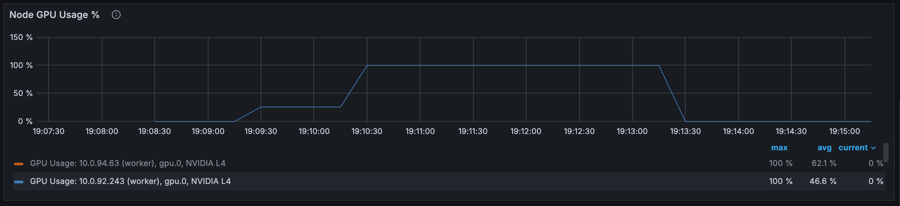
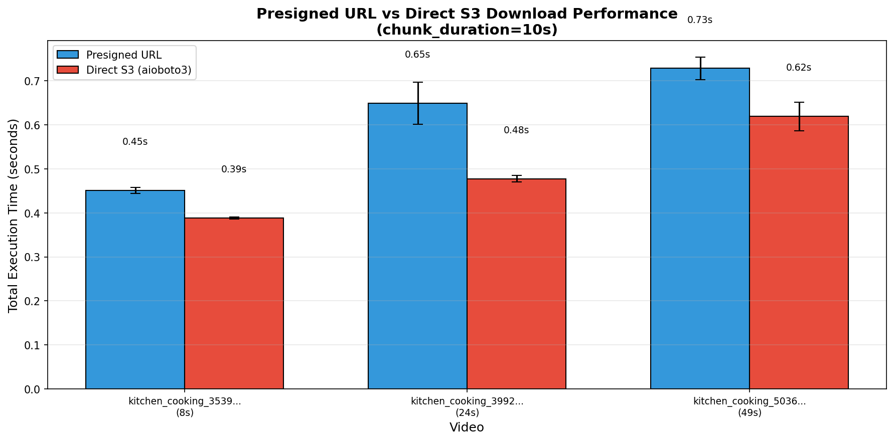
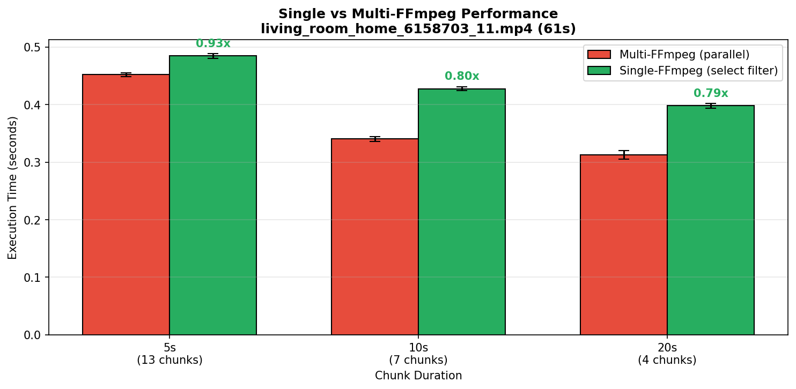
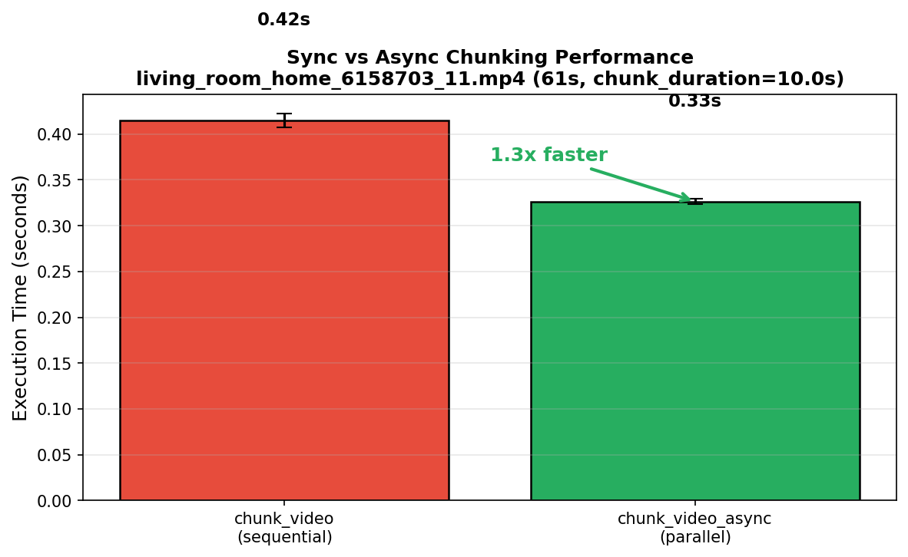
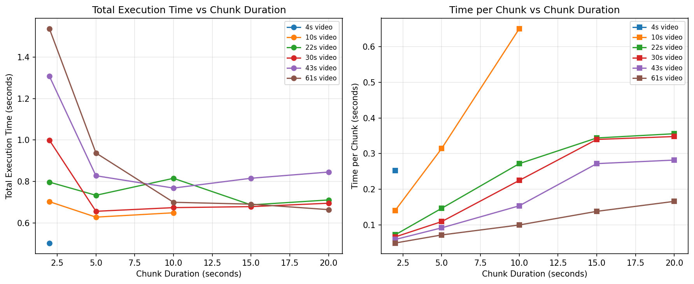
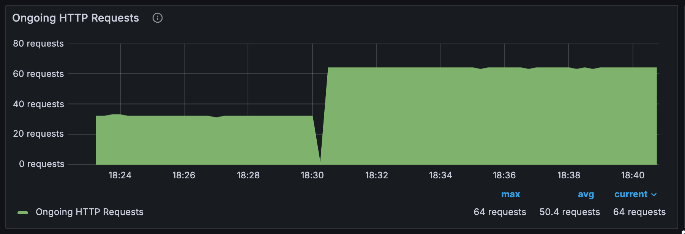
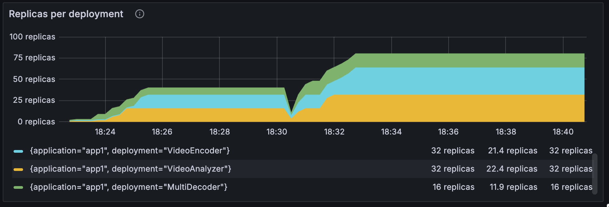
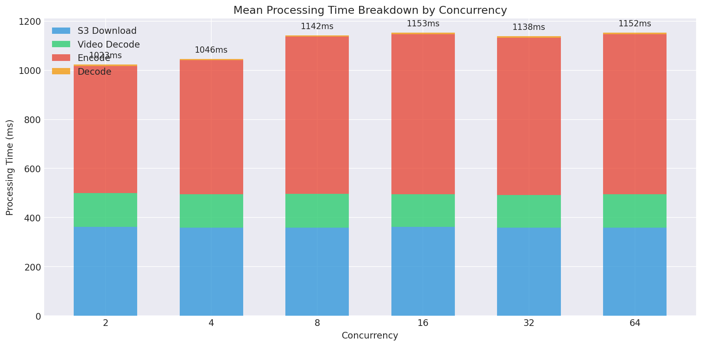
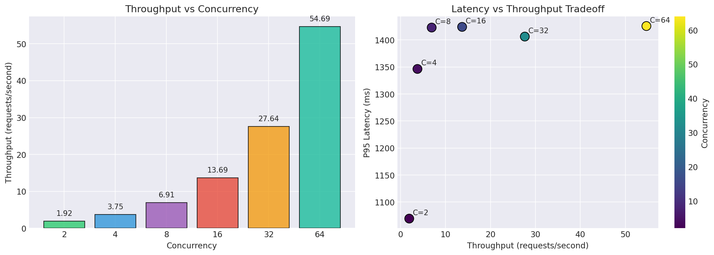

# Video analysis pipeline with Ray Serve

This notebook demonstrates how to build a production-grade video analysis pipeline with [Ray Serve](https://docs.ray.io/en/latest/serve/). The pipeline processes videos from S3 and extracts:

- **Tags**: [Zero-shot classification](https://huggingface.co/tasks/zero-shot-image-classification) labels (such as "kitchen", "office", "park")
- **Captions**: Retrieval-based descriptions matching the video content
- **Scene changes**: Detected transitions using [exponential moving average (EMA)](https://en.wikipedia.org/wiki/Exponential_smoothing) analysis

The system uses [**SigLIP**](https://huggingface.co/google/siglip-so400m-patch14-384) (`google/siglip-so400m-patch14-384`) as the vision-language backbone. SigLIP provides a unified embedding space for both images and text, enabling zero-shot classification and retrieval without task-specific fine-tuning.

## Architecture

The pipeline splits work across three [Ray Serve deployments](https://docs.ray.io/en/latest/serve/key-concepts.html#deployment), each optimized for its workload:

```
                              ┌─────────────────────┐
                         ┌───▶│  VideoEncoder       │
                         │    │      (GPU)          │
                         │    ├─────────────────────┤
┌─────────────────────┐  │    │ • SigLIP embedding  │
│  VideoAnalyzer      │──┤    │ • 16 frames/chunk   │
│     (Ingress)       │  │    │ • L2 normalization  │
├─────────────────────┤  │    └─────────────────────┘
│ • S3 download       │  │          num_gpus=1
│ • FFmpeg chunking   │  │
│ • Request routing   │  │    ┌─────────────────────┐
└─────────────────────┘  └───▶│  MultiDecoder       │
      num_cpus=6              │      (CPU)          │
                              ├─────────────────────┤
                              │ • Tag classification│
                              │ • Caption retrieval │
                              │ • Scene detection   │
                              └─────────────────────┘
                                    num_cpus=1
```

**Request lifecycle:**
1. `VideoAnalyzer` receives HTTP request with S3 video URI
2. Downloads video from S3, splits into fixed-duration chunks using FFmpeg
3. Sends all chunks to `VideoEncoder` concurrently (`asyncio.gather`)
4. Encoder returns embedding references (stored in Ray object store)
5. `VideoAnalyzer` sends embeddings to `MultiDecoder` serially (for EMA state continuity)
6. Aggregates results and returns tags, captions, and scene changes


---

## Setup

### Prerequisites

Before running this notebook, ensure you have:

| Requirement | Purpose |
|-------------|---------|
| **Pexels API key** | Download sample video (free at https://www.pexels.com/api/) |
| **S3 bucket** | Store videos and text embeddings |
| **AWS credentials** | Read/write access to your S3 bucket |
| **ffmpeg** | Video processing and frame extraction |
| **GPU** | Run SigLIP model for encoding (1 GPU minimum) |

Set these environment variables before running:

```bash
export PEXELS_API_KEY="your-pexels-api-key"
export S3_BUCKET="your-bucket-name"
export AWS_ACCESS_KEY_ID="..."
export AWS_SECRET_ACCESS_KEY="..."
```

> **Note on GPU type**: The benchmarks, design choices, and hyperparameters in this notebook were tuned for **NVIDIA L4 GPUs**. Different GPU types (A10G, T4, A100, etc.) have different memory bandwidth, compute throughput, and batch characteristics. You may need to adjust `max_ongoing_requests`, chunk sizes, and concurrency limits for optimal performance on other hardware.


```python
import os
import boto3

PEXELS_API_KEY = os.environ.get("PEXELS_API_KEY")  # Or set directly: "your-api-key"
S3_BUCKET = os.environ.get("S3_BUCKET")  # Or set directly: "your-bucket"

# Get the region of the S3 bucket
s3 = boto3.client("s3")
response = s3.get_bucket_location(Bucket=S3_BUCKET)
# AWS returns None for us-east-1, otherwise returns the region name
S3_REGION = response["LocationConstraint"] or "us-east-1"
print(f"Bucket '{S3_BUCKET}' is in region: {S3_REGION}")
```

### Download sample video

Before running the pipeline, we need a sample video in S3. This section downloads a video from Pexels, normalizes it, and uploads to S3.

**Why normalize videos?** We re-encode all videos to a consistent format:
- **384×384 resolution**: Matches SigLIP's input size exactly, eliminating resize during inference
- **30 fps**: Standardizes frame timing for consistent chunk boundaries
- **[H.264](https://en.wikipedia.org/wiki/Advanced_Video_Coding) codec (libx264)**: Fast seeking—FFmpeg can jump directly to any timestamp without decoding preceding frames. Some source codecs (VP9, HEVC) require sequential decoding, adding latency for chunk extraction

> **Note:**  
> The code below is a trimmed-down version of `scripts/download_stock_videos.py`.  
> For bulk downloads or custom video sets, run:  
> ```bash
> python scripts/download_stock_videos.py --api-key YOUR_PEXELS_API_KEY --bucket YOUR_S3_BUCKET
> ```


```python
S3_PREFIX = "anyscale-example/stock-videos/"
```


```python
import subprocess
import tempfile
from pathlib import Path

import httpx


def download_sample_video() -> str:
    """Download one sample video from Pexels, normalize it, and upload to S3.
    
    If a video already exists in S3, return that instead of downloading.
    """
    # Check if any videos already exist in S3
    response = s3.list_objects_v2(
        Bucket=S3_BUCKET,
        Prefix=S3_PREFIX,
        MaxKeys=1,
    )
    existing_files = response.get("Contents", [])
    
    if existing_files:
        # Use the first existing video
        existing_key = existing_files[0]["Key"]
        s3_uri = f"s3://{S3_BUCKET}/{existing_key}"
        print(f"Found existing video in S3: {s3_uri}")
        return s3_uri

    # No existing video found, download from Pexels
    print("No existing video in S3, downloading from Pexels...")
    
    # Search for a video
    with httpx.Client() as client:
        response = client.get(
            "https://api.pexels.com/videos/search",
            headers={"Authorization": PEXELS_API_KEY},
            params={"query": "kitchen cooking", "per_page": 1, "orientation": "landscape"},
        )
        response.raise_for_status()
        videos = response.json().get("videos", [])

    if not videos:
        raise RuntimeError("No videos found")

    video = videos[0]
    video_files = video.get("video_files", [])
    # Pick HD quality
    video_file = next((vf for vf in video_files if vf.get("quality") == "hd"), video_files[0])
    download_url = video_file["link"]
    video_id = video["id"]

    print(f"Downloading video {video_id}...")

    with tempfile.TemporaryDirectory() as temp_dir:
        raw_path = Path(temp_dir) / "raw.mp4"
        normalized_path = Path(temp_dir) / f"sample_{video_id}.mp4"

        # Download
        with httpx.Client() as client:
            with client.stream("GET", download_url, timeout=120.0) as resp:
                resp.raise_for_status()
                with open(raw_path, "wb") as f:
                    for chunk in resp.iter_bytes(8192):
                        f.write(chunk)

        print("Normalizing to 384x384@30fps...")

        # Normalize with ffmpeg (384x384 matches SigLIP input size)
        subprocess.run([
            "ffmpeg", "-y", "-i", str(raw_path),
            "-vf", "scale=384:384:force_original_aspect_ratio=decrease,pad=384:384:(ow-iw)/2:(oh-ih)/2,fps=30",
            "-c:v", "libx264", "-preset", "fast", "-an",
            str(normalized_path),
        ], capture_output=True, check=True)

        # Upload to S3
        s3_key = f"{S3_PREFIX}sample_{video_id}.mp4"
        s3.upload_file(str(normalized_path), S3_BUCKET, s3_key)

        s3_uri = f"s3://{S3_BUCKET}/{s3_key}"
        print(f"Uploaded to {s3_uri}")
        return s3_uri


# Run the download
SAMPLE_VIDEO_URI = download_sample_video()
print(f"\nSample video ready: {SAMPLE_VIDEO_URI}")

```

    Downloading video 35510474...
    Normalizing to 384x384@30fps...
    Uploaded to s3://abrar-test-bucket-123/anyscale-example/stock-videos/sample_35510474.mp4
    
    Sample video ready: s3://abrar-test-bucket-123/anyscale-example/stock-videos/sample_35510474.mp4


### Generate embeddings for text bank

The decoder matches video embeddings against precomputed **text embeddings** for tags and descriptions. We define the text banks here and use a [Ray task](https://docs.ray.io/en/latest/ray-core/tasks.html) to compute embeddings on GPU and upload to S3.


```python
# Text banks for zero-shot classification and retrieval

TAGS = [
    "kitchen", "living room", "office", "meeting room", "classroom",
    "restaurant", "cafe", "grocery store", "gym", "warehouse",
    "parking lot", "city street", "park", "shopping mall", "beach",
    "sports field", "hallway", "lobby", "bathroom", "bedroom",
]

DESCRIPTIONS = [
    "A person cooking in a kitchen",
    "Someone preparing food on a counter",
    "A chef working in a professional kitchen",
    "People eating at a dining table",
    "A person working at a desk",
    "Someone typing on a laptop",
    "A business meeting in progress",
    "A presentation being given",
    "A teacher lecturing in a classroom",
    "Students sitting at desks",
    "A customer shopping in a store",
    "People browsing products on shelves",
    "A person exercising at a gym",
    "Someone lifting weights",
    "People walking on a city sidewalk",
    "Traffic moving through an intersection",
    "Cars driving on a road",
    "People walking through a park",
    "A group having a conversation",
    "A person on a phone call",
]

print(f"Tags: {len(TAGS)}")
print(f"Descriptions: {len(DESCRIPTIONS)}")
```

    Tags: 20
    Descriptions: 20


```python
MODEL_NAME = "google/siglip-so400m-patch14-384"
S3_EMBEDDINGS_PREFIX = "anyscale-example/embeddings/"
```


```python
import asyncio
import io

import aioboto3
import numpy as np
import ray
import torch
from transformers import AutoModel, AutoProcessor


@ray.remote(num_gpus=1)
def generate_text_embeddings(tags: list[str], descriptions: list[str], bucket: str) -> dict:
    """Ray task: compute text embeddings on GPU and upload to S3."""

    device = "cuda" if torch.cuda.is_available() else "cpu"
    print(f"Loading SigLIP on {device}...")

    processor = AutoProcessor.from_pretrained(MODEL_NAME)
    model = AutoModel.from_pretrained(MODEL_NAME).to(device)
    model.eval()

    def embed_texts(texts: list[str]) -> np.ndarray:
        inputs = processor(text=texts, padding="max_length", truncation=True, return_tensors="pt")
        inputs = {k: v.to(device) for k, v in inputs.items()}
        with torch.no_grad():
            outputs = model.get_text_features(**inputs)
        embeddings = outputs.cpu().numpy()
        return (embeddings / np.linalg.norm(embeddings, axis=1, keepdims=True)).astype(np.float32)

    print("Computing tag embeddings...")
    tag_embeddings = embed_texts(tags)

    print("Computing description embeddings...")
    desc_embeddings = embed_texts(descriptions)

    async def upload():
        session = aioboto3.Session(region_name=S3_REGION)

        async def save_npz(embeddings, texts, key):
            buffer = io.BytesIO()
            np.savez_compressed(buffer, embeddings=embeddings, texts=np.array(texts, dtype=object))
            buffer.seek(0)
            async with session.client("s3") as s3:
                await s3.put_object(Bucket=bucket, Key=key, Body=buffer.getvalue())
            return f"s3://{bucket}/{key}"

        return await asyncio.gather(
            save_npz(tag_embeddings, tags, f"{S3_EMBEDDINGS_PREFIX}tag_embeddings.npz"),
            save_npz(desc_embeddings, descriptions, f"{S3_EMBEDDINGS_PREFIX}description_embeddings.npz"),
        )

    tag_uri, desc_uri = asyncio.run(upload())
    print(f"Uploaded: {tag_uri}, {desc_uri}")

    return {"tags": tag_uri, "descriptions": desc_uri}


# Run the Ray task
ray.init(ignore_reinit_error=True)
result = ray.get(generate_text_embeddings.remote(TAGS, DESCRIPTIONS, S3_BUCKET))
print(f"\nText embeddings ready:")
print(f"  Tags: {result['tags']}")
print(f"  Descriptions: {result['descriptions']}")

```

    2026-01-04 04:04:42,994	INFO worker.py:1821 -- Connecting to existing Ray cluster at address: 10.0.62.211:6379...
    2026-01-04 04:04:43,007	INFO worker.py:1998 -- Connected to Ray cluster. View the dashboard at https://session-lqu9h8iu3cpgv59j74p498djis.i.anyscaleuserdata-staging.com 
    2026-01-04 04:04:43,048	INFO packaging.py:463 -- Pushing file package 'gcs://_ray_pkg_062afcc0148d0f0e3896130fe2baff02fcfc420c.zip' (8.63MiB) to Ray cluster...
    2026-01-04 04:04:43,080	INFO packaging.py:476 -- Successfully pushed file package 'gcs://_ray_pkg_062afcc0148d0f0e3896130fe2baff02fcfc420c.zip'.
    /home/ray/anaconda3/lib/python3.12/site-packages/ray/_private/worker.py:2046: FutureWarning: Tip: In future versions of Ray, Ray will no longer override accelerator visible devices env var if num_gpus=0 or num_gpus=None (default). To enable this behavior and turn off this error message, set RAY_ACCEL_ENV_VAR_OVERRIDE_ON_ZERO=0
      warnings.warn(


    (autoscaler +6s) Tip: use `ray status` to view detailed cluster status. To disable these messages, set RAY_SCHEDULER_EVENTS=0.
    (generate_text_embeddings pid=2379, ip=10.0.25.139) Loading SigLIP on cuda...


    (generate_text_embeddings pid=2379, ip=10.0.25.139) Using a slow image processor as `use_fast` is unset and a slow processor was saved with this model. `use_fast=True` will be the default behavior in v4.52, even if the model was saved with a slow processor. This will result in minor differences in outputs. You'll still be able to use a slow processor with `use_fast=False`.


    (generate_text_embeddings pid=2379, ip=10.0.25.139) Computing tag embeddings...
    (generate_text_embeddings pid=2379, ip=10.0.25.139) Computing description embeddings...
    
    Text embeddings ready:
      Tags: s3://abrar-test-bucket-123/anyscale-example/embeddings/tag_embeddings.npz
      Descriptions: s3://abrar-test-bucket-123/anyscale-example/embeddings/description_embeddings.npz


---

## Build the Ray Serve application

This section walks through building the video analysis pipeline step by step, introducing Ray Serve concepts as we go.


### GPU encoder

The `VideoEncoder` deployment runs on GPU and converts video frames to embeddings using SigLIP. Key configuration:

- `num_gpus=1`: Each replica requires a dedicated GPU
- `max_ongoing_requests=2`: Allows pipelining—while one request computes on GPU, another prepares data on CPU

**Why no request batching?** A single chunk (16 frames @ 384×384) already saturates GPU compute. Batching multiple requests would require holding them until a batch forms, adding latency without throughput gain. Instead, we use `max_ongoing_requests=2` to pipeline preparation and computation.



**Why [`asyncio.to_thread`](https://docs.python.org/3/library/asyncio-task.html#asyncio.to_thread)?** Ray Serve deployments run in an async event loop. The `encode_frames` method is CPU/GPU-bound (PyTorch inference), which would block the event loop and prevent concurrent request handling. Wrapping it in `asyncio.to_thread` offloads the blocking work to a thread pool, keeping the event loop free to accept new requests.

**Why [`ray.put`](https://docs.ray.io/en/latest/ray-core/objects.html)?** Embeddings are large numpy arrays (~75KB per chunk). Without `ray.put`, the encoder would return raw arrays to `VideoAnalyzer`, which deserializes them—only to pass them to the decoder, requiring another serialize/deserialize cycle. With `ray.put`, the encoder stores arrays in the [object store](https://docs.ray.io/en/latest/ray-core/objects.html#objects-in-ray) and returns lightweight references. `VideoAnalyzer` just forwards the references (no deserialization), and the decoder calls `ray.get` once to retrieve the data—zero-copy if on the same node.


```python
import asyncio
import numpy as np
import ray
import torch
from ray import serve
from transformers import AutoModel, AutoProcessor
from PIL import Image


@serve.deployment(
    num_replicas="auto",
    ray_actor_options={"num_gpus": 1, "num_cpus": 2},
    max_ongoing_requests=2,
    autoscaling_config={
        "min_replicas": 1,
        "max_replicas": 10,
        "target_num_ongoing_requests": 2,
    },
)
class VideoEncoder:
    """Encodes video frames into embeddings using SigLIP."""

    def __init__(self):
        self.device = "cuda" if torch.cuda.is_available() else "cpu"

        # Load SigLIP model and processor
        self.processor = AutoProcessor.from_pretrained(MODEL_NAME)
        self.model = AutoModel.from_pretrained(MODEL_NAME).to(self.device)
        self.model.eval()

        self.embedding_dim = self.model.config.vision_config.hidden_size

    def encode_frames(self, frames: np.ndarray) -> np.ndarray:
        """Encode frames and return L2-normalized embeddings."""
        # Convert numpy frames to PIL images
        pil_images = [Image.fromarray(frame) for frame in frames]

        # Process images
        inputs = self.processor(images=pil_images, return_tensors="pt").to(self.device)

        with torch.no_grad():
            with torch.amp.autocast(device_type=self.device, enabled=self.device == "cuda"):
                outputs = self.model.get_image_features(**inputs)
                # L2 normalize
                frame_embeddings = torch.nn.functional.normalize(outputs, p=2, dim=1)

        return frame_embeddings.cpu().numpy().astype(np.float32)

    async def __call__(self, frames: np.ndarray) -> dict:
        """Process frames and return embeddings reference."""
        frame_embeddings = await asyncio.to_thread(self.encode_frames, frames)

        # Store embeddings in object store to avoid serialization
        frame_embeddings_ref = ray.put(frame_embeddings)

        return {
            "frame_embeddings_ref": frame_embeddings_ref,
            "embedding_dim": self.embedding_dim,
        }
```

    (generate_text_embeddings pid=2379, ip=10.0.25.139) Uploaded: s3://abrar-test-bucket-123/anyscale-example/embeddings/tag_embeddings.npz, s3://abrar-test-bucket-123/anyscale-example/embeddings/description_embeddings.npz


### CPU decoder

The `MultiDecoder` deployment runs on CPU and performs three tasks:

1. **Tag classification**: [Cosine similarity](https://en.wikipedia.org/wiki/Cosine_similarity) between video embedding and precomputed tag embeddings
2. **Caption retrieval**: Find the best-matching description from a text bank
3. **Scene detection**: EMA-based anomaly detection comparing each frame to recent history

The decoder loads precomputed text embeddings from S3 at startup.

**Why separate GPU/CPU deployments?** The encoder needs GPU for neural network inference; the decoder only does numpy dot products. Separating them allows independent scaling—encoders are limited by GPU count, decoders scale cheaply with CPU cores. This avoids tying expensive GPU resources to lightweight CPU work.

**Why EMA for scene detection?** Exponential Moving Average reuses existing SigLIP embeddings without an extra model. The algorithm computes `score = 1 - cosine(frame, EMA)` where EMA updates as `ema = 0.9*ema + 0.1*frame`. A simple threshold (`score > 0.15`) detects abrupt scene changes while smoothing noise.


```python
import io
import os
from typing import Optional

import aioboto3
import numpy as np
import ray
from ray import serve

SCENE_CHANGE_THRESHOLD = 0.15
EMA_ALPHA = 0.9


@serve.deployment(
    num_replicas="auto",
    ray_actor_options={"num_cpus": 1},
    max_ongoing_requests=4,
    autoscaling_config={
        "min_replicas": 1,
        "max_replicas": 10,
        "target_num_ongoing_requests": 2,
    },
)
class MultiDecoder:
    """Decodes video embeddings into tags, captions, and scene changes.
    
    This deployment is stateless - EMA state for scene detection is passed
    in and returned with each call, allowing the caller to maintain state
    continuity across multiple replicas.
    """

    async def __init__(self):
        self.bucket = S3_BUCKET
        self.ema_alpha = EMA_ALPHA
        self.scene_threshold = SCENE_CHANGE_THRESHOLD

        await self._load_embeddings()

    async def _load_embeddings(self):
        """Load precomputed text embeddings from S3."""
        session = aioboto3.Session(region_name=S3_REGION)

        async with session.client("s3") as s3:
            # Load tag embeddings
            tag_key = f"{S3_EMBEDDINGS_PREFIX}tag_embeddings.npz"
            response = await s3.get_object(Bucket=self.bucket, Key=tag_key)
            tag_data = await response["Body"].read()
            tag_npz = np.load(io.BytesIO(tag_data), allow_pickle=True)
            self.tag_embeddings = tag_npz["embeddings"]
            self.tag_texts = tag_npz["texts"].tolist()

            # Load description embeddings
            desc_key = f"{S3_EMBEDDINGS_PREFIX}description_embeddings.npz"
            response = await s3.get_object(Bucket=self.bucket, Key=desc_key)
            desc_data = await response["Body"].read()
            desc_npz = np.load(io.BytesIO(desc_data), allow_pickle=True)
            self.desc_embeddings = desc_npz["embeddings"]
            self.desc_texts = desc_npz["texts"].tolist()

    def _cosine_similarity(self, embedding: np.ndarray, bank: np.ndarray) -> np.ndarray:
        """Compute cosine similarity between embedding and all vectors in bank."""
        return bank @ embedding

    def _get_top_tags(self, embedding: np.ndarray, top_k: int = 5) -> list[dict]:
        """Get top-k matching tags with scores."""
        scores = self._cosine_similarity(embedding, self.tag_embeddings)
        top_indices = np.argsort(scores)[::-1][:top_k]
        return [{"text": self.tag_texts[i], "score": float(scores[i])} for i in top_indices]

    def _get_retrieval_caption(self, embedding: np.ndarray) -> dict:
        """Get best matching description."""
        scores = self._cosine_similarity(embedding, self.desc_embeddings)
        best_idx = np.argmax(scores)
        return {"text": self.desc_texts[best_idx], "score": float(scores[best_idx])}

    def _detect_scene_changes(
        self,
        frame_embeddings: np.ndarray,
        chunk_index: int,
        chunk_start_time: float,
        chunk_duration: float,
        ema_state: Optional[np.ndarray] = None,
    ) -> tuple[list[dict], np.ndarray]:
        """Detect scene changes using EMA-based scoring.
        
        Args:
            frame_embeddings: Frame embeddings for this chunk.
            chunk_index: Index of this chunk in the video.
            chunk_start_time: Start time of this chunk in seconds.
            chunk_duration: Duration of this chunk in seconds.
            ema_state: EMA state from previous chunk, or None for first chunk.
            
        Returns:
            Tuple of (scene_changes list, updated ema_state).
        """
        num_frames = len(frame_embeddings)
        if num_frames == 0:
            # Return empty changes and unchanged state (or first frame if no state)
            return [], ema_state if ema_state is not None else np.zeros(0)

        # Initialize EMA from first frame if no prior state
        ema = ema_state.copy() if ema_state is not None else frame_embeddings[0].copy()
        scene_changes = []

        for frame_idx, embedding in enumerate(frame_embeddings):
            similarity = float(np.dot(embedding, ema))
            score = max(0.0, 1.0 - similarity)

            if score >= self.scene_threshold:
                frame_offset = (frame_idx / max(1, num_frames - 1)) * chunk_duration
                timestamp = chunk_start_time + frame_offset
                scene_changes.append({
                    "timestamp": round(timestamp, 3),
                    "score": round(score, 4),
                    "chunk_index": chunk_index,
                    "frame_index": frame_idx,
                })

            ema = self.ema_alpha * ema + (1 - self.ema_alpha) * embedding
            ema = ema / np.linalg.norm(ema)

        return scene_changes, ema

    def __call__(
        self,
        encoder_output: dict,
        chunk_index: int,
        chunk_start_time: float,
        chunk_duration: float,
        top_k_tags: int = 5,
        ema_state: Optional[np.ndarray] = None,
    ) -> dict:
        """Decode embeddings into tags, caption, and scene changes.
        
        Args:
            encoder_output: Output from VideoEncoder containing frame embeddings ref.
            chunk_index: Index of this chunk in the video.
            chunk_start_time: Start time of this chunk in seconds.
            chunk_duration: Duration of this chunk in seconds.
            top_k_tags: Number of top tags to return.
            ema_state: EMA state from previous chunk for scene detection continuity.
                Pass None for the first chunk of a stream.
                
        Returns:
            Dict containing tags, retrieval_caption, scene_changes, and updated ema_state.
            The caller should pass the returned ema_state to the next chunk's call.
        """
        frame_embeddings = ray.get(encoder_output["frame_embeddings_ref"])

        pooled_embedding = frame_embeddings.mean(axis=0)
        pooled_embedding = pooled_embedding / np.linalg.norm(pooled_embedding)

        tags = self._get_top_tags(pooled_embedding, top_k=top_k_tags)
        caption = self._get_retrieval_caption(pooled_embedding)
        scene_changes, new_ema_state = self._detect_scene_changes(
            frame_embeddings, chunk_index, chunk_start_time, chunk_duration, ema_state
        )

        return {
            "tags": tags,
            "retrieval_caption": caption,
            "scene_changes": scene_changes,
            "ema_state": new_ema_state,
        }
```

### Video chunking

Before we can process a video, we need to split it into fixed-duration chunks and extract frames. The chunking process:

1. **Get video duration** using [`ffprobe`](https://ffmpeg.org/ffprobe.html)
2. **Define chunk boundaries** (e.g., 0-10s, 10-20s, 20-30s for a 30s video)
3. **Extract frames in parallel** using multiple concurrent [`ffmpeg`](https://ffmpeg.org/) processes
4. **Limit concurrency** with [`asyncio.Semaphore`](https://docs.python.org/3/library/asyncio-sync.html#asyncio.Semaphore) to avoid CPU oversubscription

Each chunk extracts 16 frames uniformly sampled across its duration, resized to 384×384 (matching SigLIP's input size).

#### Design choices

**Direct S3 download vs presigned URLs**: We download the video to local disk before processing. An alternative is generating a presigned S3 URL and passing it directly to FFmpeg. Benchmarks show direct download is faster—FFmpeg's HTTP client doesn't handle S3's chunked responses as efficiently as `aioboto3`, and network latency compounds across multiple seeks.



**Single FFmpeg vs parallel FFmpeg**: Two approaches for extracting frames from multiple chunks:
- **Single FFmpeg**: One process reads the entire video, using `select` filter to pick frames at specific timestamps
- **Parallel FFmpeg**: Multiple concurrent processes, each extracting one chunk

Parallel wins for local files (better CPU utilization).



**Sequential vs parallel chunk processing**: Even with parallel FFmpeg, we limit concurrency with `asyncio.Semaphore(NUM_WORKERS)`. Too many concurrent FFmpeg processes thrash CPU and memory. Benchmarks show 3-4 workers is optimal.



**Chunk duration**: We use 10-second chunks. Shorter chunks increase overhead (more FFmpeg calls, more encoder/decoder round-trips). Longer chunks increases processing efficiency but **degrade inference quality**—SigLIP processes exactly 16 frames per chunk, so a 60-second chunk samples one frame every 3.75 seconds, missing fast scene changes. The 10-second sweet spot balances throughput with temporal resolution (~1.6 fps sampling).




```python
import asyncio
import json
import subprocess
from dataclasses import dataclass
from typing import Optional

import numpy as np

NUM_WORKERS = 3  # Max concurrent ffmpeg processes
FFMPEG_THREADS = 2  # Threads per ffmpeg process


@dataclass
class VideoChunk:
    index: int
    start_time: float
    duration: float
    frames: Optional[np.ndarray] = None


def get_video_metadata(video_path: str) -> dict:
    """Get video duration using ffprobe."""
    cmd = ["ffprobe", "-v", "error", "-show_entries", "format=duration", "-of", "json", video_path]
    result = subprocess.run(cmd, capture_output=True, text=True, check=True)
    return {"duration": float(json.loads(result.stdout)["format"]["duration"])}


def extract_frames_ffmpeg(
    video_path: str, start: float, duration: float, num_frames: int, size: int = 384, threads: int = 0
) -> np.ndarray:
    """Extract frames from a video segment using ffmpeg."""
    fps = num_frames / duration if duration > 0 else num_frames
    cmd = [
        "ffmpeg", "-threads", str(threads),
        "-ss", str(start), "-t", str(duration), "-i", video_path,
        "-vf", f"fps={fps},scale={size}:{size}", "-pix_fmt", "rgb24", "-f", "rawvideo", "-",
    ]
    result = subprocess.run(cmd, capture_output=True, check=True)
    frame_size = size * size * 3
    frames = np.frombuffer(result.stdout, dtype=np.uint8).reshape(-1, size, size, 3)
    # Pad if fewer frames than requested
    if len(frames) < num_frames:
        padding = np.tile(frames[-1:], (num_frames - len(frames), 1, 1, 1))
        frames = np.concatenate([frames, padding])
    return frames[:num_frames]


async def chunk_video_async(
    video_path: str, chunk_duration: float, num_frames: int, target_size: int = 384
) -> list[VideoChunk]:
    """Split video into chunks with PARALLEL frame extraction."""
    metadata = await asyncio.to_thread(get_video_metadata, video_path)

    # Build chunk definitions
    chunk_defs = []
    start = 0.0
    idx = 0
    while start < metadata["duration"]:
        dur = min(chunk_duration, metadata["duration"] - start)
        if dur < 0.5:
            break
        chunk_defs.append((idx, start, dur))
        start += chunk_duration
        idx += 1

    if not chunk_defs:
        return []

    # Extract frames in PARALLEL, limited by semaphore
    semaphore = asyncio.Semaphore(NUM_WORKERS)

    async def extract_with_limit(idx, start, duration):
        async with semaphore:
            return await asyncio.to_thread(
                extract_frames_ffmpeg, video_path, start, duration, num_frames, target_size, FFMPEG_THREADS
            )

    frame_results = await asyncio.gather(*[extract_with_limit(*c) for c in chunk_defs])

    return [
        VideoChunk(index=idx, start_time=start, duration=dur, frames=frames)
        for (idx, start, dur), frames in zip(chunk_defs, frame_results)
    ]

```

### Deployment composition

The `VideoAnalyzer` ingress deployment orchestrates the encoder and decoder. It uses [FastAPI](https://fastapi.tiangolo.com/) integration with [`@serve.ingress`](https://docs.ray.io/en/latest/serve/http-guide.html#fastapi-http-deployments) for HTTP endpoints.

Deployments receive handles to other deployments through constructor injection using `.bind()`:

```python
encoder = VideoEncoder.bind()
decoder = MultiDecoder.bind()
app = VideoAnalyzer.bind(encoder=encoder, decoder=decoder)
```

#### Design choices

**Why `num_cpus=6`?** The analyzer runs FFmpeg for frame extraction. Each FFmpeg process uses `FFMPEG_THREADS=2`, and we run up to `NUM_WORKERS=3` concurrent processes. So `2 × 3 = 6` CPUs ensures FFmpeg doesn't contend for CPU during parallel chunk extraction.

**Why `max_ongoing_requests=4`?** The encoder has `max_ongoing_requests=2`. We want the analyzer to stay ahead: while 2 videos are encoding, we download and chunk 2 more videos so they're ready when encoder slots free up. This keeps the GPU pipeline saturated without excessive memory from queued requests.

**Why cache the S3 client?** Creating a new `aioboto3` client per request adds overhead (connection setup, credential resolution). Caching the client in `__init__` and reusing it across requests amortizes this cost. The client is thread-safe and handles connection pooling internally.

**Why encode in parallel but decode serially?** Encoding is stateless—each chunk's frames go through SigLIP independently, so we fire all chunks concurrently with [`asyncio.gather`](https://docs.python.org/3/library/asyncio-task.html#asyncio.gather). Decoding requires temporal ordering—the EMA for scene detection must process chunks in order (chunk 0's EMA state feeds into chunk 1). The `VideoAnalyzer` calls the decoder serially, passing EMA state from each response to the next request. This explicit state passing ensures correct scene detection even when multiple decoder replicas exist under autoscaling.


```python
from pydantic import BaseModel


class AnalyzeRequest(BaseModel):
    stream_id: str
    video_path: str  # S3 URI: s3://bucket/key
    num_frames: int = 16
    chunk_duration: float = 10.0


# Response models
class TagScore(BaseModel):
    text: str
    score: float


class Caption(BaseModel):
    text: str
    score: float


class SceneChange(BaseModel):
    timestamp: float
    score: float
    chunk_index: int
    frame_index: int


class TimingMs(BaseModel):
    s3_download_ms: float
    decode_video_ms: float
    encode_ms: float
    decode_ms: float
    total_ms: float


class ChunkResult(BaseModel):
    chunk_index: int
    start_time: float
    duration: float
    tags: list[TagScore]
    retrieval_caption: Caption
    scene_changes: list[SceneChange]


class AnalyzeResponse(BaseModel):
    stream_id: str
    embedding_dim: int
    tags: list[TagScore]
    retrieval_caption: Caption
    scene_changes: list[SceneChange]
    num_scene_changes: int
    chunks: list[ChunkResult]
    num_chunks: int
    video_duration: float
    timing_ms: TimingMs
```


```python
import asyncio
import tempfile
import time
from collections import defaultdict
from pathlib import Path
from urllib.parse import urlparse

import aioboto3
import numpy as np
from fastapi import FastAPI, HTTPException
from ray import serve

fastapi_app = FastAPI(title="Video Embedding API")


# --- VideoAnalyzer deployment ---

@serve.deployment(
    num_replicas="auto",
    ray_actor_options={"num_cpus": 6},
    max_ongoing_requests=4,
    autoscaling_config={
        "min_replicas": 2,
        "max_replicas": 20,
        "target_num_ongoing_requests": 2,
    },
)
@serve.ingress(fastapi_app)
class VideoAnalyzer:
    """Ingress deployment that orchestrates VideoEncoder and MultiDecoder."""

    def __init__(self, encoder, decoder):
        self.encoder = encoder
        self.decoder = decoder
        self._s3_session = aioboto3.Session(region_name=S3_REGION)
        self._s3_client = None  # Cached client for reuse across requests

    async def _get_s3_client(self):
        """Get or create a reusable S3 client."""
        if self._s3_client is None:
            self._s3_client = await self._s3_session.client("s3").__aenter__()
        return self._s3_client

    async def _download_video(self, s3_uri: str) -> Path:
        """Download video from S3 to temp file."""
        parsed = urlparse(s3_uri)
        bucket, key = parsed.netloc, parsed.path.lstrip("/")
        suffix = Path(key).suffix or ".mp4"
        temp_file = tempfile.NamedTemporaryFile(suffix=suffix, delete=False)
        temp_path = Path(temp_file.name)
        temp_file.close()

        s3 = await self._get_s3_client()
        await s3.download_file(bucket, key, str(temp_path))
        return temp_path

    def _aggregate_results(self, chunk_results: list[dict], top_k: int = 5) -> dict:
        """Aggregate tags and caption across chunks."""
        tag_scores = defaultdict(list)
        for r in chunk_results:
            for tag in r["tags"]:
                tag_scores[tag["text"]].append(tag["score"])
        agg_tags = sorted(
            [{"text": t, "score": np.mean(s)} for t, s in tag_scores.items()],
            key=lambda x: x["score"], reverse=True
        )[:top_k]
        best_caption = max((r["retrieval_caption"] for r in chunk_results), key=lambda x: x["score"])
        return {"tags": agg_tags, "retrieval_caption": best_caption}

    @fastapi_app.post("/analyze", response_model=AnalyzeResponse)
    async def analyze(self, request: AnalyzeRequest) -> AnalyzeResponse:
        """Analyze a video from S3."""
        total_start = time.perf_counter()
        temp_path = None

        try:
            # Download video
            download_start = time.perf_counter()
            temp_path = await self._download_video(request.video_path)
            s3_download_ms = (time.perf_counter() - download_start) * 1000

            # Chunk video (parallel frame extraction)
            decode_start = time.perf_counter()
            chunks = await chunk_video_async(str(temp_path), request.chunk_duration, request.num_frames)
            decode_video_ms = (time.perf_counter() - decode_start) * 1000

            if not chunks:
                raise HTTPException(status_code=400, detail="No chunks extracted")

            video_duration = chunks[-1].start_time + chunks[-1].duration

            # Encode all chunks CONCURRENTLY
            encode_start = time.perf_counter()
            encode_results = await asyncio.gather(*[self.encoder.remote(c.frames) for c in chunks])
            encode_ms = (time.perf_counter() - encode_start) * 1000

            embedding_dim = encode_results[0]["embedding_dim"] if encode_results else 0

            # Decode chunks SERIALLY, passing EMA state between calls.
            # EMA state is tracked here (not in decoder) to ensure continuity
            # even when autoscaling routes requests to different replicas.
            decode_start = time.perf_counter()
            decode_results = []
            ema_state = None  # Will be initialized from first chunk's first frame
            for chunk, enc in zip(chunks, encode_results):
                dec = await self.decoder.remote(
                    encoder_output=enc,
                    chunk_index=chunk.index,
                    chunk_start_time=chunk.start_time,
                    chunk_duration=chunk.duration,
                    ema_state=ema_state,
                )
                decode_results.append(dec)
                ema_state = dec["ema_state"]  # Carry forward for next chunk
            decode_ms = (time.perf_counter() - decode_start) * 1000

            # Aggregate and build response
            aggregated = self._aggregate_results(decode_results)
            all_scene_changes = [
                SceneChange(**sc) for r in decode_results for sc in r["scene_changes"]
            ]

            per_chunk = [
                ChunkResult(
                    chunk_index=c.index,
                    start_time=c.start_time,
                    duration=c.duration,
                    tags=[TagScore(**t) for t in r["tags"]],
                    retrieval_caption=Caption(**r["retrieval_caption"]),
                    scene_changes=[SceneChange(**sc) for sc in r["scene_changes"]],
                )
                for c, r in zip(chunks, decode_results)
            ]

            total_ms = (time.perf_counter() - total_start) * 1000

            return AnalyzeResponse(
                stream_id=request.stream_id,
                embedding_dim=embedding_dim,
                tags=[TagScore(**t) for t in aggregated["tags"]],
                retrieval_caption=Caption(**aggregated["retrieval_caption"]),
                scene_changes=all_scene_changes,
                num_scene_changes=len(all_scene_changes),
                chunks=per_chunk,
                num_chunks=len(chunks),
                video_duration=video_duration,
                timing_ms=TimingMs(
                    s3_download_ms=round(s3_download_ms, 2),
                    decode_video_ms=round(decode_video_ms, 2),
                    encode_ms=round(encode_ms, 2),
                    decode_ms=round(decode_ms, 2),
                    total_ms=round(total_ms, 2),
                ),
            )
        finally:
            if temp_path and temp_path.exists():
                temp_path.unlink(missing_ok=True)

    @fastapi_app.get("/health")
    async def health(self):
        return {"status": "healthy"}

```


```python
encoder = VideoEncoder.bind()
decoder = MultiDecoder.bind()
app = VideoAnalyzer.bind(encoder=encoder, decoder=decoder)
```


```python
serve.run(app, name="video-analyzer", route_prefix="/", blocking=False)
```

    INFO 2026-01-04 04:05:04,480 serve 135398 -- Connecting to existing Serve app in namespace "serve". New http options will not be applied.
    (ServeController pid=134537) INFO 2026-01-04 04:05:04,591 controller 134537 -- Registering autoscaling state for deployment Deployment(name='VideoEncoder', app='video-analyzer')
    (ServeController pid=134537) INFO 2026-01-04 04:05:04,592 controller 134537 -- Deploying new version of Deployment(name='VideoEncoder', app='video-analyzer') (initial target replicas: 1).
    (ServeController pid=134537) INFO 2026-01-04 04:05:04,593 controller 134537 -- Registering autoscaling state for deployment Deployment(name='MultiDecoder', app='video-analyzer')
    (ServeController pid=134537) INFO 2026-01-04 04:05:04,594 controller 134537 -- Deploying new version of Deployment(name='MultiDecoder', app='video-analyzer') (initial target replicas: 1).
    (ServeController pid=134537) INFO 2026-01-04 04:05:04,594 controller 134537 -- Registering autoscaling state for deployment Deployment(name='VideoAnalyzer', app='video-analyzer')
    (ServeController pid=134537) INFO 2026-01-04 04:05:04,595 controller 134537 -- Deploying new version of Deployment(name='VideoAnalyzer', app='video-analyzer') (initial target replicas: 2).
    (ServeController pid=134537) INFO 2026-01-04 04:05:04,700 controller 134537 -- Adding 1 replica to Deployment(name='VideoEncoder', app='video-analyzer').
    (ServeController pid=134537) INFO 2026-01-04 04:05:04,702 controller 134537 -- Adding 1 replica to Deployment(name='MultiDecoder', app='video-analyzer').
    (ServeController pid=134537) INFO 2026-01-04 04:05:04,706 controller 134537 -- Stopping 1 replicas of Deployment(name='VideoAnalyzer', app='video-analyzer') with outdated versions.
    (ServeController pid=134537) INFO 2026-01-04 04:05:04,706 controller 134537 -- Adding 1 replica to Deployment(name='VideoAnalyzer', app='video-analyzer').
    (ServeController pid=134537) INFO 2026-01-04 04:05:06,770 controller 134537 -- Replica(id='ndldcpkc', deployment='VideoAnalyzer', app='video-analyzer') is stopped.
    (ServeController pid=134537) INFO 2026-01-04 04:05:08,135 controller 134537 -- Stopping 1 replicas of Deployment(name='VideoAnalyzer', app='video-analyzer') with outdated versions.
    (ServeController pid=134537) INFO 2026-01-04 04:05:08,135 controller 134537 -- Adding 1 replica to Deployment(name='VideoAnalyzer', app='video-analyzer').
    (ServeController pid=134537) INFO 2026-01-04 04:05:10,142 controller 134537 -- Replica(id='ie8o7dry', deployment='VideoAnalyzer', app='video-analyzer') is stopped.
    (ServeReplica:video-analyzer:VideoEncoder pid=2548, ip=10.0.25.139) Using a slow image processor as `use_fast` is unset and a slow processor was saved with this model. `use_fast=True` will be the default behavior in v4.52, even if the model was saved with a slow processor. This will result in minor differences in outputs. You'll still be able to use a slow processor with `use_fast=False`.


    (autoscaler +32s) [autoscaler] [16CPU-64GB] Attempting to add 1 node to the cluster (increasing from 1 to 2).
    (autoscaler +32s) [autoscaler] [16CPU-64GB|m8i.4xlarge] [us-west-2a] [on-demand] Launched 1 instance.


    (ProxyActor pid=2607, ip=10.0.25.139) INFO 2026-01-04 04:05:11,437 proxy 10.0.25.139 -- Proxy starting on node d4cb8459fbe780df3989d0b4736d9e58b3f58e690fc0f0fead60c58d (HTTP port: 8000).
    (ProxyActor pid=2607, ip=10.0.25.139) INFO 2026-01-04 04:05:11,551 proxy 10.0.25.139 -- Got updated endpoints: {Deployment(name='VideoAnalyzer', app='video-analyzer'): EndpointInfo(route='/', app_is_cross_language=False, route_patterns=[RoutePattern(methods=['POST'], path='/analyze'), RoutePattern(methods=['GET', 'HEAD'], path='/docs'), RoutePattern(methods=['GET', 'HEAD'], path='/docs/oauth2-redirect'), RoutePattern(methods=['GET'], path='/health'), RoutePattern(methods=['GET', 'HEAD'], path='/openapi.json'), RoutePattern(methods=['GET', 'HEAD'], path='/redoc')])}.
    (ProxyActor pid=2607, ip=10.0.25.139) INFO 2026-01-04 04:05:11,565 proxy 10.0.25.139 -- Started <ray.serve._private.router.SharedRouterLongPollClient object at 0x7afd189d4080>.
    INFO 2026-01-04 04:05:13,515 serve 135398 -- Application 'video-analyzer' is ready at http://0.0.0.0:8000/.
    INFO 2026-01-04 04:05:13,528 serve 135398 -- Started <ray.serve._private.router.SharedRouterLongPollClient object at 0x73478063f6b0>.


    DeploymentHandle(deployment='VideoAnalyzer')


```python
import httpx
import time

# Wait for deployment to be ready
print("Waiting for deployment to be healthy...")
start = time.time()
while True:
    try:
        with httpx.Client(timeout=5.0) as client:
            response = client.get("http://localhost:8000/health")
            if response.status_code == 200:
                print(f"Deployment ready in {time.time() - start:.1f}s")
                break
    except httpx.RequestError:
        pass
    time.sleep(1.0)
    if time.time() - start > 120:
        raise TimeoutError("Deployment did not become healthy within 120s")

```

    Waiting for deployment to be healthy...
    Deployment ready in 0.0s


```python
import httpx
import time
import uuid

# Send a sample request to the deployed service
payload = {
    "stream_id": uuid.uuid4().hex[:8],
    "video_path": SAMPLE_VIDEO_URI,
    "num_frames": 16,
    "chunk_duration": 10.0,
}

print(f"Analyzing video: {SAMPLE_VIDEO_URI}")
print(f"Stream ID: {payload['stream_id']}\n")

start = time.perf_counter()
with httpx.Client(timeout=300.0) as client:
    response = client.post("http://localhost:8000/analyze", json=payload)
latency_ms = (time.perf_counter() - start) * 1000

result = response.json()

# Print results
print("=" * 60)
print(f"Video duration: {result['video_duration']:.1f}s")
print(f"Chunks processed: {result['num_chunks']}")
print()

print("Top Tags:")
for tag in result["tags"]:
    print(f"  {tag['score']:.3f}  {tag['text']}")
print()

print("Best Caption:")
print(f"  {result['retrieval_caption']['score']:.3f}  {result['retrieval_caption']['text']}")
print()

print(f"Scene Changes: {result['num_scene_changes']}")
for sc in result["scene_changes"][:5]:  # Show first 5
    print(f"  {sc['timestamp']:6.2f}s  score={sc['score']:.3f}")
print()

print("Timing:")
timing = result["timing_ms"]
print(f"  S3 download:  {timing['s3_download_ms']:7.1f} ms")
print(f"  Video decode: {timing['decode_video_ms']:7.1f} ms")
print(f"  Encode (GPU): {timing['encode_ms']:7.1f} ms")
print(f"  Decode (CPU): {timing['decode_ms']:7.1f} ms")
print(f"  Total server: {timing['total_ms']:7.1f} ms")
print(f"  Round-trip:   {latency_ms:7.1f} ms")
print("=" * 60)

```

    Analyzing video: s3://abrar-test-bucket-123/anyscale-example/stock-videos/sample_35510474.mp4
    Stream ID: 43b5fd0e
    
    ============================================================
    Video duration: 12.0s
    Chunks processed: 2
    
    Top Tags:
      0.055  kitchen
      0.033  cafe
      0.015  bathroom
      0.008  living room
      0.007  bedroom
    
    Best Caption:
      0.100  A person cooking in a kitchen
    
    Scene Changes: 0
    
    Timing:
      S3 download:    200.6 ms
      Video decode:   136.6 ms
      Encode (GPU):   869.5 ms
      Decode (CPU):    12.7 ms
      Total server:  1219.5 ms
      Round-trip:    1237.7 ms
    ============================================================


    (ServeReplica:video-analyzer:VideoEncoder pid=2548, ip=10.0.25.139) INFO 2026-01-04 04:05:36,175 video-analyzer_VideoEncoder g2pni5ln 726f6fd6-771d-4626-9495-8f30bcd8143a -- CALL __call__ OK 752.4ms
    (ServeReplica:video-analyzer:VideoEncoder pid=2548, ip=10.0.25.139) INFO 2026-01-04 04:05:36,270 video-analyzer_VideoEncoder g2pni5ln 726f6fd6-771d-4626-9495-8f30bcd8143a -- CALL __call__ OK 836.0ms
    (ServeReplica:video-analyzer:MultiDecoder pid=20831, ip=10.0.26.32) INFO 2026-01-04 04:05:36,278 video-analyzer_MultiDecoder vsd0e8e9 726f6fd6-771d-4626-9495-8f30bcd8143a -- CALL __call__ OK 4.0ms
    (ServeReplica:video-analyzer:MultiDecoder pid=20831, ip=10.0.26.32) INFO 2026-01-04 04:05:36,283 video-analyzer_MultiDecoder vsd0e8e9 726f6fd6-771d-4626-9495-8f30bcd8143a -- CALL __call__ OK 3.1ms
    (ServeReplica:video-analyzer:VideoAnalyzer pid=20921, ip=10.0.26.32) INFO 2026-01-04 04:05:36,284 video-analyzer_VideoAnalyzer z5pw9lpz 726f6fd6-771d-4626-9495-8f30bcd8143a -- POST /analyze 200 1223.1ms


    (autoscaler +1m7s) [autoscaler] Cluster upscaled to {40 CPU, 2 GPU}.


---

## Load Test Results

To evaluate the pipeline's performance under realistic conditions, we ran load tests using the `client/load_test.py` script with **concurrency levels ranging from 2 to 64 concurrent requests**. The Ray Serve application was configured with autoscaling enabled, allowing replicas to scale dynamically based on demand.


### Methodology

The load test was executed using:

```bash
python -m client.load_test --video s3://bucket/video.mp4 --concurrency <N>
```

**Test parameters:**
- Concurrency levels: 2, 4, 8, 16, 32, 64
- Chunk duration: 10 seconds
- Frames per chunk: 16
- Autoscaling: Enabled (replicas scale based on `target_num_ongoing_requests`)

The charts below show autoscaling in action during the concurrency=32 and 64 load test:






As load increases, replicas scale up to maintain target queue depth. The system reaches steady state once enough replicas are provisioned to handle the request rate.

To ensure fair comparison, we discarded the first half of each test run to exclude the autoscaling warm-up period where latencies are elevated due to replica initialization.


### Results Summary

| Concurrency | Requests | P50 (ms) | P95 (ms) | P99 (ms) | Throughput (req/s) |
|-------------|----------|----------|----------|----------|-------------------|
| 2           | 122      | 1,027    | 1,069    | 1,162    | 1.92              |
| 4           | 236      | 1,008    | 1,346    | 1,480    | 3.75              |
| 8           | 932      | 1,076    | 1,423    | 1,495    | 6.91              |
| 16          | 2,612    | 1,121    | 1,424    | 1,501    | 13.69             |
| 32          | 4,421    | 1,114    | 1,406    | 1,479    | 27.64             |
| 64          | 16,971   | 1,129    | 1,426    | 1,493    | 54.69             |

**Key findings:**

- **100% success rate** across all 25,294 requests analyzed
- **Near-linear throughput scaling**: Throughput increased from 1.92 req/s at concurrency 2 to **54.69 req/s at concurrency 64** (~28x improvement)
- **Stable latencies under load**: P95 latency remained between 1,069ms and 1,426ms across all concurrency levels, demonstrating effective autoscaling


### Processing Time Breakdown

The chart below shows how processing time is distributed across pipeline stages at each concurrency level:



**At concurrency 64 (best throughput):**
- **S3 Download**: 359ms (31%)
- **Video Decode (FFmpeg)**: 136ms (12%)
- **Encode (GPU)**: 651ms (56%)
- **Decode (CPU)**: 6ms (1%)

The GPU encoding stage dominates processing time, as expected for neural network inference. S3 download latency is the second largest component.


### Throughput Analysis

The charts below show throughput scaling and the latency-throughput tradeoff:



**Observations:**

1. **Linear scaling**: Throughput scales almost linearly with concurrency, indicating that autoscaling successfully provisions enough replicas to handle increased load.

2. **Latency-throughput tradeoff**: The right chart shows that P95 latency increases slightly as throughput grows (from ~1,069ms to ~1,426ms), but remains within acceptable bounds. This ~33% latency increase enables a ~28x throughput improvement.

3. **No saturation point**: Even at concurrency 64, throughput continues to scale. The system could likely handle higher concurrency with additional GPU resources.

The near-linear scaling demonstrates that the pipeline architecture—with separate GPU encoder, CPU decoder, and CPU-bound ingress—allows each component to scale independently based on its resource requirements.

