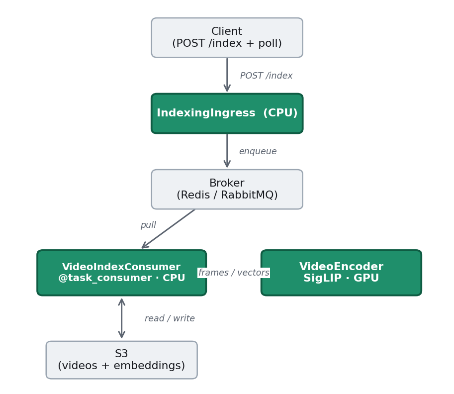
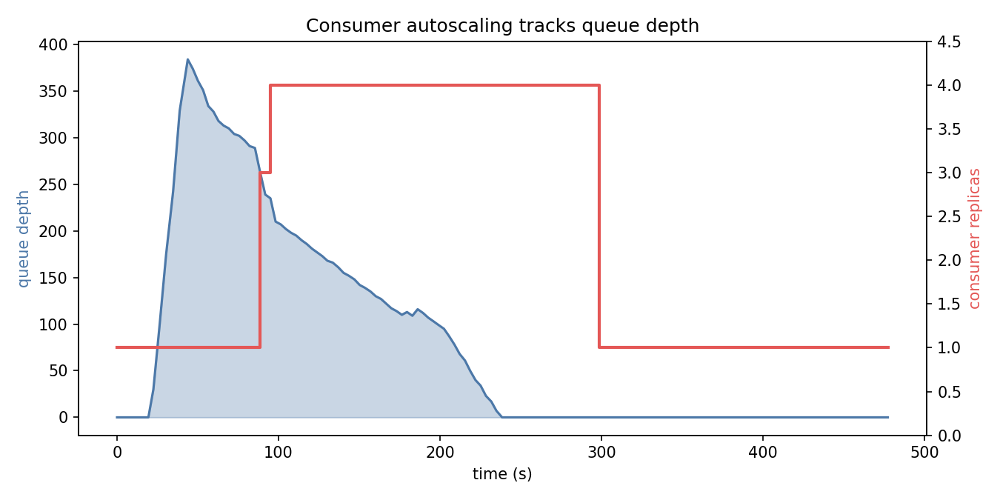
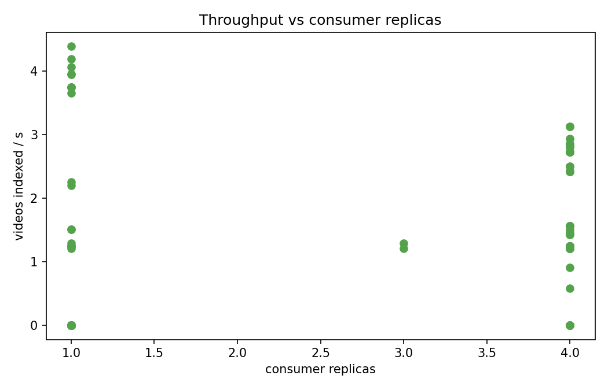
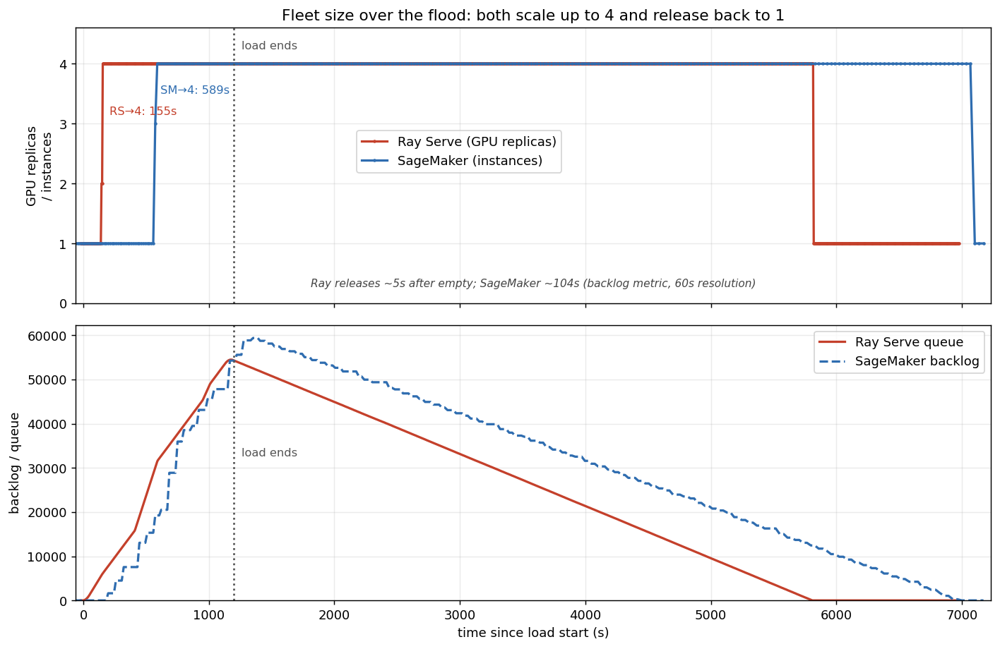

# Async video indexing with Ray Serve

An asynchronous inference service built on Ray Serve's task-consumer APIs: a
client submits a video and gets a task id immediately, the work runs in the
background off a Redis queue, and the worker pool autoscales on queue depth. The
service downloads the video, chunks it with ffmpeg, embeds the frames with SigLIP
on a GPU, and writes the vectors to S3. This directory also includes the harness
used to benchmark it against Amazon SageMaker Asynchronous Inference.

## Architecture



- **IndexingIngress** (CPU) accepts `POST /index`, enqueues the task, returns a task id. Spread one-replica-per-node (`max_replicas_per_node=1`) so each gets its own HTTP proxy, keeping ack latency low under load.
- **VideoIndexConsumer** (CPU) pulls tasks, downloads + chunks the video, calls the encoder, writes embeddings. Autoscales on queue depth.
- **VideoEncoder** (GPU) runs SigLIP; called through a Serve handle, so frames move over Ray's object store.

The **broker** (a Redis or RabbitMQ queue you provide) and **S3** are external systems, not deployments.

## Repository layout

```
video-indexing/
├── app.py                  # composes the three deployments (import path: app:app)
├── app_matched.py          # monolith variant, used for the SageMaker comparison
├── constants.py            # queue names, model, env-var config
├── config.yaml             # local `serve run` config
├── services.example.yaml   # Anyscale deploy config template
├── Containerfile           # service image (Ray nightly + ffmpeg + deps)
├── requirements.txt
├── deployments/            # the deployments + shared config
│   ├── ingress.py  consumer.py  encoder.py  processor.py
├── utils/                  # embedding_store, idempotency, s3, video helpers
└── bench/                  # benchmark harness
    ├── phased_load.py  autoscale_poll.py  e2e_latency.py
    └── sagemaker/          # SageMaker Async comparison (deploy, load, image build)
```

## Prerequisites

- Python 3.10+, `ffmpeg` on PATH, and `pip install -r requirements.txt`.
- A **Redis** instance reachable from the cluster (broker + result backend).
- An **S3 bucket** for videos and embeddings, plus AWS credentials.
- Configure via environment variables (read in `constants.py`):

```bash
export REDIS_BROKER_URL="redis://<host>:6379/0"
export REDIS_BACKEND_URL="redis://<host>:6379/1"
export S3_BUCKET="<your-bucket>"
```

## Run the service

**Locally** (needs a reachable Redis, e.g. `docker run -p 6379:6379 redis:7`):

```bash
serve run config.yaml
```

**On Anyscale** — copy the template, fill in your Redis endpoint and bucket, deploy:

```bash
cp services.example.yaml services.yaml   # then edit REDIS_* and S3_BUCKET
anyscale service deploy -f services.yaml
```

`services.example.yaml` builds the image from `Containerfile` (a current Ray nightly
plus ffmpeg and the Python deps). If you already have an image, point it at that with
`image_uri:` instead of `containerfile:`.

**Submit a video and poll for the result:**

```bash
curl -X POST "$URL/index" -H "Content-Type: application/json" \
  -d '{"video_uri": "s3://<bucket>/video.mp4", "video_id": "demo-1"}'
# -> {"task_id": "...", "status": "PENDING"}
curl "$URL/status/<task_id>"
```

Observability routes: `GET /queue` (broker depth), `GET /replicas` (per-deployment counts), `GET /proxies`.

**Drive a load test** (POST at a shaped rate; profile is `dur:rate_start:rate_end,...`):

```bash
python bench/phased_load.py --url "$URL" --video-uri "s3://<bucket>/video.mp4" \
  --profile "60:0:50,120:50:50,60:50:0" --out bench/load.csv
python bench/autoscale_poll.py --url "$URL" --out bench/metrics.csv --interval 5 --duration 900
```

## How autoscaling works

The consumer scales on **Redis queue depth** via the stock
`AsyncInferenceAutoscalingPolicy` (polls the broker, combines queue length with
in-flight requests). The encoder scales on its own GPU load. Under a 500-video
burst the consumer scales 1→4 as the backlog builds, drains it, then returns to 1:



Throughput rises with replicas until the GPU saturates, and idle cost drops
because the fleet shrinks when the queue empties:



Delivery is at-least-once (Celery acks a task only after the handler succeeds) and
the handler is idempotent on `video_id` (an S3 done-marker), so nothing is dropped
or double-indexed even as workers come and go.

## Reproduce the SageMaker comparison

To compare against SageMaker Async on identical hardware, the Ray side uses the
`app_matched.py` monolith (consumer + encoder fused into one GPU deployment,
mirroring SageMaker's single container). Both run the same 20-minute flood
(sustained 50 rps, spike to 100, ~67k videos) on 4x NVIDIA T4, cold from one
instance.

```bash
# 1. Ray Serve: deploy the monolith (copy the template, set import_path: app_matched:app)
cp services.example.yaml services.matched.yaml   # then set import_path: app_matched:app
anyscale service deploy -f services.matched.yaml
PROFILE="60:0:50,360:50:50,180:100:100,360:50:50,60:75:75,120:50:50,60:50:0"
python bench/phased_load.py --url "$URL" --video-uri "s3://<bucket>/sample.mp4" \
  --profile "$PROFILE" --out bench/rs_load.csv

# 2. SageMaker: build + push the image (bakes in the code), deploy, run the same flood
cd bench/sagemaker
./build_and_push.sh video-index-sm us-west-2 latest
python deploy_endpoint.py \
  --image-uri <ecr-image> --role-arn <sagemaker-exec-role> \
  --s3-bucket <bucket> --s3-output s3://<bucket>/sm-output/ \
  --instance-type ml.g4dn.xlarge --min-instances 1 --max-instances 4 \
  --max-concurrency-per-instance 4 --step-scaling
python sm_load.py --endpoint-name video-index-sm --input-bucket <bucket> \
  --video-uri "s3://<bucket>/sample.mp4" --profile "$PROFILE"
python sm_metrics.py --endpoint-name video-index-sm --output-bucket <bucket> \
  --output-prefix sm-output --duration 1800

# 3. End-to-end latency (submit -> embeddings-in-S3), from a run's load CSV plus
#    the S3 done-markers both engines write. --load-csv takes either run's CSV
#    (rs_load.csv here, sm_load.csv for SageMaker); run from the tutorial root:
cd ../..
python bench/e2e_latency.py --load-csv bench/rs_load.csv --bucket <bucket> --out bench/rs_e2e.csv
```

`--step-scaling` uses **two step policies + two CloudWatch alarms** on the default
backlog metric: a `backlog-fast` alarm (`ApproximateBacklogSizePerInstance >= 5`)
scales out to 4 instances, and a `backlog-empty` alarm (`ApproximateBacklogSize < 1`)
scales back to 1.



| Metric (same flood, 4x T4) | Ray Serve async | SageMaker Async |
|---|---|---|
| Time to full fleet (cold) | ~155 s | ~589 s |
| Release idle capacity (after queue empties) | ~5 s | ~104 s |
| Autoscaling configuration | one policy block | 2 step policies + 2 alarms |
| Failed / lost tasks | 0 | 0 |
| Ack latency, p50 (under load) | 12.8 ms | 11.8 ms |

The Ray ack p50 is measured with the ingress spread one replica per node
(`max_replicas_per_node=1`, so each gets its own HTTP proxy); packed onto a single
node it is closer to ~19 ms.

Ray reaches the full fleet sooner because it polls the queue in-process and reacts
in seconds; SageMaker waits on the backlog CloudWatch metric (60-second resolution
plus publication lag). Both processed the full flood with an empty dead-letter queue.

## Design notes

- **Synchronous handlers are correct here.** Ray Serve task handlers must be sync; Celery runs them in a worker thread (not the replica's event loop), so the handler can call the GPU encoder through a normal Serve handle and block on the result without deadlocking.
- **Tune `visibility_timeout`** to your task duration. On Redis, Celery makes a picked-up task invisible for this long before redelivering it. Too high and a task stranded by a crash or scale-down waits that long to recover; set it to a small multiple of your p99 task time (we use 120 s).
- **Use a current Ray nightly image**, not the deprecated `ray-ml` line — the async-inference APIs are recent.
