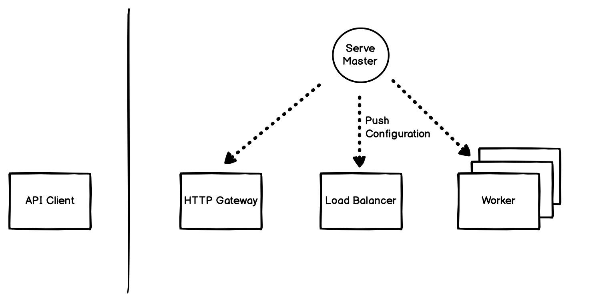

Serve In Depth
==============

This page dives into features and topics around Ray Serve. It is designed to
help you understand how to work with Serve API and the internal.

Architecture
------------
Serve's architecture it horizontally scalable. It has three independent tiers:

1. HTTP gateway servers that proxy the incoming requests to backend services.
2. Programmable load balancers to route requests to different workers.
3. Workers to execute the program.





Let's consider the life of an *HTTP request*:

1. When the ``API Client`` issues an HTTP request to ``HTTP Gateway``, the 
   gateway receives the request and parses it. For example, the HTTP request 
   can be:

.. code-block:: http
    
    GET /predict HTTP/1.1
    Host: localhost:8000

2. The ``HTTP Gateway`` takes at the request and figure out the corresponding 
   ``endpoint`` for the request. It forwards the request to ``Load Balancer``
   with the ``endpoint`` information.

.. code-block:: python

    load_balancer.enqueue_request.remote(
        endpoint="predict",
        request_payload={...}
    )

3. The ``Load Balancer`` receives the request and finds all the available workers
   corresponding to the request endpoint. It sends forward the request to one of
   the workers using flexible policy.

.. code-block:: python

    worker = find_workers(endpoint="predict")
    worker.__call__.remote(request_payload)

4. The ``Worker`` receives the request and execute it. Once it finishes, the
   response returns to load balancer and then to HTTP gateway.

.. code-block:: python

    HTTP/1.1 200 OK
    Date: ...
    Content-Type: application/json
    Content-Length: ...

    {"prediction": "success!"}

Web requests and responses
--------------------------
Serve accepts standard HTTP/1 and HTTP/1.1 protocols. The requests are wrapped
into a `Flask request`_ object before execution. 

.. _`Flask request`: https://flask.palletsprojects.com/en/1.1.x/api/#flask.Request

You can specify the route and HTTP method via the ``@serve.route` decorator.
For example, ``@serve.route("/predict")`` routes HTTP requests for path 
``/predict`` to your implementation. To specify the HTTP methods, you can set the
``methods`` parameter, for example, ``@serve.route("/predict", methods=["POST"])``.

The response of your function or class will be interpreted by Serve and encoded
automatically. For strings and bytes, serve will return ``text/plain`` type. For
nested data structures, serve will try to encoded it with ``json`` and return 
``application/json`` responses. 

.. note:: 
    Returning custom status code is currently work in progress.

    Adding variable path like ``@serve.route("/a/{name}/c")`` is currently 
    work in progress.

Composing models using RayServeHandle
-------------------------------------
pass


Support for multiple methods
----------------------------


Endpoints and backends 
---------------------- 
Serve has concepts of the "endpoint" and "backend". An "endpoint" is the name
for service, like "image classifier". A "backend" is the name for the
implementation, like "SVM:v1" or "ResNet50:v2". Endpoints and backends can be
connected and routed through the routers. For example, you can declare a
"split" configuration to route 50% of the queries to one backend and the rest
the other one. 


.. ```python
.. serve.split("image classifier", {
..     "SVM:v1": 0.5
..     "ResNet50:v2": 0.5
.. })
.. ```

Traffic policies
----------------
pass

Queuing policies
----------------
pass

Batching
--------
Batching and deadline SLOs are built-in concept of Serve. You can declare a
service "batchable" through the `@serve.accept_batch` decorator and configure
the max batch size.

.. ```
.. @serve.route("/batcher")
.. @serve.accept_batch
.. def batcher(many_flask_requests):
..     return ["many_response" for _ in range(len(many_flask_requests))]

.. batcher.set_max_batch_size(100)
.. ```


Latency reordering
------------------
Serve also support latency SLO deadline specification for both relative and
absolute SLO ordering.


