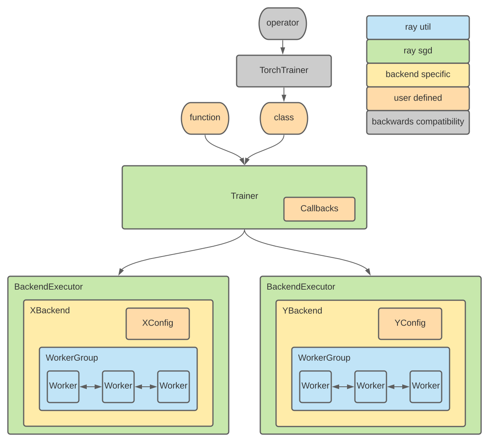

.. _train-arch:

.. TODO: the diagram and some of the components (in the given context) are outdated.
         Make sure to fix this.

Ray Train Architecture
======================

The process of training models with Ray Train consists of several components.
First, depending on the training framework you want to work with, you will have
to provide a so-called ``Trainer`` that manages the training process.
For instance, to use a PyTorch model, you use a ``TorchTrainer``.
The actual training load is distributed among workers on a cluster that belong
to a ``WorkerGroup``.
Each framework has its specific communication protocols and exchange formats,
which is why Ray Train provides ``Backend`` implementations (e.g. ``TorchBackend``)
that can be used to run the training process using a ``BackendExecutor``.

Here's a visual overview of the architecture components of Ray Train:

Below we discuss each component in a bit more detail.

Trainer
-------

Trainers are your main entry point to the Ray Train API.
Train provides a :ref:`BaseTrainer<train-base-trainer>`, and
many framework-specific Trainers inherit from the derived ``DataParallelTrainer``
(like TensorFlow or Torch) and ``GBDTTrainer`` (like XGBoost or LightGBM).
Defining an actual Trainer, such as ``TorchTrainer`` works as follows:

* You pass in a *function* to the Trainer which defines the training logic.
* The Trainer will create an :ref:`Executor <train-arch-executor>` to run the distributed training.
* The Trainer will handle callbacks based on the results from the executor.

.. _train-arch-backend:

Backend
-------

Backends are used to initialize and manage framework-specific communication protocols.
Each training library (Torch, Horovod, TensorFlow, etc.) has a separate backend
and takes specific configuration values defined in a :ref:`BackendConfig<train-backend-config>`.
Each backend comes with a ``BackendExecutor`` that is used to run the training process.

.. _train-arch-executor:

Executor
--------

The executor is an interface (``BackendExecutor``) that executes distributed training.
It handles the creation of a group of workers (using :ref:`Ray Actors<actor-guide>`)
and is initialized with a :ref:`backend<train-arch-backend>`.
The executor passes all required resources, the number of workers, and information about
worker placement to the ``WorkerGroup``.

WorkerGroup
-----------

The WorkerGroup is a generic utility class for managing a group of Ray Actors.
This is similar in concept to Fiber's `Ring <https://uber.github.io/fiber/experimental/ring/>`_.
