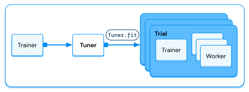

:orphan:

.. _train-tune-deprecated-api:

Hyperparameter Tuning with Ray Tune (Deprecated API)
====================================================

.. important::
    This user guide covers the deprecated Train + Tune integration. See :ref:`train-tune` for the new API user guide.

    Please see :ref:`here <train-tune-deprecation>` for information about the deprecation and migration.

Hyperparameter tuning with :ref:`Ray Tune <tune-main>` is natively supported with Ray Train.

.. https://docs.google.com/drawings/d/1yMd12iMkyo6DGrFoET1TIlKfFnXX9dfh2u3GSdTz6W4/edit

    The `Tuner` will take in a `Trainer` and execute multiple training runs, each with different hyperparameter configurations.

Key Concepts
------------

There are a number of key concepts when doing hyperparameter optimization with a :class:`~ray.tune.Tuner`:

* A set of hyperparameters you want to tune in a *search space*.
* A *search algorithm* to effectively optimize your parameters and optionally use a
  *scheduler* to stop searches early and speed up your experiments.
* The *search space*, *search algorithm*, *scheduler*, and *Trainer* are passed to a Tuner,
  which runs the hyperparameter tuning workload by evaluating multiple hyperparameters in parallel.
* Each individual hyperparameter evaluation run is called a *trial*.
* The Tuner returns its results as a :class:`~ray.tune.ResultGrid`.

.. note::
   Tuners can also be used to launch hyperparameter tuning without using Ray Train. See
   :ref:`the Ray Tune documentation <tune-main>` for more guides and examples.

Basic usage
-----------

You can take an existing :class:`Trainer <ray.train.base_trainer.BaseTrainer>` and simply
pass it into a :class:`~ray.tune.Tuner`.

.. literalinclude:: ../doc_code/tuner.py
    :language: python
    :start-after: __basic_start__
    :end-before: __basic_end__

How to configure a Tuner?
-------------------------

There are two main configuration objects that can be passed into a Tuner: the :class:`TuneConfig <ray.tune.TuneConfig>` and the :class:`ray.tune.RunConfig`.

The :class:`TuneConfig <ray.tune.TuneConfig>` contains tuning specific settings, including:

- the tuning algorithm to use
- the metric and mode to rank results
- the amount of parallelism to use

Here are some common configurations for `TuneConfig`:

.. literalinclude:: ../doc_code/tuner.py
    :language: python
    :start-after: __tune_config_start__
    :end-before: __tune_config_end__

See the :class:`TuneConfig API reference <ray.tune.TuneConfig>` for more details.

The :class:`ray.tune.RunConfig` contains configurations that are more generic than tuning specific settings.
This includes:

- failure/retry configurations
- verbosity levels
- the name of the experiment
- the logging directory
- checkpoint configurations
- custom callbacks
- integration with cloud storage

Below we showcase some common configurations of :class:`ray.tune.RunConfig`.

.. literalinclude:: ../doc_code/tuner.py
    :language: python
    :start-after: __run_config_start__
    :end-before: __run_config_end__

Search Space configuration
--------------------------

A `Tuner` takes in a `param_space` argument where you can define the search space
from which hyperparameter configurations will be sampled.

Depending on the model and dataset, you may want to tune:

- The training batch size
- The learning rate for deep learning training (e.g., image classification)
- The maximum depth for tree-based models (e.g., XGBoost)

You can use a Tuner to tune most arguments and configurations for Ray Train, including but
not limited to:

- Ray :class:`Datasets <ray.data.Dataset>`
- :class:`~ray.train.ScalingConfig`
- and other hyperparameters.

Read more about :ref:`Tune search spaces here <tune-search-space-tutorial>`.

Train - Tune gotchas
--------------------

There are a couple gotchas about parameter specification when using Tuners with Trainers:

- By default, configuration dictionaries and config objects will be deep-merged.
- Parameters that are duplicated in the Trainer and Tuner will be overwritten by the Tuner ``param_space``.
- **Exception:** all arguments of the :class:`ray.tune.RunConfig` and :class:`ray.tune.TuneConfig` are inherently un-tunable.

See :doc:`/tune/tutorials/tune_get_data_in_and_out` for an example.

Advanced Tuning
---------------

Tuners also offer the ability to tune over different data preprocessing steps and
different training/validation datasets, as shown in the following snippet.

.. literalinclude:: ../doc_code/tuner.py
    :language: python
    :start-after: __tune_dataset_start__
    :end-before: __tune_dataset_end__
