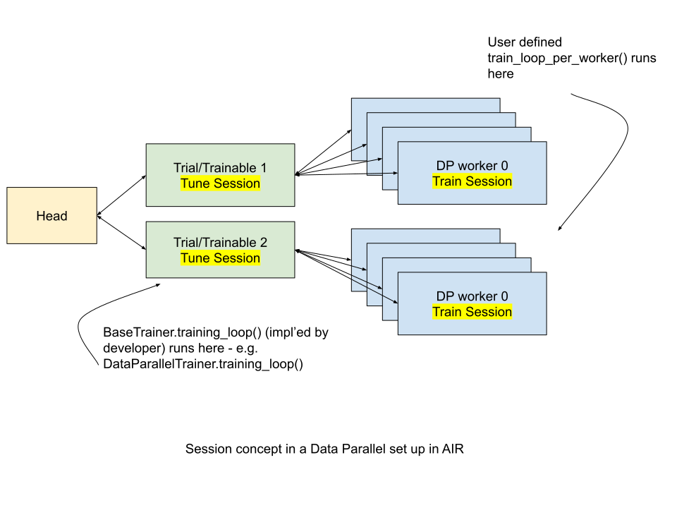

.. _train-dl-guide:

Deep Learning User Guide
========================

This guide explains how to use Train to scale PyTorch, TensorFlow and Horovod.

In this guide, we cover examples for the following use cases:

* How do I :ref:`port my code <train-porting-code>` to use Ray Train?
* How do I use Ray Train to :ref:`train with a large dataset <train-datasets>`?
* How do I :ref:`monitor <train-monitoring>` my training?
* How do I run my training on pre-emptible instances
  (:ref:`fault tolerance <train-fault-tolerance>`)?
* How do I :ref:`tune <train-tune>` my Ray Train model?

.. _train-backends:

Backends
--------

Ray Train provides a thin API around different backend frameworks for
distributed deep learning. At the moment, Ray Train allows you to perform
training with:

* **PyTorch:** Ray Train initializes your distributed process group, allowing
  you to run your ``DistributedDataParallel`` training script. See `PyTorch
  Distributed Overview <https://pytorch.org/tutorials/beginner/dist_overview.html>`_
  for more information.
* **TensorFlow:**  Ray Train configures ``TF_CONFIG`` for you, allowing you to run
  your ``MultiWorkerMirroredStrategy`` training script. See `Distributed
  training with TensorFlow <https://www.tensorflow.org/guide/distributed_training>`_
  for more information.
* **Horovod:** Ray Train configures the Horovod environment and Rendezvous
  server for you, allowing you to run your ``DistributedOptimizer`` training
  script. See `Horovod documentation <https://horovod.readthedocs.io/en/stable/index.html>`_
  for more information.

.. _train-porting-code:

Porting code to Ray Train
-------------------------

The following instructions assume you have a training function
that can already be run on a single worker for one of the supported
:ref:`backend <train-backends>` frameworks.

Update training function
~~~~~~~~~~~~~~~~~~~~~~~~

First, you'll want to update your training function to support distributed
training.

.. tabbed:: PyTorch

    Ray Train will set up your distributed process group for you and also provides utility methods
    to automatically prepare your model and data for distributed training.

    .. note::
       Ray Train will still work even if you don't use the :func:`ray.train.torch.prepare_model`
       and :func:`ray.train.torch.prepare_data_loader` utilities below,
       and instead handle the logic directly inside your training function.

    First, use the :func:~ray.train.torch.prepare_model` function to automatically move your model to the right device and wrap it in
    ``DistributedDataParallel``

    .. code-block:: diff

        import torch
        from torch.nn.parallel import DistributedDataParallel
        +from ray.air import session
        +from ray import train
        +import ray.train.torch

        def train_func():
        -   device = torch.device(f"cuda:{session.get_local_rank()}" if
        -         torch.cuda.is_available() else "cpu")
        -   torch.cuda.set_device(device)

            # Create model.
            model = NeuralNetwork()

        -   model = model.to(device)
        -   model = DistributedDataParallel(model,
        -       device_ids=[session.get_local_rank()] if torch.cuda.is_available() else None)

        +   model = train.torch.prepare_model(model)

            ...

    Then, use the ``prepare_data_loader`` function to automatically add a ``DistributedSampler`` to your ``DataLoader``
    and move the batches to the right device. This step is not necessary if you are passing in Ray Datasets to your Trainer
    (see :ref:`train-datasets`)

    .. code-block:: diff

        import torch
        from torch.utils.data import DataLoader, DistributedSampler
        +from ray.air import session
        +from ray import train
        +import ray.train.torch

        def train_func():
        -   device = torch.device(f"cuda:{session.get_local_rank()}" if
        -          torch.cuda.is_available() else "cpu")
        -   torch.cuda.set_device(device)

            ...

        -   data_loader = DataLoader(my_dataset, batch_size=worker_batch_size, sampler=DistributedSampler(dataset))

        +   data_loader = DataLoader(my_dataset, batch_size=worker_batch_size)
        +   data_loader = train.torch.prepare_data_loader(data_loader)

            for X, y in data_loader:
        -       X = X.to_device(device)
        -       y = y.to_device(device)

    .. tip::
       Keep in mind that ``DataLoader`` takes in a ``batch_size`` which is the batch size for each worker.
       The global batch size can be calculated from the worker batch size (and vice-versa) with the following equation:

        .. code-block::

            global_batch_size = worker_batch_size * session.get_world_size()

.. tabbed:: TensorFlow

    .. note::
       The current TensorFlow implementation supports
       ``MultiWorkerMirroredStrategy`` (and ``MirroredStrategy``). If there are
       other strategies you wish to see supported by Ray Train, please let us know
       by submitting a `feature request on GitHub <https://github.com/ray-project/ray/issues>`_.

    These instructions closely follow TensorFlow's `Multi-worker training
    with Keras <https://www.tensorflow.org/tutorials/distribute/multi_worker_with_keras>`_
    tutorial. One key difference is that Ray Train will handle the environment
    variable set up for you.

    **Step 1:** Wrap your model in ``MultiWorkerMirroredStrategy``.

    The `MultiWorkerMirroredStrategy <https://www.tensorflow.org/api_docs/python/tf/distribute/experimental/MultiWorkerMirroredStrategy>`_
    enables synchronous distributed training. The ``Model`` *must* be built and
    compiled within the scope of the strategy.

    .. code-block:: python

        with tf.distribute.MultiWorkerMirroredStrategy().scope():
            model = ... # build model
            model.compile()

    **Step 2:** Update your ``Dataset`` batch size to the *global* batch
    size.

    The `batch <https://www.tensorflow.org/api_docs/python/tf/data/Dataset#batch>`_
    will be split evenly across worker processes, so ``batch_size`` should be
    set appropriately.

    .. code-block:: diff

        -batch_size = worker_batch_size
        +batch_size = worker_batch_size * session.get_world_size()

.. tabbed:: Horovod

    If you have a training function that already runs with the `Horovod Ray
    Executor <https://horovod.readthedocs.io/en/stable/ray_include.html#horovod-ray-executor>`_,
    you should not need to make any additional changes!

    To onboard onto Horovod, please visit the `Horovod guide
    <https://horovod.readthedocs.io/en/stable/index.html#get-started>`_.

Create Ray Train Trainer
~~~~~~~~~~~~~~~~~~~~~~~~

``Trainer``\s are the primary Ray Train classes that are used to manage state and
execute training. You can create a simple ``Trainer`` for the backend of choice
with one of the following:

.. tabbed:: PyTorch

    .. code-block:: python

        from ray.air import ScalingConfig
        from ray.train.torch import TorchTrainer
        # For GPU Training, set `use_gpu` to True.
        use_gpu = False
        trainer = TorchTrainer(
            train_func,
            scaling_config=ScalingConfig(use_gpu=use_gpu, num_workers=2)
        )

.. tabbed:: TensorFlow

    .. warning::
        Ray will not automatically set any environment variables or configuration
        related to local parallelism / threading
        :ref:`aside from "OMP_NUM_THREADS" <omp-num-thread-note>`.
        If you desire greater control over TensorFlow threading, use
        the ``tf.config.threading`` module (eg.
        ``tf.config.threading.set_inter_op_parallelism_threads(num_cpus)``)
        at the beginning of your ``train_loop_per_worker`` function.

    .. code-block:: python

        from ray.air import ScalingConfig
        from ray.train.tensorflow import TensorflowTrainer
        # For GPU Training, set `use_gpu` to True.
        use_gpu = False
        trainer = TensorflowTrainer(
            train_func,
            scaling_config=ScalingConfig(use_gpu=use_gpu, num_workers=2)
        )

.. tabbed:: Horovod

    .. code-block:: python

        from ray.air import ScalingConfig
        from ray.train.horovod import HorovodTrainer
        # For GPU Training, set `use_gpu` to True.
        use_gpu = False
        trainer = HorovodTrainer(
            train_func,
            scaling_config=ScalingConfig(use_gpu=use_gpu, num_workers=2)
        )

To customize the backend setup, you can use the :ref:`framework-specific config objects <train-integration-api>`.

.. tabbed:: PyTorch

    .. code-block:: python

        from ray.air import ScalingConfig
        from ray.train.torch import TorchTrainer, TorchConfig

        trainer = TorchTrainer(
            train_func,
            torch_backend=TorchConfig(...),
            scaling_config=ScalingConfig(num_workers=2),
        )

.. tabbed:: TensorFlow

    .. code-block:: python

        from ray.air import ScalingConfig
        from ray.train.tensorflow import TensorflowTrainer, TensorflowConfig

        trainer = TensorflowTrainer(
            train_func,
            tensorflow_backend=TensorflowConfig(...),
            scaling_config=ScalingConfig(num_workers=2),
        )

.. tabbed:: Horovod

    .. code-block:: python

        from ray.air import ScalingConfig
        from ray.train.horovod import HorovodTrainer, HorovodConfig

        trainer = HorovodTrainer(
            train_func,
            tensorflow_backend=HorovodConfig(...),
            scaling_config=ScalingConfig(num_workers=2),
        )

For more configurability, please reference the :py:class:`~ray.train.data_parallel_trainer.DataParallelTrainer` API.

Run training function
~~~~~~~~~~~~~~~~~~~~~

With a distributed training function and a Ray Train ``Trainer``, you are now
ready to start training!

.. code-block:: python

    trainer.fit()

Configuring Training
--------------------

With Ray Train, you can execute a training function (``train_func``) in a
distributed manner by calling ``Trainer.fit``. To pass arguments
into the training function, you can expose a single ``config`` dictionary parameter:

.. code-block:: diff

    -def train_func():
    +def train_func(config):

Then, you can pass in the config dictionary as an argument to ``Trainer``:

.. code-block:: diff

    +config = {} # This should be populated.
    trainer = TorchTrainer(
        train_func,
    +   train_loop_config=config,
        scaling_config=ScalingConfig(num_workers=2)
    )

Putting this all together, you can run your training function with different
configurations. As an example:

.. code-block:: python

    from ray.air import session, ScalingConfig
    from ray.train.torch import TorchTrainer

    def train_func(config):
        for i in range(config["num_epochs"]):
            session.report({"epoch": i})

    trainer = TorchTrainer(
        train_func,
        train_loop_config={"num_epochs": 2},
        scaling_config=ScalingConfig(num_workers=2)
    )
    result = trainer.fit()
    print(result.metrics["num_epochs"])
    # 1

A primary use-case for ``config`` is to try different hyperparameters. To
perform hyperparameter tuning with Ray Train, please refer to the
:ref:`Ray Tune integration <train-tune>`.

.. TODO add support for with_parameters

.. _train-result-object:

Accessing Training Results
--------------------------

.. TODO(ml-team) Flesh this section out.

The return of a ``Trainer.fit`` is a :py:class:`~ray.air.result.Result` object, containing
information about the training run. You can access it to obtain saved checkpoints,
metrics and other relevant data.

For example, you can:

* Print the metrics for the last training iteration:

.. code-block:: python

    from pprint import pprint

    pprint(result.metrics)
    # {'_time_this_iter_s': 0.001016855239868164,
    #  '_timestamp': 1657829125,
    #  '_training_iteration': 2,
    #  'config': {},
    #  'date': '2022-07-14_20-05-25',
    #  'done': True,
    #  'episodes_total': None,
    #  'epoch': 1,
    #  'experiment_id': '5a3f8b9bf875437881a8ddc7e4dd3340',
    #  'experiment_tag': '0',
    #  'hostname': 'ip-172-31-43-110',
    #  'iterations_since_restore': 2,
    #  'node_ip': '172.31.43.110',
    #  'pid': 654068,
    #  'time_since_restore': 3.4353830814361572,
    #  'time_this_iter_s': 0.00809168815612793,
    #  'time_total_s': 3.4353830814361572,
    #  'timestamp': 1657829125,
    #  'timesteps_since_restore': 0,
    #  'timesteps_total': None,
    #  'training_iteration': 2,
    #  'trial_id': '4913f_00000',
    #  'warmup_time': 0.003167867660522461}

* View the dataframe containing the metrics from all iterations:

.. code-block:: python

    print(result.metrics_dataframe)

* Obtain the :py:class:`~ray.air.checkpoint.Checkpoint`, used for resuming training, prediction and serving.

.. code-block:: python

    result.checkpoint  # last saved checkpoint
    result.best_checkpoints  # N best saved checkpoints, as configured in run_config

.. _train-log-dir:

Log Directory Structure
~~~~~~~~~~~~~~~~~~~~~~~

Each ``Trainer`` will have a local directory created for logs and checkpoints.

You can obtain the path to the directory by accessing the ``log_dir`` attribute
of the :py:class:`~ray.air.result.Result` object returned by ``Trainer.fit()``.

.. code-block:: python

    print(result.log_dir)
    # '/home/ubuntu/ray_results/TorchTrainer_2022-06-13_20-31-06/checkpoint_000003'

.. _train-datasets:

Distributed Data Ingest with Ray Datasets
-----------------------------------------

:ref:`Ray Datasets <datasets>` are the recommended way to work with large datasets in Ray Train. Datasets provides automatic loading, sharding, and pipelined ingest (optional) of Data across multiple Train workers.
To get started, pass in one or more datasets under the ``datasets`` keyword argument for Trainer (e.g., ``Trainer(datasets={...})``).

Here's a simple code overview of the Datasets integration:

.. code-block:: python

    from ray.air import session

    # Datasets can be accessed in your train_func via ``get_dataset_shard``.
    def train_func(config):
        train_data_shard = session.get_dataset_shard("train")
        validation_data_shard = session.get_dataset_shard("validation")
        ...

    # Random split the dataset into 80% training data and 20% validation data.
    dataset = ray.data.read_csv("...")
    train_dataset, validation_dataset = dataset.train_test_split(
        test_size=0.2, shuffle=True,
    )

    trainer = TorchTrainer(
        train_func,
        datasets={"train": train_dataset, "validation": validation_dataset},
        scaling_config=ScalingConfig(num_workers=8),
    )
    trainer.fit()

For more details on how to configure data ingest for Train, please refer to :ref:`air-ingest`.

.. TODO link to Training Run Iterator API as a 3rd option for logging.

.. _train-monitoring:

Logging, Checkpointing and Callbacks
------------------------------------

Ray Train has mechanisms to easily collect intermediate results from the training workers during the training run
and also has a :ref:`Callback interface <train-callbacks>` to perform actions on these intermediate results (such as logging, aggregations, etc.).
You can use either the :ref:`built-in callbacks <air-builtin-callbacks>` that Ray AIR provides,
or implement a :ref:`custom callback <train-custom-callbacks>` for your use case. The callback API
is shared with Ray Tune.

.. _train-checkpointing:

Ray Train also provides a way to save :ref:`Checkpoints <air-checkpoints-doc>` during the training process. This is
useful for:

1. :ref:`Integration with Ray Tune <train-tune>` to use certain Ray Tune
   schedulers.
2. Running a long-running training job on a cluster of pre-emptible machines/pods.
3. Persisting trained model state to later use for serving/inference.
4. In general, storing any model artifacts.

Reporting intermediate results and handling checkpoints
~~~~~~~~~~~~~~~~~~~~~~~~~~~~~~~~~~~~~~~~~~~~~~~~~~~~~~~

Ray AIR provides a *Session* API for reporting intermediate
results and checkpoints from the training function (run on distributed workers) up to the
``Trainer`` (where your python script is executed) by calling ``session.report(metrics)``.
The results will be collected from the distributed workers and passed to the driver to
be logged and displayed.

.. warning::

    Only the results from rank 0 worker will be used. However, in order to ensure
    consistency, ``session.report()`` has to be called on each worker.

The primary use-case for reporting is for metrics (accuracy, loss, etc.) at
the end of each training epoch.

.. code-block:: python

    from ray.air import session

    def train_func():
        ...
        for i in range(num_epochs):
            result = model.train(...)
            session.report({"result": result})

The session concept exists on several levels: The execution layer (called `Tune Session`) and the Data Parallel training layer
(called `Train Session`).
The following figure shows how these two sessions look like in a Data Parallel training scenario.

..
  https://docs.google.com/drawings/d/1g0pv8gqgG29aPEPTcd4BC0LaRNbW1sAkv3H6W1TCp0c/edit

Saving checkpoints
++++++++++++++++++

:ref:`Checkpoints <air-checkpoints-doc>` can be saved by calling ``session.report(metrics, checkpoint=Checkpoint(...))`` in the
training function. This will cause the checkpoint state from the distributed
workers to be saved on the ``Trainer`` (where your python script is executed).

The latest saved checkpoint can be accessed through the ``checkpoint`` attribute of 
the :py:class:`~ray.air.result.Result`, and the best saved checkpoints can be accessed by the ``best_checkpoints``
attribute.

Concrete examples are provided to demonstrate how checkpoints (model weights but not models) are saved
appropriately in distributed training.

.. tabbed:: PyTorch

    .. code-block:: python
        :emphasize-lines: 36, 37, 38, 39, 40, 41

        import ray.train.torch
        from ray.air import session, Checkpoint, ScalingConfig
        from ray.train.torch import TorchTrainer

        import torch
        import torch.nn as nn
        from torch.optim import Adam
        import numpy as np

        def train_func(config):
            n = 100
            # create a toy dataset
            # data   : X - dim = (n, 4)
            # target : Y - dim = (n, 1)
            X = torch.Tensor(np.random.normal(0, 1, size=(n, 4)))
            Y = torch.Tensor(np.random.uniform(0, 1, size=(n, 1)))
            # toy neural network : 1-layer
            # wrap the model in DDP
            model = ray.train.torch.prepare_model(nn.Linear(4, 1))
            criterion = nn.MSELoss()

            optimizer = Adam(model.parameters(), lr=3e-4)
            for epoch in range(config["num_epochs"]):
                y = model.forward(X)
                # compute loss
                loss = criterion(y, Y)
                # back-propagate loss
                optimizer.zero_grad()
                loss.backward()
                optimizer.step()
                state_dict = model.state_dict()
                checkpoint = Checkpoint.from_dict(
                    dict(epoch=epoch, model_weights=state_dict)
                )
                session.report({}, checkpoint=checkpoint)

        trainer = TorchTrainer(
            train_func,
            train_loop_config={"num_epochs": 5},
            scaling_config=ScalingConfig(num_workers=2),
        )
        result = trainer.fit()

        print(result.checkpoint.to_dict())
        # {'epoch': 4, 'model_weights': OrderedDict([('bias', tensor([-0.1215])), ('weight', tensor([[0.3253, 0.1979, 0.4525, 0.2850]]))]), '_timestamp': 1656107095, '_preprocessor': None, '_current_checkpoint_id': 4}

.. tabbed:: TensorFlow

    .. code-block:: python
        :emphasize-lines: 23

        from ray.air import session, Checkpoint, ScalingConfig
        from ray.train.tensorflow import TensorflowTrainer

        import numpy as np

        def train_func(config):
            import tensorflow as tf
            n = 100
            # create a toy dataset
            # data   : X - dim = (n, 4)
            # target : Y - dim = (n, 1)
            X = np.random.normal(0, 1, size=(n, 4))
            Y = np.random.uniform(0, 1, size=(n, 1))

            strategy = tf.distribute.experimental.MultiWorkerMirroredStrategy()
            with strategy.scope():
                # toy neural network : 1-layer
                model = tf.keras.Sequential([tf.keras.layers.Dense(1, activation="linear", input_shape=(4,))])
                model.compile(optimizer="Adam", loss="mean_squared_error", metrics=["mse"])

            for epoch in range(config["num_epochs"]):
                model.fit(X, Y, batch_size=20)
                checkpoint = Checkpoint.from_dict(
                    dict(epoch=epoch, model_weights=model.get_weights())
                )
                session.report({}, checkpoint=checkpoint)

        trainer = TensorflowTrainer(
            train_func,
            train_loop_config={"num_epochs": 5},
            scaling_config=ScalingConfig(num_workers=2),
        )
        result = trainer.fit()

        print(result.checkpoint.to_dict())
        # {'epoch': 4, 'model_weights': [array([[-0.31858477],
        #    [ 0.03747174],
        #    [ 0.28266194],
        #    [ 0.8626015 ]], dtype=float32), array([0.02230084], dtype=float32)], '_timestamp': 1656107383, '_preprocessor': None, '_current_checkpoint_id': 4}

By default, checkpoints will be persisted to local disk in the :ref:`log
directory <train-log-dir>` of each run.

.. code-block:: python

    print(result.checkpoint.get_internal_representation())
    # ('local_path', '/home/ubuntu/ray_results/TorchTrainer_2022-06-24_21-34-49/TorchTrainer_7988b_00000_0_2022-06-24_21-34-49/checkpoint_000003')

Configuring checkpoints
+++++++++++++++++++++++

For more configurability of checkpointing behavior (specifically saving
checkpoints to disk), a :py:class:`~ray.air.config.CheckpointConfig` can be passed into
``Trainer``.

As an example, to completely disable writing checkpoints to disk:

.. code-block:: python
    :emphasize-lines: 9,14

    from ray.air import session, RunConfig, CheckpointConfig, ScalingConfig
    from ray.train.torch import TorchTrainer

    def train_func():
        for epoch in range(3):
            checkpoint = Checkpoint.from_dict(dict(epoch=epoch))
            session.report({}, checkpoint=checkpoint)

    checkpoint_config = CheckpointConfig(num_to_keep=0)

    trainer = TorchTrainer(
        train_func,
        scaling_config=ScalingConfig(num_workers=2),
        run_config=RunConfig(checkpoint_config=checkpoint_config)
    )
    trainer.fit()

You may also config ``CheckpointConfig`` to keep the "N best" checkpoints persisted to disk. The following example shows how you could keep the 2 checkpoints with the lowest "loss" value:

.. code-block:: python

    from ray.air import session, Checkpoint, RunConfig, CheckpointConfig, ScalingConfig
    from ray.train.torch import TorchTrainer

    def train_func():
        # first checkpoint
        session.report(dict(loss=2), checkpoint=Checkpoint.from_dict(dict(loss=2)))
        # second checkpoint
        session.report(dict(loss=2), checkpoint=Checkpoint.from_dict(dict(loss=4)))
        # third checkpoint
        session.report(dict(loss=2), checkpoint=Checkpoint.from_dict(dict(loss=1)))
        # fourth checkpoint
        session.report(dict(loss=2), checkpoint=Checkpoint.from_dict(dict(loss=3)))

    # Keep the 2 checkpoints with the smallest "loss" value.
    checkpoint_config = CheckpointConfig(
        num_to_keep=2, checkpoint_score_attribute="loss", checkpoint_score_order="min"
    )

    trainer = TorchTrainer(
        train_func,
        scaling_config=ScalingConfig(num_workers=2),
        run_config=RunConfig(checkpoint_config=checkpoint_config),
    )
    result = trainer.fit()
    print(result.best_checkpoints[0][0].get_internal_representation())
    # ('local_path', '/home/ubuntu/ray_results/TorchTrainer_2022-06-24_21-34-49/TorchTrainer_7988b_00000_0_2022-06-24_21-34-49/checkpoint_000000')
    print(result.best_checkpoints[1][0].get_internal_representation())
    # ('local_path', '/home/ubuntu/ray_results/TorchTrainer_2022-06-24_21-34-49/TorchTrainer_7988b_00000_0_2022-06-24_21-34-49/checkpoint_000002')

Loading checkpoints
+++++++++++++++++++

Checkpoints can be loaded into the training function in 2 steps:

1. From the training function, :func:`ray.air.session.get_checkpoint` can be used to access
   the most recently saved :py:class:`~ray.air.checkpoint.Checkpoint`. This is useful to continue training even
   if there's a worker failure.
2. The checkpoint to start training with can be bootstrapped by passing in a
   :py:class:`~ray.air.checkpoint.Checkpoint` to ``Trainer`` as the ``resume_from_checkpoint`` argument.

.. tabbed:: PyTorch

    .. code-block:: python
        :emphasize-lines: 23, 25, 26, 29, 30, 31, 35

        import ray.train.torch
        from ray.air import session, Checkpoint, ScalingConfig
        from ray.train.torch import TorchTrainer

        import torch
        import torch.nn as nn
        from torch.optim import Adam
        import numpy as np

        def train_func(config):
            n = 100
            # create a toy dataset
            # data   : X - dim = (n, 4)
            # target : Y - dim = (n, 1)
            X = torch.Tensor(np.random.normal(0, 1, size=(n, 4)))
            Y = torch.Tensor(np.random.uniform(0, 1, size=(n, 1)))

            # toy neural network : 1-layer
            model = nn.Linear(4, 1)
            criterion = nn.MSELoss()
            optimizer = Adam(model.parameters(), lr=3e-4)
            start_epoch = 0

            checkpoint = session.get_checkpoint()
            if checkpoint:
                # assume that we have run the session.report() example
                # and successfully save some model weights
                checkpoint_dict = checkpoint.to_dict()
                model.load_state_dict(checkpoint_dict.get("model_weights"))
                start_epoch = checkpoint_dict.get("epoch", -1) + 1

            # wrap the model in DDP
            model = ray.train.torch.prepare_model(model)
            for epoch in range(start_epoch, config["num_epochs"]):
                y = model.forward(X)
                # compute loss
                loss = criterion(y, Y)
                # back-propagate loss
                optimizer.zero_grad()
                loss.backward()
                optimizer.step()
                state_dict = model.state_dict()
                checkpoint = Checkpoint.from_dict(
                    dict(epoch=epoch, model_weights=state_dict)
                )
                session.report({}, checkpoint=checkpoint)

        trainer = TorchTrainer(
            train_func,
            train_loop_config={"num_epochs": 2},
            scaling_config=ScalingConfig(num_workers=2),
        )
        # save a checkpoint
        result = trainer.fit()

        # load checkpoint
        trainer = TorchTrainer(
            train_func,
            train_loop_config={"num_epochs": 4},
            scaling_config=ScalingConfig(num_workers=2),
            resume_from_checkpoint=result.checkpoint,
        )
        result = trainer.fit()

        print(result.checkpoint.to_dict())
        # {'epoch': 3, 'model_weights': OrderedDict([('bias', tensor([0.0902])), ('weight', tensor([[-0.1549, -0.0861,  0.4353, -0.4116]]))]), '_timestamp': 1656108265, '_preprocessor': None, '_current_checkpoint_id': 2}

.. tabbed:: TensorFlow

    .. code-block:: python
        :emphasize-lines: 15, 21, 22, 25, 26, 27, 30

        from ray.air import session, Checkpoint, ScalingConfig
        from ray.train.tensorflow import TensorflowTrainer

        import numpy as np

        def train_func(config):
            import tensorflow as tf
            n = 100
            # create a toy dataset
            # data   : X - dim = (n, 4)
            # target : Y - dim = (n, 1)
            X = np.random.normal(0, 1, size=(n, 4))
            Y = np.random.uniform(0, 1, size=(n, 1))

            start_epoch = 0
            strategy = tf.distribute.experimental.MultiWorkerMirroredStrategy()

            with strategy.scope():
                # toy neural network : 1-layer
                model = tf.keras.Sequential([tf.keras.layers.Dense(1, activation="linear", input_shape=(4,))])
                checkpoint = session.get_checkpoint()
                if checkpoint:
                    # assume that we have run the session.report() example
                    # and successfully save some model weights
                    checkpoint_dict = checkpoint.to_dict()
                    model.set_weights(checkpoint_dict.get("model_weights"))
                    start_epoch = checkpoint_dict.get("epoch", -1) + 1
                model.compile(optimizer="Adam", loss="mean_squared_error", metrics=["mse"])

            for epoch in range(start_epoch, config["num_epochs"]):
                model.fit(X, Y, batch_size=20)
                checkpoint = Checkpoint.from_dict(
                    dict(epoch=epoch, model_weights=model.get_weights())
                )
                session.report({}, checkpoint=checkpoint)

        trainer = TensorflowTrainer(
            train_func,
            train_loop_config={"num_epochs": 2},
            scaling_config=ScalingConfig(num_workers=2),
        )
        # save a checkpoint
        result = trainer.fit()

        # load a checkpoint
        trainer = TensorflowTrainer(
            train_func,
            train_loop_config={"num_epochs": 5},
            scaling_config=ScalingConfig(num_workers=2),
            resume_from_checkpoint=result.checkpoint,
        )
        result = trainer.fit()

        print(result.checkpoint.to_dict())
        # {'epoch': 4, 'model_weights': [array([[-0.70056134],
        #    [-0.8839263 ],
        #    [-1.0043601 ],
        #    [-0.61634773]], dtype=float32), array([0.01889327], dtype=float32)], '_timestamp': 1656108446, '_preprocessor': None, '_current_checkpoint_id': 3}

.. _train-callbacks:

Callbacks
~~~~~~~~~

You may want to plug in your training code with your favorite experiment management framework.
Ray AIR provides an interface to fetch intermediate results and callbacks to process/log your intermediate results
(the values passed into :func:`ray.air.session.report`).

Ray AIR contains :ref:`built-in callbacks <air-builtin-callbacks>` for popular tracking frameworks, or you can implement your own callback via the :ref:`Callback <tune-callbacks-docs>` interface.

Example: Logging to MLflow and TensorBoard
++++++++++++++++++++++++++++++++++++++++++

**Step 1: Install the necessary packages**

.. code-block:: bash

    $ pip install mlflow
    $ pip install tensorboardX

**Step 2: Run the following training script**

.. literalinclude:: /../../python/ray/train/examples/mlflow_simple_example.py
   :language: python

.. _train-custom-callbacks:

Custom Callbacks
++++++++++++++++

If the provided callbacks do not cover your desired integrations or use-cases,
you may always implement a custom callback by subclassing :py:class:`~ray.tune.logger.LoggerCallback`. If
the callback is general enough, please feel welcome to :ref:`add it <getting-involved>`
to the ``ray`` `repository <https://github.com/ray-project/ray>`_.

A simple example for creating a callback that will print out results:

.. code-block:: python

    from typing import List, Dict

    from ray.air import session, RunConfig, ScalingConfig
    from ray.train.torch import TorchTrainer
    from ray.tune.logger import LoggerCallback

    # LoggerCallback is a higher level API of Callback.
    class LoggingCallback(LoggerCallback):
        def __init__(self) -> None:
            self.results = []

        def log_trial_result(self, iteration: int, trial: "Trial", result: Dict):
            self.results.append(trial.last_result)

    def train_func():
        for i in range(3):
            session.report({"epoch": i})

    callback = LoggingCallback()
    trainer = TorchTrainer(
        train_func,
        run_config=RunConfig(callbacks=[callback]),
        scaling_config=ScalingConfig(num_workers=2),
    )
    trainer.fit()

    print("\n".join([str(x) for x in callback.results]))
    # {'trial_id': '0f1d0_00000', 'experiment_id': '494a1d050b4a4d11aeabd87ba475fcd3', 'date': '2022-06-27_17-03-28', 'timestamp': 1656349408, 'pid': 23018, 'hostname': 'ip-172-31-43-110', 'node_ip': '172.31.43.110', 'config': {}}
    # {'epoch': 0, '_timestamp': 1656349412, '_time_this_iter_s': 0.0026497840881347656, '_training_iteration': 1, 'time_this_iter_s': 3.433483362197876, 'done': False, 'timesteps_total': None, 'episodes_total': None, 'training_iteration': 1, 'trial_id': '0f1d0_00000', 'experiment_id': '494a1d050b4a4d11aeabd87ba475fcd3', 'date': '2022-06-27_17-03-32', 'timestamp': 1656349412, 'time_total_s': 3.433483362197876, 'pid': 23018, 'hostname': 'ip-172-31-43-110', 'node_ip': '172.31.43.110', 'config': {}, 'time_since_restore': 3.433483362197876, 'timesteps_since_restore': 0, 'iterations_since_restore': 1, 'warmup_time': 0.003779172897338867, 'experiment_tag': '0'}
    # {'epoch': 1, '_timestamp': 1656349412, '_time_this_iter_s': 0.0013833045959472656, '_training_iteration': 2, 'time_this_iter_s': 0.016670703887939453, 'done': False, 'timesteps_total': None, 'episodes_total': None, 'training_iteration': 2, 'trial_id': '0f1d0_00000', 'experiment_id': '494a1d050b4a4d11aeabd87ba475fcd3', 'date': '2022-06-27_17-03-32', 'timestamp': 1656349412, 'time_total_s': 3.4501540660858154, 'pid': 23018, 'hostname': 'ip-172-31-43-110', 'node_ip': '172.31.43.110', 'config': {}, 'time_since_restore': 3.4501540660858154, 'timesteps_since_restore': 0, 'iterations_since_restore': 2, 'warmup_time': 0.003779172897338867, 'experiment_tag': '0'}

Example: PyTorch Distributed metrics
~~~~~~~~~~~~~~~~~~~~~~~~~~~~~~~~~~~~

In real applications, you may want to calculate optimization metrics besides
accuracy and loss: recall, precision, Fbeta, etc.

Ray Train natively supports `TorchMetrics <https://torchmetrics.readthedocs.io/en/latest/>`_, which provides a collection of machine learning metrics for distributed, scalable PyTorch models.

Here is an example:

.. code-block:: python

    from typing import List, Dict
    from ray.air import session, ScalingConfig
    from ray.train.torch import TorchTrainer

    import torch
    import torchmetrics

    def train_func(config):
        preds = torch.randn(10, 5).softmax(dim=-1)
        target = torch.randint(5, (10,))
        accuracy = torchmetrics.functional.accuracy(preds, target).item()
        session.report({"accuracy": accuracy})

    trainer = TorchTrainer(train_func, scaling_config=ScalingConfig(num_workers=2))
    result = trainer.fit()
    print(result.metrics["accuracy"])
    # 0.20000000298023224

.. Running on the cloud
.. --------------------

.. Use Ray Train with the Ray cluster launcher by changing the following:

.. .. code-block:: bash

..     ray up cluster.yaml

.. TODO.

.. _train-fault-tolerance:

Fault Tolerance & Elastic Training
----------------------------------

Ray Train has built-in fault tolerance to recover from worker failures (i.e.
``RayActorError``\s). When a failure is detected, the workers will be shut
down and new workers will be added in. The training function will be
restarted, but progress from the previous execution can be resumed through
checkpointing.

.. warning:: In order to retain progress when recovery, your training function
   **must** implement logic for both saving *and* loading :ref:`checkpoints
   <train-checkpointing>`.

Each instance of recovery from a worker failure is considered a retry. The
number of retries is configurable through the ``max_failures`` attribute of the
``failure_config`` argument set in the ``run_config`` argument passed to the
``Trainer``.

.. note:: Elastic Training is not yet supported.

.. Running on pre-emptible machines
.. --------------------------------

.. You may want to

.. TODO.

.. We do not have a profiling callback in AIR as the execution engine has changed to Tune. The behavior of the callback can be replicated with checkpoints (do a trace, save it to checkpoint, it gets downloaded to driver every iteration).

.. .. _train-profiling:

.. Profiling
.. ---------

.. Ray Train comes with an integration with `PyTorch Profiler <https://pytorch.org/blog/introducing-pytorch-profiler-the-new-and-improved-performance-tool/>`_.
.. Specifically, it comes with a :ref:`TorchWorkerProfiler <train-api-torch-worker-profiler>` utility class and :ref:`train-api-torch-tensorboard-profiler-callback`  callback
.. that allow you to use the PyTorch Profiler as you would in a non-distributed PyTorch script, and synchronize the generated Tensorboard traces onto
.. the disk that from which your script was executed from.

.. **Step 1: Update training function with** ``TorchWorkerProfiler``

.. .. code-block:: bash

..     from ray.train.torch import TorchWorkerProfiler

..     def train_func():
..         twp = TorchWorkerProfiler()
..         with profile(..., on_trace_ready=twp.trace_handler) as p:
..             ...
..             profile_results = twp.get_and_clear_profile_traces()
..             train.report(..., **profile_results)
..         ...

.. **Step 2: Run training function with** ``TorchTensorboardProfilerCallback``

.. .. code-block:: python

..     from ray.train import Trainer
..     from ray.train.callbacks import TorchTensorboardProfilerCallback

..     trainer = Trainer(backend="torch", num_workers=2)
..     trainer.start()
..     trainer.run(train_func, callbacks=[TorchTensorboardProfilerCallback()])
..     trainer.shutdown()

.. **Step 3: Visualize the logs**

.. .. code-block:: bash

..     # Navigate to the run directory of the trainer.
..     # For example `cd /home/ray_results/train_2021-09-01_12-00-00/run_001/pytorch_profiler`
..     $ cd <TRAINER_RUN_DIR>/pytorch_profiler

..     # Install the PyTorch Profiler TensorBoard Plugin.
..     $ pip install torch_tb_profiler

..     # Star the TensorBoard UI.
..     $ tensorboard --logdir .

..     # View the PyTorch Profiler traces.
..     $ open http://localhost:6006/#pytorch_profiler

.. _train-tune:

Hyperparameter tuning (Ray Tune)
--------------------------------

Hyperparameter tuning with :ref:`Ray Tune <tune-main>` is natively supported
with Ray Train. Specifically, you can take an existing ``Trainer`` and simply
pass it into a :py:class:`~ray.tune.tuner.Tuner`.

.. code-block:: python

    from ray import tune
    from ray.air import session, ScalingConfig
    from ray.train.torch import TorchTrainer
    from ray.tune.tuner import Tuner, TuneConfig

    def train_func(config):
        # In this example, nothing is expected to change over epochs,
        # and the output metric is equivalent to the input value.
        for _ in range(config["num_epochs"]):
            session.report(dict(output=config["input"]))

    trainer = TorchTrainer(train_func, scaling_config=ScalingConfig(num_workers=2))
    tuner = Tuner(
        trainer,
        param_space={
            "train_loop_config": {
                "num_epochs": 2,
                "input": tune.grid_search([1, 2, 3]),
            }
        },
        tune_config=TuneConfig(num_samples=5, metric="output", mode="max"),
    )
    result_grid = tuner.fit()
    print(result_grid.get_best_result().metrics["output"])
    # 3

.. _torch-amp:

Automatic Mixed Precision
-------------------------

Automatic mixed precision (AMP) lets you train your models faster by using a lower
precision datatype for operations like linear layers and convolutions.

.. tabbed:: PyTorch

    You can train your Torch model with AMP by:

    1. Adding :func:`ray.train.torch.accelerate` with ``amp=True`` to the top of your training function.
    2. Wrapping your optimizer with :func:`ray.train.torch.prepare_optimizer`.
    3. Replacing your backward call with :func:`ray.train.torch.backward`.

    .. code-block:: diff

        def train_func():
        +   train.torch.accelerate(amp=True)

            model = NeuralNetwork()
            model = train.torch.prepare_model(model)

            data_loader = DataLoader(my_dataset, batch_size=worker_batch_size)
            data_loader = train.torch.prepare_data_loader(data_loader)

            optimizer = torch.optim.SGD(model.parameters(), lr=0.001)
        +   optimizer = train.torch.prepare_optimizer(optimizer)

            model.train()
            for epoch in range(90):
                for images, targets in dataloader:
                    optimizer.zero_grad()

                    outputs = model(images)
                    loss = torch.nn.functional.cross_entropy(outputs, targets)

        -           loss.backward()
        +           train.torch.backward(loss)
                    optimizer.step()
            ...

.. note:: The performance of AMP varies based on GPU architecture, model type,
        and data shape. For certain workflows, AMP may perform worse than
        full-precision training.

.. _train-reproducibility:

Reproducibility
---------------

.. tabbed:: PyTorch

    To limit sources of nondeterministic behavior, add
    :func:`ray.train.torch.enable_reproducibility` to the top of your training
    function.

    .. code-block:: diff

        def train_func():
        +   train.torch.enable_reproducibility()

            model = NeuralNetwork()
            model = train.torch.prepare_model(model)

            ...

    .. warning:: :func:`ray.train.torch.enable_reproducibility` can't guarantee
        completely reproducible results across executions. To learn more, read
        the `PyTorch notes on randomness <https://pytorch.org/docs/stable/notes/randomness.html>`_.

..
    import ray
    from ray import tune

    def training_func(config):
        dataloader = ray.train.get_dataset()\
            .get_shard(torch.rank())\
            .iter_torch_batches(batch_size=config["batch_size"])

        for i in config["epochs"]:
            ray.train.report(...)  # use same intermediate reporting API

    # Declare the specification for training.
    trainer = Trainer(backend="torch", num_workers=12, use_gpu=True)
    dataset = ray.dataset.window()

    # Convert this to a trainable.
    trainable = trainer.to_tune_trainable(training_func, dataset=dataset)

    tuner = tune.Tuner(trainable,
        param_space={"lr": tune.uniform(), "batch_size": tune.randint(1, 2, 3)},
        tune_config=tune.TuneConfig(num_samples=12))
    results = tuner.fit()
..
    Advanced APIs
    -------------

    TODO

    Training Run Iterator API
    ~~~~~~~~~~~~~~~~~~~~~~~~~

    TODO

    Stateful Class API
    ~~~~~~~~~~~~~~~~~~

    TODO
