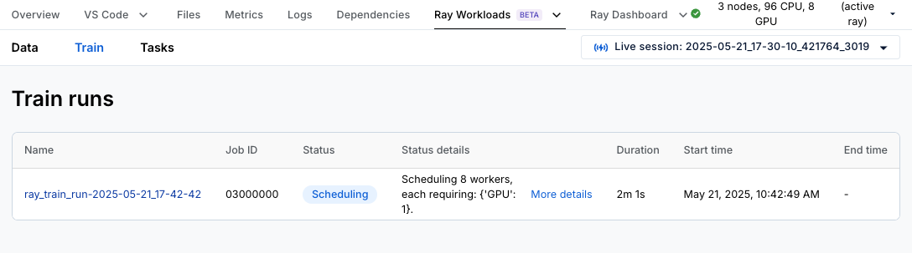
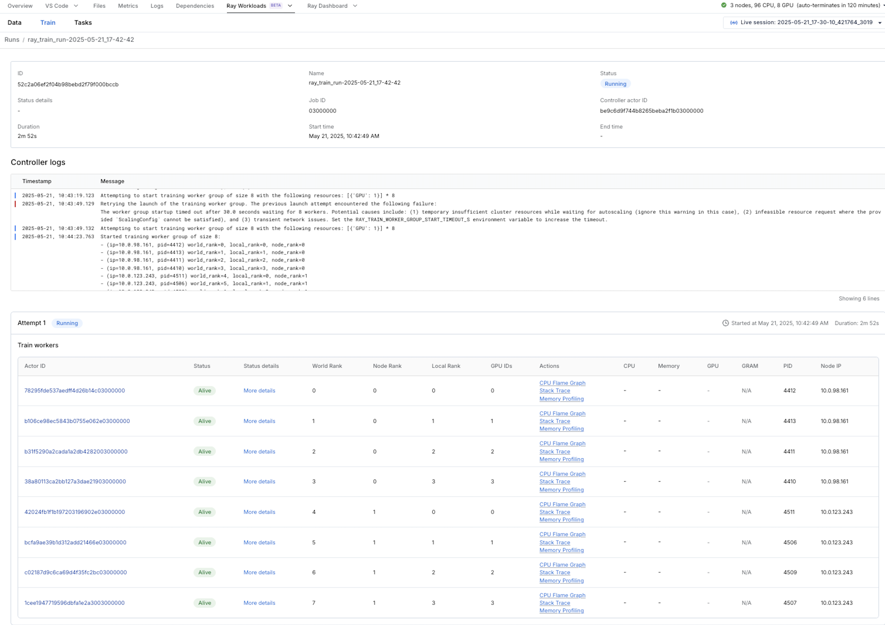
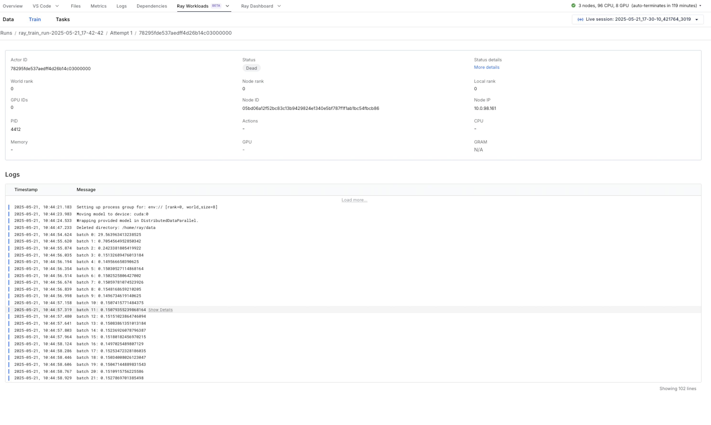
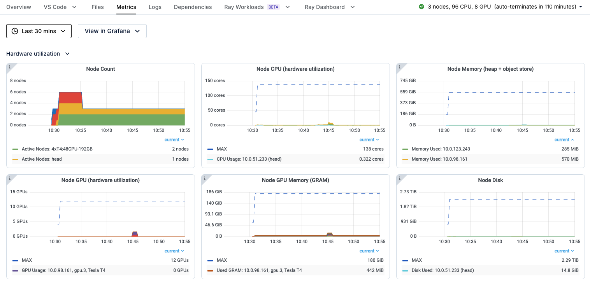
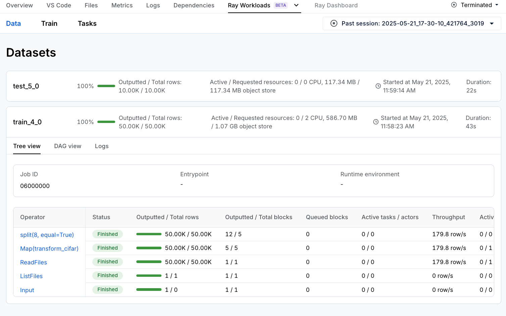

# Distributing your PyTorch Training Code with Ray Train and Ray Data on Anyscale

**⏱️ Time to complete**: 10 min

This template shows you how to distribute your PyTorch training code with Ray Train and Ray Data, getting performance and usability improvements along the way.

In this tutorial, you:
1. Start with a basic single machine PyTorch example.
2. Distribute it to multiple GPUs on multiple machines with [Ray Train](https://docs.ray.io/en/latest/train/train.html) and inspect results with the Ray Train dashboard.
3. Scale data ingest separately from training with [Ray Data](https://docs.ray.io/en/latest/data/data.html) and inspect results with the Ray Data dashboard. 

## Step 1: Start with a basic single machine PyTorch example

In this step you train a torch VisionTransformer model to recognize objects using the open CIFAR-10 dataset. It's a minimal example that trains on a single machine. Note that the code has multiple functions to highlight the changes needed to run things with Ray.

First, some imports.


```python
import os
from typing import Dict

import torch
from filelock import FileLock
from torch import nn
from torch.utils.data import DataLoader
from torchvision import datasets, transforms
from torchvision.transforms import Normalize, ToTensor
from torchvision.models import VisionTransformer
from tqdm import tqdm
```

Next, define a function that returns PyTorch DataLoaders for train and test data. Note how the code also preprocesses the data. 


```python
def get_dataloaders(batch_size):
    # Transform to normalize the input images
    transform = transforms.Compose([ToTensor(), Normalize((0.5, 0.5, 0.5), (0.5, 0.5, 0.5))])

    with FileLock(os.path.expanduser("~/data.lock")):
        # Download training data from open datasets
        training_data = datasets.CIFAR10(
            root="~/data",
            train=True,
            download=True,
            transform=transform,
        )

        testing_data = datasets.CIFAR10(
            root="~/data",
            train=False,
            download=True,
            transform=transform,
        )

    # Create data loaders
    train_dataloader = DataLoader(training_data, batch_size=batch_size, shuffle=True)
    test_dataloader = DataLoader(testing_data, batch_size=batch_size)

    return train_dataloader, test_dataloader
```

Now, define a function that runs the core training loop. Note how the code synchronously alternates between training the model for one epoch and then evaluating the its performance.


```python
def train_func(config: Dict):
    lr = config["lr"]
    epochs = config["epochs"]
    batch_size = config["batch_size_per_worker"]

    # Get dataloaders inside the worker training function
    train_dataloader, test_dataloader = get_dataloaders(batch_size=batch_size)

    model = VisionTransformer(
        image_size=32,   # CIFAR-10 image size is 32x32
        patch_size=4,    # Patch size is 4x4
        num_layers=12,   # Number of transformer layers
        num_heads=8,     # Number of attention heads
        hidden_dim=384,  # Hidden size (can be adjusted)
        mlp_dim=768,     # MLP dimension (can be adjusted)
        num_classes=10   # CIFAR-10 has 10 classes
    )
    device = torch.device('cuda' if torch.cuda.is_available() else 'cpu')
    model.to(device)

    loss_fn = nn.CrossEntropyLoss()
    optimizer = torch.optim.AdamW(model.parameters(), lr=lr, weight_decay=1e-2)

    # Model training loop
    for epoch in range(epochs):
        model.train()
        for X, y in tqdm(train_dataloader, desc=f"Train Epoch {epoch}"):
            X, y = X.to(device), y.to(device)
            pred = model(X)
            loss = loss_fn(pred, y)

            optimizer.zero_grad()
            loss.backward()
            optimizer.step()

        model.eval()
        test_loss, num_correct, num_total = 0, 0, 0
        with torch.no_grad():
            for X, y in tqdm(test_dataloader, desc=f"Test Epoch {epoch}"):
                X, y = X.to(device), y.to(device)
                pred = model(X)
                loss = loss_fn(pred, y)

                test_loss += loss.item()
                num_total += y.shape[0]
                num_correct += (pred.argmax(1) == y).sum().item()

        test_loss /= len(train_dataloader)
        accuracy = num_correct / num_total

        print({"epoch_num": epoch, "loss": test_loss, "accuracy": accuracy})
```

Finally, run training.


```python
def train_cifar_10():
    global_batch_size = 512

    train_config = {
        "lr": 1e-3,
        "epochs": 1,
        "batch_size_per_worker": global_batch_size,
    }

    train_func(train_config)


if __name__ == "__main__":
    train_cifar_10()
```

If everything works as expected, the training should take around 2 minutes 10 seconds with an accuracy of around 0.35.  

## Step 2: Distribute it to multiple machines with Ray Train and inspect results with the Ray Train Dashboard

Let’s modify this example to run with Ray Train on multiple machines. Essentially, Ray Train allows you to wrap your PyTorch training code in a function and run that function on each of the workers in your Ray Cluster. With just a few modifications, you get all the fault tolerance and auto-scaling of a [Ray Cluster](https://docs.ray.io/en/latest/cluster/getting-started.html), as well as the observability and ease-of-use of [Ray Train](https://docs.ray.io/en/latest/train/train.html).

First, import a few Ray Train modules and enable [Ray Train v2](https://github.com/ray-project/enhancements/blob/main/reps/2024-10-18-train-tune-api-revamp/2024-10-18-train-tune-api-revamp.md).


```bash
%%bash
# This will be removed once Ray Train v2 is part of latest Ray version
echo "RAY_TRAIN_V2_ENABLED=1" > /home/ray/default/.env
```


```python
# Load env vars in notebooks
from dotenv import load_dotenv
load_dotenv()
```


```python
import ray.train
from ray.train import RunConfig, ScalingConfig
from ray.train.torch import TorchTrainer

import tempfile
```

Next, modify the training function you wrote earlier. Every difference from the previous script is highlighted and explained with a numbered comment; for example, “[1].”


```python
def train_func_per_worker(config: Dict):
    lr = config["lr"]
    epochs = config["epochs"]
    batch_size = config["batch_size_per_worker"]

    # Get dataloaders inside the worker training function
    train_dataloader, test_dataloader = get_dataloaders(batch_size=batch_size)

    # [1] Prepare Dataloader for distributed training
    # Shard the datasets among workers and move batches to the correct device
    # =======================================================================
    train_dataloader = ray.train.torch.prepare_data_loader(train_dataloader)
    test_dataloader = ray.train.torch.prepare_data_loader(test_dataloader)

    model = VisionTransformer(
        image_size=32,   # CIFAR-10 image size is 32x32
        patch_size=4,    # Patch size is 4x4
        num_layers=12,   # Number of transformer layers
        num_heads=8,     # Number of attention heads
        hidden_dim=384,  # Hidden size (can be adjusted)
        mlp_dim=768,     # MLP dimension (can be adjusted)
        num_classes=10   # CIFAR-10 has 10 classes
    )

    # [2] Prepare and wrap your model with DistributedDataParallel
    # Move the model to the correct GPU/CPU device
    # ============================================================
    model = ray.train.torch.prepare_model(model)

    loss_fn = nn.CrossEntropyLoss()
    optimizer = torch.optim.AdamW(model.parameters(), lr=lr, weight_decay=1e-2)

    # Model training loop
    for epoch in range(epochs):
        if ray.train.get_context().get_world_size() > 1:
            # Required for the distributed sampler to shuffle properly across epochs.
            train_dataloader.sampler.set_epoch(epoch)

        model.train()
        for X, y in tqdm(train_dataloader, desc=f"Train Epoch {epoch}"):
            pred = model(X)
            loss = loss_fn(pred, y)

            optimizer.zero_grad()
            loss.backward()
            optimizer.step()

        model.eval()
        test_loss, num_correct, num_total = 0, 0, 0
        with torch.no_grad():
            for X, y in tqdm(test_dataloader, desc=f"Test Epoch {epoch}"):
                pred = model(X)
                loss = loss_fn(pred, y)

                test_loss += loss.item()
                num_total += y.shape[0]
                num_correct += (pred.argmax(1) == y).sum().item()

        test_loss /= len(train_dataloader)
        accuracy = num_correct / num_total

        # [3] Report metrics to Ray Train
        # ===============================
        with tempfile.TemporaryDirectory() as temp_checkpoint_dir:
            ray.train.report(
                metrics={"loss": test_loss, "accuracy": accuracy},
                checkpoint=ray.train.Checkpoint.from_directory(temp_checkpoint_dir),
            )
            if ray.train.get_context().get_world_rank() == 0:
                print({"epoch_num": epoch, "loss": test_loss, "accuracy": accuracy})
```

Finally, run the training function on the Ray Cluster with a TorchTrainer using gpu workers.


```python
def train_cifar_10(num_workers=2, use_gpu=False):
    global_batch_size = 512

    train_config = {
        "lr": 1e-3,
        "epochs": 1,
        "batch_size_per_worker": global_batch_size // num_workers,
    }

    # [1] Start distributed training
    # Define computation resources for workers
    # Run `train_func_per_worker` on those workers
    # ============================================
    scaling_config = ScalingConfig(num_workers=num_workers, use_gpu=use_gpu)
    run_config = RunConfig(storage_path="/mnt/cluster_storage", name="ray_train_run")
    trainer = TorchTrainer(
        train_loop_per_worker=train_func_per_worker,
        train_loop_config=train_config,
        scaling_config=scaling_config,
        run_config=run_config,
    )
    result = trainer.fit()
    print(f"Training result: {result}")

if __name__ == "__main__":
    train_cifar_10(num_workers=8, use_gpu=True)
```

Because you ran training in a data parallel fashion this time, it should have taken under 1 minute while maintaining similar accuracy.

Head over to the Ray Train dashboard to analyze your distributed training job. You can do so by clicking on "Ray Workloads" and then "Ray Train," which should show you a list of all the training runs you have kicked off.



Clicking into the run brings you to an overview page that shows logs from the controller, which is the process that coordinates your entire Ray Train job, as well as information about your 8 training workers.



Clicking into an individual worker brings you to a more detailed worker page. 



If your worker is still alive, you can click the "cpu flame graph," "stack trace," or "memory profiling" links in the overall run page or the individual worker page. Clicking the "cpu flame graph" link profiles your run with py-spy for 5 seconds and show you a cpu flame graph. Clicking the "stack trace" link shows you the current stack trace of your job - this is useful for debugging hanging jobs. Finally, clicking "memory profiling" profiles your run with memray for 5 seconds and show you a memory flame graph.

You can also click the "Metrics" tab on the navigation bar to view useful stats about your cluster, such as gpu utilization and metrics about ray [actors](https://docs.ray.io/en/latest/ray-core/actors.html) and [tasks](https://docs.ray.io/en/latest/ray-core/tasks.html).



## Step 3: Speed up its data loading with Ray Data

Let’s modify this example to load data with Ray Data instead of the native Torch DataLoader. With just a few modifications, you can offload data preprocessing to an independently scaling distributed Ray Data pipeline. See [here](https://docs.ray.io/en/latest/data/comparisons.html#how-does-ray-data-compare-to-other-solutions-for-ml-training-ingest) for a comparison between Ray Data and Torch data loading.

First, create a [Ray Data Dataset](https://docs.ray.io/en/latest/data/key-concepts.html#datasets-and-blocks). Note the following about the code below:
* You are now loading the data from the [Ansycale default storage bucket](https://docs.anyscale.com/configuration/storage/#anyscale-default-storage-bucket) instead of from PyTorch directly. 
* Each row of a Ray Data Dataset is a dict so you need to access its contents by key.
* Ray Data loads and transforms data lazily, which means that only the training workers materialize the data.


```python
STORAGE_PATH_PREFIX = os.environ.get("ANYSCALE_ARTIFACT_STORAGE", "artifact_storage")
STORAGE_PATH = f"{STORAGE_PATH_PREFIX}/ray_summit_24_train_demo"

def transform_cifar(row: dict):
    # Define the torchvision transform.
    transform = transforms.Compose([ToTensor(), Normalize((0.5, 0.5, 0.5), (0.5, 0.5, 0.5))])
    row["image"] = transform(row["image"])
    return row

train_dataset = ray.data.read_parquet(f'{STORAGE_PATH}/cifar10-parquet/train').map(transform_cifar)
test_dataset = ray.data.read_parquet(f'{STORAGE_PATH}/cifar10-parquet/test').map(transform_cifar)
```

Next, modify the training function you wrote earlier. Every difference from the previous script is highlighted and explained with a numbered comment; for example, “[1].”


```python
def train_func_per_worker(config: Dict):
    lr = config["lr"]
    epochs = config["epochs"]
    batch_size = config["batch_size_per_worker"]

    # [1] Prepare Dataloader for distributed training
    # Shard the datasets among workers and move batches to the correct device
    # =======================================================================
    train_data_shard = ray.train.get_dataset_shard("train")
    test_data_shard = ray.train.get_dataset_shard("test")
    train_dataloader = train_data_shard.iter_torch_batches(batch_size=batch_size)
    test_dataloader = test_data_shard.iter_torch_batches(batch_size=batch_size)

    model = VisionTransformer(
        image_size=32,   # CIFAR-10 image size is 32x32
        patch_size=4,    # Patch size is 4x4
        num_layers=12,   # Number of transformer layers
        num_heads=8,     # Number of attention heads
        hidden_dim=384,  # Hidden size (can be adjusted)
        mlp_dim=768,     # MLP dimension (can be adjusted)
        num_classes=10   # CIFAR-10 has 10 classes
    )

    model = ray.train.torch.prepare_model(model)

    loss_fn = nn.CrossEntropyLoss()
    optimizer = torch.optim.AdamW(model.parameters(), lr=lr, weight_decay=1e-2)

    # Model training loop
    for epoch in range(epochs):
        model.train()
        for batch in tqdm(train_dataloader, desc=f"Train Epoch {epoch}"):
            X, y = batch['image'], batch['label']
            pred = model(X)
            loss = loss_fn(pred, y)

            optimizer.zero_grad()
            loss.backward()
            optimizer.step()

        model.eval()
        test_loss, num_correct, num_total, num_batches = 0, 0, 0, 0
        with torch.no_grad():
            for batch in tqdm(test_dataloader, desc=f"Test Epoch {epoch}"):
                # [2] Each Ray Data batch is a dict so you must access the
                # underlying data using the appropriate keys.
                # =======================================================
                X, y = batch['image'], batch['label']
                pred = model(X)
                loss = loss_fn(pred, y)

                test_loss += loss.item()
                num_total += y.shape[0]
                num_batches += 1
                num_correct += (pred.argmax(1) == y).sum().item()

        test_loss /= num_batches
        accuracy = num_correct / num_total

        with tempfile.TemporaryDirectory() as temp_checkpoint_dir:
            ray.train.report(
                metrics={"loss": test_loss, "accuracy": accuracy},
                checkpoint=ray.train.Checkpoint.from_directory(temp_checkpoint_dir),
            )
            if ray.train.get_context().get_world_rank() == 0:
                print({"epoch_num": epoch, "loss": test_loss, "accuracy": accuracy})
```

Finally, run the training function with the Ray Data Dataset on the Ray Cluster with 8 gpu workers.


```python
def train_cifar_10(num_workers=2, use_gpu=False):
    global_batch_size = 512

    train_config = {
        "lr": 1e-3,
        "epochs": 1,
        "batch_size_per_worker": global_batch_size // num_workers,
    }

    # Configure computation resources
    scaling_config = ScalingConfig(num_workers=num_workers, use_gpu=use_gpu)
    run_config = RunConfig(storage_path="/mnt/cluster_storage", name="ray_train_run")

    # Initialize a Ray TorchTrainer
    trainer = TorchTrainer(
        train_loop_per_worker=train_func_per_worker,
        # [1] With Ray Data you pass the Dataset directly to the Trainer.
        # =====================================
        datasets={"train": train_dataset, "test": test_dataset},
        train_loop_config=train_config,
        scaling_config=scaling_config,
        run_config=run_config,
    )

    result = trainer.fit()
    print(f"Training result: {result}")

if __name__ == "__main__":
    train_cifar_10(num_workers=8, use_gpu=True)
```

Once again your training run should have taken around 1 minute with similar accuracy. There aren't big performance wins with Ray Data on this example due to the small size of the dataset; for more interesting benchmarking information check out [this blog post](https://www.anyscale.com/blog/fast-flexible-scalable-data-loading-for-ml-training-with-ray-data). The main advantage of Ray Data is that it allows you to stream data across heterogeneous compute, maximizing GPU utilization while minimizing RAM usage.

In addition to the Ray Train and Metrics dashboards you saw in the previous section, you can also view the Ray Data dashboard by clicking "Ray Workloads" and then "Data." There, you can view the throughput and status of each [Ray Data operator](https://docs.ray.io/en/latest/data/key-concepts.html#operators-and-plans).



## Summary

Congrats, in this notebook, you've:
* Trained a torch VisionTransformer model on a Ray Cluster with multiple GPU workers with Ray Train and Ray Data
* Verified that speed improved without affecting accuracy
* Gained insight into your distributed training and data preprocessing workloads with various dashboards
