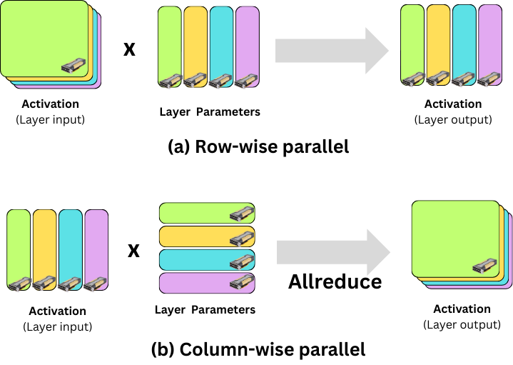

# Get started with 2D Parallelism (Tensor + Data Parallelism) using DeepSpeed and Ray Train

**Time to complete:** 20 min

This template shows how to train large language models using tensor parallelism with DeepSpeed's AutoTP and Ray Train for distributed execution.

**Tensor Parallelism (TP)** shards model weights across multiple GPUs, enabling training of models that are too large to fit on a single GPU. Combined with **Data Parallelism (DP)**, this creates a powerful **2D parallelism** strategy that scales efficiently to many GPUs.

This tutorial provides a step-by-step guide covering:

- Understanding 2D parallelism (Tensor Parallelism + Data Parallelism)
- Setting up a data loader compatible with 2D parallelism
- Preparing the model with DeepSpeed AutoTP and ZeRO
- Checkpointing
- Distributed training with Ray Train

**Note:** This tutorial uses DeepSpeed's AutoTP API. DeepSpeed automatically identifies and shards linear layers for tensor parallelism.

<div id="anyscale-note" class="alert alert-block alert-warning">

  <strong>Anyscale Specific Configuration</strong>

  <p><strong>Note:</strong> This tutorial is optimized for the Anyscale platform. When running on open source Ray, additional configuration is required. For example, you would need to manually:</p>

  <ul>
    <li><strong>Configure your Ray Cluster</strong>: Set up your multi-node environment and manage resource allocation without Anyscale's automation.</li>
    <li><strong>Manage Dependencies</strong>: Manually install and manage dependencies on each node.</li>
    <li><strong>Set Up Storage</strong>: Configure your own distributed or shared storage system for model checkpointing.</li>
  </ul>
</div>

<style>
  div#anyscale-note > p,
  div#anyscale-note > ul,
  div#anyscale-note > ul li {
    color: black;
  }

  div#anyscale-note {
    background-color: rgb(255, 243, 205);
  }

  div#anyscale-note {
    border: 1px solid #ccc; 
    border-radius: 8px;
    padding: 15px;
  }

</style>

## Understanding 2D Parallelism

2D parallelism can be achieved by combining two complementary strategies:

- **Tensor Parallelism (TP)**: Shards model weights across GPUs within a TP group. All GPUs in a TP group process the same input data but hold different parts of the model.
- **Data Parallelism (DP)**: Replicates the model across DP groups. Each DP group processes different data and synchronizes gradients.

With `tp_size=2` and `dp_size=2` on 4 GPUs, the device mesh looks like:

```
Device Mesh (2x2):
        TP Dim
      [0]  [1]
 DP   +---+---+
 Dim  | 0 | 1 |  <- TP Group 0 (same data, sharded model)
      +---+---+
      | 2 | 3 |  <- TP Group 1 (same data, sharded model)
      +---+---+
        ^   ^
       DP Groups (different data, gradient sync)
```

- **TP Groups** (rows): GPUs 0,1 and GPUs 2,3 share the same input data but have sharded model weights
- **DP Groups** (columns): GPUs 0,2 and GPUs 1,3 see different data and synchronize gradients

The following figure illustrates how tensor parallelism partitions a linear layer across GPUs:

<p align="center">

</p>

In tensor parallelism, linear layers alternate between column-wise and row-wise partitioning:

1. **Column-wise partitioned layer**: The parameter tensor is split along the output dimension. The input activation is replicated across all GPUs. Each GPU computes its portion, producing a column-wise partitioned output.

2. **Row-wise partitioned layer**: The next layer's parameters are split along the input dimension. Each GPU computes locally with its partition, then an **all-reduce** operation sums the partial results across all GPUs to produce the mathematically correct output.

This alternating pattern allows consecutive layers to be computed efficiently while maintaining numerical correctness.

## Why DeepSpeed AutoTP?

This tutorial uses [DeepSpeed AutoTP](https://github.com/deepspeedai/DeepSpeed/blob/master/blogs/huggingface-tp/README.md) for tensor parallelism, which provides two key benefits. For a complete overview of AutoTP, see the [DeepSpeed AutoTP docs](https://deepspeed.readthedocs.io/en/latest/training.html#automatic-tensor-parallel-training).

1. **Automatic partitioning**: For supported models, AutoTP automatically identifies which parameters should be partitioned and in which dimensions. You don't need to manually define partitioning patterns. Most popular models including Llama and Qwen series are already supported out of the box.

2. **Efficient combination with ZeRO**: DeepSpeed has a series of memory optimization techniques called ZeRO stage 1, 2, and 3, which drastically reduce the memory usage of data parallelism. AutoTP integrates seamlessly with DeepSpeed's ZeRO (stage 1 and 2). This combination allows you to scale to larger models while maintaining high training throughput.

You can also build tensor parallelism with PyTorch DTensor and FSDP, but you must explicitly define which parameters shard on which dimensions (for example, with `parallelize_module`) and maintain that plan as your model changes. AutoTP removes that step when the model is supported. The trade-off is that AutoTP doesn't support ZeRO stage 3 parameter sharding across data parallel ranks. If you need full parameter sharding to minimize memory, FSDP + DTensor is the better fit, though it can add communication overhead at larger data parallel sizes. For details on DTensor-based tensor parallelism, see the [PyTorch DTensor TP docs](https://docs.pytorch.org/docs/stable/distributed.tensor.parallel.html).

## When to Use Tensor Parallelism vs ZeRO stage 3

DeepSpeed ZeRO stage 3 partitions model parameters across GPUs, but they have different communication patterns and overhead characteristics.

**Communication patterns:**

- **ZeRO Stage 3**: Gathers partitioned parameters via all-gather before each layer's computation. The communication volume is proportional to the model size (M × 2 bytes for bfloat16 with M parameters).
- **Tensor Parallelism**: Uses all-reduce on activations (intermediate data) after each layer. The communication volume depends on: layers × hidden_size × seq_length × batch_size × 2 (dtype) × 2 (attention + FFN).

**Key trade-offs:**

- **TP benefits from high-bandwidth interconnects**: With NVLink or similar high-speed connections, TP's frequent but small communications complete quickly, enabling efficient layer-by-layer parallelism.
- **ZeRO Stage 3's overhead is proportional to model size**, which can become a bottleneck for very large models even when communication overlaps with computation.
- **TP is more efficient for large models with moderate batch sizes**, since TP's communication volume depends on activation size rather than model size. For very large models, activation-based communication can be significantly smaller than parameter-based communication.

**Recommended configuration:**

Given these trade-offs, a typical configuration is:

- **Use TP for intra-node parallelism**: Leverage high-speed interconnects like NVLink within a node where latency is low and bandwidth is high.
- **Use ZeRO for inter-node parallelism**: Inter-node communication has higher latency, but ZeRO's ability to overlap communication with computation makes it more suitable for this setting.

This is why we combine TP with ZeRO in this tutorial—TP handles the fast GPU-to-GPU communication within a node, while ZeRO handles the data parallel synchronization that can span across nodes.

## 1. Package and environment setup

Install the required dependencies:


```bash
%%bash
pip install torch transformers datasets "deepspeed>=0.18.6"
```


```python
import os

import logging
import tempfile
import uuid

import torch
import torch.distributed as dist

# Set up logging
logger = logging.getLogger(__name__)


def get_mixed_precision_dtype() -> torch.dtype:
    """Select a mixed-precision dtype that the current GPU supports."""
    if not torch.cuda.is_available():
        return torch.float32
    return torch.bfloat16 if torch.cuda.is_bf16_supported() else torch.float16
```

## 2. Data loading with TP-aware sharding

A critical aspect of tensor parallelism is ensuring all GPUs in a TP group receive identical input data. Standard data loaders shard by `world_rank`, giving each GPU different data. With TP, you must shard by `dp_rank` instead.

**Global batch size**: Because all GPUs in a TP group see the same data, the effective (global) batch size is `batch_size_per_gpu * dp_size`, not `batch_size_per_gpu * world_size`. For example, with `batch_size_per_gpu=1`, `dp_size=2`, and `tp_size=2` (4 GPUs total), the global batch size is 2, not 4.

```python
# All TP ranks in same DP group get identical batches
sampler = DistributedSampler(
    dataset,
    num_replicas=dp_size,  # NOT world_size
    rank=dp_rank,          # NOT world_rank
)
```

The following function creates a dataloader with proper TP-aware sharding:


```python
from datasets import DownloadConfig, load_dataset
from torch.utils.data import DataLoader
from torch.utils.data.distributed import DistributedSampler
from transformers import AutoTokenizer

import ray.train


def create_dataloader(
    model_name: str,
    dataset_name: str,
    seq_length: int,
    batch_size_per_gpu: int,
    dp_rank: int,
    dp_size: int,
    seed: int = 42,
    dataset_percentage: float = 10.0,
) -> DataLoader:
    """
    Create dataloader with TP-aware sharding.

    IMPORTANT: Uses dp_rank/dp_size for sharding (NOT world_rank/world_size).
    This ensures all TP ranks in the same DP group see identical batches.
    """
    world_rank = ray.train.get_context().get_world_rank()

    # Handle datasets that require a config name
    dataset_config = "wikitext-2-raw-v1" if dataset_name == "wikitext" else None
    dataset_percentage = float(dataset_percentage)
    if not 0 < dataset_percentage <= 100:
        raise ValueError(
            f"dataset_percentage must be in (0, 100], got {dataset_percentage}."
        )
    split_spec = f"train[:{dataset_percentage:.15g}%]"

    # Rank 0 downloads first to avoid conflicts
    if world_rank == 0:
        AutoTokenizer.from_pretrained(model_name, trust_remote_code=True)
        load_dataset(
            dataset_name,
            dataset_config,
            split=split_spec,
            download_config=DownloadConfig(disable_tqdm=True),
        )
    dist.barrier()

    # All ranks load from cache
    tokenizer = AutoTokenizer.from_pretrained(model_name, trust_remote_code=True)
    dataset = load_dataset(
        dataset_name,
        dataset_config,
        split=split_spec,
        download_config=DownloadConfig(disable_tqdm=True),
    )

    # Set pad token if needed
    if tokenizer.pad_token is None:
        if tokenizer.eos_token is not None:
            tokenizer.pad_token = tokenizer.eos_token
        else:
            raise ValueError(
                f"Tokenizer for {model_name} has no pad_token or eos_token. "
                "Please set a pad token manually."
            )

    # Tokenize dataset
    def tokenize_fn(examples):
        return tokenizer(
            examples["text"], padding="max_length", max_length=seq_length, truncation=True
        )

    tokenized = dataset.map(
        tokenize_fn,
        batched=True,
        num_proc=None,
        keep_in_memory=True,
        remove_columns=dataset.column_names,
    )
    tokenized = tokenized.filter(
        lambda example: sum(example["attention_mask"]) > 1,
        keep_in_memory=True,
    )

    # Add labels (ignore padding tokens for causal LM)
    def add_labels(examples):
        labels = []
        for input_ids, attention_mask in zip(
            examples["input_ids"], examples["attention_mask"]
        ):
            labels.append(
                [
                    token if mask == 1 else -100
                    for token, mask in zip(input_ids, attention_mask)
                ]
            )
        examples["labels"] = labels
        return examples

    tokenized = tokenized.map(add_labels, batched=True, num_proc=None, keep_in_memory=True)
    tokenized.set_format(type="torch", columns=["input_ids", "attention_mask", "labels"])

    # [1] Use DP rank/size for sharding (ensures TP ranks get same data)
    sampler = DistributedSampler(
        tokenized, num_replicas=dp_size, rank=dp_rank, shuffle=True, seed=seed
    )

    return DataLoader(tokenized, batch_size=batch_size_per_gpu, sampler=sampler, drop_last=True)
```

## 3. Model Parallelization with DeepSpeed AutoTP

DeepSpeed AutoTP is config-driven: setting `"tensor_parallel": {"autotp_size": N}` in the DeepSpeed config activates automatic tensor parallelism. The sharding happens inside `deepspeed.initialize()` — no additional API calls are needed.

The Model Parallel Unit (MPU) interface tells DeepSpeed about the parallelism topology, enabling correct gradient synchronization across data parallel ranks.


```python
import deepspeed
from transformers import AutoConfig, AutoModelForCausalLM

import ray.train.torch


class ModelParallelUnit:
    """
    Model Parallel Unit (MPU) interface for DeepSpeed.

    DeepSpeed uses this to understand the parallelism topology and
    perform gradient all-reduce only across data parallel ranks.
    """

    def __init__(
        self,
        tp_group: dist.ProcessGroup,
        dp_group: dist.ProcessGroup,
        tp_size: int,
        dp_size: int,
        tp_rank: int,
        dp_rank: int,
    ):
        self._tp_group = tp_group
        self._dp_group = dp_group
        self._tp_size = tp_size
        self._dp_size = dp_size
        self._tp_rank = tp_rank
        self._dp_rank = dp_rank

    def get_data_parallel_group(self) -> dist.ProcessGroup:
        return self._dp_group

    def get_model_parallel_group(self) -> dist.ProcessGroup:
        return self._tp_group

    def get_data_parallel_world_size(self) -> int:
        return self._dp_size

    def get_model_parallel_world_size(self) -> int:
        return self._tp_size

    def get_data_parallel_rank(self) -> int:
        return self._dp_rank

    def get_model_parallel_rank(self) -> int:
        return self._tp_rank


def setup_model_with_autotp(
    model_name: str,
    tp_size: int,
    dp_size: int,
    world_rank: int,
    world_size: int,
    config: dict,
):
    """
    Set up the model with DeepSpeed AutoTP and optional data parallelism.

    Returns:
        tuple: (engine, tp_group, dp_group, tp_rank, dp_rank)
    """
    dtype = get_mixed_precision_dtype()
    use_bf16 = dtype == torch.bfloat16

    # Validate configuration
    if dp_size * tp_size != world_size:
        raise ValueError(
            f"dp_size ({dp_size}) * tp_size ({tp_size}) must equal "
            f"world_size ({world_size})"
        )

    # Calculate TP and DP rank
    tp_rank = world_rank % tp_size
    dp_rank = world_rank // tp_size

    # Load model config and validate TP compatibility
    hf_config = AutoConfig.from_pretrained(model_name, trust_remote_code=True)
    num_kv_heads = getattr(hf_config, "num_key_value_heads", None)
    if num_kv_heads is None:
        num_kv_heads = getattr(hf_config, "num_attention_heads", None)
    if num_kv_heads is None:
        raise ValueError(
            "Model config must define `num_key_value_heads` or `num_attention_heads` "
            "to validate tensor parallel compatibility."
        )
    if num_kv_heads % tp_size != 0:
        raise ValueError(f"TP size {tp_size} must divide attention heads count {num_kv_heads}")

    if world_rank == 0:
        logger.info(f"Setting up 2D mesh: dp_size={dp_size}, tp_size={tp_size}")

    # [1] Create TP and DP process groups
    tp_group = None
    dp_group = None

    # Create TP groups (processes in the same row)
    for dp_idx in range(dp_size):
        tp_group_ranks = list(range(dp_idx * tp_size, (dp_idx + 1) * tp_size))
        group = dist.new_group(tp_group_ranks)
        if world_rank in tp_group_ranks:
            tp_group = group

    # Create DP groups (processes in the same column)
    for tp_idx in range(tp_size):
        dp_group_ranks = [tp_idx + dp_idx * tp_size for dp_idx in range(dp_size)]
        group = dist.new_group(dp_group_ranks)
        if world_rank in dp_group_ranks:
            dp_group = group

    if world_rank == 0:
        logger.info(f"Process groups created: tp_rank={tp_rank}, dp_rank={dp_rank}")

    # [2] Initialize DeepSpeed distributed backend
    deepspeed.init_distributed()

    # [3] Load pretrained model weights and move to device
    device = torch.device(f"cuda:{world_rank % torch.cuda.device_count()}")
    model = AutoModelForCausalLM.from_pretrained(
        model_name,
        trust_remote_code=True,
        torch_dtype=dtype,
    )
    model = model.to(device)

    # [4] Build DeepSpeed config
    # AutoTP is activated by setting "tensor_parallel": {"autotp_size": N}.
    # Sharding happens automatically inside deepspeed.initialize().
    batch_size_per_gpu = config.get("batch_size_per_gpu", 1)
    gradient_accumulation_steps = config.get("gradient_accumulation_steps", 1)
    zero_stage = config.get("zero_stage", 1)
    if zero_stage not in (1, 2):
        raise ValueError(
            f"DeepSpeed AutoTP supports ZeRO stage 1 or 2, but got zero_stage={zero_stage}."
        )
    effective_dp = dp_size if tp_size > 1 else world_size

    ds_config = {
        "train_batch_size": batch_size_per_gpu * effective_dp * gradient_accumulation_steps,
        "train_micro_batch_size_per_gpu": batch_size_per_gpu,
        "gradient_accumulation_steps": gradient_accumulation_steps,
        "gradient_clipping": config.get("max_grad_norm", 1.0),
        "zero_optimization": {
            "stage": zero_stage,
            "overlap_comm": True,
        },
        "tensor_parallel": {
            "autotp_size": tp_size,
        },
        "data_parallel_size": dp_size,
        "zero_allow_untested_optimizer": True,
        "steps_per_print": 2000,
        "wall_clock_breakdown": False,
    }

    if use_bf16:
        ds_config["bf16"] = {
            "enabled": True,
            "bf16_master_weights_and_grads": True,
            "bf16_optimizer_states": True,
        }
    else:
        ds_config["fp16"] = {
            "enabled": True,
        }

    # [5] Create optimizer
    params = list(model.parameters())
    optimizer = torch.optim.AdamW(
        params,
        lr=config.get("learning_rate", 1e-5),
        weight_decay=config.get("weight_decay", 0.01),
    )

    # [6] Create MPU for DeepSpeed
    mpu = ModelParallelUnit(
        tp_group=tp_group,
        dp_group=dp_group,
        tp_size=tp_size,
        dp_size=dp_size,
        tp_rank=tp_rank,
        dp_rank=dp_rank,
    )

    # [7] Initialize DeepSpeed engine
    # AutoTP sharding is applied automatically during initialize()
    engine, optimizer, _, _ = deepspeed.initialize(
        model=model,
        optimizer=optimizer,
        config=ds_config,
        mpu=mpu,
    )

    if world_rank == 0:
        num_params = sum(p.numel() for p in params)
        logger.info(f"Model initialized with {num_params:,} parameters")
        if dp_size > 1:
            logger.info(f"2D parallelism: {dp_size} DP x {tp_size} TP")

    return engine, tp_group, dp_group, tp_rank, dp_rank
```

## 4. Checkpointing

With tensor parallelism, each worker holds a shard of the model. Checkpointing saves each shard independently, and Ray Train aggregates them into a single checkpoint.

For DeepSpeed AutoTP + ZeRO, prefer DeepSpeed's native checkpoint API. `engine.save_checkpoint(...)` writes model shards, ZeRO optimizer partition state, and training state in a format that `engine.load_checkpoint(...)` can restore correctly.

In this example, all workers call `engine.save_checkpoint(...)` with the same `tag` and `client_state` (`epoch`/`step`), then each reports the checkpoint directory to Ray Train via `ray.train.report(..., checkpoint=...)`.

On restore, each worker calls `engine.load_checkpoint(...)` from the Ray Train checkpoint directory and resumes from `client_state["epoch"] + 1`.


```python
from ray.train import Checkpoint


def save_checkpoint(
    engine,
    epoch: int,
    step: int,
    avg_loss: float,
) -> None:
    """Save checkpoint and report to Ray Train."""
    with tempfile.TemporaryDirectory() as checkpoint_dir:
        ckpt_tag = f"epoch_{epoch:04d}_step_{step:06d}"
        # DeepSpeed requires all ranks to call save_checkpoint with same tag.
        engine.save_checkpoint(
            checkpoint_dir,
            tag=ckpt_tag,
            client_state={"epoch": epoch, "step": step},
            save_latest=True,
        )

        # All workers must call report() with their checkpoint
        checkpoint = Checkpoint.from_directory(checkpoint_dir)
        ray.train.report({"loss": avg_loss, "epoch": epoch}, checkpoint=checkpoint)


def load_checkpoint(
    engine,
) -> int:
    """Load DeepSpeed checkpoint from Ray Train checkpoint directory."""
    checkpoint = ray.train.get_checkpoint()
    if checkpoint is None:
        return 0

    with checkpoint.as_directory() as checkpoint_dir:
        load_path, client_state = engine.load_checkpoint(
            checkpoint_dir,
            load_optimizer_states=True,
            load_lr_scheduler_states=True,
        )
        if load_path is None:
            raise RuntimeError("Failed to load DeepSpeed checkpoint.")

        start_epoch = 0
        if client_state is not None:
            start_epoch = client_state.get("epoch", -1) + 1

    return start_epoch
```

## 5. Training loop

The main training function brings together all components:


```python
def train_func(config):
    """
    Main training loop executed by each Ray Train worker.

    This function:
    1. Sets up TP and DP process groups
    2. Creates and shards the model with DeepSpeed AutoTP
    3. Runs the training loop with checkpointing
    """
    # Get Ray Train context
    world_rank = ray.train.get_context().get_world_rank()
    world_size = ray.train.get_context().get_world_size()
    device = ray.train.torch.get_device()

    tp_size = config["tp_size"]
    dp_size = config["dp_size"]

    if world_rank == 0:
        logger.info(f"Worker started: world_rank={world_rank}, world_size={world_size}")

    # Set up model with DeepSpeed AutoTP
    engine, _, _, _, dp_rank = setup_model_with_autotp(
        model_name=config["model_name"],
        tp_size=tp_size,
        dp_size=dp_size,
        world_rank=world_rank,
        world_size=world_size,
        config=config,
    )
    start_epoch = load_checkpoint(engine)

    # Create dataloader with TP-aware sharding
    dataloader = create_dataloader(
        model_name=config["model_name"],
        dataset_name=config["dataset_name"],
        seq_length=config["seq_length"],
        batch_size_per_gpu=config["batch_size_per_gpu"],
        dp_rank=dp_rank,
        dp_size=dp_size,
        seed=config.get("seed", 42),
        dataset_percentage=config.get("dataset_percentage", 10.0),
    )

    steps_per_epoch = len(dataloader)
    if world_rank == 0:
        logger.info(f"Dataloader created: {steps_per_epoch} steps per epoch")
    if steps_per_epoch == 0:
        raise ValueError(
            "Dataloader is empty. Increase dataset_percentage or reduce batch_size_per_gpu."
        )
    log_interval = config.get("log_interval", 10)

    # Training loop
    engine.train()

    for epoch in range(start_epoch, config["num_epochs"]):
        dataloader.sampler.set_epoch(epoch)

        running_loss = 0.0
        num_batches = 0
        step = -1  # Initialize in case dataloader is empty

        for step, batch in enumerate(dataloader):
            # Move batch to device
            batch = {k: v.to(device) for k, v in batch.items()}

            # Forward pass with labels for loss computation
            outputs = engine(
                input_ids=batch["input_ids"],
                attention_mask=batch["attention_mask"],
                labels=batch["labels"],
                use_cache=False,
            )
            loss = outputs.loss

            # Backward pass (through DeepSpeed engine)
            engine.backward(loss)

            # Optimizer step (through DeepSpeed engine)
            engine.step()

            # Track loss
            loss_value = loss.item()
            running_loss += loss_value
            num_batches += 1

            # Log progress
            if (
                world_rank == 0
                and log_interval is not None
                and log_interval > 0
                and step % log_interval == 0
            ):
                logger.info(
                    f"Epoch: {epoch} Step: {step + 1}/{steps_per_epoch} Loss: {loss_value:.4f}"
                )

            # Debug mode: stop early for testing
            if config.get("debug_steps", 0) > 0 and step + 1 >= config["debug_steps"]:
                if world_rank == 0:
                    logger.info(f"Debug steps finished. Stopping epoch {epoch}.")
                break

        if num_batches == 0:
            if world_rank == 0:
                logger.warning(
                    f"Epoch {epoch} processed zero batches. Skipping checkpoint and continuing."
                )
            continue

        # Calculate average loss for epoch
        avg_loss = running_loss / num_batches

        # Save checkpoint at end of epoch
        save_checkpoint(engine, epoch, step, avg_loss)

        if world_rank == 0:
            logger.info(f"Epoch {epoch} completed. Average loss: {avg_loss:.4f}")
```

## 6. Launch the distributed training job

Configure and launch the training job using Ray Train's TorchTrainer. This example uses:
- 4 workers (GPUs)
- 2-way tensor parallelism
- 2-way data parallelism
- A small model (Qwen2.5-0.5B) for demonstration


```python
from ray.train import RunConfig, ScalingConfig
from ray.train.torch import TorchTrainer

# Parallelism configuration
tp_size = 2  # Tensor parallel degree
dp_size = 2  # Data parallel degree
num_workers = tp_size * dp_size  # Total workers must equal tp_size * dp_size

# Configure distributed training resources
scaling_config = ScalingConfig(
    num_workers=num_workers,
    use_gpu=True,
)

# Training configuration
train_loop_config = {
    # Model and data
    "model_name": "Qwen/Qwen2.5-0.5B",  # Small model for demo
    "dataset_name": "wikitext",
    "dataset_percentage": 5.0,  # Use 5% of dataset for faster demo
    # Parallelism
    "tp_size": tp_size,
    "dp_size": dp_size,
    # Training hyperparameters
    "batch_size_per_gpu": 1,  # Global batch size = batch_size_per_gpu * dp_size
    "seq_length": 512,
    "num_epochs": 1,
    "learning_rate": 1e-5,
    "weight_decay": 0.01,
    # Logging and debug
    "log_interval": 5,
    "debug_steps": 20,  # Stop after 20 steps for demo (set to 0 for full training)
    "seed": 42,
}

# Create experiment name
experiment_name = f"tp_autotp_{uuid.uuid4().hex[:8]}"
storage_path = "/tmp/ray_train_tp_autotp"  # Use persistent/shared storage in production

# Configure run settings
run_config = RunConfig(
    name=experiment_name,
    storage_path=storage_path,
)

# Initialize and launch the trainer
trainer = TorchTrainer(
    train_loop_per_worker=train_func,
    scaling_config=scaling_config,
    train_loop_config=train_loop_config,
    run_config=run_config,
)

print(f"Starting tensor parallel training with {tp_size}-way TP and {dp_size}-way DP...")
result = trainer.fit()
print("Training completed successfully!")
print(f"Final metrics: {result.metrics}")

# Reuse the same RunConfig(name, storage_path). train_func() will receive the
# latest checkpoint from ray.train.get_checkpoint() and continue automatically.
RUN_RESUME_DEMO = False
if RUN_RESUME_DEMO:
    resume_train_loop_config = dict(train_loop_config)
    resume_train_loop_config["num_epochs"] = 2  # Continue to epoch 1
    resume_trainer = TorchTrainer(
        train_loop_per_worker=train_func,
        scaling_config=scaling_config,
        train_loop_config=resume_train_loop_config,
        run_config=RunConfig(name=experiment_name, storage_path=storage_path),
    )
    resume_result = resume_trainer.fit()
    print(f"Resumed metrics: {resume_result.metrics}")
```

## Scaling to larger models

To train larger models like Qwen2-7B or Llama-3-8B, adjust the configuration. For example, on 8 GPUs you can use 4-way TP and 2-way DP:

```python
train_loop_config = {
    "model_name": "Qwen/Qwen2-7B",
    "tp_size": 4,
    "dp_size": 2,
    "batch_size_per_gpu": 1,
    "seq_length": 2048,
    ...
}

scaling_config = ScalingConfig(
    num_workers=8,
    use_gpu=True,
)
```

**Tips for scaling:**
- Increase `tp_size` to fit larger models (TP shards model weights)
- Increase `dp_size` to improve throughput (DP processes more data in parallel)
- Ensure `tp_size` divides the model's `num_key_value_heads`
- Use NVLink-connected GPUs for efficient TP communication
- DeepSpeed AutoTP works with ZeRO optimization for additional memory efficiency

## Summary

In this tutorial, you learned:

- How 2D parallelism combines tensor parallelism and data parallelism
- How to set up DeepSpeed AutoTP for automatic model sharding
- The importance of TP-aware data loading for correct gradient computation
- How to combine AutoTP with ZeRO optimization for 2D parallelism
- How to save distributed checkpoints with Ray Train

For production training of large models, consider:
- Using larger `tp_size` for models that don't fit on a single GPU
- Enabling activation checkpointing for memory efficiency (`model.gradient_checkpointing_enable()`)
- Using ZeRO Stage 2 or 3 for additional memory savings with large models
