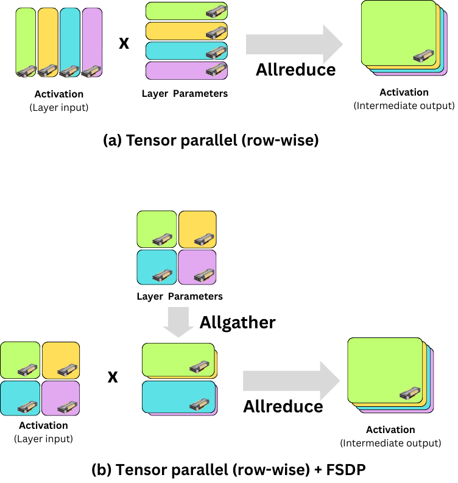

# Get started with 2D Parallelism (Tensor + Data Parallelism) using FSDP2 and Ray Train

**Time to complete:** 20 min

This template shows how to train large language models using tensor parallelism with PyTorch's native [DTensor (Distributed Tensor) API](https://docs.pytorch.org/docs/stable/distributed.tensor.html) and Ray Train for distributed execution.

**Tensor Parallelism (TP)** shards model weights across multiple GPUs, enabling training of models that are too large to fit on a single GPU. Combined with **Data Parallelism (DP)**, this creates a powerful **2D parallelism** strategy that scales efficiently to many GPUs.

This tutorial provides a step-by-step guide covering:

- Understanding 2D parallelism (Tensor Parallelism + Data Parallelism) and 2D PyTorch `DeviceMesh`
- Setting up a data loader compatible with 2D parallelism
- Preparing the model with DTensor and FSDP2 APIs
- Checkpointing
- Distributed training with Ray Train

**Note:** This tutorial uses PyTorch's native `DTensor` and `fully_shard` APIs. These require PyTorch 2.4 or later.

<div id="anyscale-note" class="alert alert-block alert-warning">

  <strong>Anyscale Specific Configuration</strong>

  <p><strong>Note:</strong> This tutorial is optimized for the Anyscale platform. When running on open source Ray, additional configuration is required. For example, you would need to manually:</p>

  <ul>
    <li><strong>Configure your Ray Cluster</strong>: Set up your multi-node environment and manage resource allocation without Anyscale's automation.</li>
    <li><strong>Manage Dependencies</strong>: Manually install and manage dependencies on each node.</li>
    <li><strong>Set Up Storage</strong>: Configure your own distributed or shared storage system for model checkpointing.</li>
  </ul>
</div>

<style>
  div#anyscale-note > p,
  div#anyscale-note > ul,
  div#anyscale-note > ul li {
    color: black;
  }

  div#anyscale-note {
    background-color: rgb(255, 243, 205);
  }

  div#anyscale-note {
    border: 1px solid #ccc; 
    border-radius: 8px;
    padding: 15px;
  }

</style>

## Understanding 2D Parallelism (Tensor Parallelism + Data Parallelism)

We can combine two complementary parallelization strategies:

- **Tensor Parallelism (TP)**: Shards model weights across GPUs within a TP group. All GPUs in a TP group process the same input data but hold different parts of the model.
- **Data Parallelism (DP)**: Replicates the model across DP groups. Each DP group processes different data and synchronizes gradients.

This tutorial uses **FSDP2** for data parallelism instead of the older `DistributedDataParallel` (DDP). While DDP replicates the entire model on each GPU, FSDP2 shards model parameters across the data parallel dimension, significantly reducing memory usage.

Additionally, FSDP2 is built on the same DTensor primitives as tensor parallelism, which makes them naturally composable for 2D parallelism.

The following figure shows the dataflow of a forward pass using tensor parallelism and FSDP2. Assume we split a parameter tensor row-wise in a tensor-parallel layer. The input tensor (activations) must be partitioned column-wise. After multiplying the local shards, we run an all-reduce to produce the layer output.

When combining FSDP2 with tensor parallelism, the parameter shard created for tensor parallelism is sharded again along the data-parallel dimension. The shards are first concatenated across the data-parallel dimension via all-gather communication. Then we multiply the local shards and run an all-reduce.

<p align="center">

</p>

Similarly, during the backward pass we need an all-reduce (and an all-gather when combined with FSDP2). Note that optimizer parameter updates (e.g., Adam) do not require communication.

You can define a `DeviceMesh` to map multiple GPU devices to multiple dimensions for partitioning. With `tp_size=2` and `dp_size=2` on 4 GPUs, the device mesh looks like:

```
Device Mesh (2x2):
        TP Dim
      [0]  [1]
 DP   +---+---+
 Dim  | 0 | 1 |  <- TP Group 0 (same data, sharded model)
      +---+---+
      | 2 | 3 |  <- TP Group 1 (same data, sharded model)
      +---+---+
        ^   ^
       DP Groups (different data, gradient sync)
```

- **TP Groups** (rows): GPUs 0,1 and GPUs 2,3 share the same input data but have sharded model weights
- **DP Groups** (columns): GPUs 0,2 and GPUs 1,3 see different data and synchronize gradients

**When to use Tensor Parallelism vs FSDP:** The communication overhead of each parallelism strategy is determined by communication volume and network bandwidth.

- **TP communication volume**: layers × hidden × seq_len × batch_size × 2 (dtype) × 2 (attention + FFN)
- **FSDP communication volume**: M × 2 bytes (bfloat16) for M parameters

Based on these formulas, TP's overhead grows with batch size and sequence length, while FSDP's overhead remains constant for a given model. Additionally, TP's communication is on the critical path, whereas FSDP's communication can overlap with computation.

TP's communication is also more frequent (after each layer), making it more sensitive to network latency. This is particularly impactful in multi-node settings where inter-node latency is higher.

Considering these factors, a typical configuration is to use **TP for intra-node parallelism** (leveraging high-speed NVLink) and **FSDP for inter-node parallelism** (where communication can be overlapped with computation).

## 1. Package and environment setup

Install the required dependencies:


```bash
%%bash
pip install torch transformers datasets
```


```python
import json
import logging
import os
import tempfile
import uuid

import torch

# Set up logging
logger = logging.getLogger(__name__)


def get_mixed_precision_dtype() -> torch.dtype:
    """Select a mixed-precision dtype that the current GPU supports."""
    return torch.bfloat16 if torch.cuda.is_bf16_supported() else torch.float16
```

## 2. Data loading with TP-aware sharding

A critical aspect of tensor parallelism is ensuring all GPUs in a TP group receive identical input data. Standard data loaders shard by `world_rank`, giving each GPU different data. With TP, you must shard by `dp_rank` instead.

**Global batch size**: Because all GPUs in a TP group see the same data, the effective (global) batch size is `batch_size_per_gpu * dp_size`, not `batch_size_per_gpu * world_size`. For example, with `batch_size_per_gpu=1`, `dp_size=2`, and `tp_size=2` (4 GPUs total), the global batch size is 2, not 4.

```python
# All TP ranks in same DP group get identical batches
sampler = DistributedSampler(
    dataset,
    num_replicas=dp_size,  # NOT world_size
    rank=dp_rank,          # NOT world_rank
)
```

The following function creates a dataloader with proper TP-aware sharding:


```python
from datasets import DownloadConfig, load_dataset
from torch.utils.data import DataLoader
from torch.utils.data.distributed import DistributedSampler
from transformers import AutoTokenizer

import ray.train


def create_dataloader(
    model_name: str,
    dataset_name: str,
    seq_length: int,
    batch_size_per_gpu: int,
    dp_rank: int,
    dp_size: int,
    seed: int = 42,
    dataset_percentage: float = 10.0,
) -> DataLoader:
    """
    Create dataloader with TP-aware sharding.

    IMPORTANT: Uses dp_rank/dp_size for sharding (NOT world_rank/world_size).
    This ensures all TP ranks in the same DP group see identical batches.
    """
    # Handle datasets that require a config name
    dataset_config = "wikitext-2-raw-v1" if dataset_name == "wikitext" else None
    dataset_percentage = float(dataset_percentage)
    if not 0 < dataset_percentage <= 100:
        raise ValueError(
            f"dataset_percentage must be in (0, 100], got {dataset_percentage}."
        )
    split_spec = f"train[:{dataset_percentage:.15g}%]"

    # HF datasets/tokenizers handle process-safe caching and downloads.
    tokenizer = AutoTokenizer.from_pretrained(model_name, trust_remote_code=True)
    dataset = load_dataset(
        dataset_name,
        dataset_config,
        split=split_spec,
        download_config=DownloadConfig(disable_tqdm=True),
    )

    # Set pad token if needed
    if tokenizer.pad_token is None:
        tokenizer.pad_token = tokenizer.eos_token

    # Tokenize dataset
    def tokenize_fn(examples):
        return tokenizer(
            examples["text"], padding="max_length", max_length=seq_length, truncation=True
        )

    tokenized = dataset.map(
        tokenize_fn, batched=True, num_proc=1, keep_in_memory=True,
        remove_columns=dataset.column_names,
    )
    tokenized = tokenized.filter(
        lambda example: sum(example["attention_mask"]) > 1,
        keep_in_memory=True,
    )

    # Add labels (ignore padding tokens for causal LM)
    def add_labels(examples):
        labels = []
        for input_ids, attention_mask in zip(
            examples["input_ids"], examples["attention_mask"]
        ):
            labels.append(
                [
                    token if mask == 1 else -100
                    for token, mask in zip(input_ids, attention_mask)
                ]
            )
        examples["labels"] = labels
        return examples

    tokenized = tokenized.map(add_labels, batched=True, num_proc=1, keep_in_memory=True)
    tokenized.set_format(type="torch", columns=["input_ids", "attention_mask", "labels"])

    # [1] Use DP rank/size for sharding (ensures TP ranks get same data)
    sampler = DistributedSampler(
        tokenized, num_replicas=dp_size, rank=dp_rank, shuffle=True, seed=seed
    )

    return DataLoader(tokenized, batch_size=batch_size_per_gpu, sampler=sampler, drop_last=True)
```

## 3. Model parallelization with the DTensor API

PyTorch's DTensor API provides native tensor parallelism through the `parallelize_module` API. For transformer models, you apply:

- **ColwiseParallel**: Splits output features across TP ranks (used for q, k, v projections and MLP up projections)
- **RowwiseParallel**: Splits input features across TP ranks (used for output projections and MLP down projections)

The following code sets up the 2D device mesh and applies tensor parallelism:


```python
from torch.distributed._composable.fsdp import MixedPrecisionPolicy, fully_shard
from torch.distributed.device_mesh import init_device_mesh
from torch.distributed.tensor.parallel import (
    ColwiseParallel,
    RowwiseParallel,
    parallelize_module,
)
from transformers import AutoConfig, AutoModelForCausalLM

import ray.train.torch


def setup_model_with_tp(
    model_name: str,
    tp_size: int,
    dp_size: int,
    world_rank: int,
    world_size: int,
    device: torch.device,
    seed: int,
):
    """
    Set up the model with tensor parallelism (DTensor) and data parallelism (FSDP2).
    
    Returns:
        tuple: (model, tp_mesh, dp_mesh, tp_rank, dp_rank)
    """
    # Validate configuration
    if tp_size <= 0 or dp_size <= 0:
        raise ValueError(
            f"tp_size and dp_size must be positive, got tp_size={tp_size}, dp_size={dp_size}."
        )
    if dp_size * tp_size != world_size:
        raise ValueError(
            f"dp_size ({dp_size}) * tp_size ({tp_size}) must equal "
            f"world_size ({world_size})"
        )

    # Calculate TP and DP rank
    tp_rank = world_rank % tp_size
    dp_rank = world_rank // tp_size

    # Load model config and validate TP compatibility
    hf_config = AutoConfig.from_pretrained(model_name, trust_remote_code=True)
    num_kv_heads = getattr(hf_config, "num_key_value_heads", None)
    if num_kv_heads is None:
        num_kv_heads = getattr(hf_config, "num_attention_heads", None)
    if num_kv_heads is None:
        raise ValueError(
            "Model config must define `num_key_value_heads` or `num_attention_heads` "
            "to validate tensor parallel compatibility."
        )
    if num_kv_heads % tp_size != 0:
        raise ValueError(f"TP size {tp_size} must divide attention heads count {num_kv_heads}")

    if world_rank == 0:
        logger.info(f"Setting up 2D mesh: dp_size={dp_size}, tp_size={tp_size}")

    # [1] Create 2D device mesh: (dp, tp)
    device_mesh = init_device_mesh(
        "cuda", (dp_size, tp_size), mesh_dim_names=("dp", "tp")
    )
    tp_mesh = device_mesh["tp"]
    dp_mesh = device_mesh["dp"]

    if world_rank == 0:
        logger.info(f"Device mesh created: {device_mesh}")

    # [2] Load pretrained model weights on the target device
    dtype = get_mixed_precision_dtype()
    torch.manual_seed(seed)
    torch.cuda.manual_seed_all(seed)
    model = AutoModelForCausalLM.from_pretrained(
        model_name,
        trust_remote_code=True,
        torch_dtype=dtype,
    ).to(device)

    # Get transformer layers (Qwen/Llama-style models)
    layers = model.model.layers

    # [3] Define TP mapping for transformer layers
    # ColwiseParallel: splits output features across TP ranks
    # RowwiseParallel: splits input features across TP ranks
    tp_mapping = {
        # Attention projections
        "self_attn.q_proj": ColwiseParallel(),
        "self_attn.k_proj": ColwiseParallel(),
        "self_attn.v_proj": ColwiseParallel(),
        "self_attn.o_proj": RowwiseParallel(),
        # MLP projections
        "mlp.gate_proj": ColwiseParallel(),
        "mlp.up_proj": ColwiseParallel(),
        "mlp.down_proj": RowwiseParallel(),
    }

    if world_rank == 0:
        logger.info(f"Applying tensor parallelism to {len(layers)} layers")

    # [4] Apply DTensor TP to transformer layers
    for layer in layers:
        parallelize_module(layer, tp_mesh, tp_mapping)

    # [5] Apply FSDP2 for data parallelism (if dp_size > 1)
    mp_policy = MixedPrecisionPolicy(param_dtype=dtype, reduce_dtype=dtype)

    if dp_size > 1:
        if world_rank == 0:
            logger.info("Applying FSDP2 to transformer layers")

        for layer in layers:
            fully_shard(layer, mesh=dp_mesh, mp_policy=mp_policy)

        # Apply to the whole model
        fully_shard(model, mesh=dp_mesh, mp_policy=mp_policy)
    else:
        if world_rank == 0:
            logger.info("dp_size=1, skipping FSDP sharding (TP only)")

    if world_rank == 0:
        num_params = sum(p.numel() for p in model.parameters())
        logger.info(f"Model initialized with {num_params:,} parameters")

    return model, tp_mesh, dp_mesh, tp_rank, dp_rank
```

## 4. Checkpointing

With tensor parallelism and FSDP2, each worker holds a shard of the model and optimizer state. For this setup, use PyTorch [Distributed Checkpoint (DCP)](https://pytorch.org/docs/stable/distributed.checkpoint.html) APIs so sharded state dicts are saved and restored correctly.

In this example, `dcp.save` and `dcp.load` handle the distributed state dicts, and rank 0 additionally writes `metadata.json` for `epoch`/`step`. Calling `ray.train.report(..., checkpoint=...)` on all workers lets Ray package the distributed checkpoint into one logical artifact.

On restore, each worker loads its local shard through DCP and resumes from `metadata.json`. This avoids materializing a full model copy on each worker and aligns naturally with DTensor/FSDP sharding.


```python
import torch.distributed.checkpoint as dcp
from torch.distributed.checkpoint.state_dict import get_state_dict, set_state_dict
from ray.train import Checkpoint


def save_checkpoint(
    model: torch.nn.Module,
    optimizer: torch.optim.Optimizer,
    world_rank: int,
    epoch: int,
    step: int,
    avg_loss: float,
) -> None:
    """Save checkpoint and report to Ray Train."""
    with tempfile.TemporaryDirectory() as checkpoint_dir:
        model_state_dict, optimizer_state_dict = get_state_dict(model, optimizer)
        state_dict = {
            "model": model_state_dict,
            "optimizer": optimizer_state_dict,
        }

        # Save distributed model/optimizer shards.
        dcp.save(state_dict=state_dict, checkpoint_id=checkpoint_dir)

        # Save metadata (from rank 0 only)
        if world_rank == 0:
            with open(os.path.join(checkpoint_dir, "metadata.json"), "w") as f:
                json.dump({"epoch": epoch, "step": step}, f)

        # All workers must call report() with their checkpoint
        checkpoint = Checkpoint.from_directory(checkpoint_dir)
        ray.train.report({"loss": avg_loss, "epoch": epoch}, checkpoint=checkpoint)


def load_checkpoint(
    model: torch.nn.Module,
    optimizer: torch.optim.Optimizer,
) -> int:
    """Load model/optimizer shards from the latest Ray Train checkpoint."""
    checkpoint = ray.train.get_checkpoint()
    if checkpoint is None:
        return 0

    with checkpoint.as_directory() as checkpoint_dir:
        metadata_path = os.path.join(checkpoint_dir, "metadata.json")

        model_state_dict, optimizer_state_dict = get_state_dict(model, optimizer)
        state_dict = {
            "model": model_state_dict,
            "optimizer": optimizer_state_dict,
        }
        dcp.load(state_dict=state_dict, checkpoint_id=checkpoint_dir)
        set_state_dict(
            model,
            optimizer,
            model_state_dict=state_dict["model"],
            optim_state_dict=state_dict["optimizer"],
        )

        start_epoch = 0
        if os.path.exists(metadata_path):
            with open(metadata_path, "r") as f:
                metadata = json.load(f)
            start_epoch = metadata.get("epoch", -1) + 1

    return start_epoch
```

## 5. Training loop

The main training function brings together all components:


```python
def train_func(config):
    """
    Main training loop executed by each Ray Train worker.

    This function:
    1. Sets up the 2D device mesh for TP + DP
    2. Creates and shards the model with DTensor (TP) and FSDP2 (DP)
    3. Runs the training loop with checkpointing
    """
    # Get Ray Train context
    world_rank = ray.train.get_context().get_world_rank()
    world_size = ray.train.get_context().get_world_size()
    device = ray.train.torch.get_device()

    tp_size = config["tp_size"]
    dp_size = config["dp_size"]

    if world_rank == 0:
        logger.info(f"Worker started: world_rank={world_rank}, world_size={world_size}")

    # Set up model with 2D parallelism
    model, _, _, _, dp_rank = setup_model_with_tp(
        model_name=config["model_name"],
        tp_size=tp_size,
        dp_size=dp_size,
        world_rank=world_rank,
        world_size=world_size,
        device=device,
        seed=config.get("seed", 42),
    )

    # Create optimizer
    # Note: Use foreach=False because DTensor doesn't support fused optimizer ops
    optimizer = torch.optim.AdamW(
        model.parameters(),
        lr=config.get("learning_rate", 1e-5),
        weight_decay=config.get("weight_decay", 0.01),
        foreach=False,
    )
    start_epoch = load_checkpoint(model, optimizer)

    dtype = get_mixed_precision_dtype()

    if world_rank == 0:
        if dp_size > 1:
            logger.info(f"2D parallelism: {dp_size} DP x {tp_size} TP")
        logger.info(f"torch.autocast enabled with dtype={dtype}")

    # Create dataloader with TP-aware sharding
    dataloader = create_dataloader(
        model_name=config["model_name"],
        dataset_name=config["dataset_name"],
        seq_length=config["seq_length"],
        batch_size_per_gpu=config["batch_size_per_gpu"],
        dp_rank=dp_rank,
        dp_size=dp_size,
        seed=config.get("seed", 42),
        dataset_percentage=config.get("dataset_percentage", 10.0),
    )

    steps_per_epoch = len(dataloader)
    if world_rank == 0:
        logger.info(f"Dataloader created: {steps_per_epoch} steps per epoch")
    if steps_per_epoch == 0:
        raise ValueError(
            "Dataloader is empty. Increase dataset_percentage or reduce batch_size_per_gpu."
        )
    log_interval = config.get("log_interval", 10)

    # Training loop
    model.train()

    for epoch in range(start_epoch, config["num_epochs"]):
        dataloader.sampler.set_epoch(epoch)

        running_loss = 0.0
        num_batches = 0

        last_step = -1
        for step, batch in enumerate(dataloader):
            last_step = step
            # Move batch to device
            batch = {k: v.to(device) for k, v in batch.items()}

            # Zero gradients
            optimizer.zero_grad(set_to_none=True)

            # Forward pass with autocast
            with torch.autocast(device_type="cuda", dtype=dtype):
                outputs = model(
                    input_ids=batch["input_ids"],
                    attention_mask=batch["attention_mask"],
                    labels=batch["labels"],
                    use_cache=False,
                )
                loss = outputs.loss

            # Backward pass
            loss.backward()

            # Optimizer step
            optimizer.step()

            # Track loss
            loss_value = loss.item()
            running_loss += loss_value
            num_batches += 1

            # Log progress
            if (
                world_rank == 0
                and log_interval is not None
                and log_interval > 0
                and step % log_interval == 0
            ):
                logger.info(
                    f"Epoch: {epoch} Step: {step + 1}/{steps_per_epoch} Loss: {loss_value:.4f}"
                )

            # Debug mode: stop early for testing
            if config.get("debug_steps", 0) > 0 and step + 1 >= config["debug_steps"]:
                if world_rank == 0:
                    logger.info(f"Debug steps finished. Stopping epoch {epoch}.")
                break

        if num_batches == 0:
            if world_rank == 0:
                logger.warning(
                    f"Epoch {epoch} processed zero batches. Skipping checkpoint and continuing."
                )
            continue

        # Calculate average loss for epoch
        avg_loss = running_loss / num_batches

        # Save checkpoint at end of epoch
        save_checkpoint(model, optimizer, world_rank, epoch, last_step, avg_loss)

        if world_rank == 0:
            logger.info(f"Epoch {epoch} completed. Average loss: {avg_loss:.4f}")
```

## 6. Launch the distributed training job

Configure and launch the training job using Ray Train's TorchTrainer. This example uses:
- 4 workers (GPUs)
- 2-way tensor parallelism
- 2-way data parallelism
- A small model (Qwen2.5-0.5B) for demonstration


```python
from ray.train import RunConfig, ScalingConfig
from ray.train.torch import TorchTrainer

# Parallelism configuration
tp_size = 2  # Tensor parallel degree
dp_size = 2  # Data parallel degree
num_workers = tp_size * dp_size  # Total workers must equal tp_size * dp_size

# Configure distributed training resources
scaling_config = ScalingConfig(
    num_workers=num_workers,
    use_gpu=True,
)

# Training configuration
train_loop_config = {
    # Model and data
    "model_name": "Qwen/Qwen2.5-0.5B",  # Small model for demo
    "dataset_name": "wikitext",
    "dataset_percentage": 5.0,  # Use 5% of dataset for faster demo
    # Parallelism
    "tp_size": tp_size,
    "dp_size": dp_size,
    # Training hyperparameters
    "batch_size_per_gpu": 1,  # Global batch size = batch_size_per_gpu * dp_size
    "seq_length": 512,
    "num_epochs": 1,
    "learning_rate": 1e-5,
    "weight_decay": 0.01,
    # Logging and debug
    "log_interval": 5,
    "debug_steps": 20,  # Stop after 20 steps for demo (set to 0 for full training)
    "seed": 42,
}

# Create experiment name
experiment_name = f"tp_dtensor_{uuid.uuid4().hex[:8]}"
storage_path = "/tmp/ray_train_tp_dtensor"  # Use persistent/shared storage in production

# Configure run settings
run_config = RunConfig(
    name=experiment_name,
    storage_path=storage_path,
)

# Initialize and launch the trainer
trainer = TorchTrainer(
    train_loop_per_worker=train_func,
    scaling_config=scaling_config,
    train_loop_config=train_loop_config,
    run_config=run_config,
)

print(f"Starting tensor parallel training with {tp_size}-way TP and {dp_size}-way DP...")
result = trainer.fit()
print("Training completed successfully!")
print(f"Final metrics: {result.metrics}")

# Reuse the same RunConfig(name, storage_path). train_func() will receive the
# latest checkpoint from ray.train.get_checkpoint() and continue automatically.
RUN_RESUME_DEMO = False
if RUN_RESUME_DEMO:
    resume_train_loop_config = dict(train_loop_config)
    resume_train_loop_config["num_epochs"] = 2  # Continue to epoch 1
    resume_trainer = TorchTrainer(
        train_loop_per_worker=train_func,
        scaling_config=scaling_config,
        train_loop_config=resume_train_loop_config,
        run_config=RunConfig(name=experiment_name, storage_path=storage_path),
    )
    resume_result = resume_trainer.fit()
    print(f"Resumed metrics: {resume_result.metrics}")
```

## Scaling to larger models

To train larger models like Qwen2-7B or Llama-3-8B, adjust the configuration. For example, on 8 GPUs you can use 4-way TP and 2-way DP:

```python
train_loop_config = {
    "model_name": "Qwen/Qwen2-7B",
    "tp_size": 4,
    "dp_size": 2,
    "batch_size_per_gpu": 1,
    "seq_length": 2048,
    ...
}

scaling_config = ScalingConfig(
    num_workers=8,
    use_gpu=True,
)
```

**Tips for scaling:**
- Increase `tp_size` to fit larger models (TP shards model weights)
- Increase `dp_size` to improve throughput (DP processes more data in parallel)
- Ensure `tp_size` divides the model's attention heads count
- Use NVLink-connected GPUs for efficient TP communication

## Summary

In this tutorial, you learned:

- How to combine tensor parallelism and data parallelism for 2D parallelism
- How to set up a 2D device mesh with PyTorch
- How to apply tensor parallelism with the DTensor API to transformer layers
- The importance of TP-aware data loading for correct gradient computation
- How to combine the DTensor API with FSDP2 for 2D parallelism
- How to save distributed checkpoints with Ray Train

For production training of large models, consider:
- Using larger `tp_size` for models that don't fit on a single GPU
- Enabling gradient checkpointing for memory efficiency
- Using PyTorch's memory profiler to optimize memory usage
