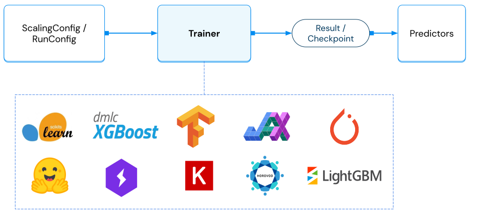

.. _train-key-concepts:

Key Concepts
============

There are four main concepts in the Ray Train library.

1. ``Trainers`` execute distributed training.
2. ``Configuration`` objects are used to configure training.
3. ``Checkpoints`` are returned as the result of training.
4. ``Predictors`` can be used for inference and batch prediction.

.. https://docs.google.com/drawings/d/1FezcdrXJuxLZzo6Rjz1CHyJzseH8nPFZp6IUepdn3N4/edit

Trainers
--------

Trainers are responsible for executing (distributed) training runs.
The output of a Trainer run is a :ref:`Result <train-key-concepts-results>` that contains
metrics from the training run and the latest saved :ref:`Checkpoint <air-checkpoint-ref>`.
Trainers can also be configured with :ref:`Datasets <air-ingest>` and :ref:`Preprocessors <air-preprocessors>` for scalable data ingest and preprocessing.

There are three categories of built-in Trainers:

.. tabbed:: Deep Learning Trainers

    Ray Train supports the following deep learning trainers:

    - :class:`TorchTrainer <ray.train.torch.TorchTrainer>`
    - :class:`TensorflowTrainer <ray.train.tensorflow.TensorflowTrainer>`
    - :class:`HorovodTrainer <ray.train.horovod.HorovodTrainer>`

    For these trainers, you usually define your own training function that loads the model
    and executes single-worker training steps. Refer to the following guides for more details:

    - :ref:`Deep learning user guide <train-dl-guide>`
    - :ref:`Quick overview of deep-learning trainers in the Ray AIR documentation <air-trainers-dl>`

.. tabbed:: Tree-Based Trainers

    Tree-based trainers utilize gradient-based decision trees for training. The most popular libraries
    for this are XGBoost and LightGBM.

    - :class:`XGBoostTrainer <ray.train.xgboost.XGBoostTrainer>`
    - :class:`LightGBMTrainer <ray.train.lightgbm.LightGBMTrainer>`

    For these trainers, you just pass a dataset and parameters. The training loop is configured
    automatically.

    - :ref:`XGBoost/LightGBM user guide <train-gbdt-guide>`
    - :ref:`Quick overview of tree-based trainers in the Ray AIR documentation <air-trainers-tree>`

.. tabbed:: Other Trainers

    Some trainers don't fit into the other two categories, such as:

    - :class:`HuggingFaceTrainer <ray.train.huggingface.HuggingFaceTrainer>` for NLP
    - :class:`RLTrainer <ray.train.rl.RLTrainer>` for reinforcement learning
    - :class:`SklearnTrainer <ray.train.sklearn.sklearn_trainer.SklearnTrainer>` for (non-distributed) training of sklearn models.

    - :ref:`Other trainers in the Ray AIR documentation <air-trainers-other>`

.. _train-key-concepts-config:

Configuration
-------------

Trainers are configured with configuration objects. There are two main configuration classes,
the :class:`ScalingConfig <ray.air.config.ScalingConfig>` and the :class:`RunConfig <ray.air.config.RunConfig>`.
The latter contains subconfigurations, such as the :class:`FailureConfig <ray.air.config.FailureConfig>`,
:class:`SyncConfig <ray.tune.syncer.SyncConfig>` and :class:`CheckpointConfig <ray.air.config.CheckpointConfig>`.

Check out the :ref:`Configurations User Guide <train-config>` for an in-depth guide on using these configurations.

.. _train-key-concepts-results:

Checkpoints
-----------

Calling ``Trainer.fit()`` returns a :class:`Result <ray.air.result.Result>` object, which includes
information about the run such as the reported metrics and the saved checkpoints.

Checkpoints have the following purposes:

* They can be passed to a Trainer to resume training from the given model state.
* They can be used to create a Predictor / BatchPredictor for scalable batch prediction.
* They can be deployed with Ray Serve.

.. _train-key-concepts-predictors:

Predictors
----------

Predictors are the counterpart to Trainers. A Trainer trains a model on a dataset, and a predictor
uses the resulting model and performs inference on it.

Each Trainer has a respective Predictor implementation that is compatible with its generated checkpoints.

.. dropdown:: Example: :class:`XGBoostPredictor <ray.train.xgboost.XGBoostPredictor>`

    .. literalinclude:: /train/doc_code/xgboost_train_predict.py
        :language: python
        :start-after: __train_predict_start__
        :end-before: __train_predict_end__

A predictor can be passed into a :class:`BatchPredictor <ray.train.batch_predictor.BatchPredictor>`
is used to scale up prediction over a Ray cluster.
It takes a Ray Dataset as input.

.. dropdown:: Example: Batch prediction with :class:`XGBoostPredictor <ray.train.xgboost.XGBoostPredictor>`

    .. literalinclude:: /train/doc_code/xgboost_train_predict.py
        :language: python
        :start-after: __batch_predict_start__
        :end-before: __batch_predict_end__

See :ref:`the Predictors user guide <air-predictors>` for more information and examples.
