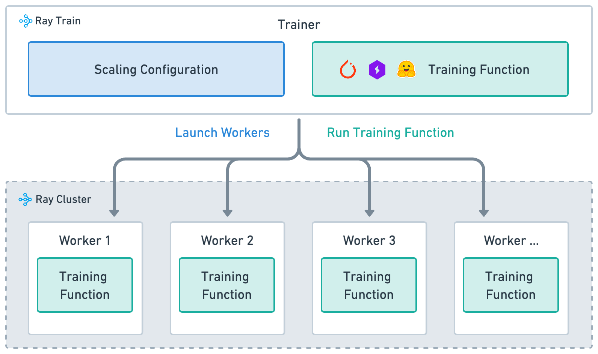

.. _train-key-concepts:

.. _train-overview:

Ray Train Overview
==================

To use Ray Train effectively, you need to understand four main concepts:

#. :ref:`Training function <train-overview-training-function>`: A Python function that contains your model training logic.
#. :ref:`Worker <train-overview-worker>`: A process that runs the training function.
#. :ref:`Scaling configuration: <train-overview-scaling-config>` A configuration of the number of workers and compute resources (for example, CPUs or GPUs).
#. :ref:`Trainer <train-overview-trainers>`: A Python class that ties together the training function, workers, and scaling configuration to execute a distributed training job.

.. _train-overview-training-function:

Training function
-----------------

The training function is a user-defined Python function that contains the end-to-end model training loop logic.
When launching a distributed training job, each worker executes this training function.

Ray Train documentation uses the following conventions:

#. `train_func` is a user-defined function that contains the training code.
#. `train_func` is passed into the Trainer's `train_loop_per_worker` parameter.

.. testcode::

    def train_func():
        """User-defined training function that runs on each distributed worker process.

        This function typically contains logic for loading the model,
        loading the dataset, training the model, saving checkpoints,
        and logging metrics.
        """
        ...

.. _train-overview-worker:

Worker
------

Ray Train distributes model training compute to individual worker processes across the cluster.
Each worker is a process that executes the `train_func`.
The number of workers determines the parallelism of the training job and is configured in the :class:`~ray.train.ScalingConfig`.

.. _train-overview-scaling-config:

Scaling configuration
---------------------

The :class:`~ray.train.ScalingConfig` is the mechanism for defining the scale of the training job.
Specify two basic parameters for worker parallelism and compute resources:

* :class:`num_workers <ray.train.ScalingConfig>`: The number of workers to launch for a distributed training job.
* :class:`use_gpu <ray.train.ScalingConfig>`: Whether each worker should use a GPU or CPU.

.. testcode::

    from ray.train import ScalingConfig

    # Single worker with a CPU
    scaling_config = ScalingConfig(num_workers=1, use_gpu=False)

    # Single worker with a GPU
    scaling_config = ScalingConfig(num_workers=1, use_gpu=True)

    # Multiple workers, each with a GPU
    scaling_config = ScalingConfig(num_workers=4, use_gpu=True)

.. _train-overview-trainers:

Trainer
-------

The Trainer ties the previous three concepts together to launch distributed training jobs.
Ray Train provides :ref:`Trainer classes <train-api>` for different frameworks.
Calling the :meth:`fit() <ray.train.trainer.BaseTrainer.fit>` method executes the training job by:

#. Launching workers as defined by the :ref:`scaling_config <train-overview-scaling-config>`.
#. Setting up the framework's distributed environment on all workers.
#. Running the `train_func` on all workers.

.. testcode::
    :hide:

    def train_func():
        pass

    scaling_config = ScalingConfig(num_workers=1, use_gpu=False)

.. testcode::

    from ray.train.torch import TorchTrainer

    trainer = TorchTrainer(train_func, scaling_config=scaling_config)
    trainer.fit()
