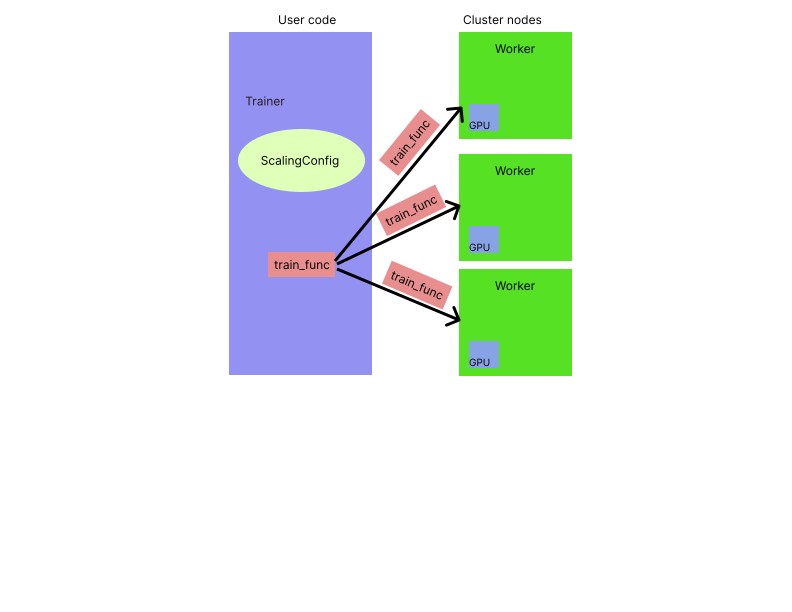

.. _train-key-concepts:

.. _train-overview:

Ray Train Overview
==================

Ray Train is a Ray AI Library built on top of the open-source Ray framework.
Developers use the API to scale model training without writing distribution logic or orchestrating compute resources. 

Using Ray Train for distributed model training involves setting up some configurations and wrapper functions.
The APIs and how-to guides are based on some key concepts and patterns.

<<<<<<<TODO: I submitted a request for this diagram to be professionally done by a designer we have on contract.>>>>>>>

The API is based on four key concepts:

1. :ref:`Ray trainers <train-overview-ray-trainers>` are framework-specific, top-level APIs that execute a single distributed training job.
2. :ref:`train_func <train-overview-train_func>` is your Python training loop.
3. :class:`ScalingConfig <ray.train.ScalingConfig>` is the Ray Train configuration class that specifies the aggregate compute resources to allocate to a single training job.
4. :ref:`Worker <train-overview-workers>` is a process that runs the `train_func` on a cluster. The number of workers generally equals the number of GPUs available in a cluster.

.. _train-overview-ray-trainers:

Ray Trainers
------------

Ray Trainers execute distributed training runs. 
They are wrapper classes around third-party framework trainers. 
These classes are the interface between Ray Train and third-party trainers. 
Ray Trainers abstract away the details of scaling compute resources that include orchestration of nodes and GPU resource management.

[TODO: Ask Matt for content]

.. _train-overview-train_func:

train_func
----------

The train_func is a user-defined wrapper function that the Ray Trainer dispatches to the distributed processes.
It contains your training loop function with the addition of logic that provides the context that every worker needs to run the training job. 
It loads the model, gets the shard of data, does checkpointing, and can have evaluation logic and metrics reporting.
train_func is an parameter of the Ray Trainer.

[TODO Is this not needed for tree-based trainers?]

.. _train-key-overview-scalingconfig:

ScalingConfig
-------------

Ray Train scales training based on high level scaling parameters. 
Users specify the number of Worker processes to distribute the training to, using the :py:class:`~ray.train.ScalingConfig` class.
Two basic parameters scale the training compute resources:

* `num_workers`: The number of Workers to launch for a single distributed training job.
* `use_gpu`: The flag that configures Ray Train to use GPUs or not. 

Examples:

* Single node, single CPU: num_workers=1, use_gpu=false
* Single node, single GPU: num_workers=1, use_gpu=true
* Three nodes, GPUs: num_workers=3, use_gpu=true

.. _train-overview-workers:

Workers
-------

Ray Train distributes model training compute to Ray Workers. 
The number of Workers is user-defined and typically equals the aggregate number of GPUs (or CPUs?) in the cluster pool of resources that are allocated to the entire training job.
Each Worker is a Python process that executes the train_func on a GPU or CPU resource.  
Ray Train abstracts away the allocation and orchestration of nodes and compute resources for Workers.
