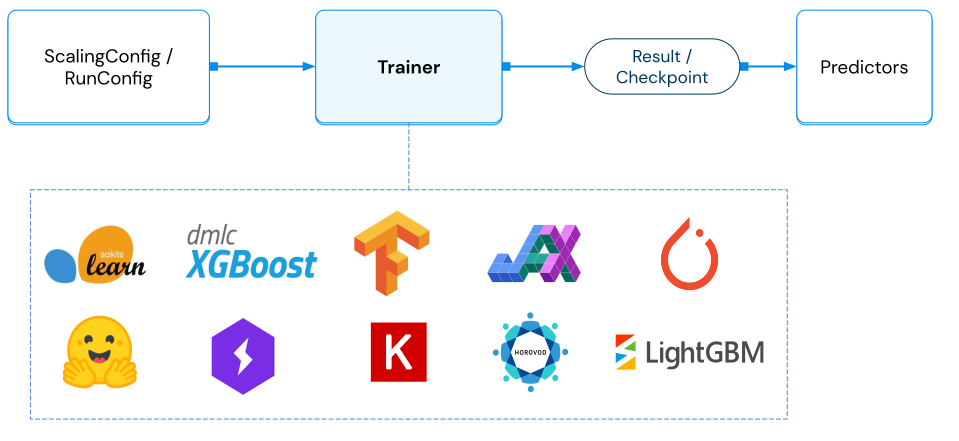

.. include:: /_includes/train/announcement.rst

.. _train-docs:

Ray Train: Scalable Model Training
==================================

.. _`issue on GitHub`: https://github.com/ray-project/ray/issues

.. tip::

    Train is currently in **beta**. Fill out `this short form <https://forms.gle/PXFcJmHwszCwQhqX7>`_ to get involved with Train development!

Ray Train scales model training for popular ML frameworks such as Torch, XGBoost, TensorFlow, and more. It seamlessly integrates with other Ray libraries such as Tune and Predictors:

.. https://docs.google.com/drawings/d/1FezcdrXJuxLZzo6Rjz1CHyJzseH8nPFZp6IUepdn3N4/edit

Intro to Ray Train
------------------

**Framework support**: Train abstracts away the complexity of scaling up training
for common machine learning frameworks such as XGBoost, Pytorch, and Tensorflow.
There are three broad categories of Trainers that Train offers:

* :ref:`Deep Learning Trainers <train-dl-guide>` (Pytorch, Tensorflow, Horovod)
* :ref:`Tree-based Trainers <train-gbdt-guide>` (XGboost, LightGBM)
* Other ML frameworks (HuggingFace, Scikit-Learn, RLlib)

**Built for ML practitioners**: Train supports standard ML tools and features that practitioners love:

* Callbacks for early stopping
* Checkpointing
* Integration with TensorBoard, Weights/Biases, and MLflow
* Jupyter notebooks

**Batteries included**: Train is part of :ref:`Ray AIR <air>` and seamlessly operates in the Ray ecosystem.

* Use :ref:`Ray Datasets <datasets>` with Train to load and process datasets both small and large.
* Use :ref:`Ray Tune <tune-main>` with Train to sweep parameter grids and leverage cutting edge hyperparameter search algorithms.
* Leverage the :ref:`Ray cluster launcher <cluster-index>` to launch autoscaling or spot instance clusters on any cloud.

Quick Start
-----------

.. tabbed:: XGBoost

    .. literalinclude:: doc_code/gbdt_user_guide.py
       :language: python
       :start-after: __xgboost_start__
       :end-before: __xgboost_end__

.. tabbed:: LightGBM

    .. literalinclude:: doc_code/gbdt_user_guide.py
       :language: python
       :start-after: __lightgbm_start__
       :end-before: __lightgbm_end__

.. tabbed:: Pytorch

   .. literalinclude:: /ray-air/doc_code/torch_trainer.py
      :language: python

.. tabbed:: Tensorflow

   .. literalinclude:: /ray-air/doc_code/tf_starter.py
      :language: python
      :start-after: __air_tf_train_start__
      :end-before: __air_tf_train_end__

.. tabbed:: Horovod

   .. literalinclude:: /ray-air/doc_code/hvd_trainer.py
      :language: python

.. _train-framework-catalog:

Framework Catalog
-----------------

Here is a catalog of the framework-specific Trainer, Checkpoint, and Predictor classes that ship out of the box with Train:

.. list-table::

    * - **Trainer Class**
      - **Checkpoint Class**
      - **Predictor Class**
    * - :class:`TorchTrainer <ray.train.torch.TorchTrainer>`
      - :class:`TorchCheckpoint <ray.train.torch.TorchCheckpoint>`
      - :class:`TorchPredictor <ray.train.torch.TorchPredictor>`
    * - :class:`TensorflowTrainer <ray.train.tensorflow.TensorflowTrainer>`
      - :class:`TensorflowCheckpoint <ray.train.tensorflow.TensorflowCheckpoint>`
      - :class:`TensorflowPredictor <ray.train.tensorflow.TensorflowPredictor>`
    * - :class:`HorovodTrainer <ray.train.horovod.HorovodTrainer>`
      - (Torch/TF Checkpoint)
      - (Torch/TF Predictor)
    * - :class:`XGBoostTrainer <ray.train.xgboost.XGBoostTrainer>`
      - :class:`XGBoostCheckpoint <ray.train.xgboost.XGBoostCheckpoint>`
      - :class:`XGBoostPredictor <ray.train.xgboost.XGBoostPredictor>`
    * - :class:`LightGBMTrainer <ray.train.lightgbm.LightGBMTrainer>`
      - :class:`LightGBMCheckpoint <ray.train.lightgbm.LightGBMCheckpoint>`
      - :class:`LightGBMPredictor <ray.train.lightgbm.LightGBMPredictor>`
    * - :class:`SklearnTrainer <ray.train.sklearn.SklearnTrainer>`
      - :class:`SklearnCheckpoint <ray.train.sklearn.SklearnCheckpoint>`
      - :class:`SklearnPredictor <ray.train.sklearn.SklearnPredictor>`
    * - :class:`HuggingFaceTrainer <ray.train.huggingface.HuggingFaceTrainer>`
      - :class:`HuggingFaceCheckpoint <ray.train.huggingface.HuggingFaceCheckpoint>`
      - :class:`HuggingFacePredictor <ray.train.huggingface.HuggingFacePredictor>`
    * - :class:`RLTrainer <ray.train.rl.RLTrainer>`
      - :class:`RLCheckpoint <ray.train.rl.RLCheckpoint>`
      - :class:`RLPredictor <ray.train.rl.RLPredictor>`

Next steps
----------

* :ref:`Getting Started <train-getting-started>`
* :ref:`Key Concepts for Ray Train <train-key-concepts>`
* :ref:`User Guide for Deep Learning Trainers <train-dl-guide>`
* :ref:`User Guide for Tree-Based Trainers <train-gbdt-guide>`

.. include:: /_includes/train/announcement_bottom.rst
