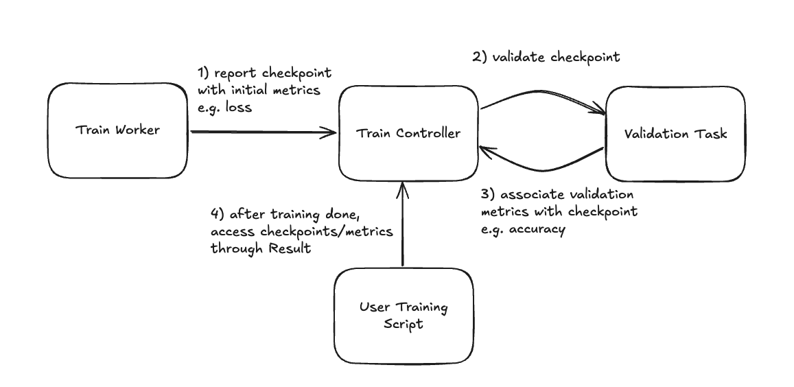

.. _train-validating-checkpoints:

Validating checkpoints asynchronously
=====================================

During training, you may want to validate the model periodically to monitor training progress.
The standard way to do this is to periodically switch between training and validation within
the training loop. Instead, Ray Train allows you to asynchronously validate the model in a
separate Ray task, which does the following:

* Runs validation in parallel without blocking the training loop
* Runs validation on different, potentially cheaper hardware than training, since validation
  doesn't require optimizer states or gradients and can use 2-4x less GPU memory
* Leverages :ref:`autoscaling <vms-autoscaling>` to launch user-specified machines only for the duration of the validation
* Lets training continue immediately after saving a checkpoint with partial metrics (for example, loss)
  and then receives validation metrics (for example, accuracy) as soon as they are available. If the initial
  and validated metrics share the same key, the validated metrics overwrite the initial metrics.

When to use async validation
----------------------------

Asynchronous validation is preferable to alternating between training and validation within the
same training loop in the following scenarios:

* **Validation takes a large percentage of total training time.** If validation is a significant
  fraction of your end-to-end training time, running it asynchronously can substantially reduce
  wall clock time by overlapping validation with training.
* **Cheaper GPUs are available for validation.** Validation doesn't require optimizer states or
  gradients, so it can use 2-4x less GPU memory than training. If you have a pool of cheaper GPUs
  or an autoscaling setup that can provision them, async validation lets you run validation on
  those cheaper machines instead of occupying your expensive training GPUs.
* **Training throughput stops scaling linearly with more workers.** As worker count increases,
  allreduce overhead grows and limits training speed, so doubling workers no longer doubles
  throughput. Validation, however, scales more linearly since it requires no gradient synchronization.
  Asynchronous validation can therefore utilize otherwise idle cluster capacity without impacting
  training.

The best way to know if async validation helps your workload is to try it. Converting is
straightforward (see the tutorial below), so you can run both approaches and compare.

Tutorial
--------

First, define a ``validation_fn`` that takes a :class:`ray.train.Checkpoint` to validate
and any number of json-serializable keyword arguments. This function should return a dictionary
of metrics from that validation.
The following is a simple example for teaching purposes only. It is impractical
because the validation task always runs on cpu; for a more realistic example, see
:ref:`train-distributed-validate-fn`.

.. literalinclude:: ../doc_code/asynchronous_validation.py
    :language: python
    :start-after: __validation_fn_simple_start__
    :end-before: __validation_fn_simple_end__

.. note::

    In this example, the validation dataset is a ray.data.Dataset object, which is not
    json-serializable. We therefore include it with the validation_fn closure instead of passing
    it as a keyword argument.

.. warning::

    Don't pass large objects to the ``validation_fn`` because Ray Train runs it as a Ray task and
    serializes all captured variables. Instead, package large objects in the ``Checkpoint`` and
    access them from shared storage later as explained in :ref:`train-checkpointing`.

Next, register your ``validation_fn`` with your trainer by settings its ``validation_config`` argument to a
:class:`ray.train.v2.api.report_config.ValidationConfig` object that contains your ``validation_fn``
and any default keyword arguments you want to pass to your ``validation_fn``.

Next, within your rank 0 worker's training loop, call :func:`ray.train.report` with ``validation``
set to True, which will call your ``validation_fn`` with the default keyword arguments you passed to the trainer.
Alternatively, you can set ``validation`` to a :class:`ray.train.v2.api.report_config.ValidationTaskConfig` object
that contains keyword arguments that will override matching keyword arguments you passed to the trainer. If
``validation`` is False, Ray Train will not run validation.

.. literalinclude:: ../doc_code/asynchronous_validation.py
    :language: python
    :start-after: __validation_fn_report_start__
    :end-before: __validation_fn_report_end__

Finally, after training is done, you can access your checkpoints and their associated metrics with the
:class:`ray.train.Result` object. See :ref:`train-inspect-results` for more details.

.. _train-distributed-validate-fn:

Write a distributed validation function
---------------------------------------

The ``validation_fn`` above runs in a single Ray task, but you can improve its performance by spawning
even more Ray tasks or actors. The Ray team recommends doing this with one of the following approaches:

* Creating a :class:`ray.train.torch.TorchTrainer` that only does validation, not training.
* (Experimental) Using :func:`ray.data.Dataset.map_batches` to calculate metrics on a validation set.

Choose an approach
~~~~~~~~~~~~~~~~~~

You should use ``TorchTrainer`` if:

* You want to keep your existing validation logic and avoid migrating to Ray Data.
  The training function API lets you fully customize the validation loop to match your current setup.
* Your validation code depends on running within a Torch process group — for example, your
  metric aggregation logic uses collective communication calls, or your model parallelism
  setup requires cross-GPU communication during the forward pass.
* You want a more consistent training and validation experience. The ``map_batches`` approach involves
  running multiple Ray Data Datasets in a single ray cluster; we are currently working on better support
  for this.

You should use ``map_batches`` if:

* You care about validation performance. Preliminary benchmarks show that ``map_batches`` is
  faster.
* You prefer Ray Data’s native metric aggregation APIs over PyTorch, where you must implement
  aggregation manually using low-level collective operations or rely on third-party libraries
  such as `torchmetrics <https://lightning.ai/docs/torchmetrics/stable>`_.

Example: validation with Ray Train TorchTrainer
~~~~~~~~~~~~~~~~~~~~~~~~~~~~~~~~~~~~~~~~~~~~~~~

Here is a ``validation_fn`` that uses a ``TorchTrainer`` to calculate average cross entropy
loss on a validation set. Note the following about this example:

* While you typically use the ``TorchTrainer`` for training, you can use it solely for validation like in this example.
* Because training generally has a higher GPU memory requirement than inference, you can set different
  resource requirements for training and validation, for example, A100 for training and A10G for validation.

.. literalinclude:: ../doc_code/asynchronous_validation.py
    :language: python
    :start-after: __validation_fn_torch_trainer_start__
    :end-before: __validation_fn_torch_trainer_end__

(Experimental) Example: validation with Ray Data map_batches
~~~~~~~~~~~~~~~~~~~~~~~~~~~~~~~~~~~~~~~~~~~~~~~~~~~~~~~~~~~~

The following is a ``validation_fn`` that uses :func:`ray.data.Dataset.map_batches` to
calculate average accuracy on a validation set. To learn more about how to use
``map_batches`` for batch inference, see :ref:`batch_inference_home`.

.. literalinclude:: ../doc_code/asynchronous_validation.py
    :language: python
    :start-after: __validation_fn_map_batches_start__
    :end-before: __validation_fn_map_batches_end__

Tuning asynchronous validation
------------------------------

Overlapping validation and training
~~~~~~~~~~~~~~~~~~~~~~~~~~~~~~~~~~~~

Asynchronous validation is most beneficial when training and validation fully overlap. If one
finishes before the other, some workers sit idle. :ref:`Autoscaling <vms-autoscaling>` lets you
spin up workers only for the duration of validation, which mitigates this but doesn't fully
eliminate the gap.

You can tune the following knobs to overlap validation and training as closely as possible:

* **Number of workers**: Tune the number of validation workers relative to training workers so that
  the two phases overlap as closely as possible.
* **Batch size**: A larger batch size typically improves throughput, but it can negatively impact
  training convergence and may lead to out-of-memory (OOM) errors.
* **Validation frequency**: Choose a validation cadence and dataset size that balance overlap with
  training. Validating too frequently or over too many rows can create a long validation tail.
  Also note that breaking early from a Ray Data iterator may lead to resource leaks - this will be
  fixed in a future release.

Ray Data production vs consumption
~~~~~~~~~~~~~~~~~~~~~~~~~~~~~~~~~~

See :ref:`balancing-data-production-consumption` for tips on balancing data production and consumption rates.

Checkpoint metrics lifecycle
-----------------------------

During the training loop the following happens to your checkpoints and metrics :

1. You report a checkpoint with some initial metrics, such as training loss, as well as a
   :class:`ray.train.v2.api.report_config.ValidationTaskConfig` object that contains the keyword
   arguments to pass to the ``validation_fn``.
2. Ray Train asynchronously runs your ``validation_fn`` with that checkpoint and configuration.
3. When that validation task completes, Ray Train associates the metrics returned by your ``validation_fn``
   with that checkpoint.
4. After training is done, you can access your checkpoints and their associated metrics with the
   :class:`ray.train.Result` object. See :ref:`train-inspect-results` for more details.

    How Ray Train populates checkpoint metrics during training and how you access them after training.

Experiment tracking
-------------------

In normal :ref:`experiment tracking with Ray Train <train-experiment-tracking-native>`,
you handle creating, logging to, and finishing the experiment tracking run from
the rank 0 training worker. However, asynchronous validation complicates this because
validation metrics are computed outside of the training worker, in a separate
Ray task.

Most modern experiment tracking configurations (for example,
`W&B distributed training <https://docs.wandb.ai/models/track/log/distributed-training#track-all-processes-to-a-single-run>`_)
support writing to the same run from different threads or processes. Other configurations,
such as the `MLflow fluent API <https://mlflow.org/docs/latest/api_reference/python_api/mlflow.html>`_, may not.

Writing to the same run
~~~~~~~~~~~~~~~~~~~~~~~

If your experiment tracking library supports writing to the same run from different
processes, the rank 0 training worker can start the run and the validation task can
join it and log validation metrics directly.

.. tab-set::

    .. tab-item:: W&B

        .. literalinclude:: ../doc_code/asynchronous_validation.py
            :language: python
            :start-after: __exp_tracking_same_run_wandb_start__
            :end-before: __exp_tracking_same_run_wandb_end__

    .. tab-item:: MLflow (non-fluent)

        .. literalinclude:: ../doc_code/asynchronous_validation.py
            :language: python
            :start-after: __exp_tracking_same_run_mlflow_start__
            :end-before: __exp_tracking_same_run_mlflow_end__

Reliability
~~~~~~~~~~~

If experiment tracking logging fails (for example, due to a transient network error),
you have two options for retrying:

1. **Wrap your logging calls in a try/except block** within the ``validation_fn`` and
   retry the logging manually with your experiment tracker's API.
2. **Use** :func:`ray.train.get_all_reported_checkpoints` **periodically during training** to
   retrieve all reported checkpoints and their associated metrics, then re-log any missing
   entries to your experiment tracker.

Writing to different runs
~~~~~~~~~~~~~~~~~~~~~~~~~

If your experiment tracking library does not support writing to the same run from different
processes, the validation task must start a new run each time it logs validation metrics.
Many tracking libraries provide ways to group related runs together so that training and
validation runs are still associated.

.. tab-set::

    .. tab-item:: W&B

        Use `W&B run grouping <https://docs.wandb.ai/models/runs/grouping>`_ to group
        the training run and validation runs together.

    .. tab-item:: MLflow

        Use `MLflow parent and child runs <https://mlflow.org/docs/latest/ml/traditional-ml/tutorials/hyperparameter-tuning/part1-child-runs/#adapting-for-parent-and-child-runs>`_
        to group the training run and validation runs together.
