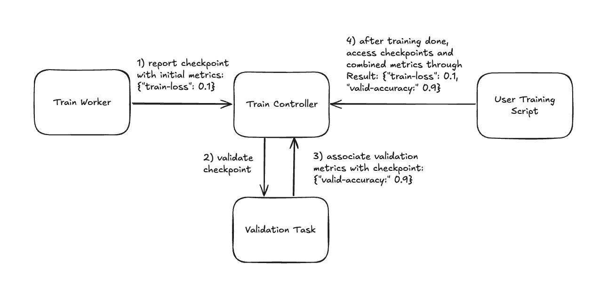

.. _train-validating-checkpoints:

Validating checkpoints asynchronously
=====================================

During training, you may want to validate the model periodically to monitor training progress.
The standard way to do this is to periodically switch between training and validation within
the training loop. Instead, Ray Train allows you to asynchronously validate the model in a
separate Ray task, which has following benefits:

* Running validation in parallel without blocking the training loop
* Running validation on different hardware than training
* Leveraging :ref:`autoscaling <vms-autoscaling>` to launch user-specified machines only for the duration of the validation
* Letting training continue immediately after saving a checkpoint with partial metrics (for example, loss)
  and then receiving validation metrics (for example, accuracy) as soon as they are available. If the initial
  and validated metrics share the same key, the validated metrics overwrite the initial metrics.

Tutorial
--------

First, define a ``validation_fn`` that takes a :class:`ray.train.Checkpoint` to validate
and any number of json-serializable keyword arguments. This function should return a dictionary
of metrics from that validation.
The following is a simple example for teaching purposes only. It is impractical
because the validation task always runs on cpu; for a more realistic example, see
:ref:`train-distributed-validate-fn`.

.. literalinclude:: ../doc_code/asynchronous_validation.py
    :language: python
    :start-after: __validation_fn_simple_start__
    :end-before: __validation_fn_simple_end__

.. note::

    In this example, the validation dataset is a ray.data.Dataset object, which is not
    json-serializable. We therefore include it with the validation_fn closure instead of passing
    it as a keyword argument.

.. warning::

    Don't pass large objects to the ``validation_fn`` because Ray Train runs it as a Ray task and
    serializes all captured variables. Instead, package large objects in the ``Checkpoint`` and
    access them from shared storage later as explained in :ref:`train-checkpointing`.

Next, register your ``validation_fn`` with your trainer by settings its ``validation_config`` argument to a
:class:`ray.train.v2.api.report_config.ValidationConfig` object that contains your ``validation_fn``
and any default keyword arguments you want to pass to your ``validation_fn``.

Next, within your rank 0 worker's training loop, call :func:`ray.train.report` with ``validation``
set to True, which will call your ``validation_fn`` with the default keyword arguments you passed to the trainer.
Alternatively, you can set ``validation`` to a :class:`ray.train.v2.api.report_config.ValidationTaskConfig` object
that contains keyword arguments that will override matching keyword arguments you passed to the trainer. If
``validation`` is False, Ray Train will not run validation.

.. literalinclude:: ../doc_code/asynchronous_validation.py
    :language: python
    :start-after: __validation_fn_report_start__
    :end-before: __validation_fn_report_end__

Finally, after training is done, you can access your checkpoints and their associated metrics with the
:class:`ray.train.Result` object. See :ref:`train-inspect-results` for more details.

.. _train-distributed-validate-fn:

Write a distributed validation function
---------------------------------------

The ``validation_fn`` above runs in a single Ray task, but you can improve its performance by spawning
even more Ray tasks or actors. The Ray team recommends doing this with one of the following approaches:

* Creating a :class:`ray.train.torch.TorchTrainer` that only does validation, not training.
* (Experimental) Using :func:`ray.data.Dataset.map_batches` to calculate metrics on a validation set.

Choose an approach
~~~~~~~~~~~~~~~~~~

You should use ``TorchTrainer`` if:

* You want to keep your existing validation logic and avoid migrating to Ray Data.
  The training function API lets you fully customize the validation loop to match your current setup.
* Your validation code depends on running within a Torch process group — for example, your
  metric aggregation logic uses collective communication calls, or your model parallelism
  setup requires cross-GPU communication during the forward pass.
* You want a more consistent training and validation experience. The ``map_batches`` approach involves
  running multiple Ray Data Datasets in a single ray cluster; we are currently working on better support
  for this.

You should use ``map_batches`` if:

* You care about validation performance. Preliminary benchmarks show that ``map_batches`` is
  faster.
* You prefer Ray Data’s native metric aggregation APIs over PyTorch, where you must implement
  aggregation manually using low-level collective operations or rely on third-party libraries
  such as `torchmetrics <https://lightning.ai/docs/torchmetrics/stable>`_.

Example: validation with Ray Train TorchTrainer
~~~~~~~~~~~~~~~~~~~~~~~~~~~~~~~~~~~~~~~~~~~~~~~

Here is a ``validation_fn`` that uses a ``TorchTrainer`` to calculate average cross entropy
loss on a validation set. Note the following about this example:

* It ``report``\s a dummy checkpoint so that the ``TorchTrainer`` keeps the metrics.
* While you typically use the ``TorchTrainer`` for training, you can use it solely for validation like in this example.
* Because training generally has a higher GPU memory requirement than inference, you can set different
  resource requirements for training and validation, for example, A100 for training and A10G for validation.

.. literalinclude:: ../doc_code/asynchronous_validation.py
    :language: python
    :start-after: __validation_fn_torch_trainer_start__
    :end-before: __validation_fn_torch_trainer_end__

(Experimental) Example: validation with Ray Data map_batches
~~~~~~~~~~~~~~~~~~~~~~~~~~~~~~~~~~~~~~~~~~~~~~~~~~~~~~~~~~~~

The following is a ``validation_fn`` that uses :func:`ray.data.Dataset.map_batches` to
calculate average accuracy on a validation set. To learn more about how to use
``map_batches`` for batch inference, see :ref:`batch_inference_home`.

.. literalinclude:: ../doc_code/asynchronous_validation.py
    :language: python
    :start-after: __validation_fn_map_batches_start__
    :end-before: __validation_fn_map_batches_end__

Checkpoint metrics lifecycle
-----------------------------

During the training loop the following happens to your checkpoints and metrics :

1. You report a checkpoint with some initial metrics, such as training loss, as well as a
   :class:`ray.train.v2.api.report_config.ValidationTaskConfig` object that contains the keyword
   arguments to pass to the ``validation_fn``.
2. Ray Train asynchronously runs your ``validation_fn`` with that checkpoint and configuration.
3. When that validation task completes, Ray Train associates the metrics returned by your ``validation_fn``
   with that checkpoint.
4. After training is done, you can access your checkpoints and their associated metrics with the
   :class:`ray.train.Result` object. See :ref:`train-inspect-results` for more details.

    How Ray Train populates checkpoint metrics during training and how you access them after training.