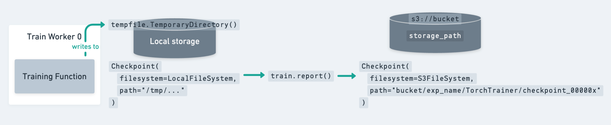
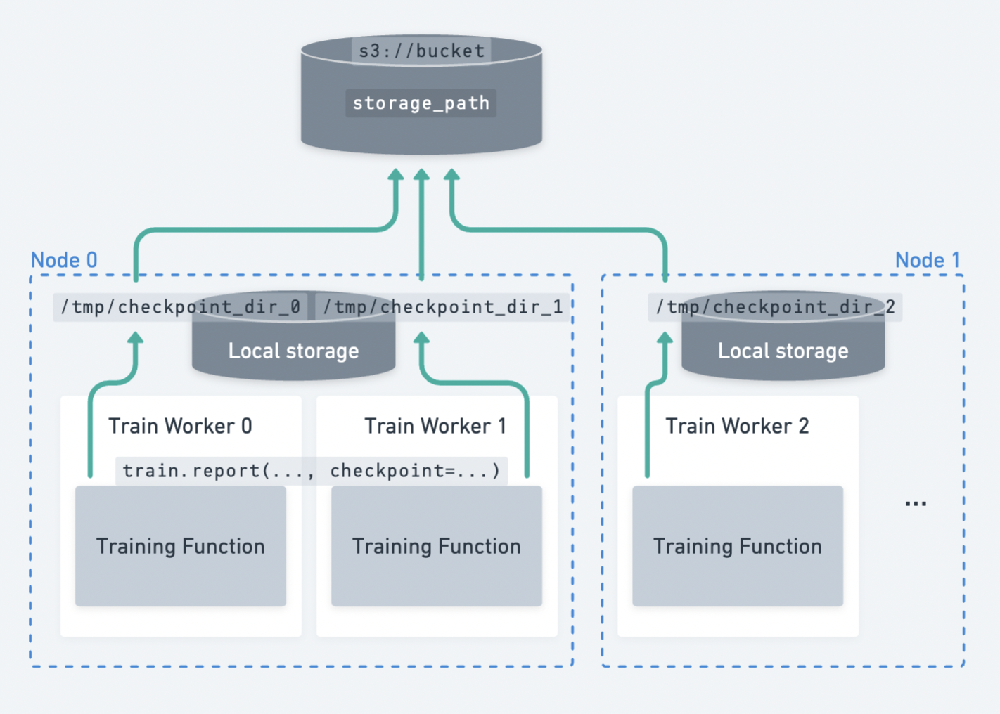

.. _train-checkpointing:

Saving and Loading Checkpoints
==============================

Ray Train provides a way to snapshot training progress with :class:`Checkpoints <ray.train.Checkpoint>`.

This is useful for:

1. **Storing the best-performing model weights:** Save your model to persistent storage, and use it for downstream serving or inference.
2. **Fault tolerance:** Handle worker process and node failures in a long-running training job and leverage pre-emptible machines.
3. **Distributed checkpointing:** Ray Train checkpointing can be used to
   :ref:`upload model shards from multiple workers in parallel. <train-distributed-checkpointing>`

.. _train-dl-saving-checkpoints:

Saving checkpoints during training
----------------------------------

The :class:`Checkpoint <ray.train.Checkpoint>` is a lightweight interface provided
by Ray Train that represents a *directory* that exists on local or remote storage.

For example, a checkpoint could point to a directory in cloud storage:
``s3://my-bucket/my-checkpoint-dir``.
A locally available checkpoint points to a location on the local filesystem:
``/tmp/my-checkpoint-dir``.

Here's how you save a checkpoint in the training loop:

1. Write your model checkpoint to a local directory.

   - Since a :class:`Checkpoint <ray.train.Checkpoint>` just points to a directory, the contents are completely up to you.
   - This means that you can use any serialization format you want.
   - This makes it **easy to use familiar checkpoint utilities provided by training frameworks**, such as
     ``torch.save``, ``pl.Trainer.save_checkpoint``, Accelerate's ``accelerator.save_model``,
     Transformers' ``save_pretrained``, ``tf.keras.Model.save``, etc.

2. Create a :class:`Checkpoint <ray.train.Checkpoint>` from the directory using :meth:`Checkpoint.from_directory <ray.train.Checkpoint.from_directory>`.

3. Report the checkpoint to Ray Train using :func:`ray.train.report(metrics, checkpoint=...) <ray.train.report>`.

   - The metrics reported alongside the checkpoint are used to :ref:`keep track of the best-performing checkpoints <train-dl-configure-checkpoints>`.
   - This will **upload the checkpoint to persistent storage** if configured. See :ref:`persistent-storage-guide`.

    The lifecycle of a :class:`~ray.train.Checkpoint`, from being saved locally
    to disk to being uploaded to persistent storage via ``train.report``.

As shown in the figure above, the best practice for saving checkpoints is to
first dump the checkpoint to a local temporary directory. Then, the call to ``train.report``
uploads the checkpoint to its final persistent storage location.
Then, the local temporary directory can be safely cleaned up to free up disk space
(e.g., from exiting the ``tempfile.TemporaryDirectory`` context).

.. tip::

    In standard DDP training, where each worker has a copy of the full-model, you should
    only save and report a checkpoint from a single worker to prevent redundant uploads.

    This typically looks like:

    .. literalinclude::  ../doc_code/checkpoints.py
        :language: python
        :start-after: __checkpoint_from_single_worker_start__
        :end-before: __checkpoint_from_single_worker_end__

    If using parallel training strategies such as DeepSpeed Zero and FSDP, where
    each worker only has a shard of the full training state, you can save and report a checkpoint
    from each worker. See :ref:`train-distributed-checkpointing` for an example.

Here are a few examples of saving checkpoints with different training frameworks:

.. tab-set::

    .. tab-item:: Native PyTorch

        .. literalinclude:: ../doc_code/checkpoints.py
            :language: python
            :start-after: __pytorch_save_start__
            :end-before: __pytorch_save_end__

        .. tip::

            You most likely want to unwrap the DDP model before saving it to a checkpoint.
            ``model.module.state_dict()`` is the state dict without each key having a ``"module."`` prefix.

    .. tab-item:: PyTorch Lightning

        Ray Train leverages PyTorch Lightning's ``Callback`` interface to report metrics
        and checkpoints. We provide a simple callback implementation that reports
        ``on_train_epoch_end``.

        Specifically, on each train epoch end, it

        - collects all the logged metrics from ``trainer.callback_metrics``
        - saves a checkpoint via ``trainer.save_checkpoint``
        - reports to Ray Train via :func:`ray.train.report(metrics, checkpoint) <ray.train.report>`

        .. literalinclude:: ../doc_code/checkpoints.py
            :language: python
            :start-after: __lightning_save_example_start__
            :end-before: __lightning_save_example_end__

        You can always get the saved checkpoint path from :attr:`result.checkpoint <ray.train.Result>` and
        :attr:`result.best_checkpoints <ray.train.Result>`.

        For more advanced usage (e.g. reporting at different frequency, reporting
        customized checkpoint files), you can implement your own customized callback.
        Here is a simple example that reports a checkpoint every 3 epochs:

        .. literalinclude:: ../doc_code/checkpoints.py
            :language: python
            :start-after: __lightning_custom_save_example_start__
            :end-before: __lightning_custom_save_example_end__

    .. tab-item:: Hugging Face Transformers

        Ray Train leverages HuggingFace Transformers Trainer's ``Callback`` interface
        to report metrics and checkpoints.

        **Option 1: Use Ray Train's default report callback**

        We provide a simple callback implementation :class:`~ray.train.huggingface.transformers.RayTrainReportCallback` that
        reports on checkpoint save. You can change the checkpointing frequency by ``save_strategy`` and ``save_steps``.
        It collects the latest logged metrics and report them together with the latest saved checkpoint.

        .. literalinclude:: ../doc_code/checkpoints.py
            :language: python
            :start-after: __transformers_save_example_start__
            :end-before: __transformers_save_example_end__

        Note that :class:`~ray.train.huggingface.transformers.RayTrainReportCallback`
        binds the latest metrics and checkpoints together,
        so users can properly configure ``logging_strategy``, ``save_strategy`` and ``evaluation_strategy``
        to ensure the monitoring metric is logged at the same step as checkpoint saving.

        For example, the evaluation metrics (``eval_loss`` in this case) are logged during
        evaluation. If users want to keep the best 3 checkpoints according to ``eval_loss``, they
        should align the saving and evaluation frequency. Below are two examples of valid configurations:

        .. testcode::
            :skipif: True

            args = TrainingArguments(
                ...,
                evaluation_strategy="epoch",
                save_strategy="epoch",
            )

            args = TrainingArguments(
                ...,
                evaluation_strategy="steps",
                save_strategy="steps",
                eval_steps=50,
                save_steps=100,
            )

            # And more ...

        **Option 2: Implement your customized report callback**

        If you feel that Ray Train's default :class:`~ray.train.huggingface.transformers.RayTrainReportCallback`
        is not sufficient for your use case, you can also implement a callback yourself!
        Below is a example implementation that collects latest metrics
        and reports on checkpoint save.

        .. literalinclude:: ../doc_code/checkpoints.py
            :language: python
            :start-after: __transformers_custom_save_example_start__
            :end-before: __transformers_custom_save_example_end__

        You can customize when (``on_save``, ``on_epoch_end``, ``on_evaluate``) and
        what (customized metrics and checkpoint files) to report by implementing your own
        Transformers Trainer callback.

.. _train-distributed-checkpointing:

Saving checkpoints from multiple workers (distributed checkpointing)
~~~~~~~~~~~~~~~~~~~~~~~~~~~~~~~~~~~~~~~~~~~~~~~~~~~~~~~~~~~~~~~~~~~~

In model parallel training strategies where each worker only has a shard of the full-model,
you can save and report checkpoint shards in parallel from each worker.

    Distributed checkpointing in Ray Train. Each worker uploads its own checkpoint shard
    to persistent storage independently.

Distributed checkpointing is the best practice for saving checkpoints
when doing model-parallel training (e.g., DeepSpeed, FSDP, Megatron-LM).

There are two major benefits:

1. **It is faster, resulting in less idle time.** Faster checkpointing incentivizes more frequent checkpointing!

   Each worker can upload its checkpoint shard in parallel,
   maximizing the network bandwidth of the cluster. Instead of a single node
   uploading the full model of size ``M``, the cluster distributes the load across
   ``N`` nodes, each uploading a shard of size ``M / N``.

2. **Distributed checkpointing avoids needing to gather the full model onto a single worker's CPU memory.**

   This gather operation puts a large CPU memory requirement on the worker that performs checkpointing
   and is a common source of OOM errors.

Here is an example of distributed checkpointing with PyTorch:

.. literalinclude:: ../doc_code/checkpoints.py
    :language: python
    :start-after: __distributed_checkpointing_start__
    :end-before: __distributed_checkpointing_end__

.. note::

    Checkpoint files with the same name will collide between workers.
    You can get around this by adding a rank-specific suffix to checkpoint files.

    Note that having filename collisions does not error, but it will result in the last
    uploaded version being the one that is persisted. This is fine if the file
    contents are the same across all workers.

    Model shard saving utilities provided by frameworks such as DeepSpeed will create
    rank-specific filenames already, so you usually do not need to worry about this.

.. _train-dl-configure-checkpoints:

Configure checkpointing
-----------------------

Ray Train provides some configuration options for checkpointing via :class:`~ray.train.CheckpointConfig`.
The primary configuration is keeping only the top ``K`` checkpoints with respect to a metric.
Lower-performing checkpoints are deleted to save storage space. By default, all checkpoints are kept.

.. literalinclude:: ../doc_code/key_concepts.py
    :language: python
    :start-after: __checkpoint_config_start__
    :end-before: __checkpoint_config_end__

.. note::

    If you want to save the top ``num_to_keep`` checkpoints with respect to a metric via
    :py:class:`~ray.train.CheckpointConfig`,
    please ensure that the metric is always reported together with the checkpoints.

Using checkpoints after training
--------------------------------

The latest saved checkpoint can be accessed with :attr:`Result.checkpoint <ray.train.Result>`.

The full list of persisted checkpoints can be accessed with :attr:`Result.best_checkpoints <ray.train.Result>`.
If :class:`CheckpointConfig(num_to_keep) <ray.train.CheckpointConfig>` is set, this list will contain the best ``num_to_keep`` checkpoints.

See :ref:`train-inspect-results` for a full guide on inspecting training results.

:meth:`Checkpoint.as_directory <ray.train.Checkpoint.as_directory>`
and :meth:`Checkpoint.to_directory <ray.train.Checkpoint.to_directory>`
are the two main APIs to interact with Train checkpoints:

.. literalinclude:: ../doc_code/checkpoints.py
    :language: python
    :start-after: __inspect_checkpoint_example_start__
    :end-before: __inspect_checkpoint_example_end__

For Lightning and Transformers, if you are using the default `RayTrainReportCallback` for checkpoint saving in your training function,
you can retrieve the original checkpoint files as below:

.. tab-set::

    .. tab-item:: PyTorch Lightning

        .. literalinclude:: ../doc_code/checkpoints.py
            :language: python
            :start-after: __inspect_lightning_checkpoint_example_start__
            :end-before: __inspect_lightning_checkpoint_example_end__

    .. tab-item:: Transformers

        .. literalinclude:: ../doc_code/checkpoints.py
            :language: python
            :start-after: __inspect_transformers_checkpoint_example_start__
            :end-before: __inspect_transformers_checkpoint_example_end__

.. _train-dl-loading-checkpoints:

Restore training state from a checkpoint
----------------------------------------

In order to enable fault tolerance, you should modify your training loop to restore
training state from a :class:`~ray.train.Checkpoint`.

The :class:`Checkpoint <ray.train.Checkpoint>` to restore from can be accessed in the
training function with :func:`ray.train.get_checkpoint <ray.train.get_checkpoint>`.

The checkpoint returned by :func:`ray.train.get_checkpoint <ray.train.get_checkpoint>` is populated
as the latest reported checkpoint during :ref:`automatic failure recovery <train-fault-tolerance>`.

See :ref:`train-fault-tolerance` for more details on restoration and fault tolerance.

.. tab-set::

    .. tab-item:: Native PyTorch

        .. literalinclude:: ../doc_code/checkpoints.py
            :language: python
            :start-after: __pytorch_restore_start__
            :end-before: __pytorch_restore_end__

    .. tab-item:: PyTorch Lightning

        .. literalinclude:: ../doc_code/checkpoints.py
            :language: python
            :start-after: __lightning_restore_example_start__
            :end-before: __lightning_restore_example_end__

.. note::

    In these examples, :meth:`Checkpoint.as_directory <ray.train.Checkpoint.as_directory>`
    is used to view the checkpoint contents as a local directory.

    *If the checkpoint points to a local directory*, this method just returns the
    local directory path without making a copy.

    *If the checkpoint points to a remote directory*, this method will download the
    checkpoint to a local temporary directory and return the path to the temporary directory.

    **If multiple processes on the same node call this method simultaneously,**
    only a single process will perform the download, while the others
    wait for the download to finish. Once the download finishes, all processes receive
    the same local (temporary) directory to read from.

    Once all processes have finished working with the checkpoint, the temporary directory
    is cleaned up.
