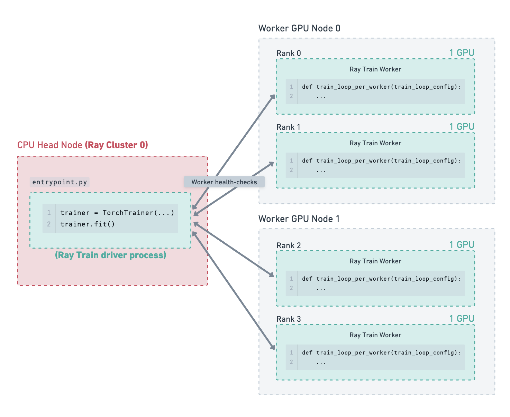

.. _:: ../doc_code:

.. _train-fault-tolerance:

Handling Failures and Node Preemption
=====================================

.. important::
    This user guide shows how to configure fault tolerance for the revamped Ray Train V2
    available starting from Ray 2.43 by enabling the environment variable ``RAY_TRAIN_V2_ENABLED=1``.
    **This user guide assumes that the environment variable has been enabled.**

    Please see :ref:`here <train-fault-tolerance-deprecation-info>` for information about the deprecation and migration.

Ray Train provides fault tolerance at three levels:

1. **Worker process fault tolerance** handles errors that happen to one or more Train worker processes while they are executing the user defined training function.
2. **Worker node fault tolerance** handles node failures that may occur during training.
3. **Job driver fault tolerance** handles the case where Ray Train driver process crashes, and training needs to be kicked off again, possibly from a new cluster.

This user guide covers how to configure and use these fault tolerance mechanisms.

.. _train-worker-fault-tolerance:

Worker Process and Node Fault Tolerance
---------------------------------------

**Worker process failures** are errors that occur within the user defined training function of a training worker,
such as GPU out-of-memory (OOM) errors, cloud storage access errors, or other runtime errors.

**Node failures** are errors that bring down the entire node, including node preemption, OOM, network partitions, or other hardware failures.
This section covers worker node failures. Recovery from head node failures is discussed in the :ref:`next section <train-job-driver-fault-tolerance>`.

Ray Train can be configured to automatically recover from worker process and worker node failures.
When a failure is detected, all the workers are shut down, new nodes are added if necessary, and a new set of workers is started.
The restarted training worker processes can resume training by loading the latest checkpoint.

In order to retain progress upon recovery, your training function
should implement logic for both :ref:`saving <train-dl-saving-checkpoints>`
*and* :ref:`loading checkpoints <train-dl-loading-checkpoints>`.
Otherwise, the training will just start from scratch.

Each recovery from a worker process or node failure is considered a retry. The
number of retries is configurable through the ``max_failures`` attribute of the
:class:`~ray.train.FailureConfig` argument set in the :class:`~ray.train.RunConfig`
passed to the ``Trainer``. By default, worker fault tolerance is disabled with ``max_failures=0``.

.. literalinclude:: ../doc_code/fault_tolerance.py
    :language: python
    :start-after: __failure_config_start__
    :end-before: __failure_config_end__

Altogether, this is what an example Torch training script with worker fault tolerance looks like:

.. literalinclude:: ../doc_code/fault_tolerance.py
    :language: python
    :start-after: __worker_fault_tolerance_start__
    :end-before: __worker_fault_tolerance_end__

Which checkpoint will be restored?
~~~~~~~~~~~~~~~~~~~~~~~~~~~~~~~~~~

Ray Train will populate :func:`ray.train.get_checkpoint() <ray.train.get_checkpoint>` with the latest available
:ref:`checkpoint reported to Ray Train <train-checkpointing>`.
The :class:`~ray.train.Checkpoint` object returned by this method has the
:meth:`~ray.train.Checkpoint.as_directory` and :meth:`~ray.train.Checkpoint.to_directory` methods
to download the checkpoint from the :class:`RunConfig(storage_path) <ray.train.RunConfig>` to local disk.

.. note::
    :meth:`~ray.train.Checkpoint.as_directory` and :meth:`~ray.train.Checkpoint.to_directory`
    will only download the checkpoint once per node even if there are multiple workers on the node.
    The workers share the same checkpoint directory on local disk.

Illustrated Example
~~~~~~~~~~~~~~~~~~~

Consider the following example of a cluster containing a CPU head node and 2 GPU worker nodes.
There are 4 GPU training workers running on the 2 worker nodes.
The :ref:`storage path has been configured <persistent-storage-guide>` to use cloud storage, which is where checkpoints are saved.

    Training has been running for some time, and the latest checkpoint has been saved to cloud storage.

.. figure:: ../images/fault_tolerance/worker_node_failure.png
    :align: left

    One of the worker GPU nodes fails due to a hardware fault. Ray Train detects this failure and shuts down all the workers.
    Since the number of failures detected so far is less than the configured ``max_failures``, Ray Train will attempt to restart training,
    rather than exiting and raising an error.

.. figure:: ../images/fault_tolerance/worker_node_replacement.png
    :align: left

    Ray Train has requested a new worker node to join the cluster and is waiting for it to come up.

.. figure:: ../images/fault_tolerance/worker_group_recovery.png
    :align: left

    The new worker node has joined the cluster.
    Ray Train restarts all the worker processes and provides them with the latest checkpoint.
    The workers download the checkpoint from storage and use it to resume training.

.. _train-restore-guide:
.. _train-job-driver-fault-tolerance:

Job Driver Fault Tolerance
--------------------------

Job driver fault tolerance is to handle cases where the Ray Train driver process is interrupted.
The Ray Train driver process is the process that calls ``trainer.fit()`` and is usually located on the head node of the cluster.

The driver process may be interrupted due to one of the following reasons:

- The run is manually interrupted by a user (e.g., Ctrl+C).
- The node where the driver process is running (head node) crashes (e.g., out of memory, out of disk).
- The entire cluster goes down (e.g., network error affecting all nodes).

In these cases, the Ray Train driver (which calls ``trainer.fit()``) needs to be launched again.
The relaunched Ray Train driver needs to find a minimal amount of run state in order to pick up where the previous run left off.
This state includes the latest reported checkpoints, which are located at the :ref:`storage path <persistent-storage-guide>`.
Ray Train fetches the latest checkpoint information from storage and passes it to the newly launched worker processes to resume training.

To find this run state, Ray Train relies on passing in the **same** :class:`RunConfig(storage_path, name) <ray.train.RunConfig>` pair as the previous run.
If the ``storage_path`` or ``name`` do not match, Ray Train will not be able to find the previous run state and will start a new run from scratch.

.. warning::
    If ``name`` is reused unintentionally, Ray Train will fetch the previous run state, even if the user is trying to start a new run.
    Therefore, always pass a unique run name when launching a new run. In other words, ``name`` should be a unique identifier for a training job.

.. note::
    Job driver crashes and interrupts do not count toward the ``max_failures`` limit of :ref:`worker fault tolerance <train-worker-fault-tolerance>`.

Here's an example training script that highlights best practices for job driver fault tolerance:

.. literalinclude:: ../doc_code/fault_tolerance.py
    :language: python
    :start-after: __job_driver_fault_tolerance_start__
    :end-before: __job_driver_fault_tolerance_end__

Then, the entrypoint script can be launched with the following command:

.. code-block:: bash

    python entrypoint.py --storage_path s3://my_bucket/ --run_name unique_run_id=da823d5

If the job is interrupted, the same command can be used to resume training.
This example shows a ``da823d5`` id, which is determined by the one launching the job. The id can often be used for other purposes such as setting the ``wandb`` or ``mlflow`` run id.

Illustrated Example
~~~~~~~~~~~~~~~~~~~

Consider the following example of a cluster containing a CPU head node and 2 GPU worker nodes. There are 4 GPU training workers running on the 2 worker nodes. The storage path has been configured to use cloud storage, which is where checkpoints are saved.

    Training has been running for some time, and the latest checkpoints and run state has been saved to storage.

    The head node crashes for some reason (e.g., an out-of-memory error), and the Ray Train driver process is interrupted.

.. figure:: ../images/fault_tolerance/cluster_failure.png
    :align: left

    The entire cluster goes down due to the head node failure.

    A manual cluster restart or some job submission system brings up a new Ray cluster.
    The Ray Train driver process runs on a new head node.
    Ray Train fetches the run state information from storage at ``{storage_path}/{name}`` (e.g., ``s3://my_bucket/my_run_name``)
    and passes the latest checkpoint to the newly launched worker processes to resume training.

.. _train-fault-tolerance-deprecation-info:

Fault Tolerance API Deprecations
--------------------------------

``<Framework>Trainer.restore`` API Deprecation 
~~~~~~~~~~~~~~~~~~~~~~~~~~~~~~~~~~~~~~~~~~~~~~

The ``<Framework>Trainer.restore`` and ``<Framework>Trainer.can_restore`` APIs are deprecated as of Ray 2.43 and will be removed in a future release. 

Motivation
**********

This API change provides several benefits:

1. **Avoid saving user code to pickled files**: The old API saved user code to pickled files, which could lead to issues with deserialization, leading to unrecoverable runs.
2. **Improved configuration experience**: While some configurations were loaded from the pickled files, certain arguments were required to be re-specified, and another subset of arguments could even be optionally re-specified. This confused users about the set of configurations that are actually being used in the restored run.

Migration Steps
***************

To migrate from the old ``<Framework>Trainer.restore`` API to the new pattern:

1. Enable the environment variable ``RAY_TRAIN_V2_ENABLED=1``.
2. Replace ``<Framework>Trainer.restore`` with the regular ``<Framework>Trainer`` constructor, making sure to pass in the same ``storage_path`` and ``name`` as the previous run.

``<Framework>Trainer(restore_from_checkpoint)`` API Deprecation
~~~~~~~~~~~~~~~~~~~~~~~~~~~~~~~~~~~~~~~~~~~~~~~~~~~~~~~~~~~~~~~

The ``<Framework>Trainer(restore_from_checkpoint)`` API is deprecated as of Ray 2.43 and will be removed in a future release.

Motivation
**********

This API was a common source of confusion that provided minimal value. It was only used to set the initial value of ``ray.train.get_checkpoint()`` but did not load any other run state.

Migration Steps
***************

Simply pass in the initial checkpoint through the ``train_loop_config`` argument. See the migration guide linked below for a code example.

Additional Resources
~~~~~~~~~~~~~~~~~~~~

* `Train V2 Migration Guide <https://github.com/ray-project/ray/issues/49454>`_: Full migration guide for Train V2
* `Train V2 REP <https://github.com/ray-project/enhancements/blob/main/reps/2024-10-18-train-tune-api-revamp/2024-10-18-train-tune-api-revamp.md>`_: Technical details about the API change
* :ref:`train-fault-tolerance-deprecated-api`: Documentation for the old API
