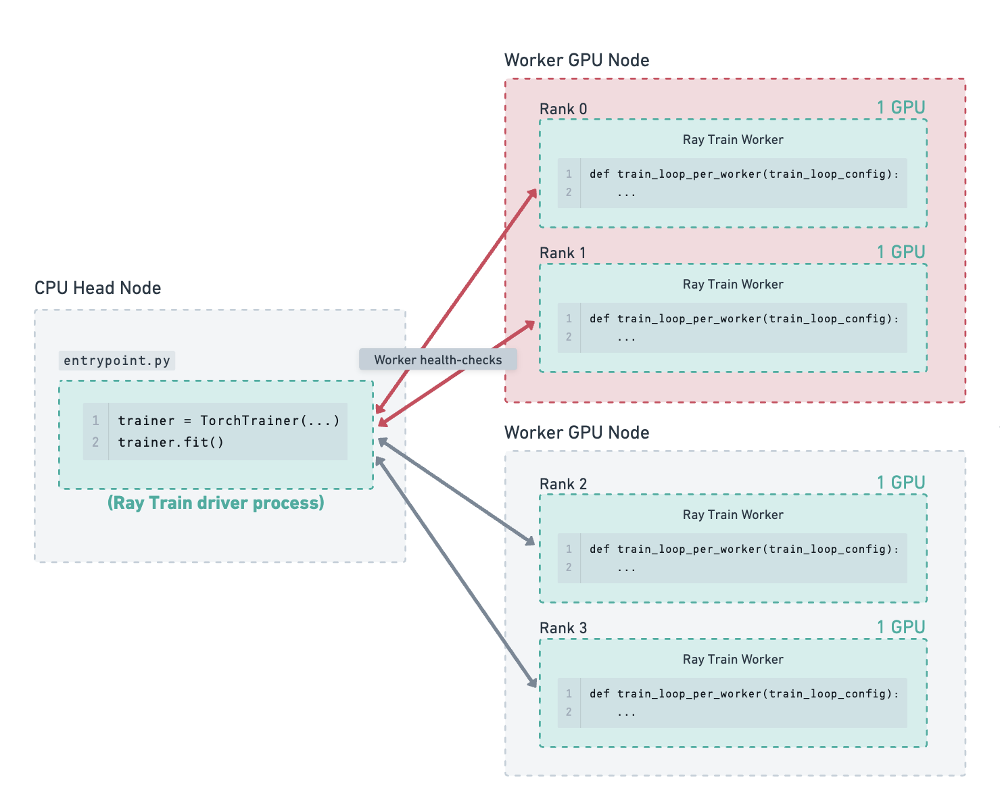
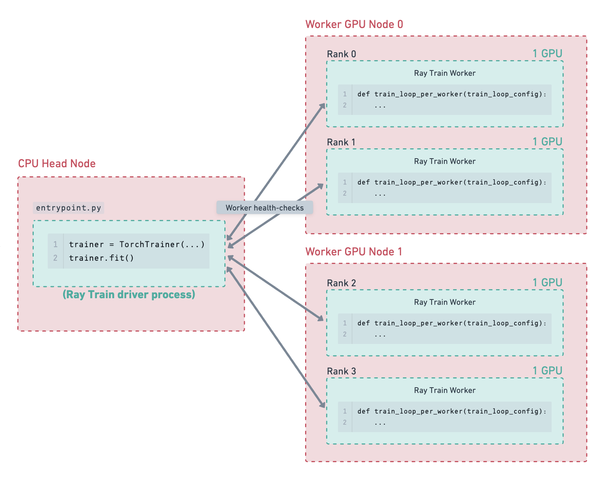

.. _:: ../doc_code:

.. _train-fault-tolerance:

Handling Failures and Node Preemption
=====================================

Ray Train provides fault tolerance at three levels:

1. **Worker process fault tolerance** handles errors that happen to one or more Train worker processes while they are executing the user defined training function.
2. **Worker node fault tolerance** handles node failures that may occur during training.
3. **Cluster fault tolerance** handles the case where the entire Ray cluster crashes, and training needs to be kicked off again.

Worker Process and Node Fault Tolerance
---------------------------------------

**Worker process failures** are errors that occur within the user defined training function of a training worker,
such as GPU out-of-memory (OOM) errors, cloud storage access errors, or other runtime errors.

**Node failures** are errors that bring down the entire node, including node preemption, OOM, network partitions, or other hardware failures.
This section covers worker node failures. Recovery from head node failures is discussed in the :ref:`next section <train-cluster-fault-tolerance>`.

Ray Train can be configured to automatically recover from worker process and worker node failures.
When a failure is detected, all the workers are shut down, new nodes are added if necessary, and a new set of workers is started.
The restarted training worker processes can resume training by loading the latest checkpoint.

In order to retain progress upon recovery, your training function
should implement logic for both :ref:`saving <train-dl-saving-checkpoints>`
*and* :ref:`loading checkpoints <train-dl-loading-checkpoints>`.
Otherwise, the training will just start from scratch.

Each recovery from a worker process or node failure is considered a retry. The
number of retries is configurable through the ``max_failures`` attribute of the
:class:`~ray.train.FailureConfig` argument set in the :class:`~ray.train.RunConfig`
passed to the ``Trainer``. By default, worker fault tolerance is disabled with ``max_failures=0``.

.. literalinclude:: ../doc_code/fault_tolerance.py
    :language: python
    :start-after: __failure_config_start__
    :end-before: __failure_config_end__

Altogether, this is what an example Torch training script with worker fault tolerance looks like:

.. literalinclude:: ../doc_code/fault_tolerance.py
    :language: python
    :start-after: __worker_fault_tolerance_start__
    :end-before: __worker_fault_tolerance_end__

Which checkpoint will be restored?
~~~~~~~~~~~~~~~~~~~~~~~~~~~~~~~~~~

Ray Train will populate :func:`ray.train.get_checkpoint() <ray.train.get_checkpoint>` with the latest available
:ref:`checkpoint reported to Ray Train <train-checkpointing>`.
The :class:`~ray.train.Checkpoint` object returned by this method has the
:meth:`~ray.train.Checkpoint.as_directory` and :meth:`~ray.train.Checkpoint.to_directory` methods
to download the checkpoint from the :class:`RunConfig(storage_path) <ray.train.RunConfig>` to local disk.

.. note::
    :meth:`~ray.train.Checkpoint.as_directory` and :meth:`~ray.train.Checkpoint.to_directory`
    will only download the checkpoint once per node even if there are multiple workers on the node.
    The workers share the same checkpoint directory on local disk.

Illustrated Example
~~~~~~~~~~~~~~~~~~~

    ABCDEFG

.. figure:: ../images/fault_tolerance/worker_node_replacement.png
    :align: center

    ABCDEFG

.. figure:: ../images/fault_tolerance/resume_from_checkpoint.png
    :align: center

    ABCDEFG

.. _train-restore-guide:
.. _train-cluster-fault-tolerance:

Restore a Ray Train Experiment
------------------------------

At the experiment level, Trainer restoration
allows you to resume a previously interrupted experiment from where it left off.

A Train experiment may be interrupted due to one of the following reasons:

- The experiment was manually interrupted (e.g., Ctrl+C, or pre-empted head node instance).
- The head node crashed (e.g., OOM or some other runtime error).
- The entire cluster went down (e.g., network error affecting all nodes).

Trainer restoration is possible for all of Ray Train's built-in trainers,
but we use ``TorchTrainer`` in the examples for demonstration.
We also use ``<Framework>Trainer`` to refer to methods that are shared across all
built-in trainers.

Let's say your initial Train experiment is configured as follows.
The actual training loop is just for demonstration purposes: the important detail is that
:ref:`saving <train-dl-saving-checkpoints>` *and* :ref:`loading checkpoints <train-dl-loading-checkpoints>`
has been implemented.

.. literalinclude:: ../doc_code/dl_guide.py
    :language: python
    :start-after: __ft_initial_run_start__
    :end-before: __ft_initial_run_end__

The results and checkpoints of the experiment are saved to the path configured by :class:`~ray.train.RunConfig`.
If the experiment has been interrupted due to one of the reasons listed above, use this path to resume:

.. literalinclude:: ../doc_code/dl_guide.py
    :language: python
    :start-after: __ft_restored_run_start__
    :end-before: __ft_restored_run_end__

.. tip::

    You can also restore from a remote path (e.g., from an experiment directory stored in a s3 bucket).

    .. literalinclude:: ../doc_code/dl_guide.py
        :language: python
        :dedent:
        :start-after: __ft_restore_from_cloud_initial_start__
        :end-before: __ft_restore_from_cloud_initial_end__

    .. literalinclude:: ../doc_code/dl_guide.py
        :language: python
        :dedent:
        :start-after: __ft_restore_from_cloud_restored_start__
        :end-before: __ft_restore_from_cloud_restored_end__

.. note::

    Different trainers may allow more parameters to be optionally re-specified on restore.
    Only **datasets** are required to be re-specified on restore, if they were supplied originally.

    `TorchTrainer.restore`, `TensorflowTrainer.restore`, and `HorovodTrainer.restore`
    can take in the same parameters as their parent class's
    :meth:`DataParallelTrainer.restore <ray.train.data_parallel_trainer.DataParallelTrainer.restore>`.

    Unless otherwise specified, other trainers will accept the same parameters as
    :meth:`BaseTrainer.restore <ray.train.trainer.BaseTrainer.restore>`.

Auto-resume
~~~~~~~~~~~

Adding the branching logic below will allow you to run the same script after the interrupt,
picking up training from where you left on the previous run. Notice that we use the
:meth:`<Framework>Trainer.can_restore <ray.train.trainer.BaseTrainer.can_restore>` utility method
to determine the existence and validity of the given experiment directory.

.. literalinclude:: ../doc_code/dl_guide.py
    :language: python
    :start-after: __ft_autoresume_start__
    :end-before: __ft_autoresume_end__

.. seealso::

    See the :meth:`BaseTrainer.restore <ray.train.trainer.BaseTrainer.restore>` docstring
    for a full example.

.. note::

    `<Framework>Trainer.restore` is different from
    :class:`<Framework>Trainer(..., resume_from_checkpoint=...) <ray.train.trainer.BaseTrainer>`.
    `resume_from_checkpoint` is meant to be used to start a *new* Train experiment,
    which writes results to a new directory and starts over from iteration 0.

    `<Framework>Trainer.restore` is used to continue an existing experiment, where
    new results will continue to be appended to existing logs.

Illustrated Example
~~~~~~~~~~~~~~~~~~~

.. figure:: ../images/fault_tolerance/head_node_failure.png
    :align: center

    ABCDEFG

    ABCDEFG

.. figure:: ../images/fault_tolerance/cluster_restart.png
    :align: center

    ABCDEFG