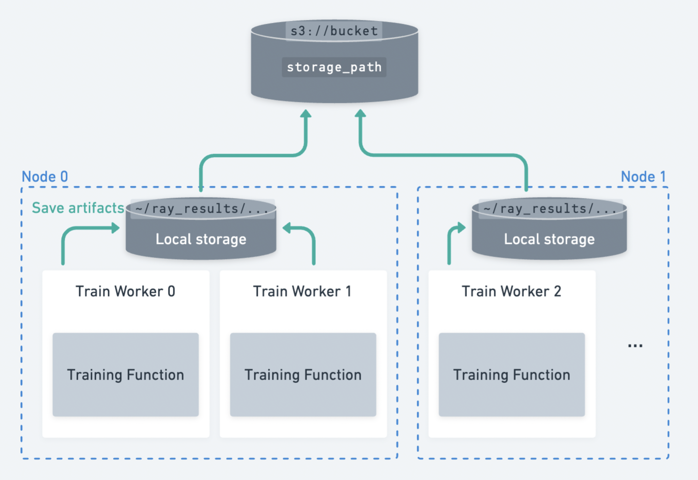

.. _persistent-storage-guide:

.. _train-log-dir:

Configuring Persistent Storage
==============================

A Ray Train run produces a history of :ref:`reported metrics <train-monitoring-and-logging>`,
:ref:`checkpoints <train-checkpointing>`, and :ref:`other artifacts <train-artifacts>`.
You can configure these to be saved to a persistent storage location.

.. figure:: ../images/persistent_storage_checkpoint.png
    :align: center
    :width: 600px

    An example of multiple workers spread across multiple nodes uploading checkpoints to persistent storage.

**Ray Train expects all workers to be able to write files to the same persistent storage location.**
Therefore, Ray Train requires some form of external persistent storage such as
cloud storage (e.g., S3, GCS) or a shared filesystem (e.g., AWS EFS, Google Filestore, HDFS)
for multi-node training.

Here are some capabilities that persistent storage enables:

- **Checkpointing and fault tolerance**: Saving checkpoints to a persistent storage location
  allows you to resume training from the last checkpoint in case of a node failure.
  See :ref:`train-checkpointing` for a detailed guide on how to set up checkpointing.
- **Post-experiment analysis**: A consolidated location storing data from all trials is useful for post-experiment analysis
  such as accessing the best checkpoints and hyperparameter configs after the cluster has already been terminated.
- **Bridge training/fine-tuning with downstream serving and batch inference tasks**: You can easily access the models
  and artifacts to share them with others or use them in downstream tasks.

Cloud storage (AWS S3, Google Cloud Storage)
--------------------------------------------

.. tip::

    Cloud storage is the recommended persistent storage option.

Use cloud storage by specifying a bucket URI as the :class:`RunConfig(storage_path) <ray.train.RunConfig>`:

.. testcode::
    :skipif: True

    from ray import train
    from ray.train.torch import TorchTrainer

    trainer = TorchTrainer(
        ...,
        run_config=train.RunConfig(
            storage_path="s3://bucket-name/sub-path/",
            name="experiment_name",
        )
    )

Ensure that all nodes in the Ray cluster have access to cloud storage, so outputs from workers can be uploaded to a shared cloud bucket.
In this example, all files are uploaded to shared storage at ``s3://bucket-name/sub-path/experiment_name`` for further processing.

Shared filesystem (NFS, HDFS)
-----------------------------

Use by specifying the shared storage path as the :class:`RunConfig(storage_path) <ray.train.RunConfig>`:

.. testcode::
    :skipif: True

    from ray import train
    from ray.train.torch import TorchTrainer

    trainer = TorchTrainer(
        ...,
        run_config=train.RunConfig(
            storage_path="/mnt/cluster_storage",
            # HDFS example:
            # storage_path=f"hdfs://{hostname}:{port}/subpath",
            name="experiment_name",
        )
    )

Ensure that all nodes in the Ray cluster have access to the shared filesystem, e.g. AWS EFS, Google Cloud Filestore, or HDFS,
so that outputs can be saved to there.
In this example, all files are saved to ``/mnt/cluster_storage/experiment_name`` for further processing.

Local storage
-------------

Using local storage for a single-node cluster
~~~~~~~~~~~~~~~~~~~~~~~~~~~~~~~~~~~~~~~~~~~~~

If you're just running an experiment on a single node (e.g., on a laptop), Ray Train will use the
local filesystem as the storage location for checkpoints and other artifacts.
Results are saved to ``~/ray_results`` in a sub-directory with a unique auto-generated name by default,
unless you customize this with ``storage_path`` and ``name`` in :class:`~ray.train.RunConfig`.

.. testcode::
    :skipif: True

    from ray import train
    from ray.train.torch import TorchTrainer

    trainer = TorchTrainer(
        ...,
        run_config=train.RunConfig(
            storage_path="/tmp/custom/storage/path",
            name="experiment_name",
        )
    )

In this example, all experiment results can found locally at ``/tmp/custom/storage/path/experiment_name`` for further processing.

.. _multinode-local-storage-warning:

Using local storage for a multi-node cluster
~~~~~~~~~~~~~~~~~~~~~~~~~~~~~~~~~~~~~~~~~~~~

.. warning::

    When running on multiple nodes, using the local filesystem of the head node as the persistent storage location is no longer supported.

    If you save checkpoints with :meth:`ray.train.report(..., checkpoint=...) <ray.train.report>`
    and run on a multi-node cluster, Ray Train will raise an error if NFS or cloud storage is not setup.
    This is because Ray Train expects all workers to be able to write the checkpoint to
    the same persistent storage location.

    If your training loop does not save checkpoints, the reported metrics will still
    be aggregated to the local storage path on the head node.

    See `this issue <https://github.com/ray-project/ray/issues/37177>`_ for more information.

.. _custom-storage-filesystem:

Custom storage
--------------

If the cases above don't suit your needs, Ray Train can support custom filesystems and perform custom logic.
Ray Train standardizes on the ``pyarrow.fs.FileSystem`` interface to interact with storage
(`see the API reference here <https://arrow.apache.org/docs/python/generated/pyarrow.fs.FileSystem.html>`_).

By default, passing ``storage_path=s3://bucket-name/sub-path/`` will use pyarrow's
`default S3 filesystem implementation <https://arrow.apache.org/docs/python/generated/pyarrow.fs.S3FileSystem.html>`_
to upload files. (`See the other default implementations. <https://arrow.apache.org/docs/python/api/filesystems.html#filesystem-implementations>`_)

Implement custom storage upload and download logic by providing an implementation of
``pyarrow.fs.FileSystem`` to :class:`RunConfig(storage_filesystem) <ray.train.RunConfig>`.

.. warning::

    When providing a custom filesystem, the associated ``storage_path`` is expected
    to be a qualified filesystem path *without the protocol prefix*.

    For example, if you provide a custom S3 filesystem for ``s3://bucket-name/sub-path/``,
    then the ``storage_path`` should be ``bucket-name/sub-path/`` with the ``s3://`` stripped.
    See the example below for example usage.

.. testcode::
    :skipif: True

    import pyarrow.fs

    from ray import train
    from ray.train.torch import TorchTrainer

    fs = pyarrow.fs.S3FileSystem(
        endpoint_override="http://localhost:9000",
        access_key=...,
        secret_key=...
    )

    trainer = TorchTrainer(
        ...,
        run_config=train.RunConfig(
            storage_filesystem=fs,
            storage_path="bucket-name/sub-path",
            name="experiment_name",
        )
    )

``fsspec`` filesystems
~~~~~~~~~~~~~~~~~~~~~~~

`fsspec <https://filesystem-spec.readthedocs.io/en/latest/>`_ offers many filesystem implementations,
such as ``s3fs``, ``gcsfs``, etc.

You can use any of these implementations by wrapping the ``fsspec`` filesystem with a ``pyarrow.fs`` utility:

.. testcode::
    :skipif: True

    # Make sure to install: `pip install -U s3fs`
    import s3fs
    import pyarrow.fs

    s3_fs = s3fs.S3FileSystem(
        key='miniokey...',
        secret='asecretkey...',
        endpoint_url='https://...'
    )
    custom_fs = pyarrow.fs.PyFileSystem(pyarrow.fs.FSSpecHandler(s3_fs))

    run_config = RunConfig(storage_path="minio_bucket", storage_filesystem=custom_fs)

.. seealso::

    See the API references to the ``pyarrow.fs`` wrapper utilities:

    * https://arrow.apache.org/docs/python/generated/pyarrow.fs.PyFileSystem.html
    * https://arrow.apache.org/docs/python/generated/pyarrow.fs.FSSpecHandler.html

MinIO and other S3-compatible storage
~~~~~~~~~~~~~~~~~~~~~~~~~~~~~~~~~~~~~

You can follow the :ref:`examples shown above <custom-storage-filesystem>` to configure
a custom S3 filesystem to work with MinIO.

Note that including these as query parameters in the ``storage_path`` URI directly is another option:

.. testcode::
    :skipif: True

    from ray import train
    from ray.train.torch import TorchTrainer

    trainer = TorchTrainer(
        ...,
        run_config=train.RunConfig(
            storage_path="s3://bucket-name/sub-path?endpoint_override=http://localhost:9000",
            name="experiment_name",
        )
    )

Overview of Ray Train outputs
-----------------------------

So far, we covered how to configure the storage location for Ray Train outputs.
Let's walk through a concrete example to see what exactly these outputs are,
and how they're structured in storage.

.. seealso::

    This example includes checkpointing, which is covered in detail in :ref:`train-checkpointing`.

.. testcode::
    :skipif: True

    import os
    import tempfile

    from ray import train
    from ray.train import Checkpoint
    from ray.train.torch import TorchTrainer

    def train_fn(config):
        for i in range(10):
            # Training logic here

            metrics = {"loss": ...}

            # Save arbitrary artifacts to the working directory
            rank = train.get_context().get_world_rank()
            with open(f"artifact-rank={rank}-iter={i}.txt", "w") as f:
                f.write("data")

            with tempfile.TemporaryDirectory() as temp_checkpoint_dir:
                torch.save(..., os.path.join(temp_checkpoint_dir, "checkpoint.pt"))
                train.report(
                    metrics,
                    checkpoint=Checkpoint.from_directory(temp_checkpoint_dir)
                )

    trainer = TorchTrainer(
        train_fn,
        scaling_config=train.ScalingConfig(num_workers=2),
        run_config=train.RunConfig(
            storage_path="s3://bucket-name/sub-path/",
            name="experiment_name",
            sync_config=train.SyncConfig(sync_artifacts=True),
        )
    )
    result: train.Result = trainer.fit()
    last_checkpoint: Checkpoint = result.checkpoint

Here's a rundown of all files that will be persisted to storage:

.. code-block:: text

    s3://bucket-name/sub-path (RunConfig.storage_path)
    └── experiment_name (RunConfig.name)          <- The "experiment directory"
        ├── experiment_state-*.json
        ├── basic-variant-state-*.json
        ├── trainer.pkl
        ├── tuner.pkl
        └── TorchTrainer_46367_00000_0_...        <- The "trial directory"
            ├── events.out.tfevents...            <- Tensorboard logs of reported metrics
            ├── result.json                       <- JSON log file of reported metrics
            ├── checkpoint_000000/                <- Checkpoints
            ├── checkpoint_000001/
            ├── ...
            ├── artifact-rank=0-iter=0.txt        <- Worker artifacts (see the next section)
            ├── artifact-rank=1-iter=0.txt
            └── ...

The :class:`~ray.train.Result` and :class:`~ray.train.Checkpoint` objects returned by
``trainer.fit`` are the easiest way to access the data in these files:

.. testcode::
    :skipif: True

    result.filesystem, result.path
    # S3FileSystem, "bucket-name/sub-path/experiment_name/TorchTrainer_46367_00000_0_..."

    result.checkpoint.filesystem, result.checkpoint.path
    # S3FileSystem, "bucket-name/sub-path/experiment_name/TorchTrainer_46367_00000_0_.../checkpoint_000009"

See :ref:`train-inspect-results` for a full guide on interacting with training :class:`Results <ray.train.Result>`.

.. _train-artifacts:

Persisting training artifacts
~~~~~~~~~~~~~~~~~~~~~~~~~~~~~

In the example above, we saved some artifacts within the training loop to the worker's
*current working directory*.
If you were training a stable diffusion model, you could save
some sample generated images every so often as a training artifact.

By default, the worker's current working directory is set to the local version of the "trial directory."
For example, ``~/ray_results/experiment_name/TorchTrainer_46367_00000_0_...`` in the example above.

If :class:`RunConfig(SyncConfig(sync_artifacts=True)) <ray.train.SyncConfig>`, then
all artifacts saved in this directory will be persisted to storage.

The frequency of artifact syncing can be configured via :class:`SyncConfig <ray.train.SyncConfig>`.
Note that this behavior is off by default.

    Multiple workers spread across multiple nodes save artifacts to their local
    working directory, which is then persisted to storage.

.. warning::

    Artifacts saved by *every worker* will be synced to storage. If you have multiple workers
    co-located on the same node, make sure that workers don't delete files within their
    shared working directory.

    A best practice is to only write artifacts from a single worker unless you
    really need artifacts from multiple.

    .. testcode::
        :skipif: True

        from ray import train

        if train.get_context().get_world_rank() == 0:
            # Only the global rank 0 worker saves artifacts.
            ...

        if train.get_context().get_local_rank() == 0:
            # Every local rank 0 worker saves artifacts.
            ...

Advanced configuration
----------------------

Setting the intermediate local directory
~~~~~~~~~~~~~~~~~~~~~~~~~~~~~~~~~~~~~~~~

When a ``storage_path`` is specified, training outputs are saved to an
*intermediate local directory*, then persisted (copied/uploaded) to the ``storage_path``.
By default, this intermediate local directory is a sub-directory of ``~/ray_results``.

Customize this intermediate local directory with the ``RAY_AIR_LOCAL_CACHE_DIR`` environment variable:

.. testcode::
    :skipif: True

    import os
    os.environ["RAY_AIR_LOCAL_CACHE_DIR"] = "/tmp/custom/"

    ...

.. _train-ray-storage:

Automatically setting up persistent storage
~~~~~~~~~~~~~~~~~~~~~~~~~~~~~~~~~~~~~~~~~~~

You can control where to store training results with the ``RAY_STORAGE``
environment variable.

For instance, if you set ``RAY_STORAGE="s3://my_bucket/train_results"``, your
results will automatically persisted there.

If you manually set a :attr:`RunConfig.storage_path <ray.train.RunConfig.storage_path>`, it
will take precedence over this environment variable.
