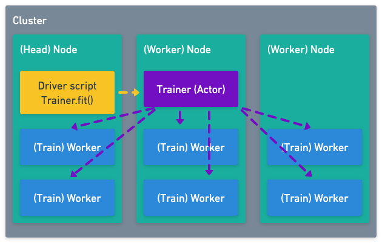

.. _train_scaling_config:

Configuring Scale and GPUs
==========================
Increasing the scale of a Ray Train training run is simple and can often
be done in a few lines of code.

The main interface for configuring scale and resources
is the :class:`~ray.train.ScalingConfig`.

Key concepts
------------
To understand how to configure scale best, this sections reviews concepts that relate
to Ray clusters and distributed training.

- **Cluster**: This is the :ref:`Ray cluster <cluster-index>` on which the training is
  executed. There is only one Ray cluster your code interacts with.
- **Node**: A node is one machine connected to the Ray cluster.
  For instance, this can be a Physical Machine, a Virtual Machine, or a Kubernetes Pod.
  The :ref:`Head Node <cluster-head-node>` is usually where you
  execute your script (but you can also execute it on any other node).
  The cluster can comprise of one to many hundreds of nodes. Each node has specific
  :ref:`Resources <core-resources>`, such as CPUs, GPUs, memory, or
  :ref:`custom resources <custom-resources>`.
- **Driver**: This is the script you are executing. It's called the driver as it is
  responsible for scheduling the Ray actors and tasks (it's "driving" the execution).
- **Trainer**: The trainer object you instantiate in Ray Train. This lives in two
  places: First, you create it in the Driver script. Then, when you call
  :meth:`Trainer.fit() <ray.train.trainer.BaseTrainer.fit>`, a copy will be
  created as a :ref:`Ray Actor <actor-key-concept>`.
- **(Train) Worker**: In the context of Ray Train, we often refer to training workers.
  Technically, these are also :ref:`Ray Actors <actor-key-concept>` that execute
  your training loop. You can specify an arbitrary number of workers. The number of workers
  can be more or less than the number of nodes. In the figure, we show two
  training workers per node.

Unfortunately, the term "worker" is used differently in different contexts. In Ray
Train, a "Worker" will always be a "Training worker" (an Actor executing your training
loop), unless we explicitly refer to a "Worker node".

Configuring scale in Ray Train (``ScalingConfig``)
--------------------------------------------------

Ray Train's :class:`~ray.train.ScalingConfig` configures the number of training workers
and the resources they should use. If the Trainer actor requires specific resources,
these can also be defined here.

The properties of the scaling configuration are :ref:`tunable <tune-search-space-tutorial>`.

.. literalinclude:: ../doc_code/key_concepts.py
    :language: python
    :start-after: __scaling_config_start__
    :end-before: __scaling_config_end__

.. seealso::

    See the :class:`~ray.train.ScalingConfig` API reference.

Increasing the number of workers
--------------------------------
The main interface to control parallelism in your training code is to set the
number of workers. This can be done by passing the ``num_workers`` attribute to
the :class:`~ray.train.ScalingConfig`:

.. code-block:: python

    from ray.train import ScalingConfig

    scaling_config = ScalingConfig(
        num_workers=8
    )

Using GPUs
----------
To use GPUs, pass ``use_gpu=True`` to the :class:`~ray.train.ScalingConfig`.
This will request one GPU per training worker. In the example below, training will
run on 8 GPUs (8 workers, each using one GPU).

.. code-block:: python

    from ray.train import ScalingConfig

    scaling_config = ScalingConfig(
        num_workers=8,
        use_gpu=True
    )

More resources
--------------
If you want to allocate more than one CPU or GPU per training worker, or if you
defined :ref:`custom cluster resources <cluster-resources>`, set
the ``resources_per_worker`` attribute:

.. code-block:: python

    from ray.train import ScalingConfig

    scaling_config = ScalingConfig(
        num_workers=8,
        resources_per_worker={
            "CPU": 4,
            "GPU": 2,
        }
        use_gpu=True,
    )

Note that if you specify GPUs in ``resources_per_worker``, you also need to keep
``use_gpu=True``.

You can also instruct Ray Train to use fractional GPUs. In that case, multiple workers
will be assigned the same CUDA device.

.. code-block:: python

    from ray.train import ScalingConfig

    scaling_config = ScalingConfig(
        num_workers=8,
        resources_per_worker={
            "CPU": 4,
            "GPU": 0.5,
        }
        use_gpu=True,
    )

Using GPUs in training code
~~~~~~~~~~~~~~~~~~~~~~~~~~~
When ``use_gpu=True`` is set, Ray Train will automatically set up environment variables
in your training loop so that the GPUs can be detected and used
(e.g. ``CUDA_VISIBLE_DEVICES``).

You can get the associated devices with :meth:`ray.train.torch.get_device`.

.. code-block:: python

    import torch
    from ray.train import ScalingConfig
    from ray.train.torch import TorchTrainer, get_device

    def train_loop(config):
        assert torch.cuda.is_available()

        device = get_device()
        assert device == torch.device("cuda:0")

    trainer = TorchTrainer(
        train_loop,
        scaling_config=ScalingConfig(
            num_workers=1,
            use_gpu=True
        )
    )
    trainer.fit()

Setting the communication backend
---------------------------------
You can set the PyTorch distributed communication backend (e.g. GLOO or NCCL) by passing a
:class:`~ray.train.torch.TorchConfig` to the :class:`~ray.train.torch.TorchTrainer`.

See the `PyTorch API reference <https://pytorch.org/docs/stable/distributed.html#torch.distributed.init_process_group>`__
for valid options.

.. code-block:: python

    from ray.train.torch import TorchConfig, TorchTrainer

    trainer = TorchTrainer(
        train_func,
        scaling_config=ScalingConfig(
            num_workers=num_training_workers,
            use_gpu=True,
        ),
        torch_config=TorchConfig(backend="gloo"),
    )

Trainer resources
-----------------
So far we've configured resources for each training worker. Technically, each
training worker is a :ref:`Ray Actor <actor-guide>`. Ray Train also schedules
an actor for the :class:`Trainer <ray.train.trainer.BaseTrainer>` object.

This object often only manages lightweight communication between the training workers.
You can still specify its resources, which can be useful if you implemented your own
Trainer that does heavier processing.

.. code-block:: python

    from ray.train import ScalingConfig

    scaling_config = ScalingConfig(
        num_workers=8,
        trainer_resources={
            "CPU": 4,
            "GPU": 1,
        }
    )

Per default, a trainer uses 1 CPU. If you have a cluster with 8 CPUs and want
to start 4 training workers a 2 CPUs, this will not work, as the total number
of required CPUs will be 9 (4 * 2 + 1). In that case, you can specify the trainer
resources to use 0 CPUs:

.. code-block:: python

    from ray.train import ScalingConfig

    scaling_config = ScalingConfig(
        num_workers=4,
        resources_per_worker={
            "CPU": 2,
        },
        trainer_resources={
            "CPU": 0,
        }
    )

.. _train-resource-guide

How many nodes, workers, and resources should I use?
----------------------------------------------------
The answer to this question depends heavily on the kind of cluster you're running on
and the training job itself.

For instance, the data type and size can influence the number of nodes you should
use, and the number of workers per node.

If you're utilizing GPUs for training, the availability and type of GPU instances
can influence the choice of nodes.

There are a few questions you should ask yourself:

- How much data are you training on?
- How much of the training data needs to fit into memory?
- How large is the model you are training?
- Are you training on GPUs?
- Does your training scale linearly with the number of resources?
- How available are the machines you're training on?
- Do you care more about speed or costs?

The general recommendation is:

- Use **as few workers per node as possible** while still achieving **full resource utilization**

Once you decided on a number of workers per node, you can increase the parallelism
by adding more nodes and scheduling more workers.

Data memory usage
~~~~~~~~~~~~~~~~~
How large is your data? Does it have to fit into the machine or accelerator memory,
or can it be loaded and processed in a streaming fashion?

If data can be loaded in a streaming fashion, the total dataset size is less relevant.
Data will usually be streamed over the network. In this case, aim to have
a low number of workers per node to reduce network congestion.

If all data has to fit into memory at the same time, make sure each node has enough
memory available.

In order to reduce memory usage per node, you can increase the number of workers and
nodes (for data parallel training).

Model memory usage
~~~~~~~~~~~~~~~~~~
How large is the model you are training? Can it fit into CPU/GPU memory?

If you're training a large model on GPUs, make sure that the GPU memory can hold
the model. Account for the training batch size: Most neural network
implementations keep the input activations of each layer in memory for the
backwards pass. This means the GPU memory usage scales linearly with the
training batch size.

Multi GPU training
~~~~~~~~~~~~~~~~~~
If you want to train your model on multiple GPUs you can choose between using
multiple nodes with 1 GPU each, or one node with multiple GPUs (or a mix).

If CPU memory and network overhead is not an issue, using one or a few large instances
with many GPUs can be beneficial. This is because the GPUs of one machine can
communicate directly with each other (e.g. via NCCL), and don't need to utilize the
(slower) network.

In this case, set the number of GPUs per worker to 1, the number of CPUs per worker
to ``# CPUs per node / # GPUs per node``, and the number of workers to the number
of total GPUs in the cluster.

If data loading is an issue, or if the training also requires heavy use of CPU
compute or memory, scheduling on multiple nodes with 1 GPU each can be a good alternative.

CPU only training
~~~~~~~~~~~~~~~~~
When you're running CPU only training, there is little benefit of scheduling more than
one worker per node. Most training frameworks can leverage multiple threads on one
machine. Multi-threading is always faster than parallelization via Ray.

In this case, set the number of CPUs per worker to the number of CPUs per node, and
the number of workers to the number of nodes.

Network overhead
~~~~~~~~~~~~~~~~
In most cases, using fewer nodes with higher resources can lead to better utilization,
as communication between nodes via network is reduced.

However, if your training job has high memory peaks or loads a lot of data via the
network, it can make sense to spread the load out to more nodes.

Costs
~~~~~
Theoretically, doubling the amount of cluster resources (and utilizing them) should cut
your training time in half. In practice, there will be additional scheduling and
communication overhead, so this won't always be true.

With most cloud storage providers, costs also scale linearly. If you use double
the resources, but only train half the time, your costs per training run should
remain constant.
