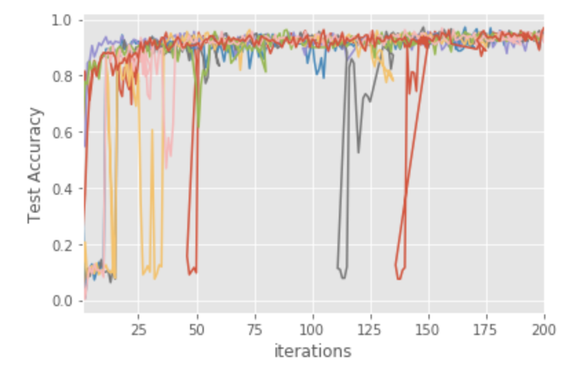

Tune Advanced Tutorials
=======================

In this page, we will explore some advanced functionality in Tune with more examples.

On this page:

.. contents::
    :local:
    :backlinks: none

A native example of Trainable
-----------------------------
As mentioned in `Tune User Guide <tune-usage.html#Tune Training API>`_, Training can be done
with either the `Trainable <tune-usage.html#trainable-api>`__ **Class API** or
**function-based API**. Comparably, ``Trainable`` is stateful, supports checkpoint/restore functionality,
and is preferable for advanced algorithms.

A naive example for ``Trainable`` is a simple number guesser:

.. code-block:: python

    import ray
    from ray import tune
    from ray.tune import Trainable

    class Guesser(Trainable):
        def _setup(self, config):
            self.config = config
            self.password = 1024

        def _train(self):
            result_dict = {"diff": abs(self.config['guess'] - self.password)}
            return result_dict

    ray.init()
    analysis = tune.run(
        Guesser,
        stop={
            "training_iteration": 1,
        },
        num_samples=10,
        config={
            "guess": tune.randint(1, 10000)
        })

    print('best config: ', analysis.get_best_config(metric="diff", mode="min"))

The program randomly picks 10 number from [1, 10000) and finds which is closer to the password.
As a subclass of ``ray.tune.Trainable``, Tune will convert ``Guesser`` into a Ray actor, which
runs on a separate process on a worker. ``_setup`` function is invoked once for each Actor for custom
initialization.

``_train`` execute one logical iteration of training in the tuning process,
which may include several iterations of actual training (see the next example). As a rule of
thumb, the execution time of one train call should be large enough to avoid overheads
(i.e. more than a few seconds), but short enough to report progress periodically
(i.e. at most a few minutes).

We only implemented ``_setup`` and ``_train`` methods for simplification, usually it's also required
to implement ``_save``, and ``_restore`` for checkpoint and fault tolerance.

Next, we train a Pytorch convolution model with Trainable and PBT.

Trainable with Population Based Training (PBT)
----------------------------------------------

Tune includes a distributed implementation of `Population Based Training (PBT) <https://deepmind.com/blog/population-based-training-neural-networks>`__ as
a scheduler `PopulationBasedTraining <tune-schedulers.html#Population Based Training (PBT)>`__ .

PBT starts by training many neural networks in parallel with random hyperparameters. But instead of the
networks training independently, it uses information from the rest of the population to refine the
hyperparameters and direct computational resources to models which show promise.

.. image:: images/tune_advanced_paper1.png

This takes its inspiration from genetic algorithms where each member of the population
can exploit information from the remainder of the population. For example, a worker might
copy the model parameters from a better performing worker. It can also explore new hyperparameters by
changing the current values randomly.

As the training of the population of neural networks progresses, this process of exploiting and exploring
is performed periodically, ensuring that all the workers in the population have a good base level of performance
and also that new hyperparameters are consistently explored.

This means that PBT can quickly exploit good hyperparameters, can dedicate more training time to
promising models and, crucially, can adapt the hyperparameter values throughout training,
leading to automatic learning of the best configurations.

First we define a Trainable that wraps a ConvNet model.

.. literalinclude:: ../../python/ray/tune/examples/pbt_convnet_example.py
   :language: python
   :start-after: __trainable_begin__
   :end-before: __trainable_end__

The example reuses some of the functions in ray/tune/examples/mnist_pytorch.py, and is also a good
demo for how to decouple the tuning logic and original training code.

Here, we also override ``reset_config``. This method is optional but can be implemented to speed
up algorithms such as PBT, and to allow performance optimizations such as running experiments
with ``reuse_actors=True``.

Then, we define a PBT scheduler:

.. literalinclude:: ../../python/ray/tune/examples/pbt_convnet_example.py
   :language: python
   :start-after: __pbt_begin__
   :end-before: __pbt_end__

Some of the most important parameters are:

- ``hyperparam_mutations`` and ``custom_explore_fn`` are used to mutate the hyperparameters.
  ``hyperparam_mutations`` is a dictionary where each key/value pair specifies the candidates
  or function for a hyperparameter. custom_explore_fn is applied after built-in perturbations
  from hyperparam_mutations are applied, and should return config updated as needed.

- ``resample_probability``: The probability of resampling from the original distribution
  when applying hyperparam_mutations. If not resampled, the value will be perturbed by a
  factor of 1.2 or 0.8 if continuous, or changed to an adjacent value if discrete. Note that
  ``resample_probability`` by default is 0.25, thus hyperparameter with a distribution
  may go out of the specific range.

Now we can kick off the tuning process by invoking tune.run:

.. literalinclude:: ../../python/ray/tune/examples/pbt_convnet_example.py
   :language: python
   :start-after: __tune_begin__
   :end-before: __tune_end__

During the training, we can constantly check the status of the models from console log:

.. code-block:: bash

    == Status ==
    Memory usage on this node: 10.4/16.0 GiB
    PopulationBasedTraining: 4 checkpoints, 1 perturbs
    Resources requested: 4/12 CPUs, 0/0 GPUs, 0.0/3.42 GiB heap, 0.0/1.17 GiB objects
    Number of trials: 4 ({'RUNNING': 4})
    Result logdir: /Users/yuhao.yang/ray_results/pbt_test
    +--------------------------+----------+---------------------+----------+------------+--------+------------------+----------+
    | Trial name               | status   | loc                 |       lr |   momentum |   iter |   total time (s) |      acc |
    |--------------------------+----------+---------------------+----------+------------+--------+------------------+----------|
    | PytorchTrainble_3b42d914 | RUNNING  | 30.57.180.224:49840 | 0.122032 |   0.302176 |     18 |          3.8689  | 0.8875   |
    | PytorchTrainble_3b45091e | RUNNING  | 30.57.180.224:49835 | 0.505325 |   0.628559 |     18 |          3.90404 | 0.134375 |
    | PytorchTrainble_3b454c46 | RUNNING  | 30.57.180.224:49843 | 0.490228 |   0.969013 |     17 |          3.72111 | 0.0875   |
    | PytorchTrainble_3b458a9c | RUNNING  | 30.57.180.224:49833 | 0.961861 |   0.169701 |     13 |          2.72594 | 0.1125   |
    +--------------------------+----------+---------------------+----------+------------+--------+------------------+----------+

In {LOG_DIR}/{MY_EXPERIMENT_NAME}/, all mutations are logged in pbt_global.txt
and individual policy perturbations are recorded in pbt_policy_{i}.txt. Tune logs:
[target trial tag, clone trial tag, target trial iteration, clone trial iteration,
old config, new config] on each perturbation step.

Checking the accuracy:

.. code-block:: python

    # Plot by wall-clock time
    dfs = analysis.fetch_trial_dataframes()
    # This plots everything on the same plot
    ax = None
    for d in dfs.values():
        ax = d.plot("training_iteration", "mean_accuracy", ax=ax, legend=False)

    plt.xlabel("iterations")
    plt.ylabel("Test Accuracy")

    print('best config:', analysis.get_best_config("mean_accuracy"))

DCGAN with Trainable and PBT
----------------------------

The Generative Adversarial Networks (GAN) (Goodfellow et al., 2014) framework learns generative
models via a training paradigm consisting of two competing modules – a generator and a
discriminator. GAN training can be remarkably brittle and unstable in the face of suboptimal
hyperparameter selection with generators often collapsing to a single mode or diverging entirely.

As presented in `Population Based Training (PBT) <https://deepmind.com/blog/population-based-training-neural-networks>`__,
PBT can help with the DCGAN training. We will now walk through how to do this in Tune.
Complete code example at `github <https://github.com/ray-project/ray/tree/master/python/ray/tune/examples/pbt_dcgan_mnist>`__

We define the Generator and Discriminator with standard Pytorch API:

.. literalinclude:: ../../python/ray/tune/examples/pbt_dcgan_mnist/pbt_dcgan_mnist.py
   :language: python
   :start-after: __GANmodel_begin__
   :end-before: __GANmodel_end__

To train the model with PBT, we need to define a metric for the scheduler to evaluate
the model candidates. For a GAN network, inception score is arguably the most
commonly used metric. We trained a mnist classification model (LeNet) and use
it to inference the generated images and evaluate the image quality.

.. literalinclude:: ../../python/ray/tune/examples/pbt_dcgan_mnist/pbt_dcgan_mnist.py
   :language: python
   :start-after: __INCEPTION_SCORE_begin__
   :end-before: __INCEPTION_SCORE_end__

The ``Trainable`` class includes a Generator and a Discriminator, each with an
independent learning rate and optimizer.

.. literalinclude:: ../../python/ray/tune/examples/pbt_dcgan_mnist/pbt_dcgan_mnist.py
   :language: python
   :start-after: __Trainable_begin__
   :end-before: __Trainable_end__

We specify inception score as the metric and start the tuning:

.. literalinclude:: ../../python/ray/tune/examples/pbt_dcgan_mnist/pbt_dcgan_mnist.py
   :language: python
   :start-after: __tune_begin__
   :end-before: __tune_end__

The trained Generator models can be loaded from checkpoints, and generate images
from noise signals.

.. image:: images/tune_advanced_dcgan_generated.gif

Visualize the increasing inception score from the training logs.

.. code-block:: python

    lossG = [df['is_score'].tolist() for df in list(analysis.trial_dataframes.values())]

    plt.figure(figsize=(10,5))
    plt.title("Inception Score During Training")
    for i, lossg in enumerate(lossG):
        plt.plot(lossg,label=i)

    plt.xlabel("iterations")
    plt.ylabel("is_score")
    plt.legend()
    plt.show()

.. image:: images/tune_advanced_dcgan_inscore.png

And the Generator loss:

.. code-block:: python

    lossG = [df['lossg'].tolist() for df in list(analysis.trial_dataframes.values())]

    plt.figure(figsize=(10,5))
    plt.title("Generator Loss During Training")
    for i, lossg in enumerate(lossG):
        plt.plot(lossg,label=i)

    plt.xlabel("iterations")
    plt.ylabel("LossG")
    plt.legend()
    plt.show()

.. image:: images/tune_advanced_dcgan_Gloss.png

Training of the MNist Generator takes about several minutes. The example can be easily
altered to generate images for other dataset, e.g. cifar10 or LSUN.
