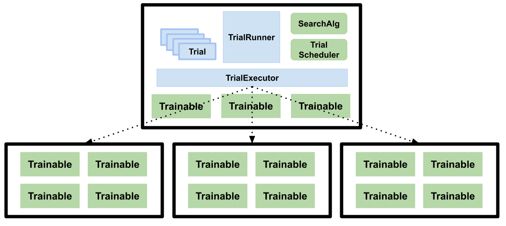

Tune Design Guide
=================

In this part of the documentation, we overview the design and architecture
of Tune.

Main Components
---------------

Tune has a couple main components.

TrialRunner: This is the main driver of the training loop. This component
uses the TrialScheduler to ..., queries the SearchAlgorithm for new
configurations to evaluate, and executes checkpointing if ``checkpoint_freq``
is set, along with automatic Trial restarting in case of trial failures (if ``max_failures`` is set).

The TrialRunner is also in charge of checkpointing the entire experiment execution state
upon each loop iteration. This allows users to restart their experiment
in case of machine failure.

Trial objects: This is an internal data structure that contains metadata about each training run. Each Trial
object is mapped one-to-one with a Trainable but are not themselves
distributed/remote. Trial objects transition among
the following states: "PENDING", "RUNNING", "PAUSED", "ERRORED", and
"TERMINATED".

TrialExecutor: The TrialExecutor is a component that interacts with
the underlying execution framework. By default, the TrialExecutor uses

SearchAlg: The SearchAlgorithm is a user-provided object
that is used for querying new hyperparameter configurations to evaluate.

TrialScheduler: This component

Trainables: These are user-provided objects that are used for
the training process. If a class is provided, it is expected to conform to the
Trainable interface. If a function is provided. it is wrapped into a
Trainable class, and the function itself is executed on a separate thread.

