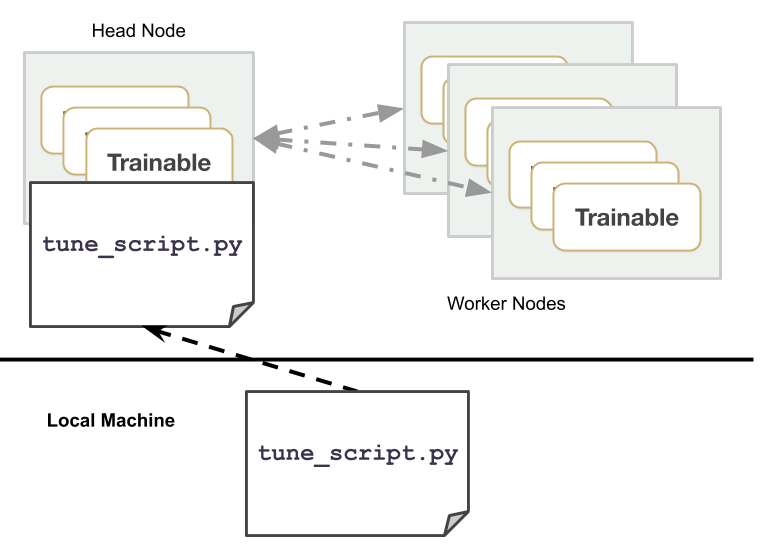

Tune Distributed Experiments
============================

Tune is commonly used for large-scale distributed hyperparameter optimization. Tune and Ray provide many utilities that enable an effective workflow for interacting with a cluster, including fast file mounting, one-line cluster launching, and result uploading to cloud storage.

This page will overview the tooling for distributed experiments, covering how to connect to a cluster, how to launch a distributed experiment, and commonly used commands.

Connecting to a cluster
-----------------------

One common approach to modifying an existing Tune experiment to go distributed is to set an `argparse` variable so that toggling between distributed and single-node is seamless. This allows Tune to utilize all the resources available to the Ray cluster.

.. code-block:: python

    import ray
    import argparse

    parser = argparse.ArgumentParser()
    parser.add_argument("--ray-redis-address")
    args = parser.parse_args()
    ray.init(redis_address=args.ray_redis_address)

Note that connecting to cluster requires a pre-existing Ray cluster to be started already (`Manual Cluster Setup <using-ray-on-a-cluster.html>`_). The script should be run on the head node of the Ray cluster. Below, ``tune_script.py`` can be any script that runs a Tune hyperparameter search.

.. code-block:: bash

    # Single-node execution
    $ python tune_script.py

    # On the head node, connect to an existing ray cluster
    $ python tune_script.py --ray-redis-address=localhost:XXXX

.. literalinclude:: ../../python/ray/tune/examples/mnist_pytorch.py
   :language: python
   :start-after: if __name__ == "__main__":

Launching a cloud cluster
-------------------------

.. tip::

    If you have already have a list of nodes, skip down to the `Local Cluster Setup`_ section.

Ray currently supports AWS and GCP. Below, we will launch nodes on AWS that will default to using the Deep Learning AMI. See the `cluster setup documentation <autoscaling.html>`_.

.. literalinclude:: ../../python/ray/tune/examples/tune-default.yaml
   :language: yaml
   :name: tune-default.yaml

This code starts a cluster as specified by the given cluster configuration YAML file, uploads ``tune_script.py`` to the cluster, and runs ``python tune_script.py``.

.. code-block:: bash

    ray submit tune-default.yaml tune_script.py --start

Analyze your results on TensorBoard by starting TensorBoard on the remote head machine.

.. code-block:: bash

    # Go to http://localhost:6006 to access TensorBoard.
    ray exec tune-default.yaml 'tensorboard --logdir=~/ray_results/ --port 6006' --port-forward 6006

Note that you can customize the directory of results by running: ``tune.run(local_dir=..)``. You can then point TensorBoard to that directory to visualize results. You can also use `awless <https://github.com/wallix/awless>`_ for easy cluster management on AWS.

Local Cluster Setup
-------------------

If you run into issues (or want to add nodes manually), you can use the manual cluster setup `documentation here <using-ray-on-a-cluster.html>`__. At a glance, On the head node, run the following.

.. code-block:: bash

    # If the ``--redis-port`` argument is omitted, Ray will choose a port at random.
    $ ray start --head --redis-port=6379

The command will print out the address of the Redis server that was started (and some other address information).

**Then on all of the other nodes**, run the following. Make sure to replace ``<redis-address>`` with the value printed by the command on the head node (it should look something like ``123.45.67.89:6379``).

.. code-block:: bash

    $ ray start --redis-address=<redis-address>

If you have already have a list of nodes, you can follow the private autoscaling cluster setup `instructions here <autoscaling.html#quick-start-private-cluster>`_.

Pre-emptible Instances (Cloud)
------------------------------

Running on spot instances (or pre-emptible instances) can reduce the cost of your experiment. You can enable spot instances in AWS via the following configuration modification:

.. code-block:: yaml

    # Provider-specific config for worker nodes, e.g. instance type.
    worker_nodes:
        InstanceType: m5.large
        ImageId: ami-0b294f219d14e6a82 # Deep Learning AMI (Ubuntu) Version 21.0

        # Run workers on spot by default. Comment this out to use on-demand.
        InstanceMarketOptions:
            MarketType: spot
            SpotOptions:
                MaxPrice: 1.0  # Max Hourly Price

In GCP, you can use the following configuration modification:

.. code-block:: yaml

    worker_nodes:
        machineType: n1-standard-2
        disks:
          - boot: true
            autoDelete: true
            type: PERSISTENT
            initializeParams:
              diskSizeGb: 50
              # See https://cloud.google.com/compute/docs/images for more images
              sourceImage: projects/deeplearning-platform-release/global/images/family/tf-1-13-cpu

        # Run workers on preemtible instances.
        scheduling:
          - preemptible: true

Spot instances may be removed suddenly while trials are still running. Often times this may be difficult to deal with when using other distributed hyperparameter optimization frameworks. Tune allows users to mitigate the effects of this by preserving the progress of your model training through checkpointing.

The easiest way to do this is to subclass the pre-defined ``Trainable`` class and implement ``_save``, and ``_restore`` abstract methods, as seen in the example below:

.. literalinclude:: ../../python/ray/tune/examples/mnist_pytorch_trainable.py
   :language: python
   :start-after: __trainable_example_begin__
   :end-before: __trainable_example_end__

This can then be used similarly to the Function API as before:

.. literalinclude:: ../../python/ray/tune/tests/tutorial.py
    :language: python
    :start-after: __trainable_run_begin__
    :end-before: __trainable_run_end__

Example for using spot instances (AWS)
~~~~~~~~~~~~~~~~~~~~~~~~~~~~~~~~~~~~~~

Here is an example for running Tune on spot instances. This assumes your AWS credentials have already been setup (``aws configure``):

1. Download a full example Tune experiment script here. This includes a Trainable with checkpointing: :download:`mnist_pytorch_trainable.py <../../python/ray/tune/examples/mnist_pytorch_trainable.py>`. To run this example, you will need to install the following:

.. code-block:: bash

    $ pip install ray torch torchvision filelock

2. Download an example cluster yaml here: :download:`tune-default.yaml <../../python/ray/tune/examples/tune-default.yaml>`
3. Run ``ray submit`` as below to run Tune across them. Append ``[--start]`` if the cluster is not up yet. Append ``[--stop]`` to automatically shutdown your nodes after running.

.. code-block:: bash

    ray submit tune-default.yaml mnist_pytorch_trainable.py \
        --args="--ray-redis-address=localhost:6379" \
        --start

4. Optionally for testing on AWS or GCP, you can use the following to kill a random worker node after all the worker nodes are up

.. code-block:: bash

    $ ray kill-random-node tune-default.yaml --hard

To summarize, here are the commands to run:

.. code-block:: bash

    wget https://raw.githubusercontent.com/ray-project/ray/master/python/ray/tune/examples/mnist_pytorch_trainable.py
    wget https://raw.githubusercontent.com/ray-project/ray/master/python/ray/tune/tune-default.yaml
    ray submit tune-default.yaml mnist_pytorch_trainable.py --args="--ray-redis-address=localhost:6379" --start

    # wait a while until after all nodes have started
    ray kill-random-node tune-default.yaml --hard

You should see Tune eventually continue the trials on a different worker node. See the `Saving and Recovery <tune-usage.html#saving-and-recovery>`__ section for more details.

You can also specify ``tune.run(upload_dir=...)`` to sync results with a cloud storage like S3, persisting results in case you want to start and stop your cluster automatically.

Common Commands
---------------

Below are some commonly used commands for submitting experiments. Please see the `Autoscaler page <autoscaling.html>`__ to see find more comprehensive documentation of commands.

.. code-block:: bash

    # Upload `tune_experiment.py` from your local machine onto the cluster. Then,
    # run `python tune_experiment.py --redis-address=localhost:6379` on the remote machine.
    $ ray submit CLUSTER.YAML tune_experiment.py --args="--redis-address=localhost:6379"

    # Start a cluster and run an experiment in a detached tmux session,
    # and shut down the cluster as soon as the experiment completes.
    # In `tune_experiment.py`, set `tune.run(upload_dir="s3://...")` to persist results
    $ ray submit CLUSTER.YAML --tmux --start --stop tune_experiment.py  --args="--redis-address=localhost:6379"

    # To start or update your cluster:
    $ ray up CLUSTER.YAML [-y]

    # Shut-down all instances of your cluster:
    $ ray down CLUSTER.YAML [-y]

    # Run Tensorboard and forward the port to your own machine.
    $ ray exec CLUSTER.YAML 'tensorboard --logdir ~/ray_results/ --port 6006' --port-forward 6006

    # Run Jupyter Lab and forward the port to your own machine.
    $ ray exec CLUSTER.YAML 'jupyter lab --port 6006' --port-forward 6006

    # Get a summary of all the experiments and trials that have executed so far.
    $ ray exec CLUSTER.YAML 'tune ls ~/ray_results'

    # Upload and sync file_mounts up to the cluster with this command.
    $ ray rsync-up CLUSTER.YAML

    # Download the results directory from your cluster head node to your local machine on ``~/cluster_results``.
    $ ray rsync-down CLUSTER.YAML '~/ray_results' ~/cluster_results

    # Launching multiple clusters using the same configuration.
    $ ray up CLUSTER.YAML -n="cluster1"
    $ ray up CLUSTER.YAML -n="cluster2"
    $ ray up CLUSTER.YAML -n="cluster3"

Troubleshooting
---------------

Sometimes, your program may freeze. Run this to restart the Ray cluster without running any of the installation commands.

.. code-block:: bash

    $ ray up CLUSTER.YAML --restart-only

..  Local Cluster Setup: tune-distributed.html#local-cluster-setup
