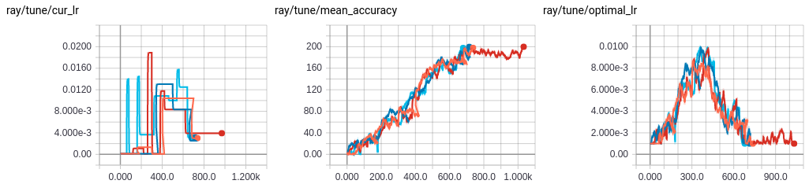
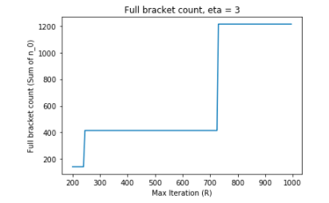

Tune Trial Schedulers
=====================

By default, Tune schedules trials in serial order with the ``FIFOScheduler`` class. However, you can also specify a custom scheduling algorithm that can early stop trials or perturb parameters.

.. code-block:: python

    tune.run( ... , scheduler=AsyncHyperBandScheduler())

Tune includes distributed implementations of early stopping algorithms such as `Median Stopping Rule <https://research.google.com/pubs/pub46180.html>`__, `HyperBand <https://arxiv.org/abs/1603.06560>`__, and an `asynchronous version of HyperBand <https://openreview.net/forum?id=S1Y7OOlRZ>`__. These algorithms are very resource efficient and can outperform Bayesian Optimization methods in `many cases <https://people.eecs.berkeley.edu/~kjamieson/hyperband.html>`__. All schedulers take in a ``metric``, which is a value returned in the result dict of your Trainable and is maximized or minimized according to ``mode``.

Current Available Trial Schedulers:

.. contents::
    :local:
    :backlinks: none

Population Based Training (PBT)
-------------------------------

Tune includes a distributed implementation of `Population Based Training (PBT) <https://deepmind.com/blog/population-based-training-neural-networks>`__. This can be enabled by setting the ``scheduler`` parameter of ``tune.run``, e.g.

.. code-block:: python

    pbt_scheduler = PopulationBasedTraining(
            time_attr='time_total_s',
            metric='mean_accuracy',
            mode='max',
            perturbation_interval=600.0,
            hyperparam_mutations={
                "lr": [1e-3, 5e-4, 1e-4, 5e-5, 1e-5],
                "alpha": lambda: random.uniform(0.0, 1.0),
                ...
            })
    tune.run( ... , scheduler=pbt_scheduler)

When the PBT scheduler is enabled, each trial variant is treated as a member of the population. Periodically, top-performing trials are checkpointed (this requires your Trainable to support `save and restore <tune-usage.html#save-and-restore>`__). Low-performing trials clone the checkpoints of top performers and perturb the configurations in the hope of discovering an even better variation.

You can run this `toy PBT example <https://github.com/ray-project/ray/blob/master/python/ray/tune/examples/pbt_example.py>`__ to get an idea of how how PBT operates. When training in PBT mode, a single trial may see many different hyperparameters over its lifetime, which is recorded in its ``result.json`` file. The following figure generated by the example shows PBT with optimizing a LR schedule over the course of a single experiment:

.. autoclass:: ray.tune.schedulers.PopulationBasedTraining
    :noindex:

Asynchronous HyperBand
----------------------

The `asynchronous version of HyperBand <https://openreview.net/forum?id=S1Y7OOlRZ>`__ scheduler can be used by setting the ``scheduler`` parameter of ``tune.run``, e.g.

.. code-block:: python

    async_hb_scheduler = AsyncHyperBandScheduler(
        time_attr='training_iteration',
        metric='episode_reward_mean',
        mode='max',
        max_t=100,
        grace_period=10,
        reduction_factor=3,
        brackets=3)
    tune.run( ... , scheduler=async_hb_scheduler)

Compared to the original version of HyperBand, this implementation provides better parallelism and avoids straggler issues during eliminations. An example of this can be found in `async_hyperband_example.py <https://github.com/ray-project/ray/blob/master/python/ray/tune/examples/async_hyperband_example.py>`__. **We recommend using this over the standard HyperBand scheduler.**

.. autoclass:: ray.tune.schedulers.AsyncHyperBandScheduler
    :noindex:

HyperBand
---------

.. note:: Note that the HyperBand scheduler requires your trainable to support saving and restoring, which is described in `Tune User Guide <tune-usage.html#save-and-restore>`__. Checkpointing enables the scheduler to multiplex many concurrent trials onto a limited size cluster.

Tune also implements the `standard version of HyperBand <https://arxiv.org/abs/1603.06560>`__. You can use it as such:

.. code-block:: python

    tune.run( ... , scheduler=HyperBandScheduler())

An example of this can be found in `hyperband_example.py <https://github.com/ray-project/ray/blob/master/python/ray/tune/examples/hyperband_example.py>`__. The progress of one such HyperBand run is shown below.

::

    == Status ==
    Using HyperBand: num_stopped=0 total_brackets=5
    Round #0:
      Bracket(n=5, r=100, completed=80%): {'PAUSED': 4, 'PENDING': 1}
      Bracket(n=8, r=33, completed=23%): {'PAUSED': 4, 'PENDING': 4}
      Bracket(n=15, r=11, completed=4%): {'RUNNING': 2, 'PAUSED': 2, 'PENDING': 11}
      Bracket(n=34, r=3, completed=0%): {'RUNNING': 2, 'PENDING': 32}
      Bracket(n=81, r=1, completed=0%): {'PENDING': 38}
    Resources used: 4/4 CPUs, 0/0 GPUs
    Result logdir: ~/ray_results/hyperband_test
    PAUSED trials:
     - my_class_0_height=99,width=43:   PAUSED [pid=11664], 0 s, 100 ts, 97.1 rew
     - my_class_11_height=85,width=81:  PAUSED [pid=11771], 0 s, 33 ts, 32.8 rew
     - my_class_12_height=0,width=52:   PAUSED [pid=11785], 0 s, 33 ts, 0 rew
     - my_class_19_height=44,width=88:  PAUSED [pid=11811], 0 s, 11 ts, 5.47 rew
     - my_class_27_height=96,width=84:  PAUSED [pid=11840], 0 s, 11 ts, 12.5 rew
      ... 5 more not shown
    PENDING trials:
     - my_class_10_height=12,width=25:  PENDING
     - my_class_13_height=90,width=45:  PENDING
     - my_class_14_height=69,width=45:  PENDING
     - my_class_15_height=41,width=11:  PENDING
     - my_class_16_height=57,width=69:  PENDING
      ... 81 more not shown
    RUNNING trials:
     - my_class_23_height=75,width=51:  RUNNING [pid=11843], 0 s, 1 ts, 1.47 rew
     - my_class_26_height=16,width=48:  RUNNING
     - my_class_31_height=40,width=10:  RUNNING
     - my_class_53_height=28,width=96:  RUNNING

.. autoclass:: ray.tune.schedulers.HyperBandScheduler
    :noindex:

HyperBand Implementation Details
~~~~~~~~~~~~~~~~~~~~~~~~~~~~~~~~

Implementation details may deviate slightly from theory but are focused on increasing usability. Note: ``R``, ``s_max``, and ``eta`` are parameters of HyperBand given by the paper. See `this post <https://people.eecs.berkeley.edu/~kjamieson/hyperband.html>`_ for context.

1. Both ``s_max`` (representing the ``number of brackets - 1``) and ``eta``, representing the downsampling rate, are fixed.  In many practical settings, ``R``, which represents some resource unit and often the number of training iterations, can be set reasonably large, like ``R >= 200``. For simplicity, assume ``eta = 3``. Varying ``R`` between ``R = 200`` and ``R = 1000`` creates a huge range of the number of trials needed to fill up all brackets.

On the other hand, holding ``R`` constant at ``R = 300`` and varying ``eta`` also leads to HyperBand configurations that are not very intuitive:

The implementation takes the same configuration as the example given in the paper and exposes ``max_t``, which is not a parameter in the paper.

2. The example in the `post <https://people.eecs.berkeley.edu/~kjamieson/hyperband.html>`_ to calculate ``n_0`` is actually a little different than the algorithm given in the paper. In this implementation, we implement ``n_0`` according to the paper (which is `n` in the below example):

.. image:: images/hyperband_allocation.png

3. There are also implementation specific details like how trials are placed into brackets which are not covered in the paper. This implementation places trials within brackets according to smaller bracket first - meaning that with low number of trials, there will be less early stopping.

Median Stopping Rule
--------------------

The Median Stopping Rule implements the simple strategy of stopping a trial if its performance falls below the median of other trials at similar points in time. You can set the ``scheduler`` parameter as such:

.. code-block:: python

    tune.run( ... , scheduler=MedianStoppingRule())

.. autoclass:: ray.tune.schedulers.MedianStoppingRule
    :noindex:

