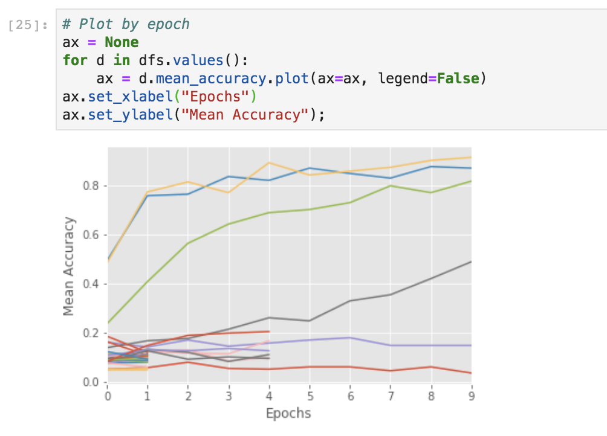

Tune Example Walkthrough
========================

This tutorial will walk you through the following process to setup a Tune experiment. Specifically, we'll leverage ASHA and Bayesian Optimization (via HyperOpt) via the following steps:

  1. Integrating Tune into your workflow
  2. Specifying a TrialScheduler
  3. Adding a SearchAlgorithm
  4. Getting the best model and analyzing results

.. note::

    To run this example, you will need to install the following:

    .. code-block:: bash

        $ pip install ray torch torchvision filelock

We first run some imports:

.. literalinclude:: ../../python/ray/tune/tests/tutorial.py
   :language: python
   :start-after: __tutorial_imports_begin__
   :end-before: __tutorial_imports_end__

Below, we have some boiler plate code for a PyTorch training function.

.. literalinclude:: ../../python/ray/tune/tests/tutorial.py
   :language: python
   :start-after: __train_func_begin__
   :end-before: __train_func_end__

Notice that there's a couple helper functions in the above training script. You can take a look at these functions in the imported module `examples/mnist_pytorch <https://github.com/ray-project/ray/blob/master/python/ray/tune/examples/mnist_pytorch.py>`__; there's no black magic happening. For example, ``train`` is simply a for loop over the data loader.

.. code:: python

    def train(model, optimizer, train_loader):
        model.train()
        for batch_idx, (data, target) in enumerate(train_loader):
            if batch_idx * len(data) > EPOCH_SIZE:
                return
            optimizer.zero_grad()
            output = model(data)
            loss = F.nll_loss(output, target)
            loss.backward()
            optimizer.step()

Let's run 1 trial, randomly sampling from a uniform distribution for learning rate and momentum.

.. literalinclude:: ../../python/ray/tune/tests/tutorial.py
   :language: python
   :start-after: __eval_func_begin__
   :end-before: __eval_func_end__

We can then plot the performance of this trial.

.. literalinclude:: ../../python/ray/tune/tests/tutorial.py
   :language: python
   :start-after: __plot_begin__
   :end-before: __plot_end__

Early Stopping with ASHA
~~~~~~~~~~~~~~~~~~~~~~~~

Let's integrate an early stopping algorithm to our search - ASHA, a scalable algorithm for principled early stopping.

How does it work? On a high level, it terminates trials that are less promising and
allocates more time and resources to more promising trials. See `this blog post <ttps://blog.ml.cmu.edu/2018/12/12/massively-parallel-hyperparameter-optimization/>`__ for more details.

We can afford to **increase the search space by 5x**, by adjusting the parameter ``num_samples``. See the `Trial Scheduler section <tune-schedulers.html>`__ for more details of available schedulers and library integrations.

.. literalinclude:: ../../python/ray/tune/tests/tutorial.py
   :language: python
   :start-after: __run_scheduler_begin__
   :end-before: __run_scheduler_end__

You can run the below in a Jupyter notebook to visualize trial progress.

.. literalinclude:: ../../python/ray/tune/tests/tutorial.py
   :language: python
   :start-after: __plot_scheduler_begin__
   :end-before: __plot_scheduler_end__

You can also use Tensorboard for visualizing results.

.. code:: bash

    $ tensorboard --logdir {logdir}

Search Algorithms in Tune
~~~~~~~~~~~~~~~~~~~~~~~~~

With Tune you can combine powerful hyperparameter search libraries such as `HyperOpt <https://github.com/hyperopt/hyperopt>`_ and `Ax <https://ax.dev>`_ with state-of-the-art algorithms such as HyperBand without modifying any model training code. Tune allows you to use different search algorithms in combination with different trial schedulers. See the `Search Algorithm section <tune-searchalg.html>`__ for more details of available algorithms and library integrations.

.. literalinclude:: ../../python/ray/tune/tests/tutorial.py
   :language: python
   :start-after: __run_searchalg_begin__
   :end-before: __run_searchalg_end__

Evaluate your model
~~~~~~~~~~~~~~~~~~~

You can evaluate best trained model using the Analysis object to retrieve the best model:

.. literalinclude:: ../../python/ray/tune/tests/tutorial.py
   :language: python
   :start-after: __run_analysis_begin__
   :end-before: __run_analysis_end__

Next Steps
----------
Take a look at the `Usage Guide <tune-usage.html>`__ for more comprehensive overview of Tune features.
