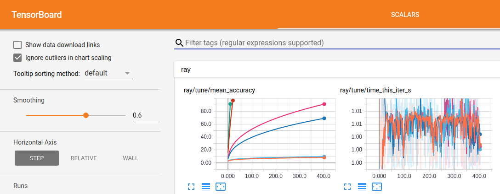

Tune User Guide
===============

.. contents::
    :local:

Experiment Setup
----------------

There are two ways to setup an experiment - one via Python and one via JSON.

The first is to create an Experiment object. You can then pass in either
a single experiment or a list of experiments to `run_experiments`, as follows:

.. code-block:: python

    # Single experiment
    run_experiments(Experiment(...))

    # Multiple experiments
    run_experiments([Experiment(...), Experiment(...), ...])

.. autoclass:: ray.tune.Experiment

An example of this can be found in `hyperband_example.py <https://github.com/ray-project/ray/blob/master/python/ray/tune/examples/hyperband_example.py>`__.

Alternatively, you can pass in a Python dict. This uses the same fields as
the ``ray.tune.Experiment``, except the experiment name is the key of the top level
dictionary.

.. code-block:: python

    run_experiments({
        "my_experiment_name": {
            "run": "my_func",
            "trial_resources": { "cpu": 1, "gpu": 0 },
            "stop": { "mean_accuracy": 100 },
            "config": {
                "alpha": tune.grid_search([0.2, 0.4, 0.6]),
                "beta": tune.grid_search([1, 2]),
            },
            "upload_dir": "s3://your_bucket/path",
            "local_dir": "~/ray_results",
            "max_failures": 2
        }
    })

An example of this can be found in `async_hyperband_example.py <https://github.com/ray-project/ray/blob/master/python/ray/tune/examples/async_hyperband_example.py>`__.

Trial Variant Generation
------------------------

In the above example, we specified a grid search over two parameters using the ``tune.grid_search`` helper function. Tune also supports sampling parameters from user-specified lambda functions, which can be used in combination with grid search.

The following shows grid search over two nested parameters combined with random sampling from two lambda functions. Note that the value of ``beta`` depends on the value of ``alpha``, which is represented by referencing ``spec.config.alpha`` in the lambda function. This lets you specify conditional parameter distributions.

.. code-block:: python

    "config": {
        "alpha": lambda spec: np.random.uniform(100),
        "beta": lambda spec: spec.config.alpha * np.random.normal(),
        "nn_layers": [
            tune.grid_search([16, 64, 256]),
            tune.grid_search([16, 64, 256]),
        ],
    },
    "repeat": 10,

By default, each random variable and grid search point is sampled once. To take multiple random samples or repeat grid search runs, add ``repeat: N`` to the experiment config. E.g. in the above, ``"repeat": 10`` repeats the 3x3 grid search 10 times, for a total of 90 trials, each with randomly sampled values of ``alpha`` and ``beta``.

.. note::

    Lambda functions will be evaluated during trial variant generation. If you need to pass a literal function in your config, use ``tune.function(...)`` to escape it.

For more information on variant generation, see `basic_variant.py <https://github.com/ray-project/ray/blob/master/python/ray/tune/suggest/basic_variant.py>`__.

Using GPUs (Resource Allocation)
--------------------------------

Tune runs each trial as a Ray actor, allocating the specified GPU and CPU ``trial_resources`` to each actor (defaulting to 1 CPU per trial). A trial will not be scheduled unless at least that amount of resources is available in the cluster, preventing the cluster from being overloaded.

If GPU resources are not requested, the ``CUDA_VISIBLE_DEVICES`` environment variable will be set as empty, disallowing GPU access.
Otherwise, it will be set to the GPUs in the list (this is managed by Ray).

If your trainable function / class creates further Ray actors or tasks that also consume CPU / GPU resources, you will also want to set ``extra_cpu`` or ``extra_gpu`` to reserve extra resource slots for the actors you will create. For example, if a trainable class requires 1 GPU itself, but will launch 4 actors each using another GPU, then it should set ``"gpu": 1, "extra_gpu": 4``.

Trial Checkpointing
-------------------

To enable checkpointing, you must implement a Trainable class (Trainable functions are not checkpointable, since they never return control back to their caller). The easiest way to do this is to subclass the pre-defined ``Trainable`` class and implement its ``_train``, ``_save``, and ``_restore`` abstract methods `(example) <https://github.com/ray-project/ray/blob/master/python/ray/tune/examples/hyperband_example.py>`__: Implementing this interface is required to support resource multiplexing in schedulers such as HyperBand and PBT.

For TensorFlow model training, this would look something like this `(full tensorflow example) <https://github.com/ray-project/ray/blob/master/python/ray/tune/examples/tune_mnist_ray_hyperband.py>`__:

.. code-block:: python

    class MyClass(Trainable):
        def _setup(self):
            self.saver = tf.train.Saver()
            self.sess = ...
            self.iteration = 0

        def _train(self):
            self.sess.run(...)
            self.iteration += 1

        def _save(self, checkpoint_dir):
            return self.saver.save(
                self.sess, checkpoint_dir + "/save",
                global_step=self.iteration)

        def _restore(self, path):
            return self.saver.restore(self.sess, path)

Additionally, checkpointing can be used to provide fault-tolerance for experiments. This can be enabled by setting ``checkpoint_freq: N`` and ``max_failures: M`` to checkpoint trials every *N* iterations and recover from up to *M* crashes per trial, e.g.:

.. code-block:: python

    run_experiments({
        "my_experiment": {
            ...
            "checkpoint_freq": 10,
            "max_failures": 5,
        },
    })

The class interface that must be implemented to enable checkpointing is as follows:

.. autoclass:: ray.tune.trainable.Trainable
    :members: _save, _restore, _train, _setup, _stop
    :noindex:

Handling Large Datasets
-----------------------

You often will want to compute a large object (e.g., training data, model weights) on the driver and use that object within each trial. Tune provides a ``pin_in_object_store`` utility function that can be used to broadcast such large objects. Objects pinned in this way will never be evicted from the Ray object store while the driver process is running, and can be efficiently retrieved from any task via ``get_pinned_object``.

.. code-block:: python

    import ray
    from ray.tune import register_trainable, run_experiments
    from ray.tune.util import pin_in_object_store, get_pinned_object

    import numpy as np

    ray.init()

    # X_id can be referenced in closures
    X_id = pin_in_object_store(np.random.random(size=100000000))

    def f(config, reporter):
        X = get_pinned_object(X_id)
        # use X

    register_trainable("f", f)
    run_experiments(...)

Visualizing Results
-------------------

Tune logs trial results to a unique directory per experiment, e.g. ``~/ray_results/my_experiment`` in the above example. The log records are compatible with a number of visualization tools:

To visualize learning in tensorboard, install TensorFlow:

.. code-block:: bash

    $ pip install tensorflow

Then, after you run a experiment, you can visualize your experiment with TensorBoard by specifying the output directory of your results. Note that if you running Ray on a remote cluster, you can forward the tensorboard port to your local machine through SSH using ``ssh -L 6006:localhost:6006 <address>``:

.. code-block:: bash

    $ tensorboard --logdir=~/ray_results/my_experiment

To use rllab's VisKit (you may have to install some dependencies), run:

.. code-block:: bash

    $ git clone https://github.com/rll/rllab.git
    $ python rllab/rllab/viskit/frontend.py ~/ray_results/my_experiment

.. image:: ray-tune-viskit.png

Finally, to view the results with a `parallel coordinates visualization <https://en.wikipedia.org/wiki/Parallel_coordinates>`__, open `ParallelCoordinatesVisualization.ipynb <https://github.com/ray-project/ray/blob/master/python/ray/tune/ParallelCoordinatesVisualization.ipynb>`__ as follows and run its cells:

.. code-block:: bash

    $ cd $RAY_HOME/python/ray/tune
    $ jupyter-notebook ParallelCoordinatesVisualization.ipynb

.. image:: ray-tune-parcoords.png

Client API
----------

You can modify an ongoing experiment by adding or deleting trials using the Tune Client API. To do this, verify that you have the ``requests`` library installed:

.. code-block:: bash

    $ pip install requests

To use the Client API, you can start your experiment with ``with_server=True``:

.. code-block:: python

    run_experiments({...}, with_server=True, server_port=4321)

Then, on the client side, you can use the following class. The server address defaults to ``localhost:4321``. If on a cluster, you may want to forward this port (e.g. ``ssh -L <local_port>:localhost:<remote_port> <address>``) so that you can use the Client on your local machine.

.. autoclass:: ray.tune.web_server.TuneClient
    :members:

For an example notebook for using the Client API, see the `Client API Example <https://github.com/ray-project/ray/tree/master/python/ray/tune/TuneClient.ipynb>`__.

Examples
--------

.. TODO(rliaw).

You can find a comprehensive of examples `using Tune and its various features here <https://github.com/ray-project/ray/tree/master/python/ray/tune/examples>`__, including examples using Keras, TensorFlow, and Population-Based Training.
