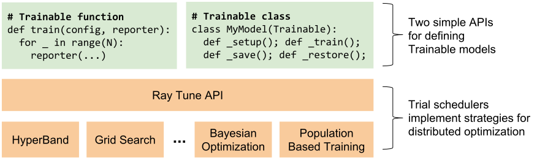

Ray Tune: Hyperparameter Optimization Framework
===============================================

This document describes Ray Tune, a hyperparameter tuning framework for long-running tasks such as RL and deep learning training. Ray Tune makes it easy to go from running one or more experiments on a single machine to running on a large cluster with efficient search algorithms.

It has the following features:

-  Scalable implementations of search algorithms such as `Population Based Training (PBT) <pbt.html>`__, `Median Stopping Rule <hyperband.html#median-stopping-rule>`__, and `HyperBand <hyperband.html>`__.

-  Integration with visualization tools such as `TensorBoard <https://www.tensorflow.org/get_started/summaries_and_tensorboard>`__, `rllab's VisKit <https://media.readthedocs.org/pdf/rllab/latest/rllab.pdf>`__, and a `parallel coordinates visualization <https://en.wikipedia.org/wiki/Parallel_coordinates>`__.

-  Flexible trial variant generation, including grid search, random search, and conditional parameter distributions.

-  Resource-aware scheduling, including support for concurrent runs of algorithms that may themselves be parallel and distributed.

You can find the code for Ray Tune `here on GitHub <https://github.com/ray-project/ray/tree/master/python/ray/tune>`__.

Concepts
--------

Ray Tune schedules a number of *trials* in a cluster. Each trial runs a user-defined Python function or class and is parameterized by a json *config* variation passed to the user code.

Ray Tune provides a ``run_experiments(spec)`` function that generates and runs the trials described by the experiment specification. The trials are scheduled and managed by a *trial scheduler* that implements the search algorithm (default is FIFO).

Ray Tune can be used anywhere Ray can, e.g. on your laptop with ``ray.init()`` embedded in a Python script, or in an `auto-scaling cluster <autoscaling.html>`__ for massive parallelism.

Getting Started
---------------

.. code-block:: python

    import ray
    from ray.tune import register_trainable, grid_search, run_experiments

    def my_func(config, reporter):
        import time, numpy as np
        i = 0
        while True:
            reporter(timesteps_total=i, mean_accuracy=i ** config["alpha"])
            i += config["beta"]
            time.sleep(.01)

    register_trainable("my_func", my_func)

    ray.init()
    run_experiments({
        "my_experiment": {
            "run": "my_func",
            "resources": { "cpu": 1, "gpu": 0 },
            "stop": { "mean_accuracy": 100 },
            "config": {
                "alpha": grid_search([0.2, 0.4, 0.6]),
                "beta": grid_search([1, 2]),
            },
            "upload_dir": "s3://your_bucket/path",
        }
    })

This script runs a small grid search over the ``my_func`` function using Ray Tune, reporting status on the command line until the stopping condition of ``mean_accuracy >= 100`` is reached (for metrics like _loss_ that decrease over time, specify `neg_mean_loss <https://github.com/ray-project/ray/blob/master/python/ray/tune/result.py#L40>`__ as a condition instead):

::

    == Status ==
    Using FIFO scheduling algorithm.
    Resources used: 4/8 CPUs, 0/0 GPUs
    Result logdir: ~/ray_results/my_experiment
     - my_func_0_alpha=0.2,beta=1:	RUNNING [pid=6778], 209 s, 20604 ts, 7.29 acc
     - my_func_1_alpha=0.4,beta=1:	RUNNING [pid=6780], 208 s, 20522 ts, 53.1 acc
     - my_func_2_alpha=0.6,beta=1:	TERMINATED [pid=6789], 21 s, 2190 ts, 101 acc
     - my_func_3_alpha=0.2,beta=2:	RUNNING [pid=6791], 208 s, 41004 ts, 8.37 acc
     - my_func_4_alpha=0.4,beta=2:	RUNNING [pid=6800], 209 s, 41204 ts, 70.1 acc
     - my_func_5_alpha=0.6,beta=2:	TERMINATED [pid=6809], 10 s, 2164 ts, 100 acc

In order to report incremental progress, ``my_func`` periodically calls the ``reporter`` function passed in by Ray Tune to return the current timestep and other metrics as defined in `ray.tune.result.TrainingResult <https://github.com/ray-project/ray/blob/master/python/ray/tune/result.py>`__. Incremental results will be synced to local disk on the head node of the cluster and optionally uploaded to the specified ``upload_dir`` (e.g. S3 path).

Trial Schedulers
----------------

By default, Ray Tune schedules trials in serial order with the ``FIFOScheduler`` class. However, you can also specify a custom scheduling algorithm that can early stop trials, perturb parameters, or incorporate suggestions from an external service. Currently implemented trial schedulers include `Population Based Training (PBT) <pbt.html>`__, `Median Stopping Rule <hyperband.html#median-stopping-rule>`__, and `HyperBand <hyperband.html>`__.

Visualizing Results
-------------------

Ray Tune logs trial results to a unique directory per experiment, e.g. ``~/ray_results/my_experiment`` in the above example. The log records are compatible with a number of visualization tools:

To visualize learning in tensorboard, install TensorFlow:

.. code-block:: bash

    $ pip install tensorflow

Then, after you run a experiment, you can visualize your experiment with TensorBoard by specifying the output directory of your results. Note that if you running Ray on a remote cluster, you can forward the tensorboard port to your local machine through SSH using ``ssh -L 6006:localhost:6006 <address>``:

.. code-block:: bash

    $ tensorboard --logdir=~/ray_results/my_experiment

.. image:: ray-tune-tensorboard.png

To use rllab's VisKit (you may have to install some dependencies), run:

.. code-block:: bash

    $ git clone https://github.com/rll/rllab.git
    $ python rllab/rllab/viskit/frontend.py ~/ray_results/my_experiment

.. image:: ray-tune-viskit.png

Finally, to view the results with a `parallel coordinates visualization <https://en.wikipedia.org/wiki/Parallel_coordinates>`__, open `ParallelCoordinatesVisualization.ipynb <https://github.com/ray-project/ray/blob/master/python/ray/tune/ParallelCoordinatesVisualization.ipynb>`__ as follows and run its cells:

.. code-block:: bash

    $ cd $RAY_HOME/python/ray/tune
    $ jupyter-notebook ParallelCoordinatesVisualization.ipynb

.. image:: ray-tune-parcoords.png

Trial Variant Generation
------------------------

In the above example, we specified a grid search over two parameters using the ``grid_search`` helper function. Ray Tune also supports sampling parameters from user-specified lambda functions, which can be used in combination with grid search.

The following shows grid search over two nested parameters combined with random sampling from two lambda functions. Note that the value of ``beta`` depends on the value of ``alpha``, which is represented by referencing ``spec.config.alpha`` in the lambda function. This lets you specify conditional parameter distributions.

.. code-block:: python

    "config": {
        "alpha": lambda spec: np.random.uniform(100),
        "beta": lambda spec: spec.config.alpha * np.random.normal(),
        "nn_layers": [
            grid_search([16, 64, 256]),
            grid_search([16, 64, 256]),
        ],
    },
    "repeat": 10,

By default, each random variable and grid search point is sampled once. To take multiple random samples or repeat grid search runs, add ``repeat: N`` to the experiment config. E.g. in the above, ``"repeat": 10`` repeats the 3x3 grid search 10 times, for a total of 90 trials, each with randomly sampled values of ``alpha`` and ``beta``.

For more information on variant generation, see `variant_generator.py <https://github.com/ray-project/ray/blob/master/python/ray/tune/variant_generator.py>`__.

Trial Checkpointing
-------------------

To enable checkpointing, you must implement a Trainable class (Trainable functions are not checkpointable, since they never return control back to their caller). The easiest way to do this is to subclass the pre-defined ``Trainable`` class and implement its ``_train``, ``_save``, and ``_restore`` abstract methods `(example) <https://github.com/ray-project/ray/blob/master/python/ray/tune/examples/hyperband_example.py>`__: Implementing this interface is required to support resource multiplexing in schedulers such as HyperBand and PBT.

For TensorFlow model training, this would look something like this `(full tensorflow example) <https://github.com/ray-project/ray/blob/master/python/ray/tune/examples/tune_mnist_ray_hyperband.py>`__:

.. code-block:: python

    class MyClass(Trainable):
        def _setup(self):
            self.saver = tf.train.Saver()
            self.sess = ...
            self.iteration = 0

        def _train(self):
            self.sess.run(...)
            self.iteration += 1

        def _save(self, checkpoint_dir):
            return self.saver.save(
                self.sess, checkpoint_dir + "/save",
                global_step=self.iteration)

        def _restore(self, path):
            return self.saver.restore(self.sess, path)

Additionally, checkpointing can be used to provide fault-tolerance for experiments. This can be enabled by setting ``checkpoint_freq: N`` and ``max_failures: M`` to checkpoint trials every *N* iterations and recover from up to *M* crashes per trial, e.g.:

.. code-block:: python

    run_experiments({
        "my_experiment": {
            ...
            "checkpoint_freq": 10,
            "max_failures": 5,
        },
    })

The class interface that must be implemented to enable checkpointing is as follows:

.. autoclass:: ray.tune.trainable.Trainable

Resource Allocation
-------------------

Ray Tune runs each trial as a Ray actor, allocating the specified GPU and CPU ``resources`` to each actor (defaulting to 1 CPU per trial). A trial will not be scheduled unless at least that amount of resources is available in the cluster, preventing the cluster from being overloaded.

If your trainable function / class creates further Ray actors or tasks that also consume CPU / GPU resources, you will also want to set ``driver_cpu_limit`` or ``driver_gpu_limit`` to tell Ray not to assign the entire resource reservation to your top-level trainable function, as described in `trial.py <https://github.com/ray-project/ray/blob/master/python/ray/tune/trial.py>`__. For example, if a trainable class requires 1 GPU itself, but will launch 4 actors each using another GPU, then it should set ``"gpu": 5, "driver_gpu_limit": 1``.

Client API
----------

You can modify an ongoing experiment by adding or deleting trials using the Tune Client API. To do this, verify that you have the ``requests`` library installed:

.. code-block:: bash

    $ pip install requests

To use the Client API, you can start your experiment with ``with_server=True``:

.. code-block:: python

    run_experiments({...}, with_server=True, server_port=4321)

Then, on the client side, you can use the following class. The server address defaults to ``localhost:4321``. If on a cluster, you may want to forward this port (e.g. ``ssh -L <local_port>:localhost:<remote_port> <address>``) so that you can use the Client on your local machine.

.. autoclass:: ray.tune.web_server.TuneClient
    :members:

For an example notebook for using the Client API, see the `Client API Example <https://github.com/ray-project/ray/tree/master/python/ray/tune/TuneClient.ipynb>`__.
