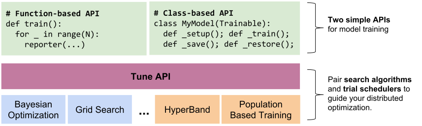
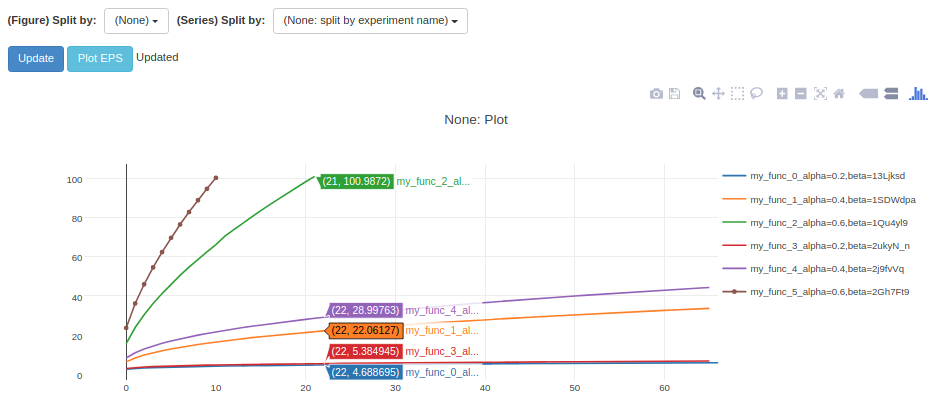
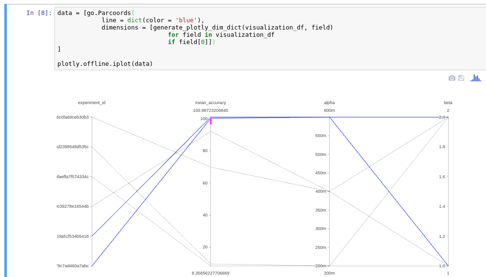

Ray Tune: Hyperparameter Optimization Framework
===============================================

Ray Tune is a scalable hyperparameter optimization framework for reinforcement learning and deep learning. Go from running one experiment on a single machine to running on a large cluster with efficient search algorithms without changing your code.

Getting Started
---------------

Installation
~~~~~~~~~~~~

You'll need to first `install ray <installation.html>`__ to import Ray Tune.

Quick Start
~~~~~~~~~~~

.. code-block:: python

    import ray
    import ray.tune as tune

    ray.init()
    tune.register_trainable("train_func", train_func)

    all_trials = tune.run_experiments({
        "my_experiment": {
            "run": "train_func",
            "stop": {"mean_accuracy": 99},
            "config": {
                "lr": tune.grid_search([0.2, 0.4, 0.6]),
                "momentum": tune.grid_search([0.1, 0.2]),
            }
        }
    })

For the function you wish to tune, add a two-line modification (note that we use PyTorch as an example but Ray Tune works with any deep learning framework):

.. code-block:: python
   :emphasize-lines: 1,14

    def train_func(config, reporter):  # add a reporter arg
        model = NeuralNet()
        optimizer = torch.optim.SGD(
            model.parameters(), lr=config["lr"], momentum=config["momentum"])
        dataset = ( ... )

        for idx, (data, target) in enumerate(dataset):
            # ...
            output = model(data)
            loss = F.MSELoss(output, target)
            loss.backward()
            optimizer.step()
            accuracy = eval_accuracy(...)
            reporter(timesteps_total=idx, mean_accuracy=accuracy) # report metrics

This PyTorch script runs a small grid search over the ``train_func`` function using Ray Tune, reporting status on the command line until the stopping condition of ``mean_accuracy >= 99`` is reached:

::

    == Status ==
    Using FIFO scheduling algorithm.
    Resources used: 4/8 CPUs, 0/0 GPUs
    Result logdir: ~/ray_results/my_experiment
     - train_func_0_lr=0.2,momentum=1:  RUNNING [pid=6778], 209 s, 20604 ts, 7.29 acc
     - train_func_1_lr=0.4,momentum=1:  RUNNING [pid=6780], 208 s, 20522 ts, 53.1 acc
     - train_func_2_lr=0.6,momentum=1:  TERMINATED [pid=6789], 21 s, 2190 ts, 100 acc
     - train_func_3_lr=0.2,momentum=2:  RUNNING [pid=6791], 208 s, 41004 ts, 8.37 acc
     - train_func_4_lr=0.4,momentum=2:  RUNNING [pid=6800], 209 s, 41204 ts, 70.1 acc
     - train_func_5_lr=0.6,momentum=2:  TERMINATED [pid=6809], 10 s, 2164 ts, 100 acc

In order to report incremental progress, ``train_func`` periodically calls the ``reporter`` function passed in by Ray Tune to return the current timestep and other metrics. Incremental results will be synced to local disk on the head node of the cluster.

`tune.run_experiments <tune.html#ray.tune.run_experiments>`__ returns a list of Trial objects which you can inspect results of via ``trial.last_result``.

Learn more `about specifying experiments <tune-config.html>`__.

Features
--------

Ray Tune has the following features:

-  Scalable implementations of search execution techniques such as `Population Based Training (PBT) <pbt.html>`__, `Median Stopping Rule <hyperband.html#median-stopping-rule>`__, and `HyperBand <hyperband.html>`__.

-  The ability to combine search execution and search algorithms, such as Model-Based Optimization (HyperOpt) with HyperBand.

-  Integration with visualization tools such as `TensorBoard <https://www.tensorflow.org/get_started/summaries_and_tensorboard>`__, `rllab's VisKit <https://media.readthedocs.org/pdf/rllab/latest/rllab.pdf>`__, and a `parallel coordinates visualization <https://en.wikipedia.org/wiki/Parallel_coordinates>`__.

-  Flexible trial variant generation, including grid search, random search, and conditional parameter distributions.

-  Resource-aware scheduling, including support for concurrent runs of algorithms that may themselves be parallel and distributed.

Concepts
--------

Ray Tune schedules a number of *trials* in a cluster. Each trial runs a user-defined Python function or class and is parameterized by a *config* variation passed to the user code.

In order to run any given function, you need to run ``register_trainable`` to a name. This makes all Ray workers aware of the function.

.. autofunction:: ray.tune.register_trainable

Ray Tune provides a ``run_experiments`` function that generates and runs the trials described by the experiment specification. The trials are scheduled and managed by a *trial scheduler* that implements the search algorithm (default is FIFO).

.. autofunction:: ray.tune.run_experiments

Ray Tune can be used anywhere Ray can, e.g. on your laptop with ``ray.init()`` embedded in a Python script, or in an `auto-scaling cluster <autoscaling.html>`__ for massive parallelism.

You can find the code for Ray Tune `here on GitHub <https://github.com/ray-project/ray/tree/master/python/ray/tune>`__.

Trial Schedulers
----------------

By default, Ray Tune schedules trials in serial order with the ``FIFOScheduler`` class. However, you can also specify a custom scheduling algorithm that can early stop trials, perturb parameters, or incorporate suggestions from an external service. Currently implemented trial schedulers include
`Population Based Training (PBT) <pbt.html>`__, `Median Stopping Rule <hyperband.html#median-stopping-rule>`__, and `HyperBand <hyperband.html>`__.

.. code-block:: python

    run_experiments({...}, scheduler=AsyncHyperBandScheduler())

Search Algorithms
-----------------

Tune allows you to use different search algorithms in combination with different scheduling algorithms. Currently, Tune offers the following search algorithms:

  - Grid search / Random Search
  - Tree-structured Parzen Estimators (HyperOpt)

If you are interested in implementing or contributing a new Search Algorithm, the API is straightforward:

.. autoclass:: ray.tune.suggest.SearchAlgorithm

HyperOpt Integration
~~~~~~~~~~~~~~~~~~~~
The ``HyperOptSearch`` is a SearchAlgorithm that is backed by HyperOpt to perform sequential model-based hyperparameter optimization.
In order to use this search algorithm, you will need to install HyperOpt via the following command:

.. code-block:: bash

    $ pip install --upgrade git+git://github.com/hyperopt/hyperopt.git

An example of this can be found in `hyperopt_example.py <https://github.com/ray-project/ray/blob/master/python/ray/tune/examples/hyperopt_example.py>`__.

.. note::

    The HyperOptScheduler takes an *increasing* metric in the reward attribute. If trying to minimize a loss, be sure to
    specify *mean_loss* in the function/class reporting and *reward_attr=neg_mean_loss* in the HyperOptScheduler initializer.

.. autoclass:: ray.tune.suggest.HyperOptSearch

Handling Large Datasets
-----------------------

You often will want to compute a large object (e.g., training data, model weights) on the driver and use that object within each trial. Ray Tune provides a ``pin_in_object_store`` utility function that can be used to broadcast such large objects. Objects pinned in this way will never be evicted from the Ray object store while the driver process is running, and can be efficiently retrieved from any task via ``get_pinned_object``.

.. code-block:: python

    import ray
    from ray.tune import register_trainable, run_experiments
    from ray.tune.util import pin_in_object_store, get_pinned_object

    import numpy as np

    ray.init()

    # X_id can be referenced in closures
    X_id = pin_in_object_store(np.random.random(size=100000000))

    def f(config, reporter):
        X = get_pinned_object(X_id)
        # use X

    register_trainable("f", f)
    run_experiments(...)

Visualizing Results
-------------------

Ray Tune logs trial results to a unique directory per experiment, e.g. ``~/ray_results/my_experiment`` in the above example. The log records are compatible with a number of visualization tools:

To visualize learning in tensorboard, install TensorFlow:

.. code-block:: bash

    $ pip install tensorflow

Then, after you run a experiment, you can visualize your experiment with TensorBoard by specifying the output directory of your results. Note that if you running Ray on a remote cluster, you can forward the tensorboard port to your local machine through SSH using ``ssh -L 6006:localhost:6006 <address>``:

.. code-block:: bash

    $ tensorboard --logdir=~/ray_results/my_experiment

.. image:: ray-tune-tensorboard.png

To use rllab's VisKit (you may have to install some dependencies), run:

.. code-block:: bash

    $ git clone https://github.com/rll/rllab.git
    $ python rllab/rllab/viskit/frontend.py ~/ray_results/my_experiment

Finally, to view the results with a `parallel coordinates visualization <https://en.wikipedia.org/wiki/Parallel_coordinates>`__, open `ParallelCoordinatesVisualization.ipynb <https://github.com/ray-project/ray/blob/master/python/ray/tune/ParallelCoordinatesVisualization.ipynb>`__ as follows and run its cells:

.. code-block:: bash

    $ cd $RAY_HOME/python/ray/tune
    $ jupyter-notebook ParallelCoordinatesVisualization.ipynb

Trial Checkpointing
-------------------

To enable checkpointing, you must implement a Trainable class (Trainable functions are not checkpointable, since they never return control back to their caller). The easiest way to do this is to subclass the pre-defined ``Trainable`` class and implement its ``_train``, ``_save``, and ``_restore`` abstract methods `(example) <https://github.com/ray-project/ray/blob/master/python/ray/tune/examples/hyperband_example.py>`__: Implementing this interface is required to support resource multiplexing in schedulers such as HyperBand and PBT.

For TensorFlow model training, this would look something like this `(full tensorflow example) <https://github.com/ray-project/ray/blob/master/python/ray/tune/examples/tune_mnist_ray_hyperband.py>`__:

.. code-block:: python

    class MyClass(Trainable):
        def _setup(self):
            self.saver = tf.train.Saver()
            self.sess = ...
            self.iteration = 0

        def _train(self):
            self.sess.run(...)
            self.iteration += 1

        def _save(self, checkpoint_dir):
            return self.saver.save(
                self.sess, checkpoint_dir + "/save",
                global_step=self.iteration)

        def _restore(self, path):
            return self.saver.restore(self.sess, path)

Additionally, checkpointing can be used to provide fault-tolerance for experiments. This can be enabled by setting ``checkpoint_freq: N`` and ``max_failures: M`` to checkpoint trials every *N* iterations and recover from up to *M* crashes per trial, e.g.:

.. code-block:: python

    run_experiments({
        "my_experiment": {
            ...
            "checkpoint_freq": 10,
            "max_failures": 5,
        },
    })

The class interface that must be implemented to enable checkpointing is as follows:

.. autoclass:: ray.tune.trainable.Trainable
    :members: _save, _restore, _train, _setup, _stop

Client API
----------

You can modify an ongoing experiment by adding or deleting trials using the Tune Client API. To do this, verify that you have the ``requests`` library installed:

.. code-block:: bash

    $ pip install requests

To use the Client API, you can start your experiment with ``with_server=True``:

.. code-block:: python

    run_experiments({...}, with_server=True, server_port=4321)

Then, on the client side, you can use the following class. The server address defaults to ``localhost:4321``. If on a cluster, you may want to forward this port (e.g. ``ssh -L <local_port>:localhost:<remote_port> <address>``) so that you can use the Client on your local machine.

.. autoclass:: ray.tune.web_server.TuneClient
    :members:

For an example notebook for using the Client API, see the `Client API Example <https://github.com/ray-project/ray/tree/master/python/ray/tune/TuneClient.ipynb>`__.

Examples
--------

You can find a list of examples `using Ray Tune and its various features here <https://github.com/ray-project/ray/tree/master/python/ray/tune/examples>`__, including examples using Keras, TensorFlow, and Population-Based Training.
