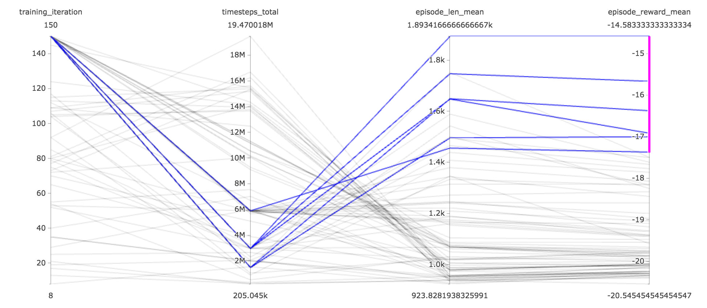

Ray Tune: Hyperparameter Optimization Framework
===============================================

Ray Tune is a hyperparameter optimization framework for long-running tasks such as RL and deep learning training. Ray Tune makes it easy to go from running one or more experiments on a single machine to running on a large cluster with efficient search algorithms.

Getting Started
---------------

To use Ray Tune, add a two-line modification to a function:

.. code-block:: python
   :emphasize-lines: 1,5

    def my_func(config, reporter):  # add the reporter parameter
        import time, numpy as np
        i = 0
        while True:
            reporter(timesteps_total=i, mean_accuracy=i ** config["alpha"])
            i += config["beta"]
            time.sleep(.01)

Then, kick off your experiment:

.. code-block:: python

    tune.register_trainable("my_func", my_func)
    ray.init()

    tune.run_experiments({
        "my_experiment": {
            "run": "my_func",
            "stop": { "mean_accuracy": 100 },
            "config": {
                "alpha": tune.grid_search([0.2, 0.4, 0.6]),
                "beta": tune.grid_search([1, 2]),
            }
        }
    })

This script runs a small grid search over the ``my_func`` function using Ray Tune, reporting status on the command line until the stopping condition of ``mean_accuracy >= 100`` is reached (for metrics like _loss_ that decrease over time, specify `neg_mean_loss <https://github.com/ray-project/ray/blob/master/python/ray/tune/result.py#L40>`__ as a condition instead):

::

    == Status ==
    Using FIFO scheduling algorithm.
    Resources used: 4/8 CPUs, 0/0 GPUs
    Result logdir: ~/ray_results/my_experiment
     - my_func_0_alpha=0.2,beta=1:  RUNNING [pid=6778], 209 s, 20604 ts, 7.29 acc
     - my_func_1_alpha=0.4,beta=1:  RUNNING [pid=6780], 208 s, 20522 ts, 53.1 acc
     - my_func_2_alpha=0.6,beta=1:  TERMINATED [pid=6789], 21 s, 2190 ts, 101 acc
     - my_func_3_alpha=0.2,beta=2:  RUNNING [pid=6791], 208 s, 41004 ts, 8.37 acc
     - my_func_4_alpha=0.4,beta=2:  RUNNING [pid=6800], 209 s, 41204 ts, 70.1 acc
     - my_func_5_alpha=0.6,beta=2:  TERMINATED [pid=6809], 10 s, 2164 ts, 100 acc

In order to report incremental progress, ``my_func`` periodically calls the ``reporter`` function passed in by Ray Tune to return the current timestep and other metrics as defined in `ray.tune.result.TrainingResult <https://github.com/ray-project/ray/blob/master/python/ray/tune/result.py>`__. Incremental results will be synced to local disk on the head node of the cluster.

Learn more `about specifying experiments <tune-config.html>`__ .

Features
--------

Ray Tune has the following features:

-  Scalable implementations of search algorithms such as `Population Based Training (PBT) <pbt.html>`__, `Median Stopping Rule <hyperband.html#median-stopping-rule>`__, and `HyperBand <hyperband.html>`__.

-  Integration with visualization tools such as `TensorBoard <https://www.tensorflow.org/get_started/summaries_and_tensorboard>`__, `rllab's VisKit <https://media.readthedocs.org/pdf/rllab/latest/rllab.pdf>`__, and a `parallel coordinates visualization <https://en.wikipedia.org/wiki/Parallel_coordinates>`__.

-  Flexible trial variant generation, including grid search, random search, and conditional parameter distributions.

-  Resource-aware scheduling, including support for concurrent runs of algorithms that may themselves be parallel and distributed.

Concepts
--------

.. image:: tune-api.svg

Ray Tune schedules a number of *trials* in a cluster. Each trial runs a user-defined Python function or class and is parameterized by a *config* variation passed to the user code.

In order to run any given function, you need to run ``register_trainable`` to a name. This makes all Ray workers aware of the function.

.. autofunction:: ray.tune.register_trainable

Ray Tune provides a ``run_experiments`` function that generates and runs the trials described by the experiment specification. The trials are scheduled and managed by a *trial scheduler* that implements the search algorithm (default is FIFO).

.. autofunction:: ray.tune.run_experiments

Ray Tune can be used anywhere Ray can, e.g. on your laptop with ``ray.init()`` embedded in a Python script, or in an `auto-scaling cluster <autoscaling.html>`__ for massive parallelism.

You can find the code for Ray Tune `here on GitHub <https://github.com/ray-project/ray/tree/master/python/ray/tune>`__.

Trial Schedulers
----------------

By default, Ray Tune schedules trials in serial order with the ``FIFOScheduler`` class. However, you can also specify a custom scheduling algorithm that can early stop trials, perturb parameters, or incorporate suggestions from an external service. Currently implemented trial schedulers include `Population Based Training (PBT) <pbt.html>`__, `Median Stopping Rule <hyperband.html#median-stopping-rule>`__, and `HyperBand <hyperband.html>`__.

.. code-block:: python

    run_experiments({...}, scheduler=AsyncHyperBandScheduler())

Visualizing Results
-------------------

Ray Tune logs trial results to a unique directory per experiment, e.g. ``~/ray_results/my_experiment`` in the above example. The log records are compatible with a number of visualization tools:

To visualize learning in tensorboard, install TensorFlow:

.. code-block:: bash

    $ pip install tensorflow

Then, after you run a experiment, you can visualize your experiment with TensorBoard by specifying the output directory of your results. Note that if you running Ray on a remote cluster, you can forward the tensorboard port to your local machine through SSH using ``ssh -L 6006:localhost:6006 <address>``:

.. code-block:: bash

    $ tensorboard --logdir=~/ray_results/my_experiment

.. image:: ray-tune-tensorboard.png

To use rllab's VisKit (you may have to install some dependencies), run:

.. code-block:: bash

    $ git clone https://github.com/rll/rllab.git
    $ python rllab/rllab/viskit/frontend.py ~/ray_results/my_experiment

.. image:: ray-tune-viskit.png

Finally, to view the results with a `parallel coordinates visualization <https://en.wikipedia.org/wiki/Parallel_coordinates>`__, open `ParallelCoordinatesVisualization.ipynb <https://github.com/ray-project/ray/blob/master/python/ray/tune/ParallelCoordinatesVisualization.ipynb>`__ as follows and run its cells:

.. code-block:: bash

    $ cd $RAY_HOME/python/ray/tune
    $ jupyter-notebook ParallelCoordinatesVisualization.ipynb

Trial Checkpointing
-------------------

To enable checkpointing, you must implement a Trainable class (Trainable functions are not checkpointable, since they never return control back to their caller). The easiest way to do this is to subclass the pre-defined ``Trainable`` class and implement its ``_train``, ``_save``, and ``_restore`` abstract methods `(example) <https://github.com/ray-project/ray/blob/master/python/ray/tune/examples/hyperband_example.py>`__: Implementing this interface is required to support resource multiplexing in schedulers such as HyperBand and PBT.

For TensorFlow model training, this would look something like this `(full tensorflow example) <https://github.com/ray-project/ray/blob/master/python/ray/tune/examples/tune_mnist_ray_hyperband.py>`__:

.. code-block:: python

    class MyClass(Trainable):
        def _setup(self):
            self.saver = tf.train.Saver()
            self.sess = ...
            self.iteration = 0

        def _train(self):
            self.sess.run(...)
            self.iteration += 1

        def _save(self, checkpoint_dir):
            return self.saver.save(
                self.sess, checkpoint_dir + "/save",
                global_step=self.iteration)

        def _restore(self, path):
            return self.saver.restore(self.sess, path)

Additionally, checkpointing can be used to provide fault-tolerance for experiments. This can be enabled by setting ``checkpoint_freq: N`` and ``max_failures: M`` to checkpoint trials every *N* iterations and recover from up to *M* crashes per trial, e.g.:

.. code-block:: python

    run_experiments({
        "my_experiment": {
            ...
            "checkpoint_freq": 10,
            "max_failures": 5,
        },
    })

The class interface that must be implemented to enable checkpointing is as follows:

.. autoclass:: ray.tune.trainable.Trainable

Client API
----------

You can modify an ongoing experiment by adding or deleting trials using the Tune Client API. To do this, verify that you have the ``requests`` library installed:

.. code-block:: bash

    $ pip install requests

To use the Client API, you can start your experiment with ``with_server=True``:

.. code-block:: python

    run_experiments({...}, with_server=True, server_port=4321)

Then, on the client side, you can use the following class. The server address defaults to ``localhost:4321``. If on a cluster, you may want to forward this port (e.g. ``ssh -L <local_port>:localhost:<remote_port> <address>``) so that you can use the Client on your local machine.

.. autoclass:: ray.tune.web_server.TuneClient
    :members:

For an example notebook for using the Client API, see the `Client API Example <https://github.com/ray-project/ray/tree/master/python/ray/tune/TuneClient.ipynb>`__.
