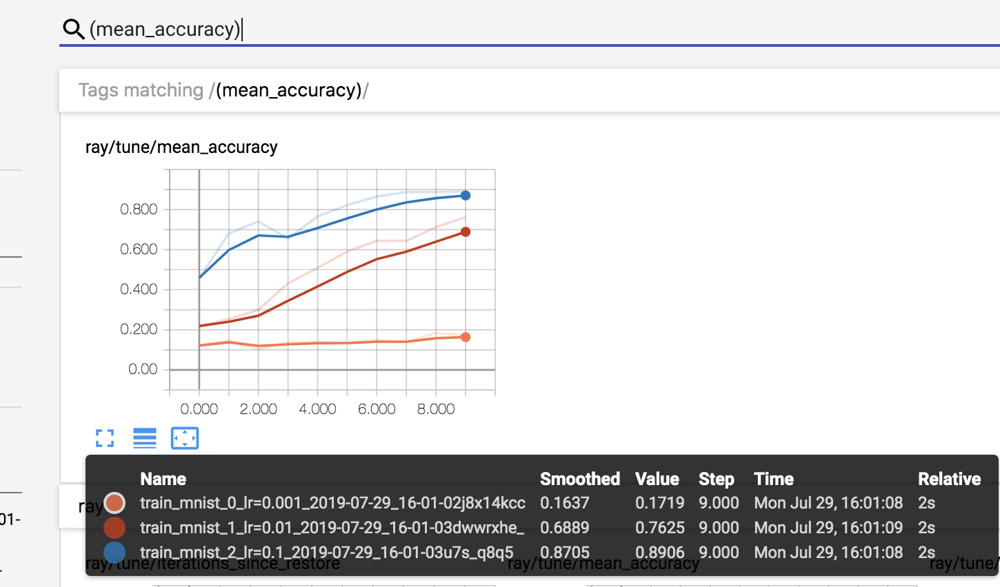

.. _tune-index:

Tune: Scalable Hyperparameter Tuning
====================================

.. image:: images/tune.png
    :scale: 30%
    :align: center

Tune is a Python library for experiment execution and hyperparameter tuning at any scale. Core features:

  * Launch a multi-node :ref:`distributed hyperparameter sweep <tune-distributed>` in less than 10 lines of code.
  * Supports any machine learning framework, :ref:`including PyTorch, XGBoost, MXNet, and Keras<tune-guides-overview>`.
  * Natively `integrates with optimization libraries <tune-searchalg.html>`_ such as `HyperOpt <https://github.com/hyperopt/hyperopt>`_, `Bayesian Optimization <https://github.com/fmfn/BayesianOptimization>`_, and `Facebook Ax <http://ax.dev>`_.
  * Choose among `scalable algorithms <tune-schedulers.html>`_ such as `Population Based Training (PBT)`_, `Vizier's Median Stopping Rule`_, `HyperBand/ASHA`_.
  * Visualize results with `TensorBoard <https://www.tensorflow.org/get_started/summaries_and_tensorboard>`__.

.. _`Population Based Training (PBT)`: tune-schedulers.html#population-based-training-pbt
.. _`Vizier's Median Stopping Rule`: tune-schedulers.html#median-stopping-rule
.. _`HyperBand/ASHA`: tune-schedulers.html#asynchronous-hyperband

**Want to get started?** Head over to the :ref:`60 second Tune tutorial <tune-60-seconds>`.

Quick Start
-----------

To run this example, install the following: ``pip install 'ray[tune]' torch torchvision``.

This example runs a small grid search to train a convolutional neural network using PyTorch and Tune.

.. literalinclude:: ../../python/ray/tune/tests/example.py
   :language: python
   :start-after: __quick_start_begin__
   :end-before: __quick_start_end__

If TensorBoard is installed, automatically visualize all trial results:

.. code-block:: bash

    tensorboard --logdir ~/ray_results

If using TF2 and TensorBoard, Tune will also automatically generate TensorBoard HParams output:

.. tip:: Join the `Ray community slack <https://forms.gle/9TSdDYUgxYs8SA9e8>`_ to discuss Ray Tune (and other Ray libraries)!

Guides/Materials
----------------

Here are some reference materials for Tune:

  * :ref:`Tune Tutorials, Guides, and Examples <tune-guides-overview>`
  * `Code <https://github.com/ray-project/ray/tree/master/python/ray/tune>`__: GitHub repository for Tune

Below are some blog posts and talks about Tune:

 - [blog] `Tune: a Python library for fast hyperparameter tuning at any scale <https://towardsdatascience.com/fast-hyperparameter-tuning-at-scale-d428223b081c>`_
 - [blog] `Cutting edge hyperparameter tuning with Ray Tune <https://medium.com/riselab/cutting-edge-hyperparameter-tuning-with-ray-tune-be6c0447afdf>`_
 - [blog] `Simple hyperparameter and architecture search in tensorflow with Ray Tune <http://louiskirsch.com/ai/ray-tune>`_
 - [slides] `Talk given at RISECamp 2019 <https://docs.google.com/presentation/d/1v3IldXWrFNMK-vuONlSdEuM82fuGTrNUDuwtfx4axsQ/edit?usp=sharing>`_
 - [video] `Talk given at RISECamp 2018 <https://www.youtube.com/watch?v=38Yd_dXW51Q>`_
 - [video] `A Guide to Modern Hyperparameter Optimization (PyData LA 2019) <https://www.youtube.com/watch?v=10uz5U3Gy6E>`_ (`slides <https://speakerdeck.com/richardliaw/a-modern-guide-to-hyperparameter-optimization>`_)

Open Source Projects using Tune
-------------------------------

Here are some of the popular open source repositories and research projects that leverage Tune. Feel free to submit a pull-request adding (or requesting a removal!) of a listed project.

 - `Softlearning <https://github.com/rail-berkeley/softlearning>`_: Softlearning is a reinforcement learning framework for training maximum entropy policies in continuous domains. Includes the official implementation of the Soft Actor-Critic algorithm.
 - `Flambe <https://github.com/asappresearch/flambe>`_: An ML framework to accelerate research and its path to production. See `flambe.ai <flambe.ai>`_.
 - `Population Based Augmentation <https://github.com/arcelien/pba>`_: Population Based Augmentation (PBA) is a algorithm that quickly and efficiently learns data augmentation functions for neural network training. PBA matches state-of-the-art results on CIFAR with one thousand times less compute.
 - `Fast AutoAugment by Kakao <https://github.com/kakaobrain/fast-autoaugment>`_: Fast AutoAugment (Accepted at NeurIPS 2019) learns augmentation policies using a more efficient search strategy based on density matching.
 - `Allentune <https://github.com/allenai/allentune>`_: Hyperparameter Search for AllenNLP from AllenAI.
 - `machinable <https://github.com/frthjf/machinable>`_: A modular configuration system for machine learning research. See `machinable.org <machinable.org>`_.

Citing Tune
-----------

If Tune helps you in your academic research, you are encouraged to cite `our paper <https://arxiv.org/abs/1807.05118>`__. Here is an example bibtex:

.. code-block:: tex

    @article{liaw2018tune,
        title={Tune: A Research Platform for Distributed Model Selection and Training},
        author={Liaw, Richard and Liang, Eric and Nishihara, Robert
                and Moritz, Philipp and Gonzalez, Joseph E and Stoica, Ion},
        journal={arXiv preprint arXiv:1807.05118},
        year={2018}
    }
