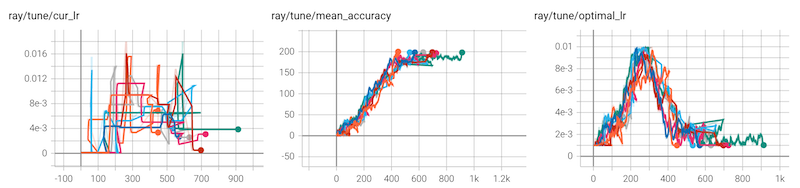

:orphan:

PBT Function Example
~~~~~~~~~~~~~~~~~~~~

The following script produces the following results. For a population of 8 trials,
the PBT learning rate schedule roughly matches the optimal learning rate schedule.

.. literalinclude:: /../../python/ray/tune/examples/pbt_function.py
