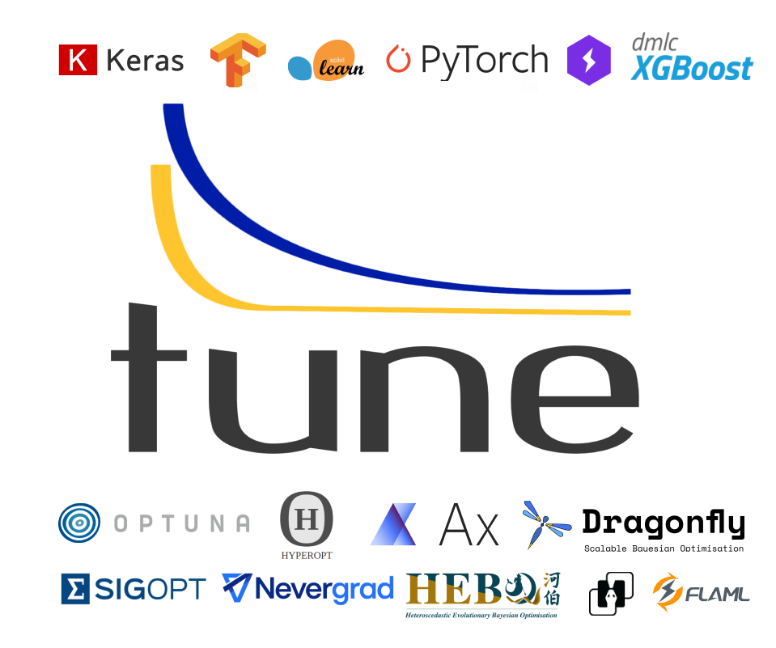

.. include:: /_includes/tune/announcement.rst

.. _tune-main:

Tune: Scalable Hyperparameter Tuning
====================================

Tune is a Python library for experiment execution and hyperparameter tuning at any scale.
You can tune your favorite machine learning framework, :ref:`including PyTorch, XGBoost, TensorFlow and Keras <tune-guides>`,
and choose among state of the art algorithms such as :ref:`Population Based Training (PBT) <tune-scheduler-pbt>`,
:ref:`BayesOptSearch <bayesopt>`, or :ref:`HyperBand/ASHA <tune-scheduler-hyperband>`.
Tune integrates with a wide range of hyperparameter optimization tools, like
:ref:`Optuna, Hyperopt, Ax, and Nevergrad <tune-search-alg>`, to name a few.

.. tabbed:: Examples

    Learn how to use Ray Tune for various machine learning frameworks in just a few steps.
    **Click on the tabs to see code examples**.

.. tabbed:: Quickstart

    .. tip:: We'd love to hear your feedback on using Tune - `get in touch <https://forms.gle/PTRvGLbKRdUfuzQo9>`_!

    To run this example, install the following: ``pip install "ray[tune]"``.

    In this quick-start example you `minimize` a simple function of the form ``f(x) = a**2 + b``, our `objective` function.
    The closer ``a`` is to zero and the smaller ``b`` is, the smaller the total value of ``f(x)``.
    We will define a so-called `search space` for  ``a`` and ``b`` and let Ray Tune explore the space for good values.

    .. literalinclude:: ../../../python/ray/tune/tests/example.py
       :language: python
       :start-after: __quick_start_begin__
       :end-before: __quick_start_end__

.. tabbed:: Keras+Hyperopt

    To tune your Keras models with Hyperopt, you wrap your model in an objective function whose ``config`` you
    can access for selecting hyperparameters.
    In the example below we only tune the ``activation`` parameter of the first layer of the model, but you can
    tune any parameter of the model you want.
    After defining the search space, you can simply initialize the ``HyperOptSearch`` object and pass it to ``run``.
    It's important to tell Ray Tune which metric you want to optimize and whether you want to maximize or minimize it.

    .. literalinclude:: doc_code/keras_hyperopt.py
        :language: python
        :start-after: __keras_hyperopt_start__
        :end-before: __keras_hyperopt_end__

.. tabbed:: PyTorch+Optuna

    To tune your PyTorch models with Optuna, you wrap your model in an objective function whose ``config`` you
    can access for selecting hyperparameters.
    In the example below we only tune the ``momentum`` and learning rate (``lr``) parameters of the model's optimizer,
    but you can tune any other model parameter you want.
    After defining the search space, you can simply initialize the ``OptunaSearch`` object and pass it to ``run``.
    It's important to tell Ray Tune which metric you want to optimize and whether you want to maximize or minimize it.
    We stop tuning this training run after ``5`` iterations, but you can easily define other stopping rules as well.

    .. literalinclude:: doc_code/pytorch_optuna.py
        :language: python
        :start-after: __pytorch_optuna_start__
        :end-before: __pytorch_optuna_end__

With Tune you can also launch a multi-node :ref:`distributed hyperparameter sweep <tune-distributed-ref>`
in less than 10 lines of code.
It automatically manages :ref:`checkpoints <tune-checkpoint-syncing>` and logging to :ref:`TensorBoard <tune-logging>`.
And you can move your models from training to serving on the same infrastructure with `Ray Serve`_.

.. _`Ray Serve`: ../serve/index.html

.. panels::
    :container: text-center
    :column: col-md-4 px-2 py-2
    :card:

    **Getting Started**
    ^^^

    In our getting started tutorial you will learn how to tune a PyTorch model
    effectively with Tune.

    +++
    .. link-button:: tune-tutorial
        :type: ref
        :text: Get Started with Tune
        :classes: btn-outline-info btn-block
    ---

    **Key Concepts**
    ^^^

    Understand the key concepts behind Ray Tune.
    Learn about tune runs, search algorithms, schedulers and other features.

    +++
    .. link-button:: tune-60-seconds
        :type: ref
        :text: Tune's Key Concepts
        :classes: btn-outline-info btn-block
    ---

    **User Guides**
    ^^^

    Our guides teach you about key features of Tune,
    such as distributed training or early stopping.

    +++
    .. link-button:: tune-guides
        :type: ref
        :text: Learn How To Use Tune
        :classes: btn-outline-info btn-block
    ---

    **Examples**
    ^^^

    In our examples you can find practical tutorials for
    scikit-learn, Keras, TensorFlow, PyTorch, mlflow, and many more.

    +++
    .. link-button:: tune-examples-ref
        :type: ref
        :text: Ray Tune Examples
        :classes: btn-outline-info btn-block
    ---

    **Ray Tune FAQ**
    ^^^

    Find answers to commonly asked questions in our detailed FAQ.

    +++
    .. link-button:: tune-faq
        :type: ref
        :text: Ray Tune FAQ
        :classes: btn-outline-info btn-block
    ---

    **Ray Tune API**
    ^^^

    Get more in-depth information about the Ray Tune API, including all about search spaces,
    algorithms and training configurations.

    +++
    .. link-button:: tune-api-ref
        :type: ref
        :text: Read the API Reference
        :classes: btn-outline-info btn-block

Why choose Tune?
----------------

There are many other hyperparameter optimization libraries out there.
If you're new to Tune, you're probably wondering, "what makes Tune different?"

.. dropdown:: Cutting-Edge Optimization Algorithms
    :animate: fade-in-slide-down

    As a user, you're probably looking into hyperparameter optimization because you want to quickly increase your
    model performance.

    Tune enables you to leverage a variety of these cutting edge optimization algorithms, reducing the cost of tuning
    by `terminating bad runs early <tune-scheduler-hyperband>`_,
    :ref:`choosing better parameters to evaluate <tune-search-alg>`, or even
    :ref:`changing the hyperparameters during training <tune-scheduler-pbt>` to optimize schedules.

.. dropdown:: First-class Developer Productivity
    :animate: fade-in-slide-down

    A key problem with many hyperparameter optimization frameworks is the need to restructure
    your code to fit the framework.
    With Tune, you can optimize your model just by :ref:`adding a few code snippets <tune-tutorial>`.

    Also, Tune removes boilerplate from your code training workflow,
    automatically :ref:`manages checkpoints <tune-checkpoint-syncing>` and
    :ref:`logs results to tools <tune-logging>` such as MLflow and TensorBoard, while also being highly customizable.

.. dropdown:: Multi-GPU & Distributed Training Out Of The Box
    :animate: fade-in-slide-down

    Hyperparameter tuning is known to be highly time-consuming, so it is often necessary to parallelize this process.
    Most other tuning frameworks require you to implement your own multi-process framework or build your own
    distributed system to speed up hyperparameter tuning.

    However, Tune allows you to transparently :ref:`parallelize across multiple GPUs and multiple nodes <tune-parallelism>`.
    Tune even has seamless :ref:`fault tolerance and cloud support <tune-distributed-ref>`, allowing you to scale up
    your hyperparameter search by 100x while reducing costs by up to 10x by using cheap preemptible instances.

.. dropdown:: Coming From Another Hyperparameter Optimization Tool?
    :animate: fade-in-slide-down

    You might be already using an existing hyperparameter tuning tool such as HyperOpt or Bayesian Optimization.

    In this situation, Tune actually allows you to power up your existing workflow.
    Tune's :ref:`Search Algorithms <tune-search-alg>` integrate with a variety of popular hyperparameter tuning
    libraries (such as Nevergrad or HyperOpt) and allow you to seamlessly scale up your optimization
    process - without sacrificing performance.

Projects using Tune
-------------------

Here are some of the popular open source repositories and research projects that leverage Tune.
Feel free to submit a pull-request adding (or requesting a removal!) of a listed project.

- `Softlearning <https://github.com/rail-berkeley/softlearning>`_: Softlearning is a reinforcement learning framework for training maximum entropy policies in continuous domains. Includes the official implementation of the Soft Actor-Critic algorithm.
- `Flambe <https://github.com/asappresearch/flambe>`_: An ML framework to accelerate research and its path to production. See `flambe.ai <https://flambe.ai>`_.
- `Population Based Augmentation <https://github.com/arcelien/pba>`_: Population Based Augmentation (PBA) is a algorithm that quickly and efficiently learns data augmentation functions for neural network training. PBA matches state-of-the-art results on CIFAR with one thousand times less compute.
- `Fast AutoAugment by Kakao <https://github.com/kakaobrain/fast-autoaugment>`_: Fast AutoAugment (Accepted at NeurIPS 2019) learns augmentation policies using a more efficient search strategy based on density matching.
- `Allentune <https://github.com/allenai/allentune>`_: Hyperparameter Search for AllenNLP from AllenAI.
- `machinable <https://github.com/frthjf/machinable>`_: A modular configuration system for machine learning research. See `machinable.org <https://machinable.org>`_.
- `NeuroCard <https://github.com/neurocard/neurocard>`_: NeuroCard (Accepted at VLDB 2021) is a neural cardinality estimator for multi-table join queries. It uses state of the art deep density models to learn correlations across relational database tables.

Learn More
----------

Below you can find blog posts and talks about Ray Tune:

- [blog] `Tune: a Python library for fast hyperparameter tuning at any scale <https://towardsdatascience.com/fast-hyperparameter-tuning-at-scale-d428223b081c>`_
- [blog] `Cutting edge hyperparameter tuning with Ray Tune <https://medium.com/riselab/cutting-edge-hyperparameter-tuning-with-ray-tune-be6c0447afdf>`_
- [blog] `Simple hyperparameter and architecture search in tensorflow with Ray Tune <http://louiskirsch.com/ai/ray-tune>`_
- [slides] `Talk given at RISECamp 2019 <https://docs.google.com/presentation/d/1v3IldXWrFNMK-vuONlSdEuM82fuGTrNUDuwtfx4axsQ/edit?usp=sharing>`_
- [video] `Talk given at RISECamp 2018 <https://www.youtube.com/watch?v=38Yd_dXW51Q>`_
- [video] `A Guide to Modern Hyperparameter Optimization (PyData LA 2019) <https://www.youtube.com/watch?v=10uz5U3Gy6E>`_ (`slides <https://speakerdeck.com/richardliaw/a-modern-guide-to-hyperparameter-optimization>`_)

Citing Tune
-----------

If Tune helps you in your academic research, you are encouraged to cite `our paper <https://arxiv.org/abs/1807.05118>`__.
Here is an example bibtex:

.. code-block:: tex

    @article{liaw2018tune,
        title={Tune: A Research Platform for Distributed Model Selection and Training},
        author={Liaw, Richard and Liang, Eric and Nishihara, Robert
                and Moritz, Philipp and Gonzalez, Joseph E and Stoica, Ion},
        journal={arXiv preprint arXiv:1807.05118},
        year={2018}
    }

.. include:: /_includes/tune/announcement_bottom.rst
