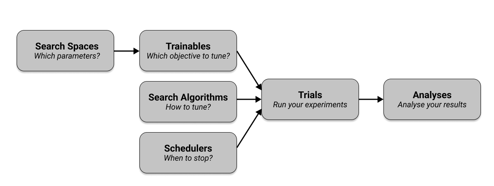

.. _tune-60-seconds:

============
Key Concepts
============

.. TODO: should we introduce checkpoints as well?

Let's quickly walk through the key concepts you need to know to use Tune.
If you want to see practical tutorials right away, go visit our :ref:`user guides<tune-guides>`.
In essence, Tune has six crucial components that you need to understand.

First, you define the hyperparameters you want to tune in a `search space` and pass them into a ``Trainable``
that specifies the objective you want to tune.
Then you select a `search algorithm` to effectively optimize your parameters and optionally use a
`scheduler` to stop searches early and speed up your experiments.
Together with other configuration, your ``Trainable``, algorithm, and scheduler are passed into ``tune.run()``,
which runs your experiments and creates `trials`.
These trials can then be used in `analyses` to inspect your experiment results.
The following figure shows an overview of these components, which we cover in detail in the next sections.

Trainables
----------

In short, a :ref:`Trainable<trainable-docs>` is an object that you can pass into a Tune run.
Ray Tune has two ways of defining a ``Trainable``, namely the :ref:`Function API <tune-function-api>`
and the :ref:`Class API<tune-class-api>`.
Both are valid ways of defining a ``Trainable``, but the ``Function API`` is generally recommended and is used
throughout the rest of this guide.

Let's say we want to optimize a simple objective function like ``a (x ** 2) + b`` in which ``a`` and ``b`` are the
hyperparameters we want to tune to `minimize` the objective.
Since the objective also has a variable ``x``, we need to test for different values of ``x``.
Given concrete choices for ``a``, ``b`` and ``x`` we can evaluate the objective function and get a `score` to minimize.

.. tabbed:: Function API

    With the :ref:`the function-based API <tune-function-api>` you create a function (here called ``trainable``) that
    takes in a dictionary of hyperparameters.
    This function computes a ``score`` in a "training loop" and `reports` this score back to Tune:

    .. literalinclude:: doc_code/key_concepts.py
        :language: python
        :start-after: __function_api_start__
        :end-before: __function_api_end__

    Note that we use ``tune.report(...)`` to report the intermediate ``score`` in the training loop, which can be useful
    in many machine learning tasks.
    If you just want to report the final ``score`` outside of this loop, you can simply return the score at the
    end of the ``trainable`` function with ``return {"score": score}``.
    You can also use ``yield {"score": score}`` instead of ``tune.report()``.

.. tabbed:: Class API

    Here's an example of specifying the objective function using the :ref:`class-based API <tune-class-api>`:

    .. literalinclude:: doc_code/key_concepts.py
        :language: python
        :start-after: __class_api_start__
        :end-before: __class_api_end__

    .. tip:: Do not use ``tune.report`` within a ``Trainable`` class.
    .. TODO: why not? explain.

Learn more about the details of :ref:`Trainables here<trainable-docs>`
and :ref:`have a look at our examples <tune-general-examples>`.
Next, let's have a closer look at what the ``config`` dictionary is that you pass into your trainables.

Search Spaces
-------------

To optimize your *hyperparameters*, you have to define a *search space*.
A search space defines valid values for your hyperparameters and can specify
how these values are sampled (e.g. from a uniform distribution or a normal
distribution).

Tune offers various functions to define search spaces and sampling methods.
:ref:`You can find the documentation of these search space definitions here <tune-sample-docs>`.

Here's an example covering all search space functions. Again,
:ref:`here is the full explanation of all these functions <tune-sample-docs>`.

.. literalinclude:: doc_code/key_concepts.py
    :language: python
    :start-after: __config_start__
    :end-before: __config_end__

Trials
------

You use :ref:`tune.run <tune-run-ref>` to execute and manage hyperparameter tuning and generate your `trials`.
At a minimum, your ``tune.run()`` call takes in a trainable as first argument, and a ``config`` dictionary
to define your search space.

The ``tune.run()`` function also provides many features such as :ref:`logging <tune-logging>`,
:ref:`checkpointing <tune-checkpoint-syncing>`, and :ref:`early stopping <tune-stopping-ref>`.
Continuing with the example defined earlier (minimizing ``a (x ** 2) + b``), a simple Tune run with a simplistic
search space for ``a`` and ``b`` would look like this:

.. literalinclude:: doc_code/key_concepts.py
    :language: python
    :start-after: __run_tunable_start__
    :end-before: __run_tunable_end__

``tune.run`` will generate a couple of hyperparameter configurations from its arguments,
wrapping them into :ref:`Trial objects <trial-docstring>`.

Trials contain a lot of information.
For instance, you can get the hyperparameter configuration used (``trial.config``), the trial ID (``trial.trial_id``),
the trial's resource specification (``resources_per_trial`` or ``trial.placement_group_factory``) and many other values.

``tune.run`` will execute until all trials stop or error.
Here's an example output of a trial run:

.. TODO: how to make sure this doesn't get outdated?
.. code-block:: bash

    == Status ==
    Memory usage on this node: 11.4/16.0 GiB
    Using FIFO scheduling algorithm.
    Resources requested: 1/12 CPUs, 0/0 GPUs, 0.0/3.17 GiB heap, 0.0/1.07 GiB objects
    Result logdir: /Users/foo/ray_results/myexp
    Number of trials: 1 (1 RUNNING)
    +----------------------+----------+---------------------+-----------+--------+--------+----------------+-------+
    | Trial name           | status   | loc                 |         a |      b |  score | total time (s) |  iter |
    |----------------------+----------+---------------------+-----------+--------+--------+----------------+-------|
    | Trainable_a826033a | RUNNING  | 10.234.98.164:31115 | 0.303706  | 0.0761 | 0.1289 |        7.54952 |    15 |
    +----------------------+----------+---------------------+-----------+--------+--------+----------------+-------+

You can also easily run just 10 trials by specifying the number of samples (``num_samples``).
Tune automatically :ref:`determines how many trials will run in parallel <tune-parallelism>`.

.. literalinclude:: doc_code/key_concepts.py
    :language: python
    :start-after: __run_tunable_samples_start__
    :end-before: __run_tunable_samples_end__

Finally, you can use more interesting search spaces to optimize your hyperparameters
via Tune's :ref:`search space API <tune-default-search-space>`, like using random samples or grid search.
Here's an example of uniformly sampling between ``[0, 1]`` for ``a`` and ``b``:

.. literalinclude:: doc_code/key_concepts.py
    :language: python
    :start-after: __search_space_start__
    :end-before: __search_space_end__

To learn more about the various ways of configuring your Tune runs,
check out the :ref:`tune.run() API reference<tune-run-ref>`.

Search Algorithms
-----------------

To optimize the hyperparameters of your training process, you use
a :ref:`Search Algorithm <tune-search-alg>` which suggests hyperparameter configurations.

For instance, to use Tune with Bayesian optimization (make sure to first run ``pip install bayesian-optimization``),
we can define an ``algo`` using ``BayesOptSearch``.
Simply pass in a ``search_alg`` argument to ``tune.run``:

.. literalinclude:: doc_code/key_concepts.py
    :language: python
    :start-after: __bayes_start__
    :end-before: __bayes_end__

Tune has SearchAlgorithms that integrate with many popular **optimization** libraries,
such as :ref:`Nevergrad <nevergrad>` and :ref:`HyperOpt <tune-hyperopt>`.
Tune automatically converts the provided search space into the search
spaces the search algorithms and underlying libraries expect.
See the :ref:`Search Algorithm API documentation <tune-search-alg>` for more details.

Note that in the example above we  tell Tune to ``stop`` after ``20`` training iterations.
This way of stopping trials with explicit rules is useful, but in many cases we can do even better with
`schedulers`.

Schedulers
----------

To make your training process more efficient, you can use a :ref:`Trial Scheduler <tune-schedulers>`.
For instance, in our ``trainable`` example minimizing a function in a training loop, we used ``tune.report()``.
This reported `incremental` results, given a hyperparameter configuration selected by a search algorithm.
Based on these reported results, a Tune scheduler can decide whether to stop the trial early or not.

In short, schedulers can stop, pause, or tweak the
hyperparameters of running trials, potentially making your hyperparameter tuning process much faster.
Unlike search algorithms, :ref:`Trial Scheduler <tune-schedulers>` do not select which hyperparameter
configurations to evaluate.

TODO
However, you can use them together.

Here's a quick example of using the so-called ``HyperBand`` scheduler to tune an experiment.
Just pass in a ``scheduler`` argument to ``tune.run()``:

.. literalinclude:: doc_code/key_concepts.py
    :language: python
    :start-after: __hyperband_start__
    :end-before: __hyperband_end__

:ref:`Population-based Training <tune-scheduler-pbt>` and :ref:`ASHA <tune-scheduler-hyperband>`
are other examples of popular optimization algorithms implemented as Trial Schedulers.

Learn more about trial schedulers in :ref:`the scheduler API documentation<schedulers-ref>`.

.. _tune-concepts-analysis:

Analyses
--------

``tune.run`` returns an :ref:`ExperimentAnalysis <tune-analysis-docs>` object which has methods you can use for
analyzing your training.
The following example shows you how to access various metrics from an ``analysis`` object, like the best available
trial, or the best hyperparameter configuration for that trial:

.. literalinclude:: doc_code/key_concepts.py
    :language: python
    :start-after: __analysis_start__
    :end-before: __analysis_end__

This object can also retrieve all training runs as dataframes,
allowing you to do ad-hoc data analysis over your results.

.. literalinclude:: doc_code/key_concepts.py
    :language: python
    :start-after: __results_start__
    :end-before: __results_end__

What's Next?
-------------

Now that you have a working understanding of Tune, check out:

* :ref:`tune-guides`: Tutorials for using Tune with your preferred machine learning library.
* :doc:`/tune/examples/index`: End-to-end examples and templates for using Tune with your preferred machine learning library.
* :ref:`tune-tutorial`: A simple tutorial that walks you through the process of setting up a Tune experiment.

Further Questions or Issues?
~~~~~~~~~~~~~~~~~~~~~~~~~~~~

.. include:: /_includes/_help.rst
