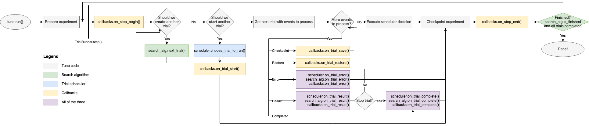

How does Tune work?
===================

This page provides an overview of Tune's inner workings.
We describe in detail what happens when you call ``tune.run()``, what the lifecycle of a Tune trial looks like
and what the architectural components of Tune are.

.. tip:: Before you continue, be sure to have read :ref:`the Tune Key Concepts page <tune-60-seconds>`.

What happens in ``tune.run``?
-----------------------------

When calling the following:

.. code-block:: python

    space = {"x": tune.uniform(0, 1)}
    tune.run(my_trainable, config=space, num_samples=10)

The provided ``my_trainable`` is evaluated multiple times in parallel
with different hyperparameters (sampled from ``uniform(0, 1)``).

Every Tune run consists of "driver process" and many "worker processes".
The driver process is the python process that calls ``tune.run`` (which calls ``ray.init()`` underneath the hood).
The Tune driver process runs on the node where you run your script (which calls ``tune.run``),
while Ray Tune trainable "actors" run on any node (either on the same node or on worker nodes (distributed Ray only)).

.. note:: :ref:`Ray Actors <actor-guide>` allow you to parallelize an instance of a class in Python.
    When you instantiate a class that is a Ray actor, Ray will start a instance of that class on a separate process
    either on the same machine (or another distributed machine, if running a Ray cluster).
    This actor can then asynchronously execute method calls and maintain its own internal state.

The driver spawns parallel worker processes (:ref:`Ray actors <actor-guide>`)
that are responsible for evaluating each trial using its hyperparameter configuration and the provided trainable
(see the `ray trial executor source code <https://github.com/ray-project/ray/blob/master/python/ray/tune/ray_trial_executor.py>`__).

While the Trainable is executing (:ref:`trainable-execution`), the Tune Driver communicates with each actor
via actor methods to receive intermediate training results and pause/stop actors (see :ref:`trial-lifecycle`).

When the Trainable terminates (or is stopped), the actor is also terminated.

.. _trainable-execution:

The execution of a trainable
~~~~~~~~~~~~~~~~~~~~~~~~~~~~

Tune uses :ref:`Ray actors <actor-guide>` to parallelize the evaluation of multiple hyperparameter configurations.
Each actor is a Python process that executes an instance of the user-provided Trainable.

The definition of the user-provided Trainable will be
:ref:`serialized via cloudpickle <serialization-guide>`) and sent to each actor process.
Each Ray actor will start an instance of the Trainable to be executed.

If the Trainable is a class, it will be executed iteratively by calling ``train/step``.
After each invocation, the driver is notified that a "result dict" is ready.
The driver will then pull the result via ``ray.get``.

If the trainable is a callable or a function, it will be executed on the Ray actor process on a separate execution thread.
Whenever ``tune.report`` is called, the execution thread is paused and waits for the driver to pull a
result (see `function_trainable.py <https://github.com/ray-project/ray/blob/master/python/ray/tune/trainable/function_trainable.py>`__.
After pulling, the actor’s execution thread will automatically resume.

Resource Management in Tune
~~~~~~~~~~~~~~~~~~~~~~~~~~~

Before running a trial, the Ray Tune driver will check whether there are available
resources on the cluster (see :ref:`resource-requirements`).
It will compare the available resources with the resources required by the trial.

If there is space on the cluster, then the Tune Driver will start a Ray actor (worker).
This actor will be scheduled and executed on some node where the resources are available.
See :doc:`tune-resources` for more information.

.. _trial-lifecycle:

Lifecycle of a Trial
--------------------

A trial's life cycle consists of 6 stages:

* **Initialization** (generation): A trial is first generated as a hyperparameter sample,
  and its parameters are configured according to what was provided in tune.run.
  Trials are then placed into a queue to be executed (with status PENDING).

* **PENDING**: A pending trial is a trial to be executed on the machine.
  Every trial is configured with resource values. Whenever the trial’s resource values are available,
  Tune will run the trial (by starting a ray actor holding the config and the training function.

* **RUNNING**: A running trial is assigned a Ray Actor. There can be multiple running trials in parallel.
  See the :ref:`trainable execution <trainable-execution>` section for more details.

* **ERRORED**: If a running trial throws an exception, Tune will catch that exception and mark the trial as errored.
  Note that exceptions can be propagated from an actor to the main Tune driver process.
  If max_retries is set, Tune will set the trial back into "PENDING" and later start it from the last checkpoint.

* **TERMINATED**: A trial is terminated if it is stopped by a Stopper/Scheduler.
  If using the Function API, the trial is also terminated when the function stops.

* **PAUSED**: A trial can be paused by a Trial scheduler. This means that the trial’s actor will be stopped.
  A paused trial can later be resumed from the most recent checkpoint.

Tune's Architecture
-------------------

.. image:: ../../images/tune-arch.png

The blue boxes refer to internal components, while green boxes are public-facing.

Tune's main components consist of ``TrialRunner``, ``Trial`` objects, ``TrialExecutor``, ``SearchAlg``,
``TrialScheduler``, and ``Trainable``.

.. _trial-runner-flow:

This is an illustration of the high-level training flow and how some of the components interact:

*Note: This figure is horizontally scrollable*

TrialRunner
~~~~~~~~~~~
[`source code <https://github.com/ray-project/ray/blob/master/python/ray/tune/trial_runner.py>`__]
This is the main driver of the training loop. This component
uses the TrialScheduler to prioritize and execute trials,
queries the SearchAlgorithm for new
configurations to evaluate, and handles the fault tolerance logic.

**Fault Tolerance**: The TrialRunner executes checkpointing if ``checkpoint_freq``
is set, along with automatic trial restarting in case of trial failures (if ``max_failures`` is set).
For example, if a node is lost while a trial (specifically, the corresponding
Trainable of the trial) is still executing on that node and checkpointing
is enabled, the trial will then be reverted to a ``"PENDING"`` state and resumed
from the last available checkpoint when it is run.
The TrialRunner is also in charge of checkpointing the entire experiment execution state
upon each loop iteration. This allows users to restart their experiment
in case of machine failure.

See the docstring at :ref:`trialrunner-docstring`.

Trial objects
~~~~~~~~~~~~~
[`source code <https://github.com/ray-project/ray/blob/master/python/ray/tune/trial.py>`__]
This is an internal data structure that contains metadata about each training run. Each Trial
object is mapped one-to-one with a Trainable object but are not themselves
distributed/remote. Trial objects transition among
the following states: ``"PENDING"``, ``"RUNNING"``, ``"PAUSED"``, ``"ERRORED"``, and
``"TERMINATED"``.

See the docstring at :ref:`trial-docstring`.

RayTrialExecutor
~~~~~~~~~~~~~~~~
[`source code <https://github.com/ray-project/ray/blob/master/python/ray/tune/ray_trial_executor.py>`__]
The RayTrialExecutor is a component that interacts with the underlying execution framework.
It also manages resources to ensure the cluster isn't overloaded.

See the docstring at :ref:`raytrialexecutor-docstring`.

SearchAlg
~~~~~~~~~
[`source code <https://github.com/ray-project/ray/tree/master/python/ray/tune/search>`__]
The SearchAlgorithm is a user-provided object
that is used for querying new hyperparameter configurations to evaluate.

SearchAlgorithms will be notified every time a trial finishes
executing one training step (of ``train()``), every time a trial
errors, and every time a trial completes.

TrialScheduler
~~~~~~~~~~~~~~
[`source code <https://github.com/ray-project/ray/blob/master/python/ray/tune/schedulers>`__]
TrialSchedulers operate over a set of possible trials to run,
prioritizing trial execution given available cluster resources.

TrialSchedulers are given the ability to kill or pause trials,
and also are given the ability to reorder/prioritize incoming trials.

Trainables
~~~~~~~~~~
[`source code <https://github.com/ray-project/ray/blob/master/python/ray/tune/trainable/trainable.py>`__]
These are user-provided objects that are used for
the training process. If a class is provided, it is expected to conform to the
Trainable interface. If a function is provided. it is wrapped into a
Trainable class, and the function itself is executed on a separate thread.

Trainables will execute one step of ``train()`` before notifying the TrialRunner.
