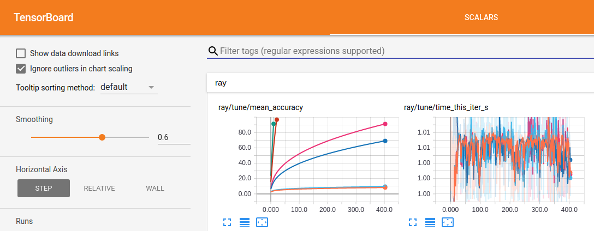
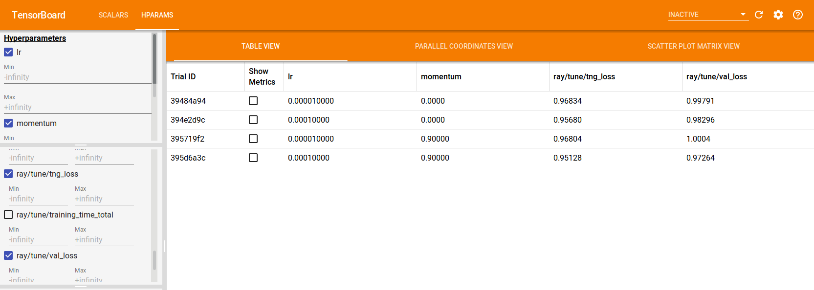

Logging and Outputs in Tune
===========================

By default, Tune logs results for TensorBoard, CSV, and JSON formats.
If you need to log something lower level like model weights or gradients, see :ref:`Trainable Logging <trainable-logging>`.
You can learn more about logging and customizations here: :ref:`loggers-docstring`.

.. _tune-logging:

How to configure logging in Tune?
---------------------------------

Tune will log the results of each trial to a sub-folder under a specified local dir, which defaults to ``~/ray_results``.

.. code-block:: bash

    # This logs to two different trial folders:
    # ~/ray_results/trainable_name/trial_name_1 and ~/ray_results/trainable_name/trial_name_2
    # trainable_name and trial_name are autogenerated.
    tuner = tune.Tuner(trainable, run_config=air.RunConfig(num_samples=2))
    results = tuner.fit()

You can specify the ``storage_path`` and ``trainable_name``:

.. code-block:: python

    # This logs to 2 different trial folders:
    # ./results/test_experiment/trial_name_1 and ./results/test_experiment/trial_name_2
    # Only trial_name is autogenerated.
    tuner = tune.Tuner(trainable,
        tune_config=tune.TuneConfig(num_samples=2),
        run_config=air.RunConfig(storage_path="./results", name="test_experiment"))
    results = tuner.fit()

To learn more about Trials, see its detailed API documentation: :ref:`trial-docstring`.

.. _tensorboard:

How to log your Tune runs to TensorBoard?
-----------------------------------------

Tune automatically outputs TensorBoard files during ``Tuner.fit()``.
To visualize learning in tensorboard, install tensorboardX:

.. code-block:: bash

    $ pip install tensorboardX

Then, after you run an experiment, you can visualize your experiment with TensorBoard by specifying
the output directory of your results.

.. code-block:: bash

    $ tensorboard --logdir=~/ray_results/my_experiment

If you are running Ray on a remote multi-user cluster where you do not have sudo access,
you can run the following commands to make sure tensorboard is able to write to the tmp directory:

.. code-block:: bash

    $ export TMPDIR=/tmp/$USER; mkdir -p $TMPDIR; tensorboard --logdir=~/ray_results

If using TensorFlow ``2.x``, Tune also automatically generates TensorBoard HParams output, as shown below:

.. code-block:: python

    tuner = tune.Tuner(
        ...,
        param_space={
            "lr": tune.grid_search([1e-5, 1e-4]),
            "momentum": tune.grid_search([0, 0.9])
        }
    )
    results = tuner.fit()

.. _tune-console-output:

How to control console output with Tune?
----------------------------------------

User-provided fields will be outputted automatically on a best-effort basis.
You can use a :ref:`Reporter <tune-reporter-doc>` object to customize the console output.

.. code-block:: bash

    == Status ==
    Memory usage on this node: 11.4/16.0 GiB
    Using FIFO scheduling algorithm.
    Resources requested: 4/12 CPUs, 0/0 GPUs, 0.0/3.17 GiB heap, 0.0/1.07 GiB objects
    Result logdir: /Users/foo/ray_results/myexp
    Number of trials: 4 (4 RUNNING)
    +----------------------+----------+---------------------+-----------+--------+--------+----------------+-------+
    | Trial name           | status   | loc                 |    param1 | param2 |    acc | total time (s) |  iter |
    |----------------------+----------+---------------------+-----------+--------+--------+----------------+-------|
    | MyTrainable_a826033a | RUNNING  | 10.234.98.164:31115 | 0.303706  | 0.0761 | 0.1289 |        7.54952 |    15 |
    | MyTrainable_a8263fc6 | RUNNING  | 10.234.98.164:31117 | 0.929276  | 0.158  | 0.4865 |        7.0501  |    14 |
    | MyTrainable_a8267914 | RUNNING  | 10.234.98.164:31111 | 0.068426  | 0.0319 | 0.9585 |        7.0477  |    14 |
    | MyTrainable_a826b7bc | RUNNING  | 10.234.98.164:31112 | 0.729127  | 0.0748 | 0.1797 |        7.05715 |    14 |
    +----------------------+----------+---------------------+-----------+--------+--------+----------------+-------+

.. _tune-log_to_file:

How to redirect Trainable logs to files in a Tune run?
---------------------------------------------------------

In Tune, Trainables are run as remote actors. By default, Ray collects actors' stdout and stderr and prints them to
the head process (see :ref:`ray worker logs <ray-worker-logs>` for more information).
Logging that happens within Tune Trainables follows this handling by default.
However, if you wish to collect Trainable logs in files for analysis, Tune offers the option
``log_to_file`` for this.
This applies to print statements, ``warnings.warn`` and ``logger.info`` etc.

By passing ``log_to_file=True`` to ``air.RunConfig``, which is taken in by ``Tuner``, stdout and stderr will be logged
to ``trial_logdir/stdout`` and ``trial_logdir/stderr``, respectively:

.. code-block:: python

    tuner = tune.Tuner(
        trainable,
        run_config=air.RunConfig(log_to_file=True)
    )
    results = tuner.fit()

If you would like to specify the output files, you can either pass one filename,
where the combined output will be stored, or two filenames, for stdout and stderr,
respectively:

.. code-block:: python

    tuner = tune.Tuner(
        trainable,
        run_config=air.RunConfig(log_to_file="std_combined.log")
    )
    tuner.fit()

    tuner = tune.Tuner(
        trainable,
        run_config=air.RunConfig(log_to_file=("my_stdout.log", "my_stderr.log")))
    results = tuner.fit()

The file names are relative to the trial's logdir. You can pass absolute paths,
too.

Caveats
^^^^^^^
Logging that happens in distributed training workers (if you happen to use Ray Tune together with Ray Train)
is not part of this ``log_to_file`` configuration.

Where to find ``log_to_file`` files?
^^^^^^^^^^^^^^^^^^^^^^^^^^^^^^^^^^^^
If your Tune workload is configured with syncing to head node, then the corresponding ``log_to_file`` outputs
can be located under each trial folder.
If your Tune workload is instead configured with syncing to cloud, then the corresponding ``log_to_file``
outputs are *NOT* synced to cloud and can only be found in the worker nodes that the corresponding trial happens.

.. note::
    This can cause problems when the trainable is moved across different nodes throughout its lifetime.
    This can happen with some schedulers or with node failures.
    We may prioritize enabling this if there are enough user requests.
    If this impacts your workflow, consider commenting on
    [this ticket](https://github.com/ray-project/ray/issues/32142).

Leave us feedback on this feature
^^^^^^^^^^^^^^^^^^^^^^^^^^^^^^^^^
We know that logging and observability can be a huge performance boost for your workflow. Let us know what is your
preferred way to interact with logging that happens in trainables. Leave you comments in
[this ticket](https://github.com/ray-project/ray/issues/32142).

.. _trainable-logging:

How do you log arbitrary files from a Tune Trainable?
-----------------------------------------------------

By default, Tune only logs the *training result dictionaries* and *checkpoints* from your Trainable.
However, you may want to save a file that visualizes the model weights or model graph,
or use a custom logging library that requires multi-process logging.
For example, you may want to do this if you're trying to log images to TensorBoard.
We refer to these saved files as **trial artifacts**.

You can save trial artifacts directly in the trainable, as shown below:

.. tip:: Make sure that any logging calls or objects stay within scope of the Trainable.
    You may see pickling or other serialization errors or inconsistent logs otherwise.

.. tab-set::

    .. tab-item:: Function API

        .. code-block:: python

            import logging_library  # ex: mlflow, wandb
            from ray.air import session

            def trainable(config):
                logging_library.init(
                    name=trial_id,
                    id=trial_id,
                    resume=trial_id,
                    reinit=True,
                    allow_val_change=True)
                logging_library.set_log_path(os.getcwd())

                for step in range(100):
                    logging_library.log_model(...)
                    logging_library.log(results, step=step)

                    # You can also just write to a file directly.
                    # The working directory is set to the trial directory, so
                    # you don't need to worry about multiple workers saving
                    # to the same location.
                    with open(f"./artifact_{step}.txt", "w") as f:
                        f.write("Artifact Data")

                    session.report(results)

    .. tab-item:: Class API

        .. code-block:: python

            import logging_library  # ex: mlflow, wandb
            from ray import tune

            class CustomLogging(tune.Trainable)
                def setup(self, config):
                    trial_id = self.trial_id
                    logging_library.init(
                        name=trial_id,
                        id=trial_id,
                        resume=trial_id,
                        reinit=True,
                        allow_val_change=True
                    )
                    logging_library.set_log_path(os.getcwd())

                def step(self):
                    logging_library.log_model(...)

                    # You can also write to a file directly.
                    # The working directory is set to the trial directory, so
                    # you don't need to worry about multiple workers saving
                    # to the same location.
                    with open(f"./artifact_{self.iteration}.txt", "w") as f:
                        f.write("Artifact Data")

                def log_result(self, result):
                    res_dict = {
                        str(k): v
                        for k, v in result.items()
                        if (v and "config" not in k and not isinstance(v, str))
                    }
                    step = result["training_iteration"]
                    logging_library.log(res_dict, step=step)

In the code snippet above, ``logging_library`` refers to whatever 3rd party logging library you are using.
Note that ``logging_library.set_log_path(os.getcwd())`` is an imaginary API that we are using
for demonstation purposes, and it highlights that the third-party library
should be configured to log to the Trainable's *working directory.* By default,
the current working directory of both functional and class trainables is set to the
corresponding trial directory once it's been launched as a remote Ray actor.

When running with multiple nodes using the :ref:`default syncing method <tune-default-syncing>`,
trial artifacts are synchronized to the driver node under the specified path.
This will allow you to visualize and analyze logs of all distributed training workers on a single machine.

When :ref:`specifying a cloud upload directory <tune-cloud-checkpointing>`, trial artifacts are uploaded to that cloud bucket
for later analysis. Note that the driver node does not necessarily contain
artifacts from *all* trials -- only the ones that were running on that node.
To disable artifacts from being uploaded to the cloud, set ``SyncConfig(sync_artifacts=False)`` in :class:`~ray.tune.syncer.SyncConfig`.

.. warning::

    Appending to trial artifacts upon restoration is not supported.
    As a workaround, save trial artifacts to separate files with unique filenames.

    For example, instead of doing this:

    .. code-block:: python

        def appending_train_fn(config):
            for i in range(config["num_epochs"]):
                with open("./artifact.txt", "a") as f:
                    f.write(f"Some data about iteration {i}\n")

    Log artifacts as independent files with unique filenames:

    .. code-block:: python

        def separate_files_train_fn(config):
            for i in range(config["num_epochs"]):
                with open(f"./artifact_{i}.txt", "w") as f:
                    f.write(f"Some data about iteration {i}\n")

    If you are running into issues, `file an issue <https://github.com/ray-project/ray/issues>`_

How to Build Custom Tune Loggers?
---------------------------------

You can create a custom logger by inheriting the LoggerCallback interface (:ref:`logger-interface`):

.. code-block:: python

    from typing import Dict, List

    import json
    import os

    from ray.tune.logger import LoggerCallback

    class CustomLoggerCallback(LoggerCallback):
        """Custom logger interface"""

        def __init__(self, filename: str = "log.txt):
            self._trial_files = {}
            self._filename = filename

        def log_trial_start(self, trial: "Trial"):
            trial_logfile = os.path.join(trial.logdir, self._filename)
            self._trial_files[trial] = open(trial_logfile, "at")

        def log_trial_result(self, iteration: int, trial: "Trial", result: Dict):
            if trial in self._trial_files:
                self._trial_files[trial].write(json.dumps(result))

        def on_trial_complete(self, iteration: int, trials: List["Trial"],
                              trial: "Trial", **info):
            if trial in self._trial_files:
                self._trial_files[trial].close()
                del self._trial_files[trial]

You can then pass in your own logger as follows:

.. code-block:: python

    from ray import tune

    tuner = tune.Tuner(
        MyTrainableClass,
        run_config=air.RunConfig(name="experiment_name", callbacks=[CustomLoggerCallback("log_test.txt")])
    )
    results = tuner.fit()

Per default, Ray Tune creates JSON, CSV and TensorBoardX logger callbacks if you don't pass them yourself.
You can disable this behavior by setting the ``TUNE_DISABLE_AUTO_CALLBACK_LOGGERS`` environment variable to ``"1"``.

An example of creating a custom logger can be found in :doc:`/tune/examples/includes/logging_example`.
