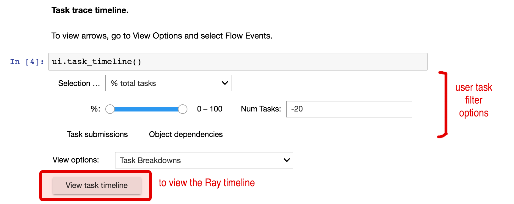
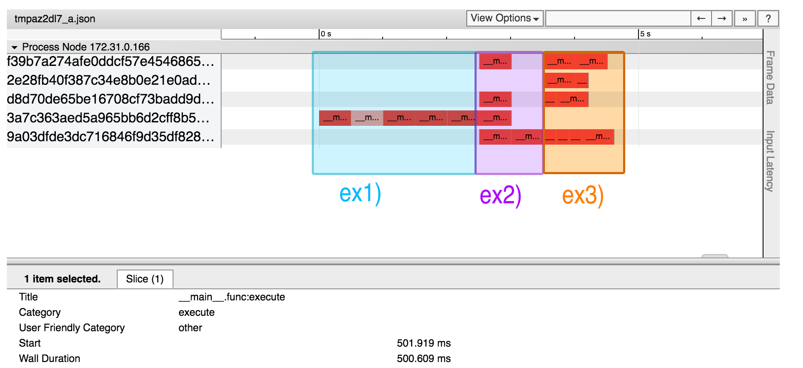

Profiling for Ray Users
=======================

This document is intended for users of Ray who want to know how to evaluate 
the performance of their code while running on Ray. Profiling the 
performance of your code can be very helpful to determine performance 
bottlenecks or where your code may not be parallelizing properly. If you 
are interested in pinpointing why your Ray application may not be 
achieving speedups as expected, then do read on!

A Basic Example to Profile
--------------------------

Let's try to profile a simple example, and compare how different looping 
call structures of the same remote function affects performance.

As a stand-in for a computationally intensive and possibly slower function,
let's define our remote function to just sleep for 0.5 seconds:

.. code-block:: python

  import ray
  import time

  # Our time-consuming remote function
  @ray.remote
  def func():
    time.sleep(0.5)

In our example setup, we wish to call our remote function ``func()`` five 
times, and store the result of each call into a list. To compare the 
performance of different ways of looping our calls to our remote function, 
we can define each loop version as a separate function on the driver script.

For the first version **ex1**, each iteration of the loop calls the remote 
function, then calls ``ray.get`` in an attempt to store the current result 
into the list, as follows:

.. code-block:: python

  # This loop is suboptimal in Ray, and should only be used for the sake of this example
  def ex1():  
    list1 = []
    for i in range(5):
      list1.append(ray.get(func.remote()))

For the second version **ex2**, each iteration of the loop calls the remote 
function, and stores it into the list **without** calling ``ray.get`` each time. 
``ray.get`` is used after the loop has finished, in preparation for processing 
``func()``'s results:

.. code-block:: python

  # This loop is more proper in Ray
  def ex2():
    list2 = []
    for i in range(5):
      list2.append(func.remote())
    ray.get(list2)

Finally, as a demonstration of Ray's parallelism abilities, let's create a 
third version **ex3** where the driver calls a second time-consuming remote 
function in between each call to ``func()``:

.. code-block:: python

  # Some other time-consuming remote function
  @ray.remote
    def other_func():
      time.sleep(0.2)

  def ex3():
    list3 = []
    for i in range(5):
      other_func.remote()
      list2.append(func.remote())
    ray.get(list3)

Timing Performance Using Python's Timestamps
--------------------------------------------

One way to sanity-check the performance of the three loops is simply to
time how long it takes to complete each loop version. We can do this using 
python's built-in ``time`` `module`_.

.. _`module`: https://docs.python.org/2/library/time.html

The ``time`` module contains a useful ``time()`` function that returns the 
current timestamp in unix time whenever it's called. We can create a generic 
function wrapper to call ``time()`` right before and right after each loop 
function to print out how long each loop takes overall:

.. code-block:: python

  # This is a generic wrapper for any driver function you want to time
  def time_this(f):
    def timed_wrapper(*args, **kw):
      start_time = time.time()
      result = f(*args, **kw)
      end_time = time.time()

      # Time taken = end_time - start_time
      print('| func:%r args:[%r, %r] took: %2.4f seconds |' % \
            (f.__name__, args, kw, end_time - start_time))
      return result
    return timed_wrapper

To **always** print out how long the loop takes to run each time the loop 
function ``ex1()`` is called, we can evoke our ``time_this`` wrapper with 
a function decorator. This can similarly be done to functions ``ex2()``
and ``ex3()``:

.. code-block:: python

  @time_this  # Added decorator
  def ex1():
    list1 = []
    for i in range(5):
      list1.append(ray.get(func.remote()))

  def main():
    ray.init()
    ex1()
    ex2()
    ex3()

  if __name__ == "__main__":
    main()

Alternatively, to print out the timer on **selective** calls to ``ex1()``,
we can forgo the decorator and make explicit calls using ``time_this``
as follows:

.. code-block:: python

  def ex1():  # Removed decorator
    list1 = []
    for i in range(5):
      list1.append(ray.get(func.remote()))

  def main():
    ray.init()
    ex1()             # This call outputs nothing
    time_this(ex1)()  # This call outputs total execution time of ex1
    time_this(ex2)()
    time_this(ex3)()

  if __name__ == "__main__":
    main()

Finally, running the three timed loops should yield output similar to this:

.. code-block:: bash

  | func:'ex1' args:[(), {}] took: 2.5083 seconds |
  | func:'ex2' args:[(), {}] took: 1.0032 seconds |
  | func:'ex3' args:[(), {}] took: 1.1045 seconds |

Let's interpret these results. 

Most pertinently, ``ex1()`` took substantially more time than ``ex2()``, 
despite their only difference being that ``ex1()`` calls ``ray.get`` on the 
remote function before adding it to the list, while ``ex2()`` waits to fetch 
the entire list with ``ray.get`` at once.

.. code-block:: python

  @ray.remote
  def func(): # A single call takes 0.5 seconds
    time.sleep(0.5)

  def ex1():  # Took Ray 2.5 seconds
  list1 = []
  for i in range(5):
    list1.append(ray.get(func.remote()))

  def ex2():  # Took Ray 1 second
    list2 = []
    for i in range(5):
      list2.append(func.remote())
    ray.get(list2)

Notice how ``ex1()`` took 2.5 seconds, exactly five times 0.5 seconds, or 
the time it would take to wait for our remote function five times in a row. 

By calling ``ray.get`` after each call to the remote function, ``ex1()`` 
removes all ability to parallelize work, by forcing the driver to wait for 
each ``func()``'s result in succession. We are completely sabotaging any 
possibility of speedup via Ray parallelization! 

Meanwhile, ``ex2()`` takes about 1 second, much faster than it would normally 
take to call ``func()`` five times iteratively. Ray is running each call to 
``func()`` in parallel, saving us time. 

``ex1()`` is actually a common user mistake in Ray. ``ray.get`` is not 
necessary to do before adding the result of ``func()`` to the list. Instead, 
the driver should send out all parallelizable calls to the remote function 
to Ray before waiting to receive their results with ``ray.get``. ``ex1()``'s
suboptimal behavior can be noticed just using this simple timing test.

Additionally, to drive home Ray's speedup benefits of running remote function 
calls in parallel, ``ex3()`` takes only 1.1 seconds, despite making five calls
to a remote function that takes 0.2 seconds per call, and making five calls to
our first remote function that takes 0.5 seconds per call. If we weren't using
Ray and multiple CPUs, this loop would take at least 3.5 seconds to finish.

Profiling Using An External Profiler (Line_Profiler)
----------------------------------------------------

One way to profile the performance of our code using Ray is to use a third-party
profiler such as `Line_profiler`_. Line_profiler is a useful line-by-line
profiler for pure Python applications that formats its output side-by-side with
the profiled code itself. 

Alternatively, another third-party profiler (not covered in this documentation)
that you could use is `Pyflame`_, which can generate profiling graphs.

.. _`Line_profiler`: https://github.com/rkern/line_profiler
.. _`Pyflame`: https://github.com/uber/pyflame

First install ``line_profiler`` with pip:

.. code-block:: bash

  pip install line_profiler

``line_profiler`` requires each section of driver code that you want to profile as 
its own independent function. Conveniently, we have already done so by defining 
each loop version as its own function. To tell ``line_profiler`` which functions
to profile, just add the ``@profile`` decorator to ``ex1()``, ``ex2()`` and 
``ex3()``. Note that you do not need to import ``line_profiler`` into your Ray 
application:

.. code-block:: python

  @profile  # Added decorator
  def ex1():
    list1 = []
    for i in range(5):
      list1.append(ray.get(func.remote()))

  def main():
    ray.init()
    ex1()
    ex2()
    ex3()

  if __name__ == "__main__":
    main()

Then, when we want to execute our Python script from the command line, instead 
of ``python your_script_here.py``, we use the following shell command to run the 
script with ``line_profiler`` enabled:

.. code-block:: bash

  kernprof -l your_script_here.py 

This command runs your script and prints only your script's output as usual. 
``Line_profiler`` instead outputs its profiling results to a corresponding 
binary file called ``your_script_here.py.lprof``.

To read ``line_profiler``'s results to terminal, use this shell command:

.. code-block:: bash

  python -m line_profiler your_script_here.py.lprof

In our loop example, this command outputs results for ``ex1()`` as follows.
Note that execution time is given in units of 1e-06 seconds:

.. code-block:: bash

  Timer unit: 1e-06 s

  Total time: 2.50883 s
  File: your_script_here.py
  Function: ex1 at line 28

  Line #      Hits         Time  Per Hit   % Time  Line Contents
  ==============================================================
      29                                           @profile
      30                                           def ex1():
      31         1          3.0      3.0      0.0   list1 = []
      32         6         18.0      3.0      0.0   for i in range(5):
      33         5    2508805.0 501761.0    100.0     list1.append(ray.get(func.remote()))

Notice that each hit to ``list1.append(ray.get(func.remote()))`` at line 33 
takes the full 0.5 seconds waiting for ``func()`` to finish. Meanwhile, in 
``ex2()`` below, each call of ``func.remote()`` at line 40 only takes 0.127 ms, 
and the majority of the time (about 1 second) is spent on waiting for ``ray.get()`` 
at the end:

.. code-block:: bash

  Total time: 1.00357 s
  File: your_script_here.py
  Function: ex2 at line 35

  Line #      Hits         Time  Per Hit   % Time  Line Contents
  ==============================================================
      36                                           @profile
      37                                           def ex2():
      38         1          2.0      2.0      0.0   list2 = []
      39         6         13.0      2.2      0.0   for i in range(5):
      40         5        637.0    127.4      0.1     list2.append(func.remote())
      41         1    1002919.0 1002919.0     99.9    ray.get(list2)

And finally, ``line_profiler``'s output for ``ex3()``:

.. code-block:: bash

  Total time: 1.10395 s
  File: your_script_here.py
  Function: ex3 at line 43

  Line #      Hits         Time  Per Hit   % Time  Line Contents
  ==============================================================
      44                                           @profile
      45                                           def ex3():
      46         1          1.0      1.0      0.0   list3 = []
      47         6         13.0      2.2      0.0   for i in range(5):
      48         5        673.0    134.6      0.1     func2.remote()
      49         5        639.0    127.8      0.1     list3.append(func.remote())
      50         1    1102625.0 1102625.0     99.9    ray.get(list3)

Profiling Using Python's CProfile
---------------------------------

A second way to profile the performance of your Ray application is to 
use Python's native cProfile `profiling module`_. Rather than tracking 
line-by-line of your application code, cProfile can give the total runtime
of each loop function, as well as list the number of calls made and
execution time of all function calls made within the profiled code. 

.. _`profiling module`: https://docs.python.org/3/library/profile.html#module-cProfile

Unlike ``line_profiler`` above, this detailed list of profiled function calls 
**includes** internal function calls and function calls made within Ray! 

However, similar to ``line_profiler``, cProfile can be enabled with minimal 
changes to your application code (given that each section of the code you want 
to profile is defined as its own function). To use cProfile, add an import 
statement, then replace calls to the loop functions as follows:

.. code-block:: python

  import cProfile  # Added import statement

  def ex1():
    list1 = []
    for i in range(5):
      list1.append(ray.get(func.remote()))

  def main():
    ray.init()
    cProfile.run('ex1()')  # Modified call to ex1
    cProfile.run('ex2()')
    cProfile.run('ex3()')

  if __name__ == "__main__":
    main()

Now, when executing your Python script, a cProfile list of profiled function 
calls will be outputted to terminal for each call made to ``cProfile.run()``.
At the very top of cProfile's output gives the total execution time for 
``'ex1()'``:

.. code-block:: bash

  601 function calls (595 primitive calls) in 2.509 seconds

Following is a snippet of profiled function calls for ``'ex1()'``. Most of 
these calls are quick and take around 0.000 seconds, so the functions of 
interest are the ones with non-zero execution times:

.. code-block:: bash

  ncalls  tottime  percall  cumtime  percall filename:lineno(function)
  ...
      1    0.000    0.000    2.509    2.509 your_script_here.py:31(ex1)
      5    0.000    0.000    0.001    0.000 remote_function.py:103(remote)
      5    0.000    0.000    0.001    0.000 remote_function.py:107(_submit)
  ...  
     10    0.000    0.000    0.000    0.000 worker.py:2459(__init__)
      5    0.000    0.000    2.508    0.502 worker.py:2535(get)
      5    0.000    0.000    0.000    0.000 worker.py:2695(get_global_worker)
     10    0.000    0.000    2.507    0.251 worker.py:374(retrieve_and_deserialize)
      5    0.000    0.000    2.508    0.502 worker.py:424(get_object)
      5    0.000    0.000    0.000    0.000 worker.py:514(submit_task)
  ...

The 5 separate calls to Ray's ``get``, taking the full 0.502 seconds each call, 
can be noticed at ``worker.py:2535(get)``. Meanwhile, the act of calling the 
remote function itself at ``remote_function.py:103(remote)`` only takes 0.001 
seconds over 5 calls, and thus is not the source of the slow performance of 
``ex1()``.

Visualizing Tasks in the Ray Timeline
-------------------------------------
Profiling the performance of your Ray application doesn't need to be 
an eye-straining endeavor of interpreting numbers among hundreds of 
lines of text. Ray comes with its own visual web UI to visualize the 
parallelization (or lack thereof) of user tasks submitted to Ray!

Currently, whenever initializing Ray, a URL is automatically generated and
printed to terminal on where to view Ray's web UI as a Jupyter notebook:

.. code-block:: bash

  ~$: python your_script_here.py

  Process STDOUT and STDERR is being redirected to /tmp/raylogs/.
  Waiting for redis server at 127.0.0.1:61150 to respond...
  Waiting for redis server at 127.0.0.1:21607 to respond...
  Starting local scheduler with the following resources: {'CPU': 4, 'GPU': 0}.

  ======================================================================
  View the web UI at http://localhost:8897/notebooks/ray_ui84907.ipynb?token=025e8ab295270a57fac209204b37349fdf34e037671a13ff
  ======================================================================

Ray's web UI attempts to run on localhost at port 8888, and if it fails 
it tries successive ports until it finds an open port. In this above 
example, it has opened on port 8897.

Because this web UI is only available as long as your Ray application 
is currently running, you may need to add a user prompt to stall 
your Ray application from exiting once it has finished executing,  
such as below. You can then browse the web UI for as long as you like:

.. code-block:: python

  def main():
    ray.init()
    ex1()
    ex2()
    ex3()

    # Require user input confirmation before exiting
    hang = int(input('Examples finished executing. Enter any integer to exit:'))

  if __name__ == "__main__":
    main()

Now, when executing your python script, you can access the Ray timeline
by copying the web UI URL into your web browser on the Ray machine. To 
load the web UI in the jupyter notebook, select **Kernel -> Restart and 
Run All** in the jupyter menu.

The Ray timeline can be viewed in the fourth cell of the UI notebook by 
using the task filter options, then clicking on the **View task timeline** 
button:

For example, here are the results of executing ``ex1()``, ``ex2()``, and 
``ex3()`` visualized in the Ray timeline. Each red block is a call to one 
of our user-defined remote functions. The longer blocks are calls to ``func()``, 
which sleeps for 0.5 seconds, and the interwoven shorter blocks in ``ex3()``
are calls to ``other_func()``, which sleeps for 0.2 seconds:

(highlighted color boxes for ``ex1()``, ``ex2()``, and ``ex3()`` added for 
the sake of this example)

Note how ``ex1()`` executes all five calls to ``func()`` in serial, 
while ``ex2()`` and ``ex3()`` are able to parallelize their remote
function calls. Because we have 4 CPUs available on our machine, we 
can only able to execute up to 4 remote functions in parallel. So,
the fifth call to the remote function in ``ex2()`` must wait until 
the first batch of ``func()`` calls is finished.

**For more on Ray's Web UI,** such as how to access the UI on a remote
node over ssh, or for troubleshooting installation, **please see our 
`Web UI documentation section`_.**

.. _`Web UI documentation section`: http://ray.readthedocs.io/en/latest/webui.html
