Design Overview
===============

.. _virtual-cluster-design-overview:

This page introduces the design overview of Ray virtual clusters:

.. contents::
    :local:

.. _virtual-cluster-management:

Virtual Cluster Management
--------------------------

The metadata (state, node types and count, etc.) of virtual clusters are managed by GCS. Meanwhile, metadata has to be published to all raylets upon any changes (create/update/remove). This ensures raylets making the right scheduling decisions for tasks within the dedicated virtual cluster.

**Create:**

When creating a new virtual cluster, GCS approximately goes through the following steps:

1. Pre-check:

   - The request has to specify a valid virtual cluster ID.
   - The expected replica sets specified in the request have to be valid.

2. Select enough unassigned nodes from the primary cluster.
3. Remove the selected nodes from the primary cluster, and add them to the new virtual cluster.
4. Flush the metadata of the newly created virtual cluster to Redis and publish it to all raylets.

**Update:**

When updating an existing virtual cluster, GCS approximately goes through the following steps:

1. Pre-check:

   - The request has to specify a valid and existing virtual cluster ID.
   - The expected replica sets specified in the request have to be valid.
   - The revision specified in the request has to be the latest one.
   - The request can not change the virtual cluster from divisible to indivisible (or vice-versa) on the fly.

2. Select enough unassigned nodes from the primary cluster (if the virtual cluster expects to scale up), and select enough idle nodes to be removed from the virtual cluster (if the virtual cluster expects to scale down).
3. Update the node type and count of the primary cluster and the virtual cluster.
4. Flush the metadata of the updated virtual cluster to Redis and publish it to all raylets.

Note, currently we do not support updating a job cluster on the fly. It is our plan to make it available in the next release.

**Remove:**

When removing a virtual cluster, GCS approximately goes through the following steps:

1. Pre-check: The request has to specify a valid and existing virtual cluster ID.
2. If there is any jobs/actors/tasks/placement groups still running inside the virtual cluster, then this request should fail.
3. Return the virtual cluster's nodes back to its father cluster.
4. Flush the metadata of the newly removed virtual cluster to Redis and publish it to all raylets.

.. _virtual-cluster-fault-tolerance:

Virtual Cluster Fault Tolerance
-------------------------------

Let nodes inside logical indivisible cluster be :math:`V_{indivisble}` , nodes inside divisible cluster be :math:`V_{divisible}`, nodes inside job cluster be :math:`V_{job}`, undivided nodes inside divisible cluster be :math:`V_{undivided}`, then:

- For divisible cluster: :math:`V_{divisible} = V_{undivided} + \sum{V_{job}}`, :math:`V_{job}` is divided from :math:`V_{divisible}`
- For indivisible cluster: :math:`V_{indivisible} = V_{undivided}`, it means that the indivisble cluster can not be diveded any more and all nodes inside indivisible cluster are undivieded.

**Raylet Failover**

When Rayle dies or restarts, the GCS Server will detect that the node is dead and then update the status of the corresponding node in the virtual cluster, and the virtual cluster manager will periodically check for dead nodes and replace them with new ones.

There are four scenarios in which the virtual cluster manager will replenish new nodes for the virtual cluster, and the state of the virtual cluster needs to be flushed or published:

- When undivided nodes belong to primary cluster :math:`V_{primary}` are dead.

  1. Just do nothing.

- When undivided nodes belongs to logical divisible cluster :math:`V_{divisible}` are dead.

  1. then select new alive undivided node with the same node type as the dead one from :math:`V_{primary}` to replace the dead one.
  2. Only flush the :math:`V_{divisible}` to the storage, without publishing.

- When nodes belong to logical indivisible cluster :math:`V_{indivisible}` are dead.

  1. Select new nodes from :math:`V_{primary}` to replace the dead nodes inside :math:`V_{indivisible}`
  2. Flush the :math:`V_{indivisible}` to storage and publish it to all the worker nodes.

- When nodes belong to :math:`V_{job}` are dead, these nodes' state will also be dead in :math:`V_{divisible}` which the :math:`V_{job}` belongs to.

  1. Select new alive undivided node with the same node type as the dead one from :math:`V_{primary}` to replace the dead one.
  2. If there are still dead nodes inside :math:`V_{job}`, then continue to select new alive undivided node with the same node type as the dead one from it's parent virtual cluster nodes :math:`V_{divisible}` to replace the dead one.
  3. If there are any dead node inside :math:`V_{job}` is replenished, then flush the :math:`V_{job}` to the storage and publish it to all the worker nodes.
  4. If there are any dead node inside :math:`V_{divisible}` (parent virtual cluster of :math:`V_{job}`) is replenished, then just flush the :math:`V_{divisible}`, without publishing.

**GCS Server Failover**

The recovery process is as follows:

1. Replay primary cluster nodes based on the gcs node table.
2. Replay logical virtual clusters (including divisible & indivisible clusters) based on the virtual cluster table.
3. Repair divisible clusters :math:`V_{divisible}` based on the :math:`V_{job}` belongs to them:

   - Find the different nodes between :math:`V_{job}` and :math:`V_{divisible}`, let :math:`D = V_{job} - V_{divisible}`
   - Remove dead nodes from :math:`V_{divisible}` based on the replica sets of :math:`D` and flush :math:`V_{divisible}`

4. Replay all job clusters :math:`V_{job}`

.. _virtual-cluster-lifecycle:

Virtual Cluster Lifecycle
-------------------------

In the context of Virtual Clusters, an Indivisible Cluster is essential for managing user-submitted jobs. This section provides a comprehensive explanation of the lifecycle of an Indivisible Cluster, detailing its creation, usage, and destruction processes within the hierarchical structure of Virtual Clusters.

Lifecycle Stages
~~~~~~~~~~~~~~~~

**Creation**

- Indivisible Cluster (logical) Creation

  - Indivisible Clusters are instantiated within the Primary Cluster through API calls.
  - Designed to host multiple jobs simultaneously, enabling efficient resource utilization.

- Job Cluster Creation

  - When a job is submitted to a Divisible Cluster with the Divisible Cluster specification, the system automatically creates a corresponding Job Cluster as a sub-cluster.
  - Job Clusters are specialized Indivisible Clusters designed to handle individual jobs, providing isolation and dedicated resources.

**Usage**

- Indivisible Clusters (logical)

  - Capable of executing between one to multiple job workloads.
  - Jobs within an Indivisible Cluster share the cluster's resources, allowing tasks from different jobs to run on the same worker nodes.

- Job Clusters

  - Dedicated to executing a single job's workloads.
  - Ensures isolation and dedicated resource allocation for each job, enhancing performance and stability.

**Destruction**

- Indivisible Cluster (logical) Destruction

  - Can be explicitly destroyed via API.
  - Destruction fails if there are any detached placement groups, detached actors, or other resources still in use, ensuring active processes are not inadvertently terminated.

- Job Cluster Destruction

  - Automatically attempts to destroy the Job Cluster once the associated job completes.
  - If destruction fails due to existing detached resources, the system performs a lazy destruction:

    - Periodically checks for empty Job Clusters.
    - Destroys Job Clusters that are no longer in use, maintaining resource hygiene over time.

Lifecycle Diagram
~~~~~~~~~~~~~~~~~

The following diagram illustrates the lifecycle of an Indivisible Cluster within the Virtual Cluster hierarchy:

.. _virtual-cluster-autoscaler:

AutoScaler
----------

**NOTE:** For the time being, the OSS autoscaler only supports Ray clusters, while virtual clusters can only be manually updated by users. It is our high-priority plan to make the autoscaler support virtual clusters.
