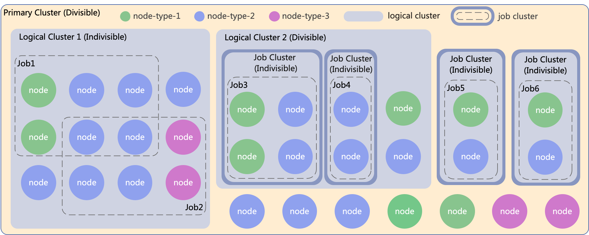

Key Concepts
============

.. _virtual-cluster-key-concepts:

This page introduces key concepts for Ray virtual clusters:

.. contents::
    :local:

Virtual Cluster
---------------
**Virtual cluster** provides logical resource isolation, enables multi-tenancy by allowing
Ray cluster admins to easily manage multiple workloads on the same Ray cluster.

A virtual cluster consists of a group of heterogeneous worker nodes and a collection of
child clusters, including :ref:`divisible cluster <virtual-cluster-divisible-cluster>`
and :ref:`indivisible cluster <virtual-cluster-indivisible-cluster>`:

Users can submit jobs for execution on the Ray virtual cluster through the HTTP API or
by using command-line tools.
See :ref:`Virtual Cluster Management API <virtual-cluster-management>`
and :ref:`Virtual Cluster CLI <virtual-cluster-cli>` for more information.

.. _virtual-cluster-divisible-cluster:

Divisible Cluster
-----------------
**Divisible clusters** are clusters that can be divided into smaller clusters. Each child
cluster can be managed independently and can be scaled up or down based on the workload.

.. _virtual-cluster-indivisible-cluster:

Indivisible Cluster
-------------------
**Indivisible clusters** are clusters that cannot be divided into smaller clusters. Jobs
can be submitted to the indivisible cluster directly.

.. _virtual-cluster-primary-cluster:

Primary Cluster
---------------
**Primary cluster** is, to some extent, equivalent to a Ray Cluster, encompassing all worker 
nodes within the Ray Cluster. The Primary Cluster is a Divisible Cluster, capable of 
creating Logical Clusters or Job Clusters.

.. _virtual-cluster-logical-cluster:

Logical Cluster
---------------
**Logical Cluster** consists of two types of Virtual Clusters: Indivisible and Divisible

- `Indivisible Cluster` cannot be further divided into sub-virtual clusters. Ray Jobs can be directly submitted to this kind of virtual cluster. One Indivisible Cluster can execute 1 to N job's workloads. All jobs are co-located, meaning that tasks from multiple jobs can run on the same node.
- `Divisible Cluster` on the other hand, can be further divided into sub-virtual clusters. When a job is submitted to a Divisible Cluster, the dashboard will automatically create a Job Cluster(a special type of Indivisible Cluster) for this job. (Note: Jobs submitting to a Divisible Cluster must provide the expected ReplicaSet information, including the required number of each NodeType).

.. _virtual-cluster-job-cluster:

Job Cluster
-----------
**Job Cluster** is a special type of Indivisible Cluster, which cannot be further subdivided into smaller virtual clusters. It is automatically created when jobs are submitted to a Divisible Cluster  and is destroyed once job is dead and all corresponding tasks finished. It can only execute one job's workerloads.
