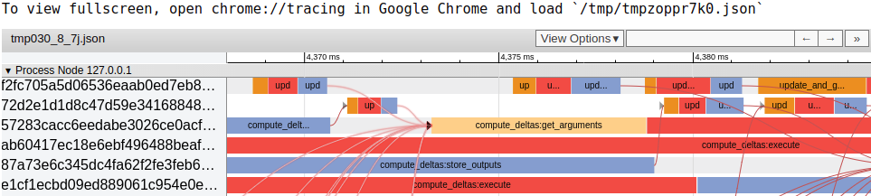

Web UI
======

The Ray web UI includes tools for debugging Ray jobs. The following
image shows an example of using the task timeline for performance debugging:

Dependencies
------------

To use the UI, you will need to install the following.

.. code-block:: bash

  pip install jupyter ipywidgets bokeh

If you see an error like

.. code-block:: bash

  Widget Javascript not detected. It may not be installed properly.

Then you may need to run the following.

.. code-block:: bash

  jupyter nbextension enable --py --sys-prefix widgetsnbextension

**Note:** If you are building Ray from source, then you will also need a
``python2`` executable.

Running the Web UI
------------------

Currently, the web UI is launched automatically when ``ray.init`` is called. The
command will print a URL of the form:

.. code-block:: text

  =============================================================================
  View the web UI at http://localhost:8889/notebooks/ray_ui92131.ipynb?token=89354a314e5a81bf56e023ad18bda3a3d272ee216f342938
  =============================================================================

If you are running Ray on your local machine, then you can head directly to that
URL with your browser to see the Jupyter notebook. Otherwise, if you are using
Ray remotely, such as on EC2, you will need to ensure that port is open on that
machine. Typically, when you ssh into the machine, you can also port forward
with the ``-L`` option as such:

.. code-block:: bash

  ssh -L <local_port>:localhost:<remote_port> <user>@<ip-address>

So for the above URL, you would use the port 8889. The Jupyter notebook attempts
to run on port 8888, but if that fails it tries successive ports until it finds
an open port.

You can also open the port on the machine as well, which is not recommended for
security as the machine would be open to the Internet. In this case, you would
need to replace localhost by the public IP the remote machine is using.

Once you have navigated to the URL, start the UI by clicking on the following.

.. code-block:: text

  Kernel -> Restart and Run all

Features
--------

The UI supports a search for additional details on Task IDs and Object IDs, a
task timeline, a distribution of task completion times, and time series for CPU
utilization and cluster usage.

Task and Object IDs
~~~~~~~~~~~~~~~~~~~

These widgets show additional details about an object or task given the ID. If
you have the object in Python, the ID can be found by simply calling ``.hex`` on
an Object ID as below:

.. code-block:: python

   # This will return a hex string of the ID.
   objectid = ray.put(1)
   literal_id = objectid.hex()

and pasting in the returned string with no quotes. Otherwise, they can be found
in the task timeline in the output area below the timeline when you select a
task.

For Task IDs, they can be found by searching for an object ID the task created,
or via the task timeline in the output area.

The additional details for tasks here can also be found in the task timeline;
the search just provides an easier method to find a specific task when you have
millions.

Task Timeline
~~~~~~~~~~~~~

There are three components to this widget: the controls for the widget at the
top, the timeline itself, and the details area at the bottom. In the controls,
you first select whether you want to select a subset of tasks via the time they
were completed or by the number of tasks. You can control the percentages either
via a double sided slider, or by setting specific values in the text boxes. If
you choose to select by the number of tasks, then entering a negative number N
in the text field denotes the last N tasks run, while a positive value N denotes
the first N tasks run. If there are ten tasks and you enter -1 into the field,
then the slider will show 90% to 100%, where 1 would show 0% to 10%. Finally,
you can choose if you want edges for task submission (if a task invokes another
task) or object dependencies (if the result from a task is passed to another
task) to be added, and if you want the different phases of a task broken up into
separate tasks in the timeline.

For the timeline, each node has its own dropdown with a timeline, and each row
in the dropdown is a worker. Moving and zooming are handled by selecting the
appropiate icons on the floating taskbar. The first is selection, the second
panning, the third zooming, and the fourth timing. To shown edges, you can
enable Flow Events in View Options.

If you have selection enabled in the floating taskbar and select a task, then
the details area at the bottom will fill up with information such as task ID,
function ID, and the duration in seconds of each phase of the task.

Time Distributions and Time Series
~~~~~~~~~~~~~~~~~~~~~~~~~~~~~~~~~~

The completion time distribution, CPU utilization, and cluster usage all have
the same task selection controls as the task timeline.

The task completion time distribution tracks the histogram of completion tasks
for all tasks selected.

CPU utilization gives you a count of how many CPU cores are being used at a
given time. As typically each core has a worker assigned to it, this is
equivalent to utilization of the workers running in Ray.

Cluster Usage gives you a heat-map with time on the x-axis, node IP addresses on
the y-axis, and coloring based on how many tasks were running on that node at
that given time.

Troubleshooting
---------------

The Ray timeline visualization may not work in Firefox or Safari.
