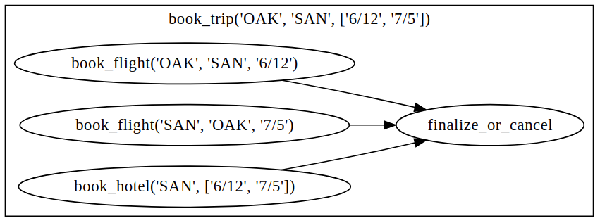

Workflow Basics
===============

If you’re brand new to Ray, we recommend starting with the :ref:`walkthrough <core-walkthrough>`.

Ray DAG
-------

Normally, Ray tasks are executed eagerly.
Ray DAG provides a way to build the DAG without execution, and Ray Workflow is based on Ray DAGs.

It is simple to build a Ray DAG: you just replace all ``.remote(...)`` with ``.bind(...)`` in a Ray application.
Ray DAGs can be composed in arbitrarily like normal Ray tasks.

Here is a single three-node DAG:

.. code-block:: python

    from typing import List
    import ray

    # Define Ray remote functions.
    @ray.remote
    def read_data(num: int):
        return [i for i in range(num)]

    @ray.remote
    def preprocessing(data: List[float]) -> List[float]:
        return [d**2 for d in data]

    @ray.remote
    def aggregate(data: List[float]) -> float:
        return sum(data)

    # Build the DAG.
    data = read_data.bind(10)
    preprocessed_data = preprocessing.bind(data)
    output = aggregate.bind(preprocessed_data)

The Ray DAG will not be executed until further actions are taken on it.

Your first workflow
-------------------

A single line is all you need to turn the previous DAG into a workflow:

.. code-block:: python

    # <follow the previous code>
    from ray import workflow

    # Create the workflow from the DAG.
    wf = workflow.create(output)
    # Execute the workflow and print the result.
    print(wf.run())

    # The workflow can also be executed asynchronously.
    # print(ray.get(output.run_async()))

Here is the workflow we created:

.. image:: basic.png
   :width: 500px
   :align: center

Each node in the original DAG becomes a workflow task.
Workflow tasks behave similarly to Ray tasks. They are executed in a parallel and distributed way.

Setting workflow options
------------------------

You can directly set Ray options to a workflow task just like to a normal
Ray remote function. To set workflow-specific options, you can use ``workflow.options``
either as a decorator or as a option feeding dictionary:

.. code-block:: python

    import ray
    from ray import workflow

    @workflow.options(checkpoint=False)
    @ray.remote(num_cpus=2, num_gpus=3)
    def read_data(num: int):
        return [i for i in range(num)]

    read_data_with_options = read_data.options(
        num_cpus=1, num_gpus=1, **workflow.options(checkpoint=True))

Retrieving results
------------------

To retrieve a workflow result, you can assign ``workflow_id`` when running a workflow:

.. code-block:: python

    import ray
    from ray import workflow

    try:
        # cleanup previous workflows
        workflow.delete("add_example")
    except Exception:
        pass

    @ray.remote
    def add(left: int, right: int) -> int:
        return left + right

    @ray.remote
    def get_val() -> int:
        return 10

    ret = add.bind(get_val.bind(), 20)

    assert workflow.create(ret).run(workflow_id="add_example") == 30

Then workflow results can be retrieved with ``workflow.get_output(workflow_id) -> ObjectRef[T]``. If the workflow has not yet completed, calling ``ray.get()`` on the returned reference will block until the result is computed. For example:

.. code-block:: python

    assert ray.get(workflow.get_output("add_example")) == 30

We can retrieve the results for individual workflow tasks too with *named tasks*. A task can be named in two ways:

 1) via ``.options(**workflow.options(name="task_name"))``
 2) via decorator ``@workflow.options(name="task_name"``)

Once a task is given a name, the result of the task will be retrievable via ``workflow.get_output(workflow_id, name="task_name")``. If the task with the given name hasn't been executed yet, an exception will be thrown. Here are some examples:

.. code-block:: python

    # TODO(suquark): Fix this example
    import ray
    from ray import workflow

    try:
        # cleanup previous workflows
        workflow.delete("double")
    except Exception:
        pass

    @ray.remote
    def double(v):
        return 2 * v

    inner_task = double.options(**workflow.options(name="inner")).bind(1)
    outer_task = double.options(**workflow.options(name="outer")).bind(inner_task)
    result = workflow.create(outer_task).run_async("double")
    inner = workflow.get_output("double", name="inner")
    outer = workflow.get_output("double", name="outer")

    assert ray.get(inner) == 2
    assert ray.get(outer) == 4
    assert ray.get(result) == 4

If there are multiple tasks with the same name, a suffix with a counter ``_n`` will be added automatically. For example,

.. code-block:: python

    # TODO(suquark): Fix this example
    import ray
    from ray import workflow

    try:
        # cleanup previous workflows
        workflow.delete("double")
    except Exception:
        pass

    @workflow.options(name="double")
    @ray.remote
    def double(s):
        return s * 2

    inner_task = double.bind(1)
    outer_task = double.bind(inner_task)
    result = workflow.create(outer_task).run_async("double")

    inner = workflow.get_output("double", name="double")
    outer = workflow.get_output("double", name="double_1")

    assert ray.get(inner) == 2
    assert ray.get(outer) == 4
    assert result == 4

By default, each task will be given a name generated by the library, ``<WORKFLOW_ID>.<MODULE_NAME>.<FUNC_NAME>``.

Error handling
--------------

Workflows provides two ways to handle application-level exceptions: (1) automatic retry, and (2) the ability to catch and handle exceptions.

The following error handling flags can be either set in the task decorator or via ``.options()``:

.. code-block:: python

    from typing import Tuple
    import random

    import ray
    from ray import workflow

    @ray.remote
    def faulty_function() -> str:
        if random.random() > 0.5:
            raise RuntimeError("oops")
        return "OK"

    # Tries up to three times before giving up.
    r1 = faulty_function.options(**workflow.options(max_retries=5)).bind()
    workflow.create(r1).run()

    @ray.remote
    def handle_errors(result: Tuple[str, Exception]):
        # The exception field will be None on success.
        err = result[1]
        if err:
            return "There was an error: {}".format(err)
        else:
            return "OK"

    # `handle_errors` receives a tuple of (result, exception).
    r2 = faulty_function.options(**workflow.options(catch_exceptions=True)).bind()
    workflow.create(handle_errors.bind(r2)).run()

- If ``max_retries`` is given, the task will be retried for the given number of times if an exception is raised. It will only retry for the application level error. For system errors, it's controlled by ray. By default, ``max_retries`` is set to be 3.
- If ``catch_exceptions`` is True, the return value of the function will be converted to ``Tuple[Optional[T], Optional[Exception]]``. This can be combined with ``max_retries`` to try a given number of times before returning the result tuple.

The parameters can also be passed to the decorator

.. code-block:: python

    @workflow.options(max_retries=5, catch_exceptions=True)
    @ray.remote
    def faulty_function():
        pass

Durability guarantees
---------------------

Workflow tasks provide *exactly-once* execution semantics. What this means is that once the result of a workflow task is logged to durable storage, Ray guarantees the task will never be re-executed. A task that receives the output of another workflow task can be assured that its inputs tasks will never be re-executed.

Failure model
~~~~~~~~~~~~~
- If the cluster fails, any workflows running on the cluster enter RESUMABLE state. The workflows can be resumed on another cluster (see the management API section).
- The lifetime of the workflow is not coupled with the driver. If the driver exits, the workflow will continue running in the background of the cluster.

Note that tasks that have side-effects still need to be idempotent. This is because the task could always fail prior to its result being logged.

.. code-block:: python
    :caption: Non-idempotent workflow:

    @ray.remote
    def book_flight_unsafe() -> FlightTicket:
        ticket = service.book_flight()
        # Uh oh, what if we failed here?
        return ticket

    # UNSAFE: we could book multiple flight tickets
    workflow.create(book_flight_unsafe.bind()).run()

.. code-block:: python
    :caption: Idempotent workflow:

    @ray.remote
    def generate_id() -> str:
       # Generate a unique idempotency token.
       return uuid.uuid4().hex

    @ray.remote
    def book_flight_idempotent(request_id: str) -> FlightTicket:
       if service.has_ticket(request_id):
           # Retrieve the previously created ticket.
           return service.get_ticket(request_id)
       return service.book_flight(request_id)

    # SAFE: book_flight is written to be idempotent
    request_id = generate_id.bind()
    workflow.create(book_flight_idempotent.bind(request_id)).run()

Dynamic workflows
-----------------

Additional tasks can be dynamically created and inserted into the workflow DAG during execution.

This is achieved by returning a continuation of a DAG.
A continuation is something returned by a function and executed after it returns.
The continuation feature enables nesting, looping, and recursion within workflows.

The following example shows how to implement the recursive ``factorial`` program using dynamically generated tasks:

.. code-block:: python

    @ray.remote
    def factorial(n: int) -> int:
        if n == 1:
            return 1
        else:
            return workflow.continuation(multiply.bind(n, factorial.bind(n - 1)))

    @ray.remote
    def multiply(a: int, b: int) -> int:
        return a * b

    ret = workflow.create(factorial.bind(10))
    assert ret.run() == 3628800

The key behavior to note is that when a task returns a ``Workflow`` output instead of a concrete value, that workflow's output will be substituted for the task's return. To better understand dynamic workflows, let's look at a more realistic example of booking a trip:

.. code-block:: python

    @ray.remote
    def book_flight(...) -> Flight: ...

    @ray.remote
    def book_hotel(...) -> Hotel: ...

    @ray.remote
    def finalize_or_cancel(
        flights: List[Flight],
        hotels: List[Hotel]) -> Receipt: ...

    @ray.remote
    def book_trip(origin: str, dest: str, dates) ->
            "Workflow[Receipt]":
        # Note that the workflow engine will not begin executing
        # child workflows until the parent task returns.
        # This avoids task overlap and ensures recoverability.
        f1: Workflow = book_flight.bind(origin, dest, dates[0])
        f2: Workflow = book_flight.bind(dest, origin, dates[1])
        hotel: Workflow = book_hotel.bind(dest, dates)
        return workflow.continuation(finalize_or_cancel.bind([f1, f2], [hotel]))

    fut = workflow.create(book_trip.bind("OAK", "SAN", ["6/12", "7/5"]))
    fut.run()  # returns Receipt(...)

Here the workflow initially just consists of the ``book_trip`` task. Once executed, ``book_trip`` generates tasks to book flights and hotels in parallel, which feeds into a task to decide whether to cancel the trip or finalize it. The DAG can be visualized as follows (note the dynamically generated nested workflows within ``book_trip``):

The execution order here will be:
1. Run the ``book_trip`` task.
2. Run the two ``book_flight`` tasks and the ``book_hotel``  task in parallel.
3. Once all three booking tasks finish, ``finalize_or_cancel`` will be executed and its return will be the output of the workflow.

Ray Integration
---------------

Mixing workflow tasks with Ray tasks and actors
~~~~~~~~~~~~~~~~~~~~~~~~~~~~~~~~~~~~~~~~~~~~~~~

Workflows are compatible with Ray tasks and actors. There are two methods of using them together:

1. Workflows can be launched from within a Ray task or actor. For example, you can launch a long-running workflow from Ray serve in response to a user request. This is no different from launching a workflow from the driver program.
2. Workflow tasks can use Ray tasks or actors within a single task. For example, a task could use Ray Train internally to train a model. No durability guarantees apply to the tasks or actors used within the task; if the task fails, it will be re-executed from scratch.

Passing nested arguments
~~~~~~~~~~~~~~~~~~~~~~~~
Like Ray tasks, when you pass a list of ``Workflow`` outputs to a task, the values are not resolved. But we ensure that all ancestors of a task are fully executed prior to the task starting:

.. code-block:: python

    @ray.remote
    def add(values: List[ray.ObjectRef[int]]) -> int:
        # although those value are not resolved, they have been
        # fully executed and checkpointed. This guarantees exactly-once
        # execution semantics.
        return sum(ray.get(values))

    @ray.remote
    def get_val() -> int:
        return 10

    ret = add.bind([get_val.bind() for _ in range(3)])
    assert workflow.create(ret).run() == 30

Passing object references between tasks
~~~~~~~~~~~~~~~~~~~~~~~~~~~~~~~~~~~~~~~

Ray object references and data structures composed of them (e.g., ``ray.Dataset``) can be passed into and returned from workflow tasks. To ensure recoverability, their contents will be logged to durable storage. However, an object will not be checkpointed more than once, even if it is passed to many different tasks.

.. code-block:: python

    @ray.remote
    def do_add(a, b):
        return a + b

    @ray.remote
    def add(a, b):
        return do_add.remote(a, b)

    workflow.create(add.bind(ray.put(10), ray.put(20))).run() == 30

Ray actor handles are not allowed to be passed between tasks.

Setting custom resources for tasks
~~~~~~~~~~~~~~~~~~~~~~~~~~~~~~~~~~

You can assign resources (e.g., CPUs, GPUs to tasks via the same ``num_cpus``, ``num_gpus``, and ``resources`` arguments that Ray tasks take):

.. code-block:: python

    @ray.remote(num_gpus=1)
    def train_model() -> Model:
        pass  # This task is assigned a GPU by Ray.

    workflow.create(train_model.bind()).run()
