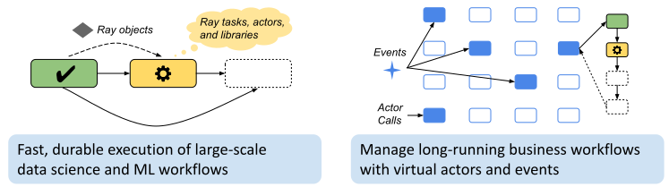

.. _workflows:

Workflows: Fast, Durable Application Flows
==========================================

.. warning::

  Workflows is available as **alpha** in Ray 1.7+. Expect rough corners and for its APIs and storage format to change. Please file feature requests and bug reports on GitHub Issues or join the discussion on the `Ray Slack <https://forms.gle/9TSdDYUgxYs8SA9e8>`__.

Ray Workflows provides high-performance, *durable* application workflows using Ray tasks as the underlying execution engine. It is intended to support both large-scale workflows (e.g., ML and data pipelines) and long-running business workflows (when used together with Ray Serve).

..
  https://docs.google.com/drawings/d/113uAs-i4YjGBNxonQBC89ns5VqL3WeQHkUOWPSpeiXk/edit

Why Workflows?
--------------

**Flexibility:** Combine the flexibility of Ray's dynamic task graphs with strong durability guarantees. Branch or loop conditionally based on runtime data. Use Ray distributed libraries seamlessly within workflow steps.

**Performance:** Workflows offers sub-second overheads for task launch and supports workflows with hundreds of thousands of steps. Take advantage of the Ray object store to pass distributed datasets between steps with zero-copy overhead.

**Dependency management:** Workflows leverages Ray's runtime environment feature to snapshot the code dependencies of a workflow. This enables management of workflows and virtual actors as code is upgraded over time.

You might find that workflows is *lower level* compared to engines such as `AirFlow <https://www.astronomer.io/blog/airflow-ray-data-science-story>`__ (which can also run on Ray). This is because workflows focuses more on core workflow primitives as opposed to tools and integrations.

Concepts
--------
Workflows provides the *step* and *virtual actor* durable primitives, which are analogous to Ray's non-durable tasks and actors.

Steps
~~~~~
Steps are functions annotated with the ``@workflow.step`` decorator. Steps are retried on failure, but once a step finishes successfully it will never be run again. Similar to Ray tasks, steps can take other step futures as arguments. Unlike Ray tasks, you are not allowed to call ``ray.get()`` or ``ray.wait()`` on step futures, which ensures recoverability.

.. code-block:: python
    :caption: Composing steps together into a workflow:

    from ray import workflow

    @workflow.step
    def one() -> int:
        return 1

    @workflow.step
    def add(a: int, b: int) -> int:
        return a + b

    output: "Workflow[int]" = add.step(100, one.step())

Workflows
~~~~~~~~~
A workflow is an execution graph of steps created with ``Workflow.run()`` or ``Workflow.run_async()``. Once started, a workflow's execution is durably logged to storage. On system failure, workflows can be resumed on any Ray cluster with access to the storage.

.. code-block:: python
    :caption: Creating a new workflow run:

    workflow.init(storage="/tmp/data")
    assert output.run(workflow_id="run_1") == 101
    assert workflow.get_status("run_1") == workflow.WorkflowStatus.SUCCESSFUL
    assert workflow.get_output("run_1") == 101

Objects
~~~~~~~~~
Large data objects can be stored in the Ray object store. References to these objects can be passed into and returned from steps. Objects are checkpointed when initially returned from a step. After checkpointing, the object can be shared among any number of workflow steps at memory-speed via the Ray object store.

.. code-block:: python
    :caption: Using Ray objects in a workflow:

    import ray
    from typing import List

    @ray.remote
    def hello():
        return "hello"

    @workflow.step
    def words() -> List[ray.ObjectRef]:
        return [hello.remote(), ray.put("world")]

    @workflow.step
    def concat(words: List[ray.ObjectRef]) -> str:
        return " ".join([ray.get(w) for w in words])

    workflow.init()
    assert concat.step(words.step()).run() == "hello world"

Dynamic Workflows
~~~~~~~~~~~~~~~~~
Workflows can generate new steps at runtime. When a step returns a step future as its output, that DAG of steps is dynamically inserted into the workflow DAG following the original step. This feature enables nesting, looping, and recursion within workflows.

.. code-block:: python
    :caption: The Fibonacci recursive workflow:

    @workflow.step
    def add(a: int, b: int) -> int:
        return a + b

    @workflow.step
    def fib(n: int) -> int:
        if n <= 1:
            return n
        return add.step(fib.step(n - 1), fib.step(n - 2))

    assert fib.step(10).run() == 55

Virtual Actors
~~~~~~~~~~~~~~
Virtual actors have their state durably logged to workflow storage. This enables the management of long-running business workflows. Virtual actors can launch sub-workflows from method calls and receive timer-based and externally triggered events.

.. code-block:: python
    :caption: A persistent virtual actor counter:

    @workflow.virtual_actor
    class Counter:
        def __init__(self):
            self.count = 0

        def incr(self):
            self.count += 1
            return self.count

    workflow.init(storage="/tmp/data")
    c1 = Counter.get_or_create("counter_1")
    assert c1.incr.run() == 1
    assert c1.incr.run() == 2

Events
~~~~~~
Workflows can be efficiently triggered by timers or external events using the event system.

.. code-block:: python
    :caption: Using events.

    # Sleep is a special type of event.
    sleep_step = workflow.sleep(100)

    # `wait_for_events` allows for pluggable event listeners.
    event_step = workflow.wait_for_event(MyEventListener)

    # If a step's arguments include events, the step function won't be executed until all of the events have occured.
    gather.step(sleep_step, event_step, "hello world").run()
