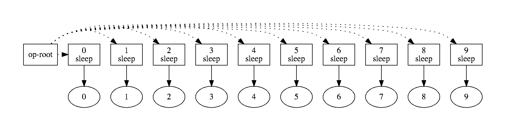
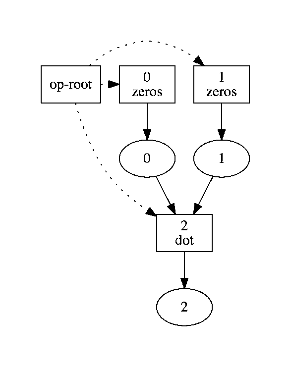

# Tutorial

To use Ray, you need to understand the following:

- How Ray uses object references to represent immutable remote objects.
- How Ray constructs a computation graph using remote functions.

## Overview

Ray is a distributed extension of Python. When using Ray, several processes are
involved.

- A **scheduler**: The scheduler assigns tasks to workers. It is its own
process.
- Multiple **workers**: Workers execute tasks and store the results in object
stores. Each worker is a separate process.
- One **object store** per node: The object store enables the sharing of Python
objects between worker processes so each worker does not have to have a separate
copy.
- A **driver**: The driver is the Python process that the user controls and
which submits tasks to the scheduler. For example, if the user is running a
script or using a Python shell, then the driver is the process that runs the
script or the shell.

## Starting Ray

To start Ray, start Python, and run the following commands.

```python
import ray
ray.services.start_ray_local(num_workers=10)
```

That command starts a scheduler, one object store, and ten workers. Each of
these are distinct processes. They will be killed when you exit the Python
interpreter. They can also be killed manually with the following command.

```
killall scheduler objstore python
```

## Immutable remote objects

In Ray, we can create and manipulate objects. We refer to these objects as
**remote objects**, and we use **object references** to refer to them. Remote
objects are stored in **object stores**, and there is one object store per node
in the cluster. In the cluster setting, we may not actually know which machine
each object lives on.

An **object reference** is essentially a unique ID that can be used to refer to
a remote object. If you're familiar with Futures, our object references are
conceptually similar.

We assume that remote objects are immutable. That is, their values cannot be
changed after creation. This allows remote objects to be replicated in multiple
object stores without needing to synchronize the copies.

### Put and Get

The commands `ray.get` and `ray.put` can be used to convert between Python
objects and object references, as shown in the example below.

```python
x = [1, 2, 3]
ray.put(x)  # prints <ray.ObjRef at 0x1031baef0>
```

The command `ray.put(x)` would be run by a worker process or by the driver
process (the driver process is the one running your script). It takes a Python
object and copies it to the local object store (here *local* means *on the same
node*). Once the object has been stored in the object store, its value cannot be
changed.

In addition, `ray.put(x)` returns an object reference, which is essentially an
ID that can be used to refer to the newly created remote object. If we save the
object reference in a variable with `ref = ray.put(x)`, then we can pass `ref`
into remote functions, and those remote functions will operate on the
corresponding remote object.

The command `ray.get(ref)` takes an object reference and creates a Python object
from the corresponding remote object. For some objects like arrays, we can use
shared memory and avoid copying the object. For other objects, this currently
copies the object from the object store into the memory of the worker process.
If the remote object corresponding to the object reference `ref` does not live
on the same node as the worker that calls `ray.get(ref)`, then the remote object
will first be copied from an object store that has it to the object store that
needs it.

```python
>>> ref = ray.put([1, 2, 3])
>>> ray.get(ref)  # prints [1, 2, 3]
```

If the remote object corresponding to the object reference `ref` has not been
created yet, *the command `ray.get(ref)` will wait until the remote object has
been created.*

## Computation graphs in Ray

Ray represents computation with a directed acyclic graph of tasks. Tasks are
added to this graph by calling **remote functions**.

For example, a normal Python function looks like this.
```python
def add(a, b):
  return a + b
```
A remote function in Ray looks like this.
```python
@ray.remote([int, int], [int])
def add(a, b):
  return a + b
```

The information passed to the `@ray.remote` decorator includes type information
for the arguments and for the return values of the function. Because of the
distinction that we make between *submitting a task* and *executing the task*,
we require type information so that we can catch type errors when the remote
function is called instead of catching them when the task is actually executed
(which could be much later and could be on a different machine).

### Remote functions

Whereas in regular Python, calling `add(1, 2)` would return `3`, in Ray, calling
`add.remote(1, 2)` does not actually execute the task. Instead, it adds a task
to the computation graph and immediately returns an object reference to the
output of the computation.

```python
>>> ref = add.remote(1, 2)
>>> ray.get(ref)  # prints 3
```

There is a sharp distinction between *submitting a task* and *executing the
task*. When a remote function is called, the task of executing that function is
submitted to the scheduler, and the scheduler immediately returns object
references for the outputs of the task. However, the task will not be executed
until the scheduler actually schedules the task on a worker.

When a task is submitted, each argument may be passed in by value or by object
reference. For example, these lines have the same behavior.

```python
>>> add.remote(1, 2)
>>> add.remote(1, ray.put(2))
>>> add.remote(ray.put(1), ray.put(2))
```

Remote functions never return actual values, they always return object
references.

When the remote function is actually executed, it operates on Python objects.
That is, if the remote function was called with any object references, the
Python objects corresponding to those object references will be retrieved and
passed into the actual execution of the remote function.

### Blocking computation

In a regular Python script, the specification of a computation is intimately
linked to the actual execution of the code. For example, consider the following
code.

```python
import time

# This takes 50 seconds.
for i in range(10):
  time.sleep(5)
```

At the core of the above script, there are ten separate tasks, each of which
sleeps for five seconds (this is a toy example, but you could imagine replacing
the call to `sleep` with some computationally intensive task). These tasks do
not depend on each other, so in principle, they could be executed in parallel.
However, in the above implementation, they will be executed serially, which will
take fifty seconds.

Ray gets around this by representing computation as a graph of tasks, where some
tasks depend on the outputs of other tasks and where tasks can be executed once
their dependencies are done.

For example, suppose we define the remote function `sleep` to be a wrapper
around `time.sleep`.

```python
@ray.remote([int], [int])
def sleep(n):
  time.sleep(n)
  return 0
```

Then we can write

```python
# Submit ten tasks to the scheduler. This finishes almost immediately.
result_refs = []
for i in range(10):
  result_refs.append(sleep.remote(5))

# Wait for the results. If we have at least ten workers, this takes 5 seconds.
[ray.get(ref) for ref in result_refs]  # prints [0, 0, 0, 0, 0, 0, 0, 0, 0, 0]
```

The for loop simply adds ten tasks to the computation graph, with no
dependencies between the tasks. It executes almost instantaneously. Afterwards,
we use `ray.get` to wait for the tasks to finish. If we have at least ten
workers, then all ten tasks can be executed in parallel, and so the overall
script should take five seconds.

### Visualizing the Computation Graph

The computation graph can be viewed as follows.

```python
ray.visualize_computation_graph(view=True)
```

<p align="center">
  
</p>

In this figure, boxes are tasks and ovals are objects.

The box that says `op-root` in it just refers to the overall script itself. The
dotted lines indicate that the script launched 10 tasks (tasks are denoted by
rectangular boxes). The solid lines indicate that each task produces one output
(represented by an oval).

It is clear from the computation graph that these ten tasks can be executed in
parallel.

Computation graphs encode dependencies. For example, suppose we define

```python
import numpy as np

@ray.remote([list], [np.ndarray])
def zeros(shape):
  return np.zeros(shape)

@ray.remote([np.ndarray, np.ndarray], [np.ndarray])
def dot(a, b):
  return np.dot(a, b)
```

Then we run

```python
aref = zeros.remote([10, 10])
bref = zeros.remote([10, 10])
cref = dot.remote(aref, bref)
```

The corresponding computation graph looks like this.

<p align="center">
  
</p>

The three dashed lines indicate that the script launched three tasks (the two
`zeros` tasks and the one `dot` task). Each task produces a single output, and
the `dot` task depends on the outputs of the two `zeros` tasks.

This makes it clear that the two `zeros` tasks can execute in parallel but that
the `dot` task must wait until the two `zeros` tasks have finished.
