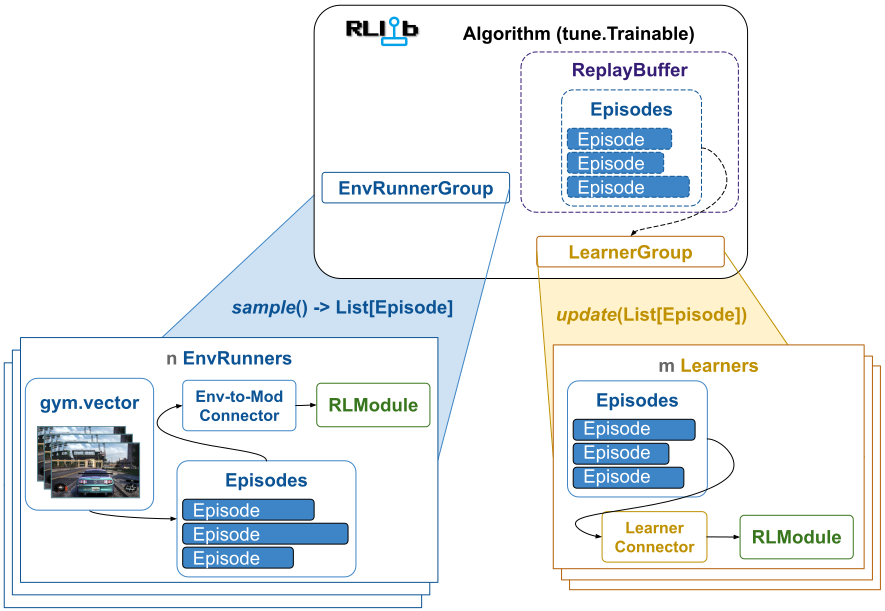
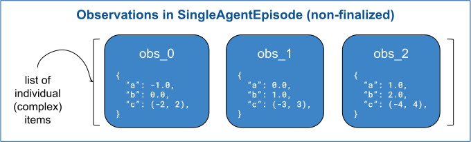
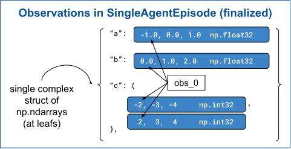
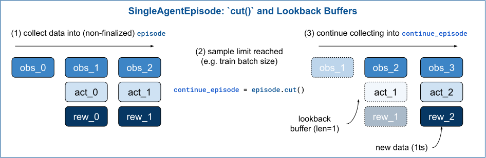

.. include:: /_includes/rllib/we_are_hiring.rst

.. _single-agent-episode-docs:

Episodes
========

.. include:: /_includes/rllib/new_api_stack.rst

RLlib stores and transports all trajectory data in the form of `Episodes`, in particular
:py:class:`~ray.rllib.env.single_agent_episode.SingleAgentEpisode` for single-agent setups
and :py:class:`~ray.rllib.env.multi_agent_episode.MultiAgentEpisode` for multi-agent setups.
The data is translated from this `Episode` format to tensor batches (including a possible move to the GPU)
only immediately before a neural network forward pass by so called :ref:`connector pipelines <connector-v2-docs>`.

    **Episodes** are the main vehicle to store and transport trajectory data across the different components
    of RLlib (for example from `EnvRunner` to `Learner` or from `ReplayBuffer` to `Learner`).
    One of the main design principles of RLlib's new API stack is that all trajectory data is kept in such episodic form
    for as long as possible. Only immediately before the neural network passes, :ref:`connector pipelines <connector-v2-docs>`
    translate lists of Episodes into tensor batches. See the section on :ref:`Connectors and Connector pipelines here <connector-v2-docs>`
    for more details.

The main advantage of collecting and moving around data in such a trajectory-as-a-whole format
(as opposed to tensor batches) is that it offers 360° visibility and full access
to the RL environment's history. This means users can extract arbitrary pieces of information from episodes to be further
processed by their custom components. Think of a transformer model requiring not
only the most recent observation to compute the next action, but instead the whole sequence of the last n observations.
Using :py:meth:`~ray.rllib.env.single_agent_episode.SingleAgentEpisode.get_observations`, a user can easily
extract this information inside their custom :py:class:`~ray.rllib.connectors.connector_v2.ConnectorV2`
pipeline and add the data to the neural network batch.

Another advantage of episodes over batches is the more efficient memory footprint.
For example, an algorithm like DQN needs to have both observations and
next observations (to compute the TD error-based loss) in the train batch, thereby duplicating an
already large observation tensor. Using episode objects for most of the time reduces the memory need
to a single observation-track, which contains all observations, from reset to terminal.

This page explains in detail what working with RLlib's Episode APIs looks like.

SingleAgentEpisode
==================

This page describes the single-agent case only.

.. note::
    The Ray team is working on a detailed description of the multi-agent case, analogous to this page here,
    but for :py:class:`~ray.rllib.env.multi_agent_episode.MultiAgentEpisode`.

Creating a SingleAgentEpisode
-----------------------------

RLlib usually takes care of creating :py:class:`~ray.rllib.env.single_agent_episode.SingleAgentEpisode` instances
and moving them around, for example from :py:class:`~ray.rllib.env.env_runner.EnvRunner` to :py:class:`~ray.rllib.core.learner.learner.Learner`.
However, here is how to manually generate and fill an initially empty episode with dummy data:

.. literalinclude:: doc_code/sa_episode.py
    :language: python
    :start-after: rllib-sa-episode-01-begin
    :end-before: rllib-sa-episode-01-end

The :py:class:`~ray.rllib.env.single_agent_episode.SingleAgentEpisode` constructed and filled preceding should roughly look like this now:

.. figure:: images/episodes/sa_episode.svg
    :width: 750
    :align: left

    **(Single-agent) Episode**: The episode starts with a single observation (the "reset observation"), then
    continues on each timestep with a 3-tuple of `(observation, action, reward)`. Note that because of the reset observation,
    every episode - at each timestep - always contains one more observation than it contains actions or rewards.
    Important additional properties of an Episode are its `id_` (str) and `terminated/truncated` (bool) flags.
    See further below for a detailed description of the :py:class:`~ray.rllib.env.single_agent_episode.SingleAgentEpisode`
    APIs exposed to the user.

Using the getter APIs of SingleAgentEpisode
-------------------------------------------

Now that there is a :py:class:`~ray.rllib.env.single_agent_episode.SingleAgentEpisode` to work with, one can explore
and extract information from this episode using its different "getter" methods:

.. figure:: images/episodes/sa_episode_getters.svg
    :width: 750
    :align: left

    **SingleAgentEpisode getter APIs**: "getter" methods exist for all of the Episode's fields, which are `observations`,
    `actions`, `rewards`, `infos`, and `extra_model_outputs`. For simplicity, only the getters for observations, actions, and rewards
    are shown here. Their behavior is intuitive, returning a single item when provided with a single index and returning a list of items
    (in the non-numpy'ized case; see further below) when provided with a list of indices or a slice of indices.

Note that for `extra_model_outputs`, the getter is slightly more complicated as there exist sub-keys in this data (for example:
`action_logp`). See :py:meth:`~ray.rllib.env.single_agent_episode.SingleAgentEpisode.get_extra_model_outputs` for more information.

The following code snippet summarizes the various capabilities of the different getter methods:

.. literalinclude:: doc_code/sa_episode.py
    :language: python
    :start-after: rllib-sa-episode-02-begin
    :end-before: rllib-sa-episode-02-end

Numpy'ized and non-numpy'ized Episodes
--------------------------------------

The data in a :py:class:`~ray.rllib.env.single_agent_episode.SingleAgentEpisode` can exist in two states:
non-numpy'ized and numpy'ized. A non-numpy'ized episode stores its data items in plain python lists
and appends new timestep data to these. In a numpy'ized episode,
these lists have been converted into possibly complex structures that have NumPy arrays at their leafs.
Note that a numpy'ized episode doesn't necessarily have to be terminated or truncated yet
in the sense that the underlying RL environment declared the episode to be over or has reached some
maximum number of timesteps.

.. figure:: images/episodes/sa_episode_non_finalized_vs_finalized.svg
    :width: 900
    :align: left

:py:class:`~ray.rllib.env.single_agent_episode.SingleAgentEpisode` objects start in the non-numpy'ized
state, in which data is stored in python lists, making it very fast to append data from an ongoing episode:

.. literalinclude:: doc_code/sa_episode.py
    :language: python
    :start-after: rllib-sa-episode-03-begin
    :end-before: rllib-sa-episode-03-end

To illustrate the differences between the data stored in a non-numpy'ized episode vs. the same data stored in
a numpy'ized one, take a look at this complex observation example here, showing the exact same observation data in two
episodes (one non-numpy'ized the other numpy'ized):

    **Complex observations in a non-numpy'ized episode**: Each individual observation is a (complex) dict matching the
    gymnasium environment's observation space. There are three such observation items stored in the episode so far.

    **Complex observations in a numpy'ized episode**: The entire observation record is a single complex dict matching the
    gymnasium environment's observation space. At the leafs of the structure are `NDArrays` holding the individual values of the leaf.
    Note that these `NDArrays` have an extra batch dim (axis=0), whose length matches the length of the episode stored (here 3).

Episode.cut() and lookback buffers
----------------------------------

During sample collection from an RL environment, the :py:class:`~ray.rllib.env.env_runner.EnvRunner` sometimes has to stop
appending data to an ongoing (non-terminated) :py:class:`~ray.rllib.env.single_agent_episode.SingleAgentEpisode` to return the
data collected thus far.
The `EnvRunner` then calls :py:meth:`~ray.rllib.env.single_agent_episode.SingleAgentEpisode.cut` on
the :py:class:`~ray.rllib.env.single_agent_episode.SingleAgentEpisode` object, which returns a
new episode chunk, with which collection can continue in the next round of sampling.

.. literalinclude:: doc_code/sa_episode.py
    :language: python
    :start-after: rllib-sa-episode-04-begin
    :end-before: rllib-sa-episode-04-end

Note that a "lookback" mechanism exists to allow for connectors to look back into the
`H` previous timesteps of the cut episode from within the continuation chunk, where `H`
is a configurable parameter.

The default lookback horizon (`H`) is 1. This means you can - after a `cut()` - still access
the most recent action (`get_actions(-1)`), the most recent reward (`get_rewards(-1)`),
and the two most recent observations (`get_observations([-2, -1])`). If you would like to
be able to access data further in the past, change this setting in your
:py:class:`~ray.rllib.algorithms.algorithm_config.AlgorithmConfig`:

.. testcode::
    :hide:

    from ray.rllib.algorithms.algorithm_config import AlgorithmConfig

.. testcode::

    config = AlgorithmConfig()
    # Change the lookback horizon setting, in case your connector (pipelines) need
    # to access data further in the past.
    config.env_runners(episode_lookback_horizon=10)

Lookback Buffers and getters in more Detail
~~~~~~~~~~~~~~~~~~~~~~~~~~~~~~~~~~~~~~~~~~~

The following code demonstrates more options available to users of the
:py:class:`~ray.rllib.env.single_agent_episode.SingleAgentEpisode` getter APIs to access
information further in the past (inside the lookback buffers). Imagine having to write
a connector piece that has to add the last 5 rewards to the tensor batch used by your model's
action computing forward pass:

.. literalinclude:: doc_code/sa_episode.py
    :language: python
    :start-after: rllib-sa-episode-05-begin
    :end-before: rllib-sa-episode-05-end

Another useful getter argument (besides `fill`) is the `neg_index_as_lookback` boolean argument.
If set to True, negative indices are not interpreted as "from the end", but as
"into the lookback buffer". This allows you to loop over a range of global timesteps
while looking back a certain amount of timesteps from each of these global timesteps:

.. literalinclude:: doc_code/sa_episode.py
    :language: python
    :start-after: rllib-sa-episode-06-begin
    :end-before: rllib-sa-episode-06-end
